# 概述

## 推荐系统基本概念

曝光(impression)：系统将产品展现给用户

##### 转化流程：

不同产品有不同的转化流程，应该根据具体情况设计特征和模型

##### 短期消费指标：

非核心指标

##### 北极星指标

是推荐系统的核心指标，和短期消费指标冲突时以北极星指标为重

##### 实验流程

离线实验：收集历史数据，在历史数据上做训练、测试。

小流量A\B测试：将算法部署到实际产品中，用户产生真实交互。将用户随机分为实验组和对照组，实验组

使用新策略，对照组使用旧策略，查看其业务指标，如果有效则加大流量进行推全

## 推荐系统的链路

- 召回（retrieval）：快速从海量数据中取回几千个用户可能感兴趣的物品。 
- 粗排：用小规模的机器学习模型给召回的物品打分，然后做截断，选出分数最高的几百个物品。 
- 精排：用大规模神经网络给粗排选中的几百个物品打分，可以做截断，也可以不做截断。 
- 重排：根据精排分数和多样性分数做随机抽样，得到几十个物品，将相似内容打散并插入广告和运行内容。

##### 召回

召回通道：协同过滤、双塔模型、关注的作者、等等

召回阶段存在多条召回通道，每条召回通道都会返回一定数量的物品，并作去重和过滤

##### 排序

排序是使用机器学习模型来预估用户对产品的兴趣，保留分数高的产品。

如果直接用大规模神经网络对几千个产品打分花费的代价很大，为了解决计算量的问题将排序分为粗排和精排阶段

- 粗排：使用简单模型快速打分，进行截断
- 精排：模型更复杂、使用的特征更丰富，分数更可靠，计算量很大

重排主要是考虑多样性

##### 粗排、精排

区别：精排模型更大、输入特征更多

统计特征：物品的点击率、用户的点击率、物品分男女用户两桶的点击率、用户按物品类目分桶的点击率等

##### 重排

功能：

- 最重要的功能，多样性抽样，如MMR、DPP，从几百个产品中选出几十个
- 用规则打散相似产品
- 插入广告、运营推广内容，根据生态要求调整排序

## 推荐系统的AB测试

##### 随机分桶

##### 分层实验

主要解决的问题：信息流产品的公司有许多团队，大家都需要做AB测试，流量不够用

##### Holdout机制

用于衡量整个部门的业务指标收益

单独的实验通常由一到两个算法工程师负责，如果有效则算作个人业绩，但是部门业绩不能简单使用所有实验的加和，实验叠加通常有折损，这是不可信的。

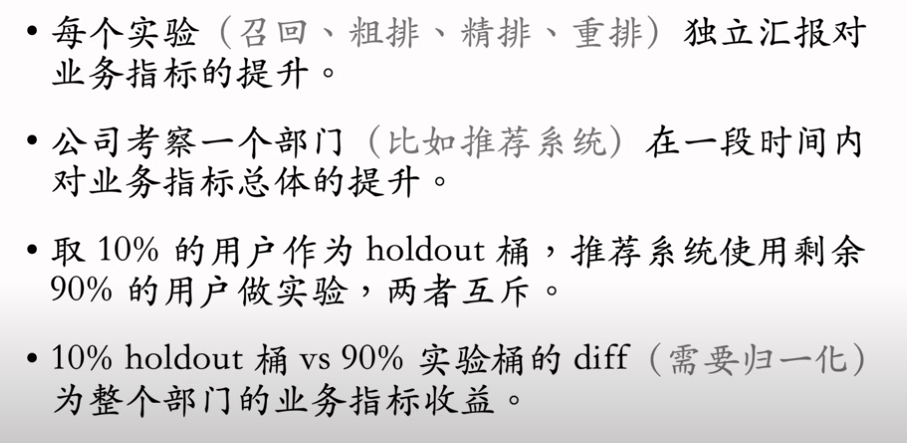

##### 实验推全、反转实验

如果实验有效，则新建一个推全层进行推全，新层与其他层正交

推全后，点击率、点赞率、完播率等指标会立刻被新策略影响，但是留存指标存在滞后性，为了能够观测这种长期指标带来的收益，计算diff，在新层中保留部分用户作为反转桶使用旧策略

# 召回

## 基于物品的协同过滤（Item Based Collaborative Filtering，ItemCF）

##### 原理

如果用户喜欢物品1，而且物品1和物品2相似，那么用户很可能喜欢物品2

注意：是通过用户行为判定两个物品是否相似，而不是物品内容

要点：

- 如何计算两个物品之间的相似度
- 如何预估用户对候选物品的兴趣
- 如何利用索引在线上做快速召回

##### 物品相似度

基本原理（想法）：两个物品的受众重合程度越高越相似

考虑用户的喜欢程度

把每个物品表示为一个稀疏向量，向量每个元素对应一个用户，相似度sim就是两个向量夹角的余弦

##### 预估用户对物品的兴趣分数

##### ItemCF召回的完成流程

使用索引，离线计算量大，线上计算量小

###### 事先做离线计算

###### 线上做召回

1. 给定用户id，通过“用户-物品”索引，找到用户近期感兴趣的物品列表（last-n）
2. 对于last-n列表中的每个物品，通过“物品-物品”索引，找到top-k相似的物品
3. 对于取回的相似物品（最多有nk个），用公式预估用户对物品的兴趣分数
4. 返回预估兴趣分数最高的100个物品，作为本召回通道的输出（推荐结果）

## Swing召回通道

和ItemCF非常相似，唯一的区别在于如何定义物品的相似度

 

我们希望两个物品重合的用户广泛而且多样，而不是集中在一个小圈子里，因此在计算相似度的时候降低小圈子用户的权重

例如：小王在家族群里转发文章《我的野蛮女友》，群内长辈并不喜欢此类文章，但是还是点进去浏览，造成很多用户喜欢这类文章的假象，这就是小圈子问题。

## 基于用户的协同过滤（User Based Collaborative Filtering，UserCF）

##### 原理

如果用户1和用户2相似，而且用户2喜欢某个物品，那么用户1很可能喜欢该物品

要点：

- 如何计算两个用户之间的相似度
- 如何预估用户对候选物品的兴趣
- 如何利用索引在线上快速做召回

##### 用户相似度

两个用户喜欢的物品重合度越高相似度越高

$0<sim(u1,u2)<1$,越接近1越相似

上述公式同等对待热门物品和冷门物品，这是不合理的，越热门的物品越不能反映出用户的兴趣，相反，重复的物品越冷门，越能反应用户的兴趣。

因此需要降低热门物品的权重

##### 完整召回流程

###### 实现离线计算

###### 线上召回

## 离散特征处理

1. 建立字典：把类别映射成序号
2. 向量化：把序号映射成向量
   - One-hot编码：把序号映射成高维稀疏向量
   - Embedding：把序号映射成低维稠密向量

##### One-hot编码

###### 局限

##### Embedding（嵌入）

  

神经网络绝大多数的参数都在embedding层，工业界常对embedding做许多优化，这是存储和计算效率的关键所在

##### 小结

当类别数量很大时，用embedding

- Word embedding
- 用户ID embedding
- 物品ID embedding

## 矩阵补充（Matrix completion）

矩阵补充（matrix completion），它是一种向量召回通道。矩阵补充的本质是对用户 ID 和物品 ID 做 embedding，并用两个 embedding 向量的內积预估用户对物品的兴趣。值得注意的是，矩阵补充存在诸多缺点，在实践中效果远不及双塔模型。

##### 模型结构

##### 训练

###### 基本思路

###### 数据集

###### 训练

$$
\min _{A, \mathbf{B}} \sum_{(u, i, y) \in \Omega}\left(y-\left\langle\mathbf{a}_u, \mathbf{b}_i\right\rangle\right)^2
$$
上式为模型优化的目标函数，对目标函数求最小化，优化变量是参数矩阵A、B 。

求最小化可以使用随机梯度下降等算法，每次更新A和B的一列

##### 矩阵补充

使用绿色位置的数据进行训练，然后使用模型预测出灰色位置的评分，这就是为什么叫做矩阵补充。

##### 实践中效果不好

不会在工业界中使用

缺点：

1. 仅使用ID embedding，没有利用物品、用户属性
   - 物品属性：类目、关键词、地理位置、作者信息
   - 用户属性：性别、年龄、地理定位、感兴趣的类目
   - 双塔模型可以看作矩阵补充的升级版
2. 负样本的选取方式不对
   - 样本：用户-物品的二元组，记作$(u,j)$
   - 正样本：曝光之后，有点击、交互。（正确的做饭）
   - 负样本：曝光之后，没有点击、交互（错误的做法）
   - 这是一种想当然的做法，学术界可能认为这样没错，但是工业界实践中这样的方法没有效果
3. 做训练的方法不好
   - 使用内积作为兴趣分数的预估，其效果不如使用余弦相似度，工业界普遍使用余弦相似度
   -  使用平方损失函数（回归），不如用交叉熵损失函数（分类）

### 线上服务

##### 模型存储 

##### 线上服务

问题：这种巨大的计算量是不可接受的，因此要加速最近邻查找（nearest neighbor search），避免暴力枚举。

## 近似最近邻查找（Approximate Nearest Neighbor Search）

##### 支持最近邻查找的系统

Milvus、Faiss、HnswLib等向量数据库支持近似最近邻查找

有些系统不支持余弦相似度，可以将所有向量做归一化，让他们的二范数全都等于1，那么他们的内积就等于余弦相似度。

散点代表物品向量，a代表用户的embedding

以余弦相似度为例说明一种近似最近邻查找的算法

首先将数据分为不同的区域，划分区域的形状取决于衡量最近邻的标准

- 余选相似度：扇形
- 欧氏距离：多边形

划分区域后，每个区域使用一个单位向量进行表示。并且建立索引，key为该区域的单位向量，value为区域中所有点（物品embedding）。

假如有一亿个物品，分成一万个区域，则有一万个区域（单位向量），给定单位向量，可以快速取回区域内所有的点。

有了这样的索引就可以做快速召回了。

1. 首先计算用户embedding向量和所有区域向量的余弦相似度（一万次计算）
2. 找到最相似的区域向量之后，取回其区域内的所有点，每个点代表一个物品，然后计算用户和这些物品的余弦相似度（一万次左右计算）
3. 得到用户和物品的相似度排名，即兴趣分数排名，这就是最近邻查找的结果

这种方法比暴力枚举快五千倍

- 暴力枚举：一亿次计算
- 近似最近邻查找：两万次左右计算

## 双塔模型

双塔模型（two-tower）也叫 DSSM，是推荐系统中最重要的召回通道，没有之一。

### 模型结构

用户特征

物品特征

双塔模型有两个塔：用户塔、物品塔。两个塔各输出一个向量，作为用户、物品的表征。两个向量的內积或余弦相似度作为对兴趣的预估。

和矩阵补充相比，双塔模型使用了ID之外的多种特征来作为模型输入

### 训练

##### 训练方法

- Pointwise：独立看待每个正样本、负样本，做简单的二元分类
- Pairwise：每次取一个正样本、一个负样本^[1]^
- Listwise：每次取一个正样本、多个负样本^[2]^

##### 正负样本的选择

- 正样本：用户点击的物品
- 负样本^[1,2]^：
  - 没有被召回的？
  - 召回但是被粗排、精排淘汰的？
  - 曝光但是未点击的？

##### Pointwise训练

- 把召回看作二元分类任务
- 对于正样本，鼓励$cos(a,b)$接近+1
- 对于负样本，鼓励$cos(a,b)$接近-1
- 控制正负样本的数量为1：2或者1：3，这是业界经验值，原因未知

##### Pairwise

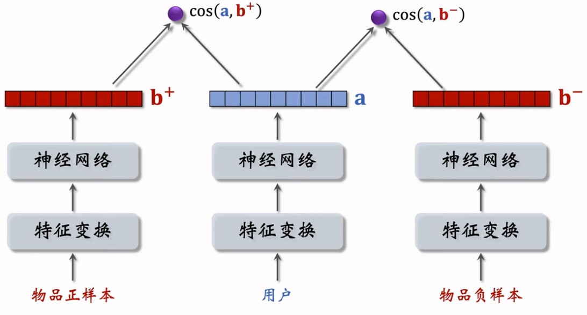

基本想法：鼓励$cos(a,b^{+})$大于$cos(a,b^-)$

- 如果$cos(a,b^{+})$大于$cos(a,b^-)+m$，则没有损失
- 否则，损失等于$cos(a,b^-)+m-cos(a,b^+)$
- m为超参数，需要手动设置

这样就可以得到如下的损失函数：Triplet hinge loss（这种损失函数在孪生神经网络中很常见，Siamese neural network）
$$
L\left(\mathbf{a}, \mathbf{b}^{+}, \mathbf{b}^{-}\right)=\max \left\{0, \cos \left(\mathbf{a}, \mathbf{b}^{-}\right)+m-\cos \left(\mathbf{a}, \mathbf{b}^{+}\right)\right\} .
$$
训练过程就是对损失函数求最小化，用梯度更新双塔模型神经网络的方式

还有其他损失函数：Triplet logistic loss
$$
L\left(\mathrm{a}, \mathbf{b}^{+}, \mathbf{b}^{-}\right)=\log \left(1+\exp \left[\sigma \cdot\left(\cos \left(\mathrm{a}, \mathbf{b}^{-}\right)-\cos \left(\mathrm{a}, \mathbf{b}^{+}\right)\right)\right]\right)
$$
$\sigma$是超参数

##### Listwise训练

- 一条数据包含：
  - 一个用户，特征向量记作$a$
  - 一个正样本，特征向量记作$b^+$
  - 多个负样本，特征向量记作$b_1^-,···,b_n^-$
- 鼓励$cos(a,b^+)$尽量大
- 鼓励$\cos \left(\mathrm{a}, \mathbf{b}_1^{-}\right), \cdots, \cos \left(\mathrm{a}, \mathbf{b}_n^{-}\right)$尽量小

### 不适用于召回的模型

这种在前期就将用户和物品的特征向量就融合的模型不适合用于召回。

这种模型需要将所有物品的特征输入到模型中，无法使用最近邻查找加速，这种计算量是不可接受的。

通常这种模型被用作排序。

召回模型都是后期融合。

### 正负样本

选对正负样本效果大于改进模型结构

#### 正样本

#### 负样本

##### 简单负样本

###### 全体物品

- 未被召回的物品，大概率是用户不感兴趣的
- 数亿物品中只有一小部分被召回，也就是说几乎所有物品都没有被召回，未被召回的物品基本就是全体物品
- 可以直接在全体物品中直接做抽样，作为负样本
  - 均匀抽样：对冷门物品不公平
    - 正样本大多是热门物品，如果均匀抽样产生负样本，负样本大多是冷门物品，这样会导致热门物品更热，冷门物品更冷
  - 非均匀抽样：目的是打压热门物品
    - 负样本抽样概率与热门程度（点击次数）正相关
    - 抽样概率正比于点击次数的0.75次方，0.75为经验值

###### Batch内负样本

上面的采样方案中，一个物品出现在batch内的概率正比于点击次数，也就是说物品成为负样本的概率正比于点击次数，但是上文我们提到，负样本采样概率应该正比于点击次数的0.75次方，这样会使得热门物品成为负样本的概率过大，导致热门物品被过分打压，造成偏差。

上面的参考文献提出了解决方案：

- 物品$i$被抽样到的概率为$p_{i}\propto点击次数$
- 预估用户对物品$i$的兴趣$cos(a,b_i)$，训练的时候要鼓励正样本的余弦相似度尽量大，负样本的余弦相似度尽量小
- 训练双塔模型的时候调整为$\cos(\mathrm{a},{\mathrm{b}_i})-\log{p_i}$，这样可以纠偏，避免过分打压热门物品。
- 线上召回的时候无需作调整

##### 困难负样本

工业界常用做法：

##### 常见错误

错误做法：将曝光但是没有点击的物品当作负样本

召回的目标是快速找到用户可能感兴趣的物品，而不是区分比较感兴趣的物品和非常感兴趣的物品，这是排序的任务

##### 总结

### 线上召回

##### 离线存储

把物品向量$b$存入向量数据库

1. 完成训练之后，用物品塔计算每个物品的特征向量$b$
2. 把几亿个物品向量$b$存入向量数据库（比如Milvus、Faiss、HnswLib）
3. 向量数据库建立索引，以便加速最近邻查找

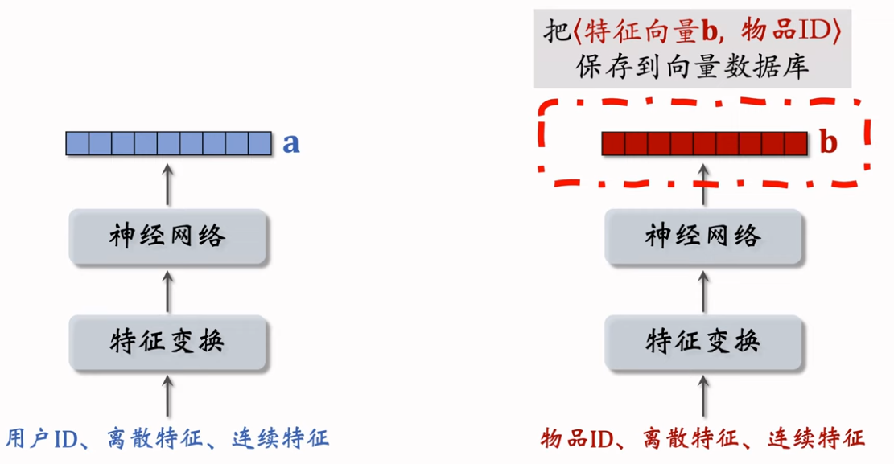

##### 线上召回

查找用户最感兴趣的k个物品

1. 给定用户ID和画像，线上用神经网络计算用户向量a
2. 最近邻查找：
   1. 把向量a作为query，调用向量数据库做最近邻查找
   2. 返回余弦相似度最大的k个物品，作为召回结果

##### 问题

### 模型更新

全量更新：今天凌晨，用昨天全天的数据训练模型

增量更新：做online learning更新模型参数

注意：做增量更新时仅更新Embdding层的参数，不更新全连接层的参数，全连接层的参数只有在全量更新的时候才会进行更新，这是处于工程实现的考量

##### 问题

能否只做增量更新，不做全量更新？

答案是不能。实践证明只做增量更新效果不好

 全量模型训练效果更好，增量模型可以实时捕捉用户的兴趣

### 总结

## 双塔模型+自监督学习

### 双塔模型

##### 问题

- 推荐系统中头部效应严重，这是数据的问题。
  - 少部分流行物品占据大部分点击
  - 大部分物品的点击次数不高
- 这导致高点击物品的表征学的好，长尾物品的表征学的不好

##### 训练

###### batch内采样

###### Listwise训练

###### 损失函数

###### 纠偏

###### 小结

- 从点击数据中随机抽取n个用户-物品二元组，组成一个batch
- 双塔模型的损失函数：

$$
{\cal L}_{\mathrm{main}}[i]\ =\ -\log\biggl(\frac{\exp(\cos(a_{i},b_{j})-\log p_{i})}{\sum_{j=1}^{n}\exp(\cos(a_{i},b_{j})-\log p_{j})}\biggr).
$$

- 做梯度下降，减小损失函数：

$$
\frac{1}{n}\sum^n_{i=1}L_{main}[i].
$$

### 自监督学习 

上面的方法使用listwise方式同时训练用户塔和物品塔，接下来介绍使用自监督学习训练物品塔

论文由google发表

##### 原理

训练的时候应该鼓励$\cos(\mathrm{b}_{i}^{\prime},\mathrm{b}_{i}^{\prime\prime})$尽量大，$\cos(\mathrm{b}_{i}^{\prime},\mathrm{b}_{j}^{\prime\prime})$尽量小

##### 特征变换

###### Random Mask

随机选一些离散特征(比如类目)，把它们遮住。

例:

- 某物品的类目特征是$u=\{数码,摄影\}$。则通常对数码和摄影分别做embedding得到两个特征向量，然后两个特征向量做加和或者平均等操作得到类目的特征向量
- Mask后的类目特征是$u'=\{default\}$。default为默认的缺失值，然后对default做embedding得到类目的特征向量

###### Dropout

仅对多值离散特征生效

###### 互补特征（complementary）

###### Mask一组关联的特征

特征之间据有关联，只mask一个特征仍然可以通过其强关联的特征学到该特征，所以最好是将一组关联的特征全部mask，例如下图：

互补信息，mutual information：
$$
{\cal M}I(u,\nu)\,=\,\Sigma_{u\in{\cal U}}\Sigma_{\nu\in{\cal V}}\,p(u,v)\cdot\log\frac{p(u,\nu)}{p(u)\cdot p(v)}.
$$

实际工业界会权衡利弊，考虑这种复杂的实现、计算、维护成本是否值得

##### 训练模型

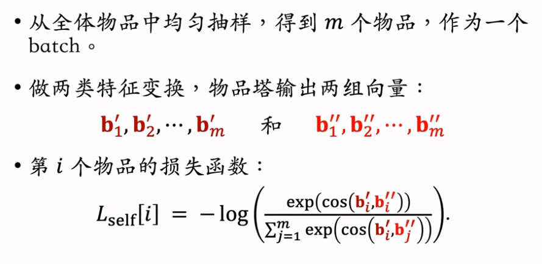

自监督学习的损失函数：
$$
{\cal L}_{\mathrm{self}}[i]\;=\;-\log\left(\frac{\exp({\mathrm{cos}}({\mathrm{b}}_{i}^{\prime},{\mathrm{b}}_{i}^{\prime\prime}))}{\sum_{j=1}^{m}\exp({\mathrm{cos}}({\mathrm{b}}_{i}^{\prime},{\mathrm{b}}_{j}^{\prime\prime}))}\right).
$$
做梯度下降，减小自监督学习的损失：
$$
{\frac{1}{m}}\,\sum_{i=1}^{m}{\cal L}_{\mathrm{self}}[i].
$$

### 总结

##### 训练模型

- 对点击做随机抽样，得到$n$对用户-物品二元组，作为一个batch，用来训练双塔，包括用户塔和物品塔

- 从全体物品中均匀抽样，得到$m$个物品，作为一个batch，用来做自监督学习，只训练物品塔

- 最后做梯度下降，使得损失减小：
  $$
  {\frac{1}{n}}\sum_{i=1}^{n}L_{\mathrm{main}}[i]\ +\alpha\cdot{\frac{1}{m}}\sum_{j=1}^{m}L_{\mathrm{self}}[j].
  $$

$L_{main}$是双塔模型的损失，$L_{self}$是自监督学习的损失，$\alpha$是超参数，决定自监督学习起到的作用

## Deep Retrieval召回

Deep Retrieval 是字节跳动AML部门开发的召回技术^[1]^，已经在字节很多业务线上落地，对指标有一定提升。但是其他公司尚未复现出Deep Retrieval。

- 经典的双塔模型把用户、物品表示为向量，线上做最近邻查找
- Deep Retrirval^[1]^把物品表征为路径（path），线上查找用户最匹配的路径
- Deep Retrieval 跟阿里的TDM^[2]^ 较为相似。

参考文献：

1.Weihao Gao et al.Learning An End-to-End Structure for Retrieval in Large-Scale Recommendations. In CIKM, 2021. 

2.Han Zhu et al. Learning Tree-based Deep Model for Recommender Systems. InKDD, 2018.

主要内容如下：

### 索引

##### 物品表征为路径

##### 物品到路径的索引

索引：item->List\<path>

- 一个物品对应多条路径
- 用三个节点表示一条路径：path=[a,b,c]

索引：path->Lish\<item>

- 一条路径对应多个物品
- 线上召回的时候要用到这个索引，给定一条路径得到对应的物品列表作为召回结果

### 预估模型

Deep Retrieval设计了一种神经网络，给定用户特征，神经网络可以预估用户对路径的兴趣分数，用这种神经网络可以根据用户特征召回多条路径

##### 预估用户对路径的兴趣

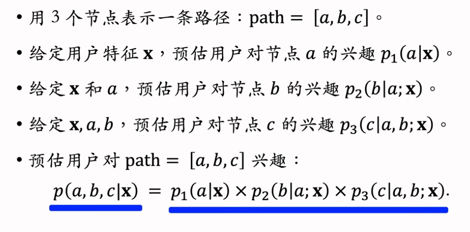

p1，p2，p3都是通过神经网络计算得到的

$\boldsymbol{p}_1,\mathbf{p}_2,\vec{p}_3$分别对应L1,L2,L3，长度为K，元素为对应节点的兴趣分数

三次计算的神经网络不共享参数

### 线上召回

召回：用户-》路径-》物品

##### Beam Search

Beam search算法在nlp、机器学习领域都要重要应用

beam size越大，计算量越大，效果越好

###### size=1

首先通过神经网络计算第一层各个节点的兴趣分数，由于beam size=1，所以选取兴趣分数最高的节点，其兴趣分数为$\boldsymbol{p}_1(5|\boldsymbol{x})$

从节点5出发通往L2有K条路经，我们要从K条路径中选出一条，用神经网络第二层，将用户特征$\boldsymbol{x}$和$\boldsymbol{emb(5)}$作为输入得到$\boldsymbol{p}_2$，从$\boldsymbol{p}_2$中选取元素分数最高即用户兴趣最高的节点，4号节点，其兴趣分数为$\boldsymbol{p}_2(4|5;x)$，这样就选出了一条路径，这是因为beam size=1

用同样的方法可以选出最后一层的节点，得到最后的路径如下

用户对$path=[a,b,c]$的兴趣分数为：
$$
\boldsymbol{p}(a,b,c|\mathbf{x})\;=\;\boldsymbol{p}_{1}(a|\mathbf{x})\times\boldsymbol{p}_{2}(b|a;\mathbf{x})\times\boldsymbol{p}_{3}(c|a,b;\mathbf{x}).
$$
最优的路径是分数p最大的路径：
$$
[a^{*},b^{*},c^{*}]\;=\;\arg\operatorname*{sux}_{a,b,c}\;\;p(a,b,c\mid\mathbf{x})
$$
深度为n，宽度为K，则一共有$K^n$条路径，想找到最优路径很难

上面的size=1时，其实就是贪心算法，贪心算法选中的路径未必是最优的路径

###### size=4

如果把beam size设置的大一些，效果会比贪心效果好，但是相应的增加了计算量

下面介绍size=4的方法

最后一共有四条路径被选中，应为beam size=4

### 训练

同时学习神经网络参数和物品表征

Deep Retrieval只使用正样本

##### 学习神经网络参数

##### 学习物品表征

$score(item,path)$代表所有点击过该item的用户对特定路径的兴趣分数之和

根据$score(item,path)$选出$J$条路径作为item的表征

用贪心算法更新路径

##### 小结

Deep Retrieval的训练分为更新神经网络和更新物品的表征两部分，交替做两部分的训练就可以同时学习到神经网络和物品表征

同时学习用户-路径和物品-路径的关系

## 其他召回通道

这些召回通道都是工业界实际使用的，但是重要性不如itemCF、swing、双塔等模型重要

### 地理位置召回

##### GeoHash召回

GeoHash召回通道返回的结果，具体有那些物品符合用户兴趣，由排序模型决定

##### 同城召回

### 作者召回

##### 关注作者召回

作者发布的笔记按照时间顺序倒排，召回时，返回所有关注的作者的最新发布的笔记

##### 有交互的作者召回

用户-》有交互的作者 索引需要实时更新，只维护最近交互的固定数量作者

##### 相似作者召回

作者是否相似通过相似度进行判断，例如粉丝重合度

感兴趣的作者包括关注的作者和有交互的作者

### 缓存召回

问题：缓存大小固定，需要固定退场机制

## 曝光过滤&Bloom Filter

### 曝光过滤问题

**在推荐系统中，如果用户看过某个物品，就不再把物品推荐给这个用户。**小红书、抖音都这样做曝光过滤，原因是实验表明重复曝光同一个物品会损害用户体验。但也不是所有推荐系统都有曝光过滤，像 YouTube 这样的长视频就没有曝光过滤，看过的可以再次推荐。 

**曝光过滤通常是在召回阶段做。**想要做曝光过滤，需要对于每个用户，记录已经曝光给他的物品。一个用户历史上看过的物品可能会非常多，但是不需要存储所有的浏览记录，只需要存储最近一段时间的。

对于每个召回的物品，都需要判断它是否已经给该用户曝光过，排除掉曾经曝光过的物品。

一位用户看过n个物品，本次召回r个物品，如果暴力对比，需要O(nr)的时间

为了做到高效的曝光过滤，需要用Bloom Filter这种数据结构。

### Bloom Filter

m,k是需要设置的参数

##### k=1

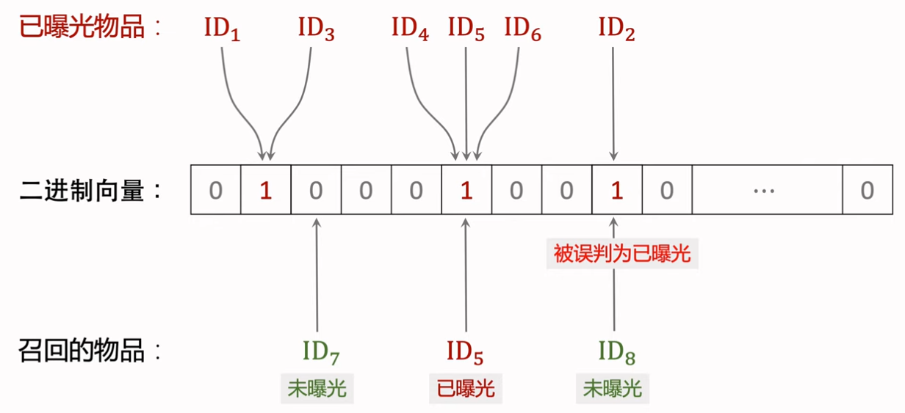

##### k=3

##### 参数设置

- 曝光物品集合大小为$\color{blue}n$，二进制向量维度为$\color{blue}{m}$，使用$\color{blue}{k}$个哈希函数

- Bloom Filter误判的概率为
  $$
  {\color{red}\delta}\approx\left(1-\exp\left(-{\frac{\color{blue}k n}{\color{blue}m}}\right)\right)^{\color{blue}k}
  $$

  - $\color{blue}n$越大，向量中的1越多，误判的概率越大，即未曝光物品的$\color{blue}{k}$个位置恰好都是1的概率大
  - $\color{blue}{m}$越大，向量越长，越不容易发生哈希碰撞，越不容易误判，但是也需要更多的存储
  - $\color{blue}{k}$太大、太小都不好，有最优取值

- 人为设定可容忍的误判概率${\color{red}\delta}$，那么最优参数为：

  - $$
    {\color{blue}k}=1.44\cdot\ln\left({\frac{1}{\color{red}\delta}}\right)
    $$

  - $$
    {\color{blue}m}=2{\color{blue}n}\cdot\ln\left(\frac{1}{\color{red}\delta}\right)
    $$

    

##### Bloom Filter的缺点

Bloom Filter向量中的元素是所有物品共享的，如果删除单个物品时将对应元素置为0会影响其他物品，因此如果需要移除物品需要重新计算Bloom Filter向量

### 曝光过滤的链路

# 排序

## 多目标排序模型

### 排序的依据

### 多目标模型

##### 模型结构

神经网络可以是简单的全连接网络，也可以是wide&deep

全连接层数量一般为2-3

##### 训练

训练中存在许多问题

- 困难：数据类别不平衡，正样本少，负样本多过多的负样本对训练没有提升，白白浪费了计算资源

##### 预估值校准

采样率$\alpha$越大，负样本越少，预估点击率偏离真是点击率越严重

真实点击率：
$$
p_{\mathrm{true}}={\frac{n_{+}}{n_{+}+n_{-}}}(期望)
$$
预估点击率：
$$
p_{\mathrm{pred}}={\frac{n_{+}}{n_{+}+\alpha{\cdot}n_{-}}}(期望)
$$
由上面两个公式可以得到校准公式^[1]^：
$$
p_\mathrm{true}={\frac{\alpha\cdot p_{\mathrm{pred}}}{\left(1-p_{\mathrm{pred}}\right)+\alpha\cdot p_{\mathrm{pred}}}}.
$$

## Multi-gate Mixture-of-Experts(MMoE)

Multi-gate Mixture-of-Experts (MMoE) 是一种多目标排序模型。

MMoE 用多个独立的塔提取特征，并对多塔提取的特征向量做加权平均，然后送入多头。

MMoE 的训练容易出现极化现象（polarize），可以用 dropout 解决。 

##### 模型结构

三个专家的神经网络结构相同，但是不共享参数

专家的数量为超参数（实践中会尝试4或者8）

$$
p_1+p_2+p_3=1\\
q_1+q_2+q_3=1
$$

这里假设多目标排序只有两个目标：点击率和点赞率，因此只生成了两组权重$p$，$q$，实际中，可以根据目标的数量生成多组权重

##### 极化现象（Polarization）

如下图中的例子：

权重p在只能融合第三号专家的输出向量，权重q只能融合第二号专家的输入向量

这和普通的多目标排序模型没有区别，失去了MMoE的优势

解决方法：

我们不希望n维向量中的一个元素接近于1，其他接近于0

采用dropout方法后，神经网络会在训练过程中避免极化，因为如果产生极化，且这个接近于1的元素被dropout，那么结果就会错的离谱。

参考文献：

实际工程中，MMoE不一定有效果

## 预估分数的融合

排序的多目标模型会预估点击率、点赞率等指标。得到这些指标之后，需要将它们融合成一个分数。

$\alpha,w$都是超参数

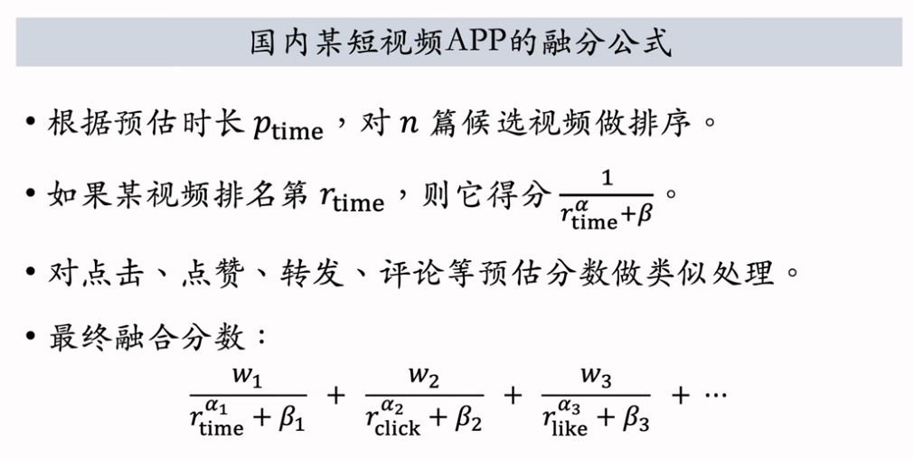

## 视频播放建模

视频播放的建模主要有两个目标：视频播放时长、视频完播率。

### 视频播放时长

直接用回归拟合模拟播放时长效果不好。

建议用YouTuBe的时长建模^[1]^

神经网络被称为share bottom

$t$为实际观测到的播放时长。如果$y=p$，那么显而易见$exp(z)=t$

- 把最后一个全连接层的输出记作$z$。设$p=sigmoid(z)$

- 实际观测的播放时长记作$t$。如果没有点击，则$t=0$

- 做训练：最小化交叉熵损失
  $$
  -\left({\frac{t}{1+t}}\cdot\log p+{\frac{1}{1+t}}\cdot\log(1-p)\right).
  $$
  实践中把分母$1+t$去掉也可以，这就相当于给损失函数做加权，权重是播放时长

- 做推理：把$exp(z)$作为播放时长的预估

- 把$exp(z)$作为融分公式中的一项

### 视频完播

##### 回归方法

##### 二元分类方法

##### 问题

实践中，不能直接把预估的完播率用到融分公式

一般来说，视频越长，完播率越低，如果直接将预估的完播率应用到融分公式，这对长视频不公平

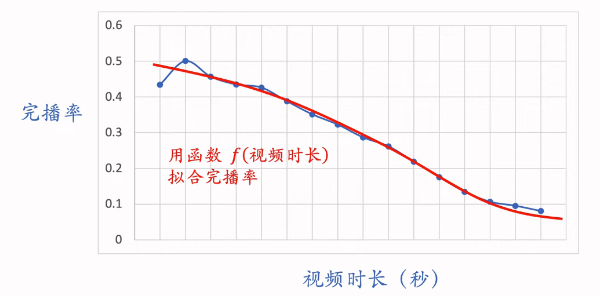

用函数$f(视频时长)$对完播率进行调整，以公平对待长短视频完播率

线上预估完播率，然后做调整：
$$
p_{\mathrm{finsih}}=\frac{预估完播率}{f(视频长度)}
$$
把$p_{\mathrm{finish}}$作为融分公式中的一项

## 排序模型的特征

推荐系统中的排序模型需要用户画像、物品画像、统计特征、场景特征。

### 特征分类

##### 用户画像（User Profile）

- 用户ID，在召回、排序中做embedding，通常为32维或64维
- 人口统计学属性：性别、年龄。不同性别年龄段的人兴趣区别很大
- 账号信息：新老、活跃度……等。模型需要针对低活用户和新用户做专门的优化
- 感兴趣的类目、关键词、品牌等。

##### 物品画像（Item profile）

- 物品ID，在召回、排序中做embedding
- 发布时间（或者年龄）。很多内容具有很大的时效性，发布时间越久的物品价值越低
- Geohash（经纬度编码）、所在城市。
- 物品本身的内容：标题、类目、关键词、品牌……
- 字数、图片数、视频清晰度、标签数……
- 内容信息量、图片美学……这都是算法打分

##### 用户统计特征

- 用户最近30天（7天，1天，1小时）的曝光数、点击数、点赞数、收藏数……不同时间粒度可以反映出用户实时兴趣、短期兴趣、中长期兴趣。
- 分桶统计各种指标。例如按照笔记\视频分桶。比如最近7天，该用户对图文笔记的点击率、点赞率，对视频笔记的点击率、点赞率，这样可以反映出用户对两类笔记的偏好。
- 按照笔记类目分桶。比如最近三十天，用户对美妆笔记的点击率，对美食笔记的点击率，对科技数码笔记的点击率。

##### 笔记统计特征

- 笔记最近30天（7天、1天、1小时）的曝光数、点击数、点赞数、收藏数……这些统计量反映出物品的受欢迎程度。如果一个物品的所有指标都很高，那说明这篇笔记很优质，算法应该给他更多流量。使用不同时间粒度也是有道理的，例如一篇笔记的30天指标很高，但是7天指标很低，说明它已经过时了，不应该给更多流量。
- 按照笔记的受众做分桶。比如按照用户性别分桶，按照用户年龄分桶，地域分桶等。这样的统计量可以反映出一个物品更受哪个群体欢迎。
- 作者特征：这些特征反应了作者的受欢迎程度和作品的质量
  - 发布笔记数
  - 粉丝数
  - 消费指标（曝光数、点击数、点赞数、收藏数）

##### 场景特征（Context）

随着推荐请求得到，不需要从数据库中获取

- 用户定位GeoHash（经纬度编码）、城市
- 当前时刻（分段，做embedding）
- 是否是周末、是否是节假日
- 手机品牌、手机型号、操作系统

### 特征处理

实际工程中，可能会用到同一特征通过不同处理手段得到的结果。比如同时使用$log(1+点击数)$和点击率作为输入。

##### 特征覆盖率

理想的情况是特征覆盖率为100%

要考虑如果特征缺失，那么其默认值应该是什么。如果特征很重要，这会显著提升模型精度。

### 数据服务

推荐系统用到三个数据源，包括

- 用户画像（User Profile）

- 物品画像（Item Profile）

- 统计数据

三个数据源都存储在内存数据库中，在线上服务的时候，排序服务器会从三个数据源取回所需要的数据进行处理，作为特征输入到模型中，预测出相应指标

##### 线上服务的系统结构（粗略）

物品画像数据库尽量不要放维度过大的向量。

用户画像和物品画像可以在用户本地缓存，因为基本是静态的。但是统计数据不可以。

## 粗排

推荐系统的粗排三塔模型，它介于前期融合的双塔模型和后期融合的精排模型之间。

用户塔可以很大，因为它只需要做1次推理。

物品塔可以比较大，因为物品塔的输出可以缓存在PS。

交叉塔必须很小，如果有n个物品，交叉塔需要做n次推理。

三塔模型的计算量主要是上层的全连接层。

### 对比

##### 粗排vs精排

##### 精排模型vs双塔模型

###### 精排模型

主要计算在shared bottom

###### 双塔模型

计算代价小，适合做召回。

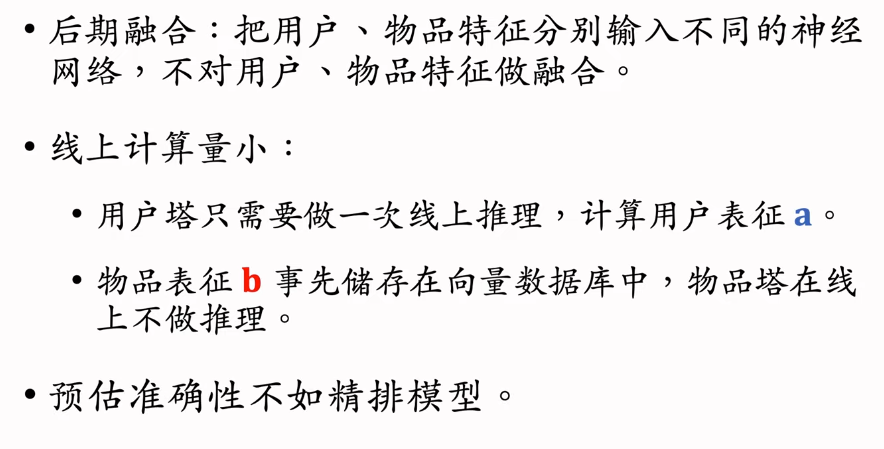

### 粗排的三塔模型

##### 模型结构

交叉特征指用户特征和物品特征做交叉

###### 下层结构

PS指的是parameter server

###### 上层结构

##### 推理

# 特征交叉

## Factorized Machine（FM）因式分解机

线性模型对输入的特征取加权和，作为对目标的预估。

如果先做特征交叉，再用线性模型，通常可以取得更好的效果。

如果做二阶特征交叉，那么参数量为O(特征数量平方)，计算量大，而且容易造成过拟合。

因式分解机（Factorized Machine, FM）用低秩矩阵分解的方式降低参数量，加速计算。

任何可以用线性模型（比如线性回归、逻辑回归）解决的问题，都可以用 FM 解决。

##### 线性模型

b为bias偏移项，p为对目标的预估

##### 二阶特征交叉

当d很小的时候，上面的模型没有问题，但是当d很大时，参数量会很大，这会带来很大的计算量，而且会出现overfiting

###### 如何减少参数量

重点关注交叉特征的权重$u_{ij}$

k为超参数，k越大$V\cdot V^T$越接近矩阵$U$

##### Factorized Machine

## 深度交叉网络（DCN）

Deep & Cross Networks (DCN) 译作“深度交叉网络”，用来代替简单的全连接网络，可以用于召回双塔模型、粗排三塔模型、精排模型。

DCN 由一个深度网络和一个交叉网络组成，交叉网络的基本组成单元是交叉层 (Cross Layer)。

##### 召回、排序模型

###### 双塔模型

###### 多目标排序模型

###### MMoE

##### 交叉层（Cross Layer）

交叉层的输入是两个向量$x_0,x_i$

$x_0$是整个神经网络最底层的输入，$x_i$是神经网络第$i$层的输入

$W,b$是全连接层的参数，也是整个交叉层的全部参数

Hadamard Product即为逐元素相乘

##### 交叉网络（Cross Network）

上面介绍的是Cross Network V2^[1]^

老版本的Cross Network在论文^[2]^中提出，现在已经没用了

##### 深度交叉网络（Deep&Cross Network）

## LHUC网络结构(Learning Hidden Uint Contributions)

LHUC 这种神经网络结构，可以用于精排。

LHUC 的起源是语音识别，后来被应用到推荐系统，快手将其称为 PPNet，现在已经在业界广泛落地。

##### 语音识别中的LHUC

上图中的两个神经网络都是由多个全连接层组成的，最后一层的激活函数都是$2\times Sigmoid$，$Sigmoid$作用在每一个元素上，所以最后输出的向量所有元素都介于零到二之间，这样的向量和语音向量做逐元素乘积会放大某些特征，缩小另一些特征，实现个性化。

##### 推荐系统排序模型中的LHUC

注意：将LHUC用于推荐系统，门控神经网络（2 x sigmoid）的梯度不要传递到用户ID embedding特征，需要对其做 stop gradient。

## SENet&Bilinear Cross

- SENet 是计算机视觉中的一种技术，可以用在推荐系统中对特征做动态加权。
- 双线性（Bilinear）特征交叉可以提升排序模型的表现。有很多种 Bilinear 交叉的方法。
- FiBiNet 是将 SENet 与 Bilinear 模型结合。

### SENet

r大于1，为超参数

Embedding向量维度可以不同

- SENet的本质是对离散特征做field-wise加权
- Field：
  - 用户ID embdeding是64维向量
  - 这64个元素算一个field，获得相同的权重
- 如果有m个离散特征，也就是m个fields，那么权重向量是m维
- 然后使用权重向量的每个元素对每个field做加权，重要的离散特征其权重高，不重要的特征权重低

### Field间特征交叉

##### 特征交叉

使用哈达玛乘积的时候，通常人工选择一些特征向量进行特征交叉

##### Bilinear Cross（内积）

##### Bilinear Cross（哈达玛乘积）

所有特征做交叉得到的大部分交叉特征是没有意义的。

使用这种特征交叉通常也需要人工指定一部分特征做交叉，这样既能减少参数数量，也能让concatenate后的向量变小。

### FiBiNet

图中SENet后得到的加权特征可以不用再做次双线性特征交叉

# 行为序列

## 用户历史行为序列建模

用户最近 n 次点击、点赞、收藏、转发等行为都是推荐系统中重要的特征，可以帮助召回和排序变得更精准。

最简单的方法——对用户行为取简单的平均，作为特征输入召回、排序模型。

##### LastN特征

##### 小红书的实践

小红书的召回、粗排、精排都用到了LastN特征

将平均得到的特征向量作为一种用户特征，用于召回、排序模型

## DIN模型（注意力机制）

DIN 模型，它是对 LastN 序列建模的一种方法，效果优于简单的平均。

DIN 的本质是注意力机制（attention）。

DIN 是阿里在 2018 年提出的，参考下面的参考文献。

##### DIN模型

- DIN用加权平均代替平均，即注意力机制（attention）
- 权重为候选物品与用户LastN物品的相似度

相似度计算方式有很多种，可以使用内积、余弦相似度等

##### 简单平均vs注意力机制

## SIM模型（长序列建模）

SIM 模型，它的主要目的是保留用户的长期兴趣。

SIM 的原理是对用户行为序列做快速筛选，缩短序列长度，使得DIN可以用于长序列。

##### DIM模型的缺点

- 注意力层的计算量正比于用户行为序列长度，因此只能记录最近几百个物品，否则计算量太大
- 缺点：关注短期兴趣，遗忘长期兴趣
- 实验证明，让记录的用户行为序列变长，可以显著提升推荐系统所有的指标，但是暴力增加序列长度是不划算的，这会带来巨大的计算量，性价比不高

##### 改进DIN

##### SIM模型

- 保留用户长期行为记录，n的大小可以是几千
- 对于每个候选物品，在用户LastN记录中做快速查找，找到k个相似物品
- 把LastN变成TopK，然后输入到注意力层
- SIM模型减小计算量（从n降到k）

###### 第一步：查找

具体使用哪种方法取决于公司的基建水平，如果有足够的设备则可以使用soft search获得更好的模型效果，否则使用hard search就可以了

###### 第二步：注意力机制

和DIN的区别在于，SIM使用的是第一步查找得到的TopK物品交互记录，而不是LastN交互记录

###### 使用时间信息：

###### 为什么SIM使用时间信息

- DIN的序列短，记录用户近期行为
- SIM的序列长，记录用户长期行为
- 时间越久远，重要性越低。使用时间信息可以带来显著提升

##### 小结

# 重排（推荐系统中的多样性）

如果多样性做得好，可以显著提升推荐系统的核心业务指标。

## 基础知识

- 物品相似性的度量。
  - 可以用物品标签或向量表征度量物品的相似性。
  - 最好的方法是基于图文内容的向量表征，比如 CLIP 方法。
- 提升多样性的方法。在推荐的链路上，在粗排和精排的后处理阶段，综合排序模型打分和多样性分数做选择。

### 物品相似度的度量

基于内容的向量表征，也就是使用cv和nlp模型提取的物品特征向量

##### 基于物品属性标签

##### 基于向量表征

###### 双塔模型的物品向量表征

使用双塔模型学习到的物品向量表征来计算相似度效果不好，最后推荐的物品多样性很差。

这是由于推荐系统中的头部现象很严重，曝光和点击都集中在少部分物品，新物品和长尾物品的曝光和点击都很少，双塔模型无法很好的学习他们的向量表征

###### 基于图文内容的物品表征

问题：这些cv和nlp模型如何训练？

- 如果使用外界的公开数据集训练，那么模型用在自己的数据上是否有效果
- 如果使用自己的数据进行训练，需要大量人工进行标注

### 提升多样性的方法

##### 推荐系统的链路

## MMR多样性算法（Maximal Marginal Relevance）

推荐系统和搜索引擎重排中常用的 Maximal Marginal Relevance (MMR)，它根据精排打分和物品相似度，从 n 个物品中选出 k 个价值高、且多样性好的物品。

滑动窗口 (sliding window)，它可以与 MMR、DPP 等多样性算法结合，实践中滑动窗口的效果更优。

### 多样性

### MMR

##### 原理

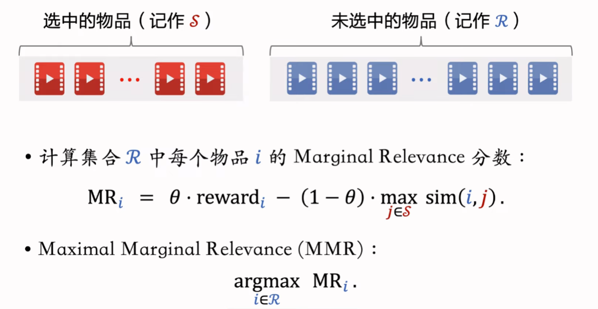

$\theta$是零到一之间的参数，平衡物品的价值和多样性，$\theta$越大，则物品的价值对排序影响越大，$\theta$越小，则多样性对排序影响越大。

##### 算法流程

### 滑动窗口

两个被推荐的物品，如果离得远，则可以相似，并不影响用户体验

实际工程中，都会使用滑动窗口

## 业务规则约束下的多样性算法

推荐系统有很多业务规则，比如不能连续出多篇某种类型的物品、某两种类型的物品笔记间隔多少。

这些业务规则应用在重排阶段，可以与 MMR、DPP 等多样性算法相结合。

##### 重排的规则

重排规则的优先级高于多样性

##### MMR+重排规则

## DPP多样性算法

行列式点过程 (determinantal point process, DPP) 是一种经典的机器学习方法，在 1970's 年代提出，在 2000 年之后有快速的发展。

DPP 是目前推荐系统重排多样性公认的最好方法。 

### 数学基础

##### 超平行体

 

一组向量$\boldsymbol{v}_{1},\cdots,\boldsymbol{v}_{k}\in\mathbb{R}^{d}$可以确定一个$k$维超平行体：
$$
{\mathcal{P}}(\boldsymbol{v}_{1},\cdots,\boldsymbol{v}_{k})=\{\alpha_{1}\boldsymbol{v}_{1}+\cdots+\alpha_{k}\boldsymbol{v}_{k}\mid0\leq\alpha_{1},\cdots,\alpha_{k}\leq1\}.
$$
要求$k\leq d$，比如$d=3$维空间中有$k=2$维平行四边形，但是$d=2$维空间中没有$k=3$维平行六面体。

如果想让超平行体有意义，那么$\boldsymbol{v}_{1},\cdots,\boldsymbol{v}_{k}$必须线程独立，如果他们线性相关，则体积${\mathrm{vol}}({\mathcal{P}})=0$。例如，有$k=3$个向量，落在一个平面上，则平行六面体的体积为0。

##### 平行四边形的面积

##### 平行六面体的体积

##### 衡量物品多样性

### DDP:多样性算法

##### 多样性问题

##### 行列式点过程（DPP）

DPP是一种传统的统计机器学习方法：
$$
\underset{\mathcal{S:|S|=k}}{argmax}\ log\ det(\boldsymbol{V}_\mathcal{S}^T\boldsymbol{V}_\mathcal{S})
$$
Hulu的论文^[1]^将DPP应用在推荐系统上：
$$
\underset{\mathcal{S:|S|=k}}{argmax}\ \theta\cdot(\sum_{j\in\mathcal{S}}{\mathrm{reward}}_{j})+(1-\theta)\cdot\log{\mathrm{det}}(\boldsymbol{V}_\mathcal{S}^{T}\,\boldsymbol{V}_\mathcal{S}).
$$

论文的主要贡献在于提出了如何快速计算上面的公式

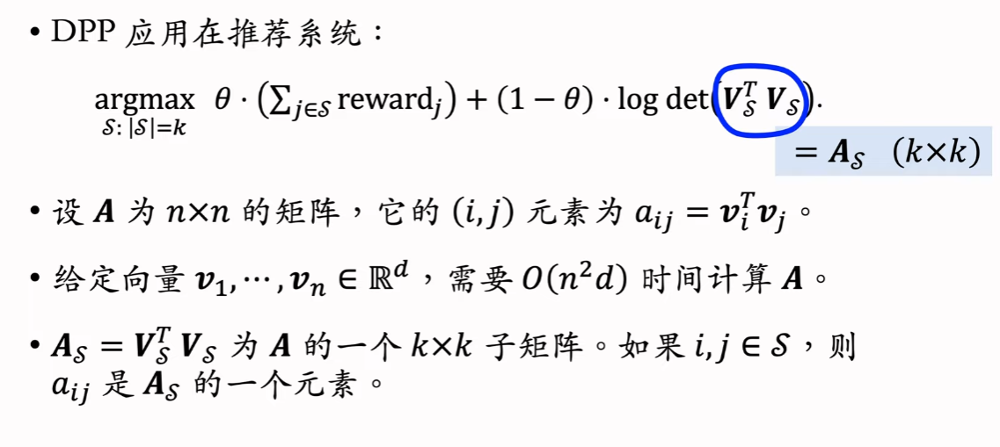

直接求解DPP问题是不可能的，因为DPP是一个np难的问题，通常用贪心算法求解

##### 求解DPP

求解DPP的主要难点在于求解行列式$det(A_{\mathcal{S\cup i}})$，计算代价非常大

###### 暴力算法

暴力算法的总时间复杂度为
$$
O(n^2d+nk^4)
$$
$n^2d$为计算矩阵A的时间

实际场景中，n大小约为几百，k大小约为几十，这个时间复杂度看起来ok，但实际上不行，因为推荐系统留给多样性算法的时间只有10ms左右

###### Hulu的快速算法

$A_\mathcal{S}$是一个对称半正定的矩阵

给$A_\mathcal{S}$添加一行和一列成为$A_\mathcal{S\cup{i}}$，不需要重新计算Cholesky分解，可以利用$A_\mathcal{S}$的cholesky快速计算出

$A_\mathcal{S\cup{i}}$的Cholesky分解

### DPP的扩展

##### 滑动窗口

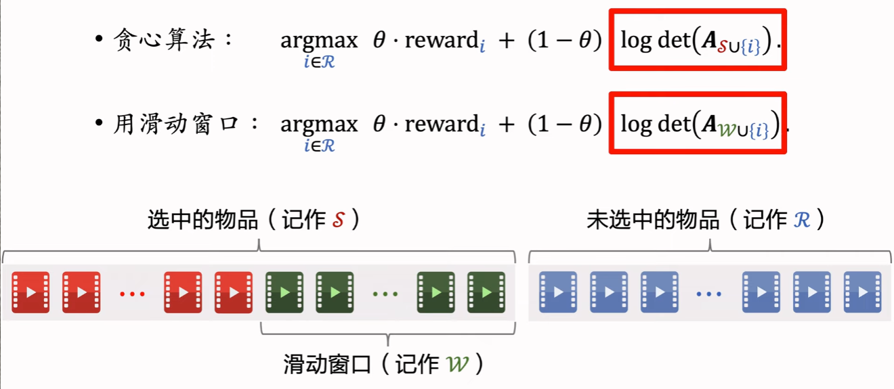

##### 规则约束

# 物品冷启动

物品冷启动指的是如何对新发布的物品做分发。

优化物品冷启动在小红书这样的 User-Generated Content (UGC) 平台尤为重要，这是因为新物品数量巨大，内容质量良莠不齐，分发非常困难。

像腾讯视频这样的平台属于PGC

UGC 平台的物品冷启动有三个目标：

- 精准推荐：克服冷启的困难，把新物品推荐给合适的用户，不引起用户反感。
- 激励发布：流量向低曝光新物品倾斜，激励发布。
- 挖掘高潜：通过初期小流量的试探，找到高质量的物品，给与流量倾斜。

## 评价指标

### 作者侧指标

- 发布渗透率、人均发布量反映出作者的发布积极性
- 冷启动的重要优化目标是促进发布，增大内容池
- 新笔记获得的曝光越多，首次曝光和交互出现得越早，作者发布积极性越高

##### 发布渗透率（penetration rate）

##### 人均发布量

### 用户侧指标

##### 新笔记的消费指标

##### 大盘消费指标

大盘消费指标不区分新笔记和老笔记

优化冷启动的优化目标不是提升大盘指标，而要保证新策略不会使得大盘指标下降，保证用户体验

### 内容侧指标

##### 高热笔记占比

### 冷启动的优化点

- 优化推荐全链路，包括召回和排序。
  - 每一个环节都针对新物品做优化，让新物品有机会走完全链路被曝光。
  - 同时也要尽量将新笔记的推荐做准，不要引起用户的反感。
- 流量调控，也就是流量如何在新物品和老物品中间分配。
  - 让流量向新物品倾斜，帮助新物品获得更多的曝光的机会

## 简单的召回通道

冷启动召回的难点是缺少用户交互，还没学好笔记 ID embedding，导致双塔模型效果不好。

而且缺少用户交互会导致 ItemCF 不适用。 

### 召回的难点

##### 召回的依据

##### 冷启召回的困难

###### 为什么ItemCF不适用于物品冷启动

新物品和用户没有交互或者交互很少，没有办法通过重叠交互用户判断物品之间的相似度

##### 召回通道

### 双塔模型

双塔模型不能直接用于物品冷启动的愿意就是无法很好的学习物品的ID Embedding。

因此需要对双塔模型进行改造

##### ID Embedding改进方案

###### 新笔记使用default embedding

###### 利用相似笔记embedding向量

##### 多个向量召回池

### 类目召回

##### 用户画像

##### 基于类目的召回

##### 基于关键词的召回

和基于类目的召回的区别就是使用关键词代替类目

##### 缺点

## 聚类召回

聚类召回是基于物品内容的召回通道。

它假设如果用户喜欢一个物品，那么用户会喜欢内容相似的其他物品。

使用聚类召回，需要事先训练一个多模态神经网络，将笔记图文表征为向量，并对向量做聚类，然后建索引。

### 聚类召回

##### 基本思想

##### 聚类索引

##### 线上召回

### 内容相似度模型

##### 提取图文特征

##### 两篇笔记内容相似度

图中的神经网络共享参数

CNN和BERT都是预训练好的，全连接层是随机初始化的，需要从数据中学习

##### 训练内容相似度模型

##### 正负样本的选取

### 总结

## Look_Alike人群扩散召回

Look_Alike常用在广告系统，也可以用在推荐系统。

Look-Alike 是一种召回通道，对冷启很有效。

Look-Alike 适用于发布一段时间、但是点击次数不高的物品。

物品从发布到热门，主要的透出渠道会经历三个阶段： 

1. 类目召回、聚类召回。它们是基于内容的召回通道，适用于刚刚发布的物品。
2. Look-Alike 召回。它适用于有点击，但是点击次数不高的物品。
3. 双塔、ItemCF、Swing  等等。它们是基于用户行为的召回通道，适用于点击次数较高的物品。

##### Look_Alike起源于互联网广告

满足所有条件的用户被称作种子用户，但是由于信息缺失等问题，只有很少一部分用户是种子用户

这部分种子用户的数量是不满足投放广告的需求的，需要找到更多的潜在用户

这就用到了人群扩散

扩散时需要用到用户相似度

##### Look_Alike用于新笔记召回

新笔记的交互行为较少，推荐经常不准，一旦发现这种交互行为，我们就要充分利用

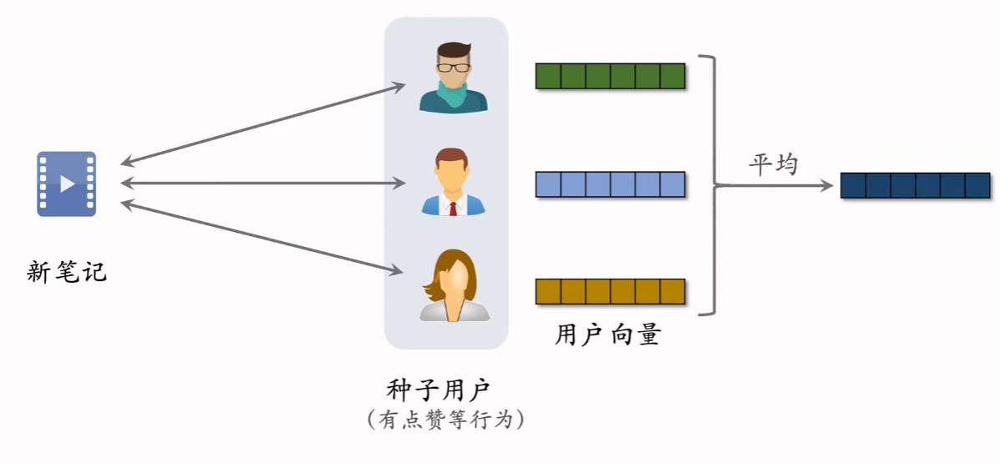

近线更新是指不需要实时更新，能做到分钟级别就可以了

最近邻查找的结果就是Look_Alike召回通道的召回结果

## 流量调控

流量调控是物品冷启动最重要的一环，直接影响作者发布指标。

前面所介绍的内容都是通过增加召回通道解决物品冷启动，流量调控是在排序阶段提权。

### 扶持新笔记

##### 目的

##### 工业界做法

### 流量调控技术的发展

1. 在推荐结果中强插新笔记。较为落后的技术，现在某些公司的边缘业务线还在使用
2. 对新笔记的排序分数做提权（boost）。比如乘以一个大于1的系数
3. 通过提权，对新笔记做保量。
   - 比如尽量保证新笔记在发布后的24小时最少有100次曝光。
   - 保量的手段也是提权，但是提权的策略更复杂更精细
4. 差异化保量。 
   - 根据内容质量决定保量的多少
   - 内容质量高，则给予更多流量和曝光；内容质量低，则流量和曝光少。

### 新笔记提权（boost）

##### 推荐系统的链路

##### 新笔记提权

在粗排和重排对物品做boost，因为这两个阶段会淘汰大量物品。

### 新笔记保量

##### 新笔记保量

注：图中的提权系数仅作说明，不具有参考意义

##### 动态提权保量

$$
提权系数=f(\frac{发布时间}{目标时间},\frac{已有曝光}{目标曝光})=f(0.5,0.2)
$$

##### 保量的难点

###### 保量成功率远低于100%

###### 线上环境变化会导致保量失败

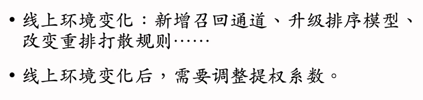

###### 思考题

给所有新笔记一个很大的提权系数(比如4倍)直到达成 100次曝光为止，这样的保量成功率很高。为什么不用这种方法呢？

### 差异化保量

##### 普通保量vs差异化保量

##### 差异化保量

## 冷启动的AB测试

### 标准AB测试

标准的AB测试只观测用户侧的大盘消费指标

冷启动的AB测试既观测作者侧指标，也观测用户侧指标，很麻烦

### 用户侧实验

##### 缺点

### 作者侧实验

##### 方案一

###### 缺点：新笔记之间会抢流量

实验组新笔记得到提权，所以得到更多的曝光次数，对照组新笔记的曝光次数减少，因此产生diff，但是这种diff是不可信的，推全之后会消失。这是因为推全之后不会存在抢流量的情况，diff就会消失。

###### 缺点：新笔记和老笔记抢流量

AB测试时，50%新笔记提权后，会抢100%老笔记的流量。

推全后，100%新笔记抢100%老笔记的流量，也就是说推全之后新笔记更难抢到流量。

新老笔记抢流量不是问题，问题在于推全之后，设定发生了变化，导致AB测试的结果不准确

##### 方案二

这种设计的目的是为了避免两组新笔记抢流量，因为这种方案比方案一更可信

新笔记内容池减少一般，可能会导致用户侧指标下降

###### 方案二比方案一的优缺点

##### 方案三

这相当于把应用划分为两个应用。

可以保证AB测试和推全后结果相同，但是由于内容池减少了一般，会严重损害用户体验，用户侧指标严重下降，损害公司业务，是得不偿失的。

### 总结

# 涨指标的方法

- 改进召回模型和添加新的召回模型。
- 改进粗排和精排模型。
- 提升召回、粗排、精排中的多样性。
- 特殊对待新用户、低活用户等特殊人群。
- 利用关注、转发、评论这三种交互行为来提升指标。

## 推荐系统的评价指标

时长关系到留存，曝光数关系到广告收入，需要对两者做平衡

## 召回

### 召回模型&召回通道

### 改进双塔模型

##### 方向一：优化正样本、负样本

##### 方向二：改进神经网络结构

###### 多向量模型

有点类似于排序中的多目标排序模型。

物品塔使用单向量是因为物品特征是提前计算好存储在向量数据库中的，如果使用多向量会极大的增加计算量。

##### 方向三：改进模型的训练方法

### Item-to-Item（I2I）

##### 如何计算物品相似度

### 小众的召回模型

##### 类似I2I的模型

##### 更复杂的模型

### 总结

## 排序模型

### 精排模型的改进

离散特征首先通过Embedding得到一个几千维的数值向量，然后在经过全连接网络得到一个几百维的特征向量

连续特征通过另一个神经网络得到一个几百维的特征向量。

由于算力的限制，基座中的神经网络通常不会太大，如果用cpu推理全连接网络通常只有1-2层，如果用gpu推理全连接网络可以有3-6层。

将基座网络输出的特征向量做concatenation，得到上层神经网络的输入。

上层网络中的全连接网络通常只有两层。

精排模型中的基座和上层的多目标预估都有很多可以改进的点。

##### 基座

基座的输入包括离散特征和连续特征，输出一个向量，作为多目标预估的输入。

- 改进1：基座加宽加深，计算量更大，预测更准确
  - 全连接网络不够大，通常会underfit
  - 推荐系统的参数量很大，但是99%都集中在Embedding层，全连接网络参数量很小
  - 数据量太大，但是全连接网络不够大，所以全连接网络加宽加深可以让模型变得更准
  - 这会带来更大的计算量，要考虑投入产出比的问题
  - 工业实践中基座网络一般为1-6层，取决于训练和推理的架构水平
- 改进2：做自动的特征交叉。比如bilinear^[1]^和LHUC^[2]^
- 改进3：特征工程。比如添加统计特征，多模态内容特征

##### 多目标预估

基于基座输出的向量，同时预估点击率等多个目标

- 改进1：增加新的预估目标，并把预估结果加入融分公式

- 改进2：MMoE^[1]^、PLE^[2]^等结构可能有效，但是往往无效。
- 改进3：纠正position bias^[3]^可能有效，但是大概率无效

### 粗排模型的改进

自动特征交叉、人工特征工程、增加新的预估目标等用于优化精排模型的手段也可以用于粗排模型。

接下来的优化都是针对粗排模型的

粗排不需要很高的精度，所以可以使用多向量双塔这种简单模型

##### 粗精排一致性建模

蒸馏精排模型来训练粗排，让粗排精排更一致

### 用户行为序列建模

在排序模型优化到一定程度后，提升指标会变得非常困难，这时候最主要的提升指标的手段就是用户行为序列建模

最简单的用户行为序列建模的方法是对物品向量取平均，作为一种用户特征^[1]^

更先进一点的方法是DIN^[2]^，它使用注意力机制，对物品向量做加权平均

工业界目前沿着SIM^[3]^的方向发展。先用类目等属性筛选物品，然后用DIN对物品向量做加权平均

##### 改进方向

增加序列长度最大的难点还是工程架构，工程架构弱的话无法做长序列建模。

目前做的最好的是快手，实现了超长序列建模，可以使用长度为100万的用户行为序列，几乎覆盖了用户所有的历史行为。

这是非常困难的，有些公司只能做到1000。

算法原理大家都知道，但是序列长度能做的很大靠的是架构

通过筛选减小序列长度。

聚类方法：通常使用层次聚类

##### 概括

### 在线学习

增量更新就是在线学习。

增量更新是分钟级别的

##### 资源消耗

在线学习对推荐系统的提升非常大，同时也带来了更多的资源消耗

线上一共有四个精排模型（holdout、推全模型、新模型1、性模型2），那么就需要四套在线学习资源。也就说如果只有四套在线学习资源，那么就只能同时测试两个新模型。想看7日留存，模型必须在线上运行至少七天，想看30日留存，模型必须在线上至少运行30天。

同样的，召回和粗排也需要在线学习，每个模型都需要一套计算资源。

但是召回和粗排模型小，没有精排在线学习消耗的资源多

在模型开发初期，一般不进行在线学习，只有在模型成熟之后，才会考虑进行在线学习。

过早的进行在线学习，很容易把模型锁死在较弱的版本，后续开发版本迭代会很慢。

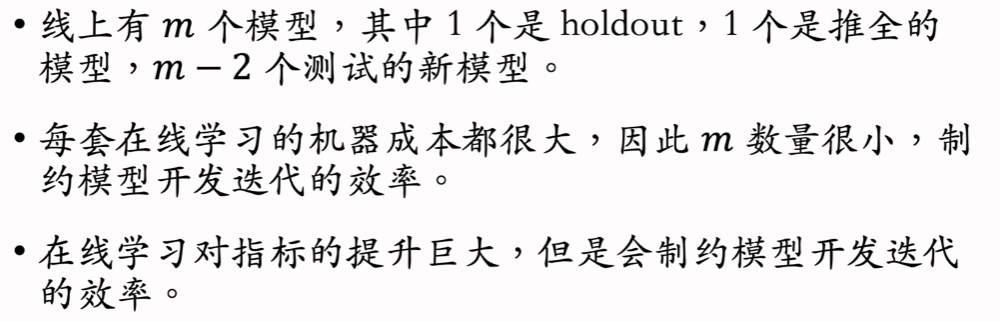

### 老汤模型

算法工程师最麻烦的问题，解决不了的话，新模型很难超过老模型，开发迭代效率会很低。

##### 问题

##### 问题1

只用10天数据训练的新模型不可能追上已经训练上百天的老模型，即使其结构更好

##### 问题2

在训练初期进行蒸馏可以大幅加快收敛

### 总结：改进排序模型

## 提升多样性

可以通过提升推荐物品的多样性（diversity）为推荐系统涨指标。

在召回、粗排、精排三个阶段，均有提升多样性的方法。

在召回阶段，可以通过添加噪声、随机选取用户行为序列等方式提升双塔模型、I2I的多样性。

在排序阶段，结合兴趣分数与多样性分数共同给候选物品排序。

### 排序的多样性

##### 精排多样性

##### 粗排多样性

### 召回的多样性

##### 双塔模型

双塔模型是最重要的召回通道，占据了最多的召回配额

###### 添加噪声

添加噪声的增强多样性会使得推荐变得不准，直觉上认为会损害系统指标，但实际上会提升系统指标。

添加噪声到embedding，可以是高斯噪声等

###### 抽样用户行为序列

##### U2I2I

###### 抽样用户行为序列

### 探索流量

通常来说，推荐给用户的物品是个性化召回模型、个性化排序模型选出来的，个性化非常强，但不妨保存2%的探索流量，也就是说推荐给用户的物品有2%的流量是非个性化的。

### 总结

## 特殊对待特殊用户人群

特殊对待特殊的用户人群，比如新用户和低活用户。具体介绍3大类方法：

- 构造特殊内容池，用于特殊用户人群的召回。
- 使用特殊排序策略，保护特殊用户。
- 使用特殊的排序模型，消除模型预估的偏差。

##### 为什么特殊对待特殊用户人群

##### 涨指标的方法

### 构造特殊的内容池

##### 如何构造特殊内容池

工业界已经在使用因果推断了，但是技术还不成熟

##### 特殊内容池的召回

特殊内容池没有额外的训练代价

但是特殊内容池有额外的推理代价

### 特殊的排序策略

##### 排除低质量物品

##### 差异化的融分公式

### 特殊的排序模型

##### 差异化的排序模型

###### 大模型+小模型

小模型起到纠偏的作用

###### 融合多个experts，类似MMoE

MMoE计算权重使用全部特征，这里只使用用户特征，由用户特征决定加权权重

这样不管是新用户，老用户，还是介于新老用户，都可以用这种方案解决。

###### 大模型预估之后，用小模型做校准

大模型用全体用户的数据训练，小模型用特殊人群的数据进行训练

小模型结合大模型的预估和用户特征，再做一次预估，起到校准的作用，用在特殊人群上，小模型预估比大模型更准确。

##### 错误的做法

这种错误的方法短期内可以提升系统指标，看似很有效，但是这样会大量增加系统的维护代价，长期来看是有害的。

### 总结

## 利用交互行为

可以利用关注、转发、评论这三种交互行为给推荐系统涨指标。

### 关注

##### 关注量对留存的价值

下面介绍两种利用关注关系提升用户留存的方法

###### 用排序策略提升关注量

上面的排序策略只有在$f$很小的时候才会起到促关注作用，因为如果$f$很大，那么$w(f)$就会接近于0，这一项就不起作用了，这是符合要求的。

###### 构造促关注内容池和召回通道

##### 粉丝数对促发布的价值

##### 隐式关注关系

### 转发（分享）

##### 促转发（分享回流）

不可以简单的提升转发次数

目标应该是在不损害点击和其他交互的前提下，尽量多吸引站外流量。 

##### KOL建模

什么样的用户转发可以吸引大量站外流量呢？

答案是其他平台的KOL(key opinion leader)，也就是有很多粉丝的大V。注意是其他平台的KOL，而不是本平台的KOL。

问题的关键就是如何判断本平台的用户是不是其他平台的KOL，通常通过该用户历史上的转发能带来多少站外流量来判断。

##### 促转发的策略

识别出站外的KOL之后，要将其用于排序和召回

### 评论

##### 评论促发布

##### 评论的其他价值

### 总结

