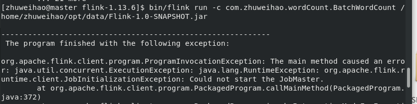

# FLINK官网：https://flink.apache.org/

# Flink简介（官网搬运）

Flink项目的核心目标，是“数据流上的有状态计算”（Stateful  Computations over Data Streams）。

Apache Flink 是一个框架和分布式处理引擎，如下图所示，用于对无界和有界数据流进行有状态计算。Flink 被设计在所有常见的集群环境中运行，以内存执行速度和任意规模来执行计算。

Flink 是一个流式大数据处理引擎。 “内存执行速度”和“任意规模”，突出了 Flink 的两个特点：速度快、可扩展性强


## 流式数据处理的发展

### 传统数据处理架构

从字面上来看OLTP是做事务处理，OLAP是做分析处理。从对数据库操作来看，OLTP主要是对数据的增删改，OLAP是对数据的查询。

#### 事务处理（OLTP,on-line transaction processing）


#### 分析处理（OLAP,On-Line Analytical Processing）


### 有状态的流处理

不难想到，如果我们对于事件流的处理非常简单，例如收到一条请求就返回一个“收到”， 那就可以省去数据库的查询和更新了。但是这样的处理是没什么实际意义的。在现实的应用中， 往往需要还其他一些额外数据。我们可以把需要的额外数据保存成一个“状态”，然后针对这条数据进行处理，并且更新状态。在传统架构中，这个状态就是保存在数据库里的。这就是所谓的“有状态的流处理”。 

为了加快访问速度，我们可以直接将状态保存在本地内存。当应用收到一 个新事件时，它可以从状态中读取数据，也可以更新状态。而当状态是从内存中读写的时候， 这就和访问本地变量没什么区别了，实时性可以得到极大的提升。 


另外，数据规模增大时，我们也不需要做重构，只需要构建分布式集群，各自在本地计算就可以了，可扩展性也变得更好。 

因为采用的是一个分布式系统，所以还需要保护本地状态，防止在故障时数据丢失。我们可以定期地将应用状态的一致性检查点（checkpoint）存盘，写入远程的持久化存储，遇到故障时再去读取进行恢复，这样就保证了更好的容错性。

### Lambda架构

对于有状态的流处理，当数据越来越多时，我们必须用分布式的集群架构来获取更大的吞吐量。但是分布式架构会带来另一个问题：怎样保证数据处理的顺序是正确的呢？ 

对于批处理来说，这并不是一个问题。因为所有数据都已收集完毕，我们可以根据需要选择、排列数据，得到想要的结果。可如果我们采用“来一个处理一个”的流处理，就可能出现 “乱序”的现象：本来先发生的事件，因为分布处理的原因滞后了。怎么解决这个问题呢？ 

以 Storm 为代表的第一代分布式开源流处理器，主要专注于具有毫秒延迟的事件处理，特点就是一个字“快”；而对于准确性和结果的一致性，是不提供内置支持的，因为结果有可能取决于到达事件的时间和顺序。另外，第一代流处理器通过检查点来保证容错性，但是故障恢 复的时候，即使事件不会丢失，也有可能被重复处理——所以无法保证 exactly-once。

 与批处理器相比，可以说第一代流处理器牺牲了结果的准确性，用来换取更低的延迟。而 批处理器恰好反过来，牺牲了实时性，换取了结果的准确。 我们自然想到，如果可以让二者做个结合，不就可以同时提供快速和准确的结果了吗？

正是基于这样的思想，Lambda 架构被设计出来。我们可以认为这是第二代流处理架构，但事实上，它只是第一代流处理器和批处理器的简单合并。


Lambda 架构主体是传统批处理架构的增强。它的“批处理层”（Batch Layer）就是由传统的批处理器和存储组成，而“实时层”（Speed Layer）则由低延迟的流处理器实现。数据到达之后，两层处理双管齐下，一方面由流处理器进行实时处理，另一方面写入批处理存储空间， 等待批处理器批量计算。流处理器快速计算出一个近似结果，并将它们写入“流处理表”中。 而批处理器会定期处理存储中的数据，将准确的结果写入批处理表，并从快速表中删除不准确的结果。最终，应用程序会合并快速表和批处理表中的结果，并展示出来。

### 新一代流处理器

之前的分布式流处理架构，都有明显的缺陷，人们也一直没有放弃对流处理器的改进和完善。终于，在原有流处理器的基础上，新一代分布式开源流处理器诞生了。为了与之前的系统区分，我们一般称之为第三代流处理器，代表当然就是 Flink。 

第三代流处理器通过巧妙的设计，完美解决了乱序数据对结果正确性的影响。这一代系统还做到了精确一次（exactly-once）的一致性保障，是第一个具有一致性和准确结果的开源流 处理器。另外，先前的流处理器仅能在高吞吐和低延迟中二选一，而新一代系统能够同时提供这两个特性。所以可以说，这一代流处理器仅凭一套系统就完成了 Lambda 架构两套系统的工作，它的出现使得 Lambda 架构黯然失色。 

除了低延迟、容错和结果准确性之外，新一代流处理器还在不断添加新的功能，例如高可用的设置，以及与资源管理器（如 YARN 或 Kubernetes）的紧密集成等等。

## 架构

Apache Flink 是一个框架和分布式处理引擎，用于在*无边界和有边界*数据流上进行有状态的计算。Flink 能在所有常见集群环境中运行，并能以内存速度和任意规模进行计算。

接下来，我们来介绍一下 Flink 架构中的重要方面。

### 处理无界和有界数据

任何类型的数据都可以形成一种事件流。信用卡交易、传感器测量、机器日志、网站或移动应用程序上的用户交互记录，所有这些数据都形成一种流。

数据可以被作为 *无界* 或者 *有界* 流来处理。

1. **无界流** 有定义流的开始，但没有定义流的结束。它们会无休止地产生数据。无界流的数据必须持续处理，即数据被摄取后需要立刻处理。我们不能等到所有数据都到达再处理，因为输入是无限的，在任何时候输入都不会完成。处理无界数据通常要求以特定顺序摄取事件，例如事件发生的顺序，以便能够推断结果的完整性。
2. **有界流** 有定义流的开始，也有定义流的结束。有界流可以在摄取所有数据后再进行计算。有界流所有数据可以被排序，所以并不需要有序摄取。有界流处理通常被称为批处理


**Apache Flink 擅长处理无界和有界数据集** 精确的时间控制和状态化使得 Flink 的运行时(runtime)能够运行任何处理无界流的应用。有界流则由一些专为固定大小数据集特殊设计的算法和数据结构进行内部处理，产生了出色的性能。

通过探索 Flink 之上构建的 [用例](https://flink.apache.org/zh/usecases.html) 来加深理解。

### 部署应用到任意地方

Apache Flink 是一个分布式系统，它需要计算资源来执行应用程序。Flink 集成了所有常见的集群资源管理器，例如 [Hadoop YARN](https://hadoop.apache.org/docs/stable/hadoop-yarn/hadoop-yarn-site/YARN.html)、 [Apache Mesos](https://mesos.apache.org/) 和 [Kubernetes](https://kubernetes.io/)，但同时也可以作为独立集群运行。

Flink 被设计为能够很好地工作在上述每个资源管理器中，这是通过资源管理器特定(resource-manager-specific)的部署模式实现的。Flink 可以采用与当前资源管理器相适应的方式进行交互。

部署 Flink 应用程序时，Flink 会根据应用程序配置的并行性自动标识所需的资源，并从资源管理器请求这些资源。在发生故障的情况下，Flink 通过请求新资源来替换发生故障的容器。提交或控制应用程序的所有通信都是通过 REST 调用进行的，这可以简化 Flink 与各种环境中的集成。

### 运行任意规模应用

Flink 旨在任意规模上运行有状态流式应用。因此，应用程序被并行化为可能数千个任务，这些任务分布在集群中并发执行。所以应用程序能够充分利用无尽的 CPU、内存、磁盘和网络 IO。而且 Flink 很容易维护非常大的应用程序状态。其异步和增量的检查点算法对处理延迟产生最小的影响，同时保证精确一次状态的一致性。

[Flink 用户报告了其生产环境中一些令人印象深刻的扩展性数字](https://flink.apache.org/zh/poweredby.html)

- 处理**每天处理数万亿的事件**,
- 应用维护**几TB大小的状态**, 和
- 应用**在数千个内核上运行**。

### 利用内存性能

有状态的 Flink 程序针对本地状态访问进行了优化。任务的状态始终保留在内存中，如果状态大小超过可用内存，则会保存在能高效访问的磁盘数据结构中。任务通过访问本地（通常在内存中）状态来进行所有的计算，从而产生非常低的处理延迟。Flink 通过定期和异步地对本地状态进行持久化存储来保证故障场景下精确一次的状态一致性。


## 应用

Apache Flink 是一个针对无界和有界数据流进行有状态计算的框架。Flink 自底向上在不同的抽象级别提供了多种 API，并且针对常见的使用场景开发了专用的扩展库。

在本章中，我们将介绍 Flink 所提供的这些简单易用、易于表达的 API 和库。

### 流处理应用的基本组件

可以由流处理框架构建和执行的应用程序类型是由框架对 *流*、*状态*、*时间* 的支持程度来决定的。在下文中，我们将对上述这些流处理应用的基本组件逐一进行描述，并对 Flink 处理它们的方法进行细致剖析。

#### 流

显而易见，（数据）流是流处理的基本要素。然而，流也拥有着多种特征。这些特征决定了流如何以及何时被处理。Flink 是一个能够处理任何类型数据流的强大处理框架。

- **有界** 和 **无界** 的数据流：流可以是无界的；也可以是有界的，例如固定大小的数据集。Flink 在无界的数据流处理上拥有诸多功能强大的特性，同时也针对有界的数据流开发了专用的高效算子。
- **实时** 和 **历史记录** 的数据流：所有的数据都是以流的方式产生，但用户通常会使用两种截然不同的方法处理数据。或是在数据生成时进行实时的处理；亦或是先将数据流持久化到存储系统中——例如文件系统或对象存储，然后再进行批处理。Flink 的应用能够同时支持处理实时以及历史记录数据流。

#### 状态

只有在每一个单独的事件上进行转换操作的应用才不需要状态，换言之，每一个具有一定复杂度的流处理应用都是有状态的。任何运行基本业务逻辑的流处理应用都需要在一定时间内存储所接收的事件或中间结果，以供后续的某个时间点（例如收到下一个事件或者经过一段特定时间）进行访问并进行后续处理。


应用状态是 Flink 中的一等公民，Flink 提供了许多状态管理相关的特性支持，其中包括：

- **多种状态基础类型**：Flink 为多种不同的数据结构提供了相对应的状态基础类型，例如原子值（value），列表（list）以及映射（map）。开发者可以基于处理函数对状态的访问方式，选择最高效、最适合的状态基础类型。
- **插件化的State Backend**：State Backend 负责管理应用程序状态，并在需要的时候进行 checkpoint。Flink 支持多种 state backend，可以将状态存在内存或者 [RocksDB](https://rocksdb.org/)。RocksDB 是一种高效的嵌入式、持久化键值存储引擎。Flink 也支持插件式的自定义 state backend 进行状态存储。
- **精确一次语义**：Flink 的 checkpoint 和故障恢复算法保证了故障发生后应用状态的一致性。因此，Flink 能够在应用程序发生故障时，对应用程序透明，不造成正确性的影响。
- **超大数据量状态**：Flink 能够利用其异步以及增量式的 checkpoint 算法，存储数 TB 级别的应用状态。
- **可弹性伸缩的应用**：Flink 能够通过在更多或更少的工作节点上对状态进行重新分布，支持有状态应用的分布式的横向伸缩。

#### 时间

时间是流处理应用另一个重要的组成部分。因为事件总是在特定时间点发生，所以大多数的事件流都拥有事件本身所固有的时间语义。进一步而言，许多常见的流计算都基于时间语义，例如窗口聚合、会话计算、模式检测和基于时间的 join。流处理的一个重要方面是应用程序如何衡量时间，即区分事件时间（event-time）和处理时间（processing-time）。

Flink 提供了丰富的时间语义支持。

- **事件时间模式**：使用事件时间语义的流处理应用根据事件本身自带的时间戳进行结果的计算。因此，无论处理的是历史记录的事件还是实时的事件，事件时间模式的处理总能保证结果的准确性和一致性。
- **Watermark 支持**：Flink 引入了 watermark 的概念，用以衡量事件时间进展。Watermark 也是一种平衡处理延时和完整性的灵活机制。
- **迟到数据处理**：当以带有 watermark 的事件时间模式处理数据流时，在计算完成之后仍会有相关数据到达。这样的事件被称为迟到事件。Flink 提供了多种处理迟到数据的选项，例如将这些数据重定向到旁路输出（side output）或者更新之前完成计算的结果。
- **处理时间模式**：除了事件时间模式，Flink 还支持处理时间语义。处理时间模式根据处理引擎的机器时钟触发计算，一般适用于有着严格的低延迟需求，并且能够容忍近似结果的流处理应用。

### 分层 API

Flink 根据抽象程度分层，提供了三种不同的 API。每一种 API 在简洁性和表达力上有着不同的侧重，并且针对不同的应用场景。


#### ProcessFunction

[ProcessFunction](https://nightlies.apache.org/flink/flink-docs-stable/dev/stream/operators/process_function.html) 是 Flink 所提供的最具表达力的接口。ProcessFunction 可以处理一或两条输入数据流中的单个事件或者归入一个特定窗口内的多个事件。它提供了对于时间和状态的细粒度控制。开发者可以在其中任意地修改状态，也能够注册定时器用以在未来的某一时刻触发回调函数。因此，你可以利用 ProcessFunction 实现许多[有状态的事件驱动应用](https://flink.apache.org/zh/usecases.html#eventDrivenApps)所需要的基于单个事件的复杂业务逻辑。

#### DataStream API

[DataStream API](https://nightlies.apache.org/flink/flink-docs-stable/dev/datastream_api.html) 为许多通用的流处理操作提供了处理原语。这些操作包括窗口、逐条记录的转换操作，在处理事件时进行外部数据库查询等。DataStream API 支持 Java 和 Scala 语言，预先定义了例如`map()`、`reduce()`、`aggregate()` 等函数。你可以通过扩展实现预定义接口或使用 Java、Scala 的 lambda 表达式实现自定义的函数。

#### SQL & Table API

Flink 支持两种关系型的 API，[Table API 和 SQL](https://nightlies.apache.org/flink/flink-docs-stable/dev/table/index.html)。这两个 API 都是批处理和流处理统一的 API，这意味着在无边界的实时数据流和有边界的历史记录数据流上，关系型 API 会以相同的语义执行查询，并产生相同的结果。Table API 和 SQL 借助了 [Apache Calcite](https://calcite.apache.org/) 来进行查询的解析，校验以及优化。它们可以与 DataStream 和 DataSet API 无缝集成，并支持用户自定义的标量函数，聚合函数以及表值函数。

Flink 的关系型 API 旨在简化[数据分析](https://flink.apache.org/zh/usecases.html#analytics)、[数据流水线和 ETL 应用](https://flink.apache.org/zh/usecases.html#pipelines)的定义。

### 库

Flink 具有数个适用于常见数据处理应用场景的扩展库。这些库通常嵌入在 API 中，且并不完全独立于其它 API。它们也因此可以受益于 API 的所有特性，并与其他库集成。

- **[复杂事件处理(CEP)](https://nightlies.apache.org/flink/flink-docs-stable/dev/libs/cep.html)**：模式检测是事件流处理中的一个非常常见的用例。Flink 的 CEP 库提供了 API，使用户能够以例如正则表达式或状态机的方式指定事件模式。CEP 库与 Flink 的 DataStream API 集成，以便在 DataStream 上评估模式。CEP 库的应用包括网络入侵检测，业务流程监控和欺诈检测。
- **[DataSet API](https://nightlies.apache.org/flink/flink-docs-stable/dev/batch/index.html)**：DataSet API 是 Flink 用于批处理应用程序的核心 API。DataSet API 所提供的基础算子包括*map*、*reduce*、*(outer) join*、*co-group*、*iterate*等。所有算子都有相应的算法和数据结构支持，对内存中的序列化数据进行操作。如果数据大小超过预留内存，则过量数据将存储到磁盘。Flink 的 DataSet API 的数据处理算法借鉴了传统数据库算法的实现，例如混合散列连接（hybrid hash-join）和外部归并排序（external merge-sort）。
- **[Gelly](https://nightlies.apache.org/flink/flink-docs-stable/dev/libs/gelly/index.html)**: Gelly 是一个可扩展的图形处理和分析库。Gelly 是在 DataSet API 之上实现的，并与 DataSet API 集成。因此，它能够受益于其可扩展且健壮的操作符。Gelly 提供了[内置算法](https://nightlies.apache.org/flink/flink-docs-stable/dev/libs/gelly/library_methods.html)，如 label propagation、triangle enumeration 和 page rank 算法，也提供了一个简化自定义图算法实现的 [Graph API](https://nightlies.apache.org/flink/flink-docs-stable/dev/libs/gelly/graph_api.html)。

## 运维

Apache Flink 是一个针对无界和有界数据流进行有状态计算的框架。由于许多流应用程序旨在以最短的停机时间连续运行，因此流处理器必须提供出色的故障恢复能力，以及在应用程序运行期间进行监控和维护的工具。

Apache Flink 非常注重流数据处理的可运维性。因此在这一小节中，我们将详细介绍 Flink 的故障恢复机制，并介绍其管理和监控应用的功能。

### 7 * 24小时稳定运行

在分布式系统中，服务故障是常有的事，为了保证服务能够7*24小时稳定运行，像Flink这样的流处理器故障恢复机制是必须要有的。显然这就意味着，它(这类流处理器)不仅要能在服务出现故障时候能够重启服务，而且还要当故障发生时，保证能够持久化服务内部各个组件的当前状态，只有这样才能保证在故障恢复时候，服务能够继续正常运行，好像故障就没有发生过一样。

Flink通过几下多种机制维护应用可持续运行及其一致性:

- **检查点的一致性**: Flink的故障恢复机制是通过建立分布式应用服务状态一致性检查点实现的，当有故障产生时，应用服务会重启后，再重新加载上一次成功备份的状态检查点信息。结合可重放的数据源，该特性可保证*精确一次（exactly-once）*的状态一致性。
- **高效的检查点**: 如果一个应用要维护一个TB级的状态信息，对此应用的状态建立检查点服务的资源开销是很高的，为了减小因检查点服务对应用的延迟性（SLAs服务等级协议）的影响，Flink采用异步及增量的方式构建检查点服务。
- **端到端的精确一次**: Flink 为某些特定的存储支持了事务型输出的功能，及时在发生故障的情况下，也能够保证精确一次的输出。
- **集成多种集群管理服务**: Flink已与多种集群管理服务紧密集成，如 [Hadoop YARN](https://hadoop.apache.org/), [Mesos](https://mesos.apache.org/), 以及 [Kubernetes](https://kubernetes.io/)。当集群中某个流程任务失败后，一个新的流程服务会自动启动并替代它继续执行。
- **内置高可用服务**: Flink内置了为解决单点故障问题的高可用性服务模块，此模块是基于[Apache ZooKeeper](https://zookeeper.apache.org/) 技术实现的，[Apache ZooKeeper](https://zookeeper.apache.org/)是一种可靠的、交互式的、分布式协调服务组件。

### Flink能够更方便地升级、迁移、暂停、恢复应用服务

驱动关键业务服务的流应用是经常需要维护的。比如需要修复系统漏洞，改进功能，或开发新功能。然而升级一个有状态的流应用并不是简单的事情，因为在我们为了升级一个改进后版本而简单停止当前流应用并重启时，我们还不能丢失掉当前流应用的所处于的状态信息。

而Flink的 *Savepoint* 服务就是为解决升级服务过程中记录流应用状态信息及其相关难题而产生的一种唯一的、强大的组件。一个 Savepoint，就是一个应用服务状态的一致性快照，因此其与checkpoint组件的很相似，但是与checkpoint相比，Savepoint 需要手动触发启动，而且当流应用服务停止时，它并不会自动删除。Savepoint 常被应用于启动一个已含有状态的流服务，并初始化其（备份时）状态。Savepoint 有以下特点：

- **便于升级应用服务版本**: Savepoint 常在应用版本升级时使用，当前应用的新版本更新升级时，可以根据上一个版本程序记录的 Savepoint 内的服务状态信息来重启服务。它也可能会使用更早的 Savepoint 还原点来重启服务，以便于修复由于有缺陷的程序版本导致的不正确的程序运行结果。
- **方便集群服务移植**: 通过使用 Savepoint，流服务应用可以自由的在不同集群中迁移部署。
- **方便Flink版本升级**: 通过使用 Savepoint，可以使应用服务在升级Flink时，更加安全便捷。
- **增加应用并行服务的扩展性**: Savepoint 也常在增加或减少应用服务集群的并行度时使用。
- **便于A/B测试及假设分析场景对比结果**: 通过把同一应用在使用不同版本的应用程序，基于同一个 Savepoint 还原点启动服务时，可以测试对比2个或多个版本程序的性能及服务质量。
- **暂停和恢复服务**: 一个应用服务可以在新建一个 Savepoint 后再停止服务，以便于后面任何时间点再根据这个实时刷新的 Savepoint 还原点进行恢复服务。
- **归档服务**: Savepoint 还提供还原点的归档服务，以便于用户能够指定时间点的 Savepoint 的服务数据进行重置应用服务的状态，进行恢复服务。

### 监控和控制应用服务

如其它应用服务一样，持续运行的流应用服务也需要监控及集成到一些基础设施资源管理服务中，例如一个组件的监控服务及日志服务等。监控服务有助于预测问题并提前做出反应，日志服务提供日志记录能够帮助追踪、调查、分析故障发生的根本原因。最后，便捷易用的访问控制应用服务运行的接口也是Flink的一个重要的亮点特征。

Flink与许多常见的日志记录和监视服务集成得很好，并提供了一个REST API来控制应用服务和查询应用信息。具体表现如下：

- **Web UI方式**: Flink提供了一个web UI来观察、监视和调试正在运行的应用服务。并且还可以执行或取消组件或任务的执行。
- **日志集成服务**:Flink实现了流行的slf4j日志接口，并与日志框架[log4j](https://logging.apache.org/log4j/2.x/)或[logback](https://logback.qos.ch/)集成。
- **指标服务**: Flink提供了一个复杂的度量系统来收集和报告系统和用户定义的度量指标信息。度量信息可以导出到多个报表组件服务，包括 [JMX](https://en.wikipedia.org/wiki/Java_Management_Extensions), Ganglia, [Graphite](https://graphiteapp.org/), [Prometheus](https://prometheus.io/), [StatsD](https://github.com/etsy/statsd), [Datadog](https://www.datadoghq.com/), 和 [Slf4j](https://www.slf4j.org/).
- **标准的WEB REST API接口服务**: Flink提供多种REST API接口，有提交新应用程序、获取正在运行的应用程序的Savepoint服务信息、取消应用服务等接口。REST API还提供元数据信息和已采集的运行中或完成后的应用服务的指标信息。


## WordCount

word.txt

```
hello world
hello flink
hello java
```

### 批处理

我们进行单词频次统计的基本思路是：先逐行读入文件数据，然后将每一行文字拆分成单词；接着按照单词分组，统计每组数据的个数，就是对应单词的频次。

Flink 同时提供了 Java 和 Scala 两种语言的 API，有些类在两套 API 中名称是一样的。 所以在引入包时，如果有 Java 和 Scala 两种选择，要注意选用 Java 的包。

```java
public class BatchWordCount {
    public static void main(String[] args) throws Exception {
        //创建执行环境
        ExecutionEnvironment executionEnvironment = ExecutionEnvironment.getExecutionEnvironment();
        //从文件读取数据，按行读取(存储的元素就是每行的文本)
        DataSource<String> dataSource = executionEnvironment.readTextFile("Flink/src/main/resources/word.txt");
        //转换数据格式
        FlatMapOperator<String, Tuple2<String, Long>> wordAndOne = dataSource
                .flatMap((String line, Collector<Tuple2<String, Long>> out) -> {
                    String[] words = line.split(" ");
                    for (String word : words) {
                        out.collect(Tuple2.of(word, 1L));
                    }
                })
                //当 Lambda 表达式使用 Java 泛型的时候, 由于泛型擦除的存在, 需要显示的声明类型信息
                .returns(Types.TUPLE(Types.STRING, Types.LONG));
        UnsortedGrouping<Tuple2<String, Long>> wordAndOneUG = wordAndOne.groupBy(0);
        AggregateOperator<Tuple2<String, Long>> sum = wordAndOneUG.sum(1);
        sum.print();
    }
}
```


需要注意的是，这种代码的实现方式，是基于 DataSet API 的，也就是我们对数据的处理转换，是看作数据集来进行操作的。事实上 Flink 本身是流批统一的处理架构，批量的数据集本质上也是流，没有必要用两套不同的 API 来实现。所以从 Flink 1.12 开始，官方推荐的做法是直接使用 DataStream API，在提交任务时通过将执行模式设为 BATCH 来进行批处理：

```
bin/flink run -Dexecution.runtime-mode=BATCH BatchWordCount.jar
```

这样，DataSet API 就已经处于“软弃用”（soft deprecated）的状态，在实际应用中只要维护一套 DataStream API 就可以了。这里只是为了方便理解，依然用 DataSet API 做了批处理的实现。

### 流处理

在 Flink 的视角里，一切数据都可以认为是流，流数据是无界流，而批数据则是有界流。所以批处理，其实就可以看作有界流的处理。 

对于流而言，我们会在获取输入数据后立即处理，这个过程是连续不断的。当然，有时我们的输入数据可能会有尽头，这看起来似乎就成了一个有界流；但是它跟批处理是截然不同的 ——在输入结束之前，我们依然会认为数据是无穷无尽的，处理的模式也仍旧是连续逐个处理。 下面我们就针对不同类型的输入数据源，用具体的代码来实现流处理。

#### 读取文件（有界数据流）

```java
public class BoundedStreamWordCount {
    public static void main(String[] args) throws Exception {
        //创建流式执行环境
        StreamExecutionEnvironment streamExecutionEnvironment = StreamExecutionEnvironment.getExecutionEnvironment();
        //读取文件
        DataStream<String> stringDataStream = streamExecutionEnvironment.readTextFile("Flink/src/main/resources/word.txt");
        //转换数据格式
        SingleOutputStreamOperator<Tuple2<String, Long>> wordAndOne = stringDataStream
                .flatMap((String line, Collector<String> words) -> {
                    Arrays.stream(line.split(" ")).forEach(words::collect);
                })
                .returns(Types.STRING)
                .map(word -> Tuple2.of(word, 1L))
                .returns(Types.TUPLE(Types.STRING, Types.LONG));
        //分组
        KeyedStream<Tuple2<String, Long>, String> wordAndOneKS = wordAndOne.keyBy(t -> t.f0);
        //求和
        SingleOutputStreamOperator<Tuple2<String, Long>> sum = wordAndOneKS.sum(1);
        //打印
        sum.print();
        //执行
        streamExecutionEnvironment.execute();
    }
}
```

主要观察与批处理程序 BatchWordCount 的不同： 

- 创建执行环境的不同，流处理程序使用的是 StreamExecutionEnvironment。
- 每一步处理转换之后，得到的数据对象类型不同。
- 分组操作调用的是 keyBy 方法，可以传入一个匿名函数作为键选择器 （KeySelector），指定当前分组的 key 是什么。
- 代码末尾需要调用 streamExecutionEnvironment 的 execute 方法，开始执行任务。


可以看到，这与批处理的结果是完全不同的。批处理针对每个单词，只会输出一个最终的统计个数；而在流处理的打印结果中，“hello”这个单词每出现一次，都会有一个频次统计数据输出。这就是流处理的特点，数据逐个处理，每来一条数据就会处理输出一次。我们通过 打印结果，可以清晰地看到单词“hello”数量增长的过程。

### 读取文本流（无界数据流）

在实际的生产环境中，真正的数据流其实是无界的，有开始却没有结束，这就要求我们需要保持一个监听事件的状态，持续地处理捕获的数据。 

为了模拟这种场景，我们就不再通过读取文件来获取数据了，而是监听数据发送端主机的指定端口，统计发送来的文本数据中出现过的单词的个数。具体实现上，我们只要对 BoundedStreamWordCount 代码中读取数据的步骤稍做修改，就可以实现对真正无界流的处理。

```java
public class StreamWordCount {
    public static void main(String[] args) throws Exception{
        //创建流式执行环境
        StreamExecutionEnvironment streamExecutionEnvironment = StreamExecutionEnvironment.getExecutionEnvironment();
        //读取文本流
        DataStream<String> dataStream = streamExecutionEnvironment.socketTextStream("10.10.11.146", 1234);
        //转换数据格式
        SingleOutputStreamOperator<Tuple2<String, Long>> wordAndOne = dataStream
                .flatMap((String line, Collector<String> words) -> {
                    Arrays.stream(line.split(" ")).forEach(words::collect);
                })
                .returns(Types.STRING)
                .map(word -> Tuple2.of(word, 1L))
                .returns(Types.TUPLE(Types.STRING, Types.LONG));
        //分组
        KeyedStream<Tuple2<String, Long>, String> wordAndOneKS = wordAndOne.keyBy(t -> t.f0);
        //求和
        SingleOutputStreamOperator<Tuple2<String, Long>> sum = wordAndOneKS.sum(1);
        //打印
        sum.print();
        //执行
        streamExecutionEnvironment.execute();
    }
}
```

注意事项： 

- socket 文本流的读取需要配置两个参数：发送端主机名和端口号。这里代码中指定了主机“10.10.11.146”的 1234 端口作为发送数据的 socket 端口，需要根据测试环境自行配置。
- 在实际项目应用中，主机名和端口号这类信息往往可以通过配置文件，或者传入程序运行参数的方式来指定。
- socket文本流数据的发送，可以通过Linux系统自带的netcat工具进行模拟。

在 Linux 环境的主机上，执行下列命令，发送数据进行测试：

```
nc -lk 1234
```


可以发现，输出的结果与之前读取文件的流处理非常相似。

-----

idea本地调试正常运行，打包运行出错

```
bin/flink run -m localhost:8081 -c com.zhuweihao.wordCount.BatchWordCount /home/zhuweihao/opt/data/Flink-1.0-SNAPSHOT.jar
```

```
bin/flink run -c com.zhuweihao.wordCount.BatchWordCount /home/zhuweihao/opt/data/Flink-1.0-SNAPSHOT.jar
```




