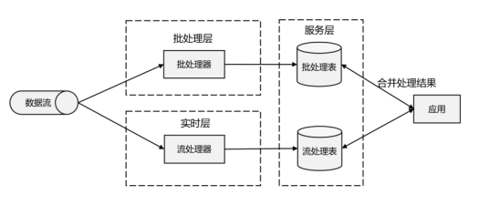
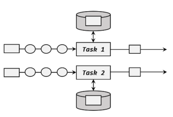

# FLINK官网：https://flink.apache.org/

# Flink简介（官网搬运）

Flink项目的核心目标，是“数据流上的有状态计算”（Stateful  Computations over Data Streams）。

Apache Flink 是一个框架和分布式处理引擎，如下图所示，用于对无界和有界数据流进行有状态计算。Flink 被设计在所有常见的集群环境中运行，以内存执行速度和任意规模来执行计算。

Flink 是一个流式大数据处理引擎。 “内存执行速度”和“任意规模”，突出了 Flink 的两个特点：速度快、可扩展性强


## 流式数据处理的发展

### 传统数据处理架构

从字面上来看OLTP是做事务处理，OLAP是做分析处理。从对数据库操作来看，OLTP主要是对数据的增删改，OLAP是对数据的查询。

#### 事务处理（OLTP,on-line transaction processing）


#### 分析处理（OLAP,On-Line Analytical Processing）


### 有状态的流处理

不难想到，如果我们对于事件流的处理非常简单，例如收到一条请求就返回一个“收到”， 那就可以省去数据库的查询和更新了。但是这样的处理是没什么实际意义的。在现实的应用中， 往往需要还其他一些额外数据。我们可以把需要的额外数据保存成一个“状态”，然后针对这条数据进行处理，并且更新状态。在传统架构中，这个状态就是保存在数据库里的。这就是所谓的“有状态的流处理”。 

为了加快访问速度，我们可以直接将状态保存在本地内存。当应用收到一 个新事件时，它可以从状态中读取数据，也可以更新状态。而当状态是从内存中读写的时候， 这就和访问本地变量没什么区别了，实时性可以得到极大的提升。 


另外，数据规模增大时，我们也不需要做重构，只需要构建分布式集群，各自在本地计算就可以了，可扩展性也变得更好。 

因为采用的是一个分布式系统，所以还需要保护本地状态，防止在故障时数据丢失。我们可以定期地将应用状态的一致性检查点（checkpoint）存盘，写入远程的持久化存储，遇到故障时再去读取进行恢复，这样就保证了更好的容错性。

### Lambda架构

对于有状态的流处理，当数据越来越多时，我们必须用分布式的集群架构来获取更大的吞吐量。但是分布式架构会带来另一个问题：怎样保证数据处理的顺序是正确的呢？ 

对于批处理来说，这并不是一个问题。因为所有数据都已收集完毕，我们可以根据需要选择、排列数据，得到想要的结果。可如果我们采用“来一个处理一个”的流处理，就可能出现 “乱序”的现象：本来先发生的事件，因为分布处理的原因滞后了。怎么解决这个问题呢？ 

以 Storm 为代表的第一代分布式开源流处理器，主要专注于具有毫秒延迟的事件处理，特点就是一个字“快”；而对于准确性和结果的一致性，是不提供内置支持的，因为结果有可能取决于到达事件的时间和顺序。另外，第一代流处理器通过检查点来保证容错性，但是故障恢 复的时候，即使事件不会丢失，也有可能被重复处理——所以无法保证 exactly-once。

 与批处理器相比，可以说第一代流处理器牺牲了结果的准确性，用来换取更低的延迟。而 批处理器恰好反过来，牺牲了实时性，换取了结果的准确。 我们自然想到，如果可以让二者做个结合，不就可以同时提供快速和准确的结果了吗？

正是基于这样的思想，Lambda 架构被设计出来。我们可以认为这是第二代流处理架构，但事实上，它只是第一代流处理器和批处理器的简单合并。



Lambda 架构主体是传统批处理架构的增强。它的“批处理层”（Batch Layer）就是由传统的批处理器和存储组成，而“实时层”（Speed Layer）则由低延迟的流处理器实现。数据到达之后，两层处理双管齐下，一方面由流处理器进行实时处理，另一方面写入批处理存储空间， 等待批处理器批量计算。流处理器快速计算出一个近似结果，并将它们写入“流处理表”中。 而批处理器会定期处理存储中的数据，将准确的结果写入批处理表，并从快速表中删除不准确的结果。最终，应用程序会合并快速表和批处理表中的结果，并展示出来。

### 新一代流处理器

之前的分布式流处理架构，都有明显的缺陷，人们也一直没有放弃对流处理器的改进和完善。终于，在原有流处理器的基础上，新一代分布式开源流处理器诞生了。为了与之前的系统区分，我们一般称之为第三代流处理器，代表当然就是 Flink。 

第三代流处理器通过巧妙的设计，完美解决了乱序数据对结果正确性的影响。这一代系统还做到了精确一次（exactly-once）的一致性保障，是第一个具有一致性和准确结果的开源流 处理器。另外，先前的流处理器仅能在高吞吐和低延迟中二选一，而新一代系统能够同时提供这两个特性。所以可以说，这一代流处理器仅凭一套系统就完成了 Lambda 架构两套系统的工作，它的出现使得 Lambda 架构黯然失色。 

除了低延迟、容错和结果准确性之外，新一代流处理器还在不断添加新的功能，例如高可用的设置，以及与资源管理器（如 YARN 或 Kubernetes）的紧密集成等等。

## 架构

Apache Flink 是一个框架和分布式处理引擎，用于在*无边界和有边界*数据流上进行有状态的计算。Flink 能在所有常见集群环境中运行，并能以内存速度和任意规模进行计算。

接下来，我们来介绍一下 Flink 架构中的重要方面。

### 处理无界和有界数据

任何类型的数据都可以形成一种事件流。信用卡交易、传感器测量、机器日志、网站或移动应用程序上的用户交互记录，所有这些数据都形成一种流。

数据可以被作为 *无界* 或者 *有界* 流来处理。

1. **无界流** 有定义流的开始，但没有定义流的结束。它们会无休止地产生数据。无界流的数据必须持续处理，即数据被摄取后需要立刻处理。我们不能等到所有数据都到达再处理，因为输入是无限的，在任何时候输入都不会完成。处理无界数据通常要求以特定顺序摄取事件，例如事件发生的顺序，以便能够推断结果的完整性。
2. **有界流** 有定义流的开始，也有定义流的结束。有界流可以在摄取所有数据后再进行计算。有界流所有数据可以被排序，所以并不需要有序摄取。有界流处理通常被称为批处理


**Apache Flink 擅长处理无界和有界数据集** 精确的时间控制和状态化使得 Flink 的运行时(runtime)能够运行任何处理无界流的应用。有界流则由一些专为固定大小数据集特殊设计的算法和数据结构进行内部处理，产生了出色的性能。

通过探索 Flink 之上构建的 [用例](https://flink.apache.org/zh/usecases.html) 来加深理解。

### 部署应用到任意地方

Apache Flink 是一个分布式系统，它需要计算资源来执行应用程序。Flink 集成了所有常见的集群资源管理器，例如 [Hadoop YARN](https://hadoop.apache.org/docs/stable/hadoop-yarn/hadoop-yarn-site/YARN.html)、 [Apache Mesos](https://mesos.apache.org/) 和 [Kubernetes](https://kubernetes.io/)，但同时也可以作为独立集群运行。

Flink 被设计为能够很好地工作在上述每个资源管理器中，这是通过资源管理器特定(resource-manager-specific)的部署模式实现的。Flink 可以采用与当前资源管理器相适应的方式进行交互。

部署 Flink 应用程序时，Flink 会根据应用程序配置的并行性自动标识所需的资源，并从资源管理器请求这些资源。在发生故障的情况下，Flink 通过请求新资源来替换发生故障的容器。提交或控制应用程序的所有通信都是通过 REST 调用进行的，这可以简化 Flink 与各种环境中的集成。

### 运行任意规模应用

Flink 旨在任意规模上运行有状态流式应用。因此，应用程序被并行化为可能数千个任务，这些任务分布在集群中并发执行。所以应用程序能够充分利用无尽的 CPU、内存、磁盘和网络 IO。而且 Flink 很容易维护非常大的应用程序状态。其异步和增量的检查点算法对处理延迟产生最小的影响，同时保证精确一次状态的一致性。

[Flink 用户报告了其生产环境中一些令人印象深刻的扩展性数字](https://flink.apache.org/zh/poweredby.html)

- 处理**每天处理数万亿的事件**,
- 应用维护**几TB大小的状态**, 和
- 应用**在数千个内核上运行**。

### 利用内存性能

有状态的 Flink 程序针对本地状态访问进行了优化。任务的状态始终保留在内存中，如果状态大小超过可用内存，则会保存在能高效访问的磁盘数据结构中。任务通过访问本地（通常在内存中）状态来进行所有的计算，从而产生非常低的处理延迟。Flink 通过定期和异步地对本地状态进行持久化存储来保证故障场景下精确一次的状态一致性。


## 应用

Apache Flink 是一个针对无界和有界数据流进行有状态计算的框架。Flink 自底向上在不同的抽象级别提供了多种 API，并且针对常见的使用场景开发了专用的扩展库。

在本章中，我们将介绍 Flink 所提供的这些简单易用、易于表达的 API 和库。

### 流处理应用的基本组件

可以由流处理框架构建和执行的应用程序类型是由框架对 *流*、*状态*、*时间* 的支持程度来决定的。在下文中，我们将对上述这些流处理应用的基本组件逐一进行描述，并对 Flink 处理它们的方法进行细致剖析。

#### 流

显而易见，（数据）流是流处理的基本要素。然而，流也拥有着多种特征。这些特征决定了流如何以及何时被处理。Flink 是一个能够处理任何类型数据流的强大处理框架。

- **有界** 和 **无界** 的数据流：流可以是无界的；也可以是有界的，例如固定大小的数据集。Flink 在无界的数据流处理上拥有诸多功能强大的特性，同时也针对有界的数据流开发了专用的高效算子。
- **实时** 和 **历史记录** 的数据流：所有的数据都是以流的方式产生，但用户通常会使用两种截然不同的方法处理数据。或是在数据生成时进行实时的处理；亦或是先将数据流持久化到存储系统中——例如文件系统或对象存储，然后再进行批处理。Flink 的应用能够同时支持处理实时以及历史记录数据流。

#### 状态

只有在每一个单独的事件上进行转换操作的应用才不需要状态，换言之，每一个具有一定复杂度的流处理应用都是有状态的。任何运行基本业务逻辑的流处理应用都需要在一定时间内存储所接收的事件或中间结果，以供后续的某个时间点（例如收到下一个事件或者经过一段特定时间）进行访问并进行后续处理。


应用状态是 Flink 中的一等公民，Flink 提供了许多状态管理相关的特性支持，其中包括：

- **多种状态基础类型**：Flink 为多种不同的数据结构提供了相对应的状态基础类型，例如原子值（value），列表（list）以及映射（map）。开发者可以基于处理函数对状态的访问方式，选择最高效、最适合的状态基础类型。
- **插件化的State Backend**：State Backend 负责管理应用程序状态，并在需要的时候进行 checkpoint。Flink 支持多种 state backend，可以将状态存在内存或者 [RocksDB](https://rocksdb.org/)。RocksDB 是一种高效的嵌入式、持久化键值存储引擎。Flink 也支持插件式的自定义 state backend 进行状态存储。
- **精确一次语义**：Flink 的 checkpoint 和故障恢复算法保证了故障发生后应用状态的一致性。因此，Flink 能够在应用程序发生故障时，对应用程序透明，不造成正确性的影响。
- **超大数据量状态**：Flink 能够利用其异步以及增量式的 checkpoint 算法，存储数 TB 级别的应用状态。
- **可弹性伸缩的应用**：Flink 能够通过在更多或更少的工作节点上对状态进行重新分布，支持有状态应用的分布式的横向伸缩。

#### 时间

时间是流处理应用另一个重要的组成部分。因为事件总是在特定时间点发生，所以大多数的事件流都拥有事件本身所固有的时间语义。进一步而言，许多常见的流计算都基于时间语义，例如窗口聚合、会话计算、模式检测和基于时间的 join。流处理的一个重要方面是应用程序如何衡量时间，即区分事件时间（event-time）和处理时间（processing-time）。

Flink 提供了丰富的时间语义支持。

- **事件时间模式**：使用事件时间语义的流处理应用根据事件本身自带的时间戳进行结果的计算。因此，无论处理的是历史记录的事件还是实时的事件，事件时间模式的处理总能保证结果的准确性和一致性。
- **Watermark 支持**：Flink 引入了 watermark 的概念，用以衡量事件时间进展。Watermark 也是一种平衡处理延时和完整性的灵活机制。
- **迟到数据处理**：当以带有 watermark 的事件时间模式处理数据流时，在计算完成之后仍会有相关数据到达。这样的事件被称为迟到事件。Flink 提供了多种处理迟到数据的选项，例如将这些数据重定向到旁路输出（side output）或者更新之前完成计算的结果。
- **处理时间模式**：除了事件时间模式，Flink 还支持处理时间语义。处理时间模式根据处理引擎的机器时钟触发计算，一般适用于有着严格的低延迟需求，并且能够容忍近似结果的流处理应用。

### 分层 API

Flink 根据抽象程度分层，提供了三种不同的 API。每一种 API 在简洁性和表达力上有着不同的侧重，并且针对不同的应用场景。


#### ProcessFunction

[ProcessFunction](https://nightlies.apache.org/flink/flink-docs-stable/dev/stream/operators/process_function.html) 是 Flink 所提供的最具表达力的接口。ProcessFunction 可以处理一或两条输入数据流中的单个事件或者归入一个特定窗口内的多个事件。它提供了对于时间和状态的细粒度控制。开发者可以在其中任意地修改状态，也能够注册定时器用以在未来的某一时刻触发回调函数。因此，你可以利用 ProcessFunction 实现许多[有状态的事件驱动应用](https://flink.apache.org/zh/usecases.html#eventDrivenApps)所需要的基于单个事件的复杂业务逻辑。

#### DataStream API

[DataStream API](https://nightlies.apache.org/flink/flink-docs-stable/dev/datastream_api.html) 为许多通用的流处理操作提供了处理原语。这些操作包括窗口、逐条记录的转换操作，在处理事件时进行外部数据库查询等。DataStream API 支持 Java 和 Scala 语言，预先定义了例如`map()`、`reduce()`、`aggregate()` 等函数。你可以通过扩展实现预定义接口或使用 Java、Scala 的 lambda 表达式实现自定义的函数。

#### SQL & Table API

Flink 支持两种关系型的 API，[Table API 和 SQL](https://nightlies.apache.org/flink/flink-docs-stable/dev/table/index.html)。这两个 API 都是批处理和流处理统一的 API，这意味着在无边界的实时数据流和有边界的历史记录数据流上，关系型 API 会以相同的语义执行查询，并产生相同的结果。Table API 和 SQL 借助了 [Apache Calcite](https://calcite.apache.org/) 来进行查询的解析，校验以及优化。它们可以与 DataStream 和 DataSet API 无缝集成，并支持用户自定义的标量函数，聚合函数以及表值函数。

Flink 的关系型 API 旨在简化[数据分析](https://flink.apache.org/zh/usecases.html#analytics)、[数据流水线和 ETL 应用](https://flink.apache.org/zh/usecases.html#pipelines)的定义。

### 库

Flink 具有数个适用于常见数据处理应用场景的扩展库。这些库通常嵌入在 API 中，且并不完全独立于其它 API。它们也因此可以受益于 API 的所有特性，并与其他库集成。

- **[复杂事件处理(CEP)](https://nightlies.apache.org/flink/flink-docs-stable/dev/libs/cep.html)**：模式检测是事件流处理中的一个非常常见的用例。Flink 的 CEP 库提供了 API，使用户能够以例如正则表达式或状态机的方式指定事件模式。CEP 库与 Flink 的 DataStream API 集成，以便在 DataStream 上评估模式。CEP 库的应用包括网络入侵检测，业务流程监控和欺诈检测。
- **[DataSet API](https://nightlies.apache.org/flink/flink-docs-stable/dev/batch/index.html)**：DataSet API 是 Flink 用于批处理应用程序的核心 API。DataSet API 所提供的基础算子包括*map*、*reduce*、*(outer) join*、*co-group*、*iterate*等。所有算子都有相应的算法和数据结构支持，对内存中的序列化数据进行操作。如果数据大小超过预留内存，则过量数据将存储到磁盘。Flink 的 DataSet API 的数据处理算法借鉴了传统数据库算法的实现，例如混合散列连接（hybrid hash-join）和外部归并排序（external merge-sort）。
- **[Gelly](https://nightlies.apache.org/flink/flink-docs-stable/dev/libs/gelly/index.html)**: Gelly 是一个可扩展的图形处理和分析库。Gelly 是在 DataSet API 之上实现的，并与 DataSet API 集成。因此，它能够受益于其可扩展且健壮的操作符。Gelly 提供了[内置算法](https://nightlies.apache.org/flink/flink-docs-stable/dev/libs/gelly/library_methods.html)，如 label propagation、triangle enumeration 和 page rank 算法，也提供了一个简化自定义图算法实现的 [Graph API](https://nightlies.apache.org/flink/flink-docs-stable/dev/libs/gelly/graph_api.html)。

## 运维

Apache Flink 是一个针对无界和有界数据流进行有状态计算的框架。由于许多流应用程序旨在以最短的停机时间连续运行，因此流处理器必须提供出色的故障恢复能力，以及在应用程序运行期间进行监控和维护的工具。

Apache Flink 非常注重流数据处理的可运维性。因此在这一小节中，我们将详细介绍 Flink 的故障恢复机制，并介绍其管理和监控应用的功能。

### 7 * 24小时稳定运行

在分布式系统中，服务故障是常有的事，为了保证服务能够7*24小时稳定运行，像Flink这样的流处理器故障恢复机制是必须要有的。显然这就意味着，它(这类流处理器)不仅要能在服务出现故障时候能够重启服务，而且还要当故障发生时，保证能够持久化服务内部各个组件的当前状态，只有这样才能保证在故障恢复时候，服务能够继续正常运行，好像故障就没有发生过一样。

Flink通过几下多种机制维护应用可持续运行及其一致性:

- **检查点的一致性**: Flink的故障恢复机制是通过建立分布式应用服务状态一致性检查点实现的，当有故障产生时，应用服务会重启后，再重新加载上一次成功备份的状态检查点信息。结合可重放的数据源，该特性可保证*精确一次（exactly-once）*的状态一致性。
- **高效的检查点**: 如果一个应用要维护一个TB级的状态信息，对此应用的状态建立检查点服务的资源开销是很高的，为了减小因检查点服务对应用的延迟性（SLAs服务等级协议）的影响，Flink采用异步及增量的方式构建检查点服务。
- **端到端的精确一次**: Flink 为某些特定的存储支持了事务型输出的功能，及时在发生故障的情况下，也能够保证精确一次的输出。
- **集成多种集群管理服务**: Flink已与多种集群管理服务紧密集成，如 [Hadoop YARN](https://hadoop.apache.org/), [Mesos](https://mesos.apache.org/), 以及 [Kubernetes](https://kubernetes.io/)。当集群中某个流程任务失败后，一个新的流程服务会自动启动并替代它继续执行。
- **内置高可用服务**: Flink内置了为解决单点故障问题的高可用性服务模块，此模块是基于[Apache ZooKeeper](https://zookeeper.apache.org/) 技术实现的，[Apache ZooKeeper](https://zookeeper.apache.org/)是一种可靠的、交互式的、分布式协调服务组件。

### Flink能够更方便地升级、迁移、暂停、恢复应用服务

驱动关键业务服务的流应用是经常需要维护的。比如需要修复系统漏洞，改进功能，或开发新功能。然而升级一个有状态的流应用并不是简单的事情，因为在我们为了升级一个改进后版本而简单停止当前流应用并重启时，我们还不能丢失掉当前流应用的所处于的状态信息。

而Flink的 *Savepoint* 服务就是为解决升级服务过程中记录流应用状态信息及其相关难题而产生的一种唯一的、强大的组件。一个 Savepoint，就是一个应用服务状态的一致性快照，因此其与checkpoint组件的很相似，但是与checkpoint相比，Savepoint 需要手动触发启动，而且当流应用服务停止时，它并不会自动删除。Savepoint 常被应用于启动一个已含有状态的流服务，并初始化其（备份时）状态。Savepoint 有以下特点：

- **便于升级应用服务版本**: Savepoint 常在应用版本升级时使用，当前应用的新版本更新升级时，可以根据上一个版本程序记录的 Savepoint 内的服务状态信息来重启服务。它也可能会使用更早的 Savepoint 还原点来重启服务，以便于修复由于有缺陷的程序版本导致的不正确的程序运行结果。
- **方便集群服务移植**: 通过使用 Savepoint，流服务应用可以自由的在不同集群中迁移部署。
- **方便Flink版本升级**: 通过使用 Savepoint，可以使应用服务在升级Flink时，更加安全便捷。
- **增加应用并行服务的扩展性**: Savepoint 也常在增加或减少应用服务集群的并行度时使用。
- **便于A/B测试及假设分析场景对比结果**: 通过把同一应用在使用不同版本的应用程序，基于同一个 Savepoint 还原点启动服务时，可以测试对比2个或多个版本程序的性能及服务质量。
- **暂停和恢复服务**: 一个应用服务可以在新建一个 Savepoint 后再停止服务，以便于后面任何时间点再根据这个实时刷新的 Savepoint 还原点进行恢复服务。
- **归档服务**: Savepoint 还提供还原点的归档服务，以便于用户能够指定时间点的 Savepoint 的服务数据进行重置应用服务的状态，进行恢复服务。

### 监控和控制应用服务

如其它应用服务一样，持续运行的流应用服务也需要监控及集成到一些基础设施资源管理服务中，例如一个组件的监控服务及日志服务等。监控服务有助于预测问题并提前做出反应，日志服务提供日志记录能够帮助追踪、调查、分析故障发生的根本原因。最后，便捷易用的访问控制应用服务运行的接口也是Flink的一个重要的亮点特征。

Flink与许多常见的日志记录和监视服务集成得很好，并提供了一个REST API来控制应用服务和查询应用信息。具体表现如下：

- **Web UI方式**: Flink提供了一个web UI来观察、监视和调试正在运行的应用服务。并且还可以执行或取消组件或任务的执行。
- **日志集成服务**:Flink实现了流行的slf4j日志接口，并与日志框架[log4j](https://logging.apache.org/log4j/2.x/)或[logback](https://logback.qos.ch/)集成。
- **指标服务**: Flink提供了一个复杂的度量系统来收集和报告系统和用户定义的度量指标信息。度量信息可以导出到多个报表组件服务，包括 [JMX](https://en.wikipedia.org/wiki/Java_Management_Extensions), Ganglia, [Graphite](https://graphiteapp.org/), [Prometheus](https://prometheus.io/), [StatsD](https://github.com/etsy/statsd), [Datadog](https://www.datadoghq.com/), 和 [Slf4j](https://www.slf4j.org/).
- **标准的WEB REST API接口服务**: Flink提供多种REST API接口，有提交新应用程序、获取正在运行的应用程序的Savepoint服务信息、取消应用服务等接口。REST API还提供元数据信息和已采集的运行中或完成后的应用服务的指标信息。


## WordCount

word.txt

```
hello world
hello flink
hello java
```

### 批处理

我们进行单词频次统计的基本思路是：先逐行读入文件数据，然后将每一行文字拆分成单词；接着按照单词分组，统计每组数据的个数，就是对应单词的频次。

Flink 同时提供了 Java 和 Scala 两种语言的 API，有些类在两套 API 中名称是一样的。 所以在引入包时，如果有 Java 和 Scala 两种选择，要注意选用 Java 的包。

```java
public class BatchWordCount {
    public static void main(String[] args) throws Exception {
        //创建执行环境
        ExecutionEnvironment executionEnvironment = ExecutionEnvironment.getExecutionEnvironment();
        //从文件读取数据，按行读取(存储的元素就是每行的文本)
        DataSource<String> dataSource = executionEnvironment.readTextFile("Flink/src/main/resources/word.txt");
        //转换数据格式
        FlatMapOperator<String, Tuple2<String, Long>> wordAndOne = dataSource
                .flatMap((String line, Collector<Tuple2<String, Long>> out) -> {
                    String[] words = line.split(" ");
                    for (String word : words) {
                        out.collect(Tuple2.of(word, 1L));
                    }
                })
                //当 Lambda 表达式使用 Java 泛型的时候, 由于泛型擦除的存在, 需要显示的声明类型信息
                .returns(Types.TUPLE(Types.STRING, Types.LONG));
        UnsortedGrouping<Tuple2<String, Long>> wordAndOneUG = wordAndOne.groupBy(0);
        AggregateOperator<Tuple2<String, Long>> sum = wordAndOneUG.sum(1);
        sum.print();
    }
}
```


需要注意的是，这种代码的实现方式，是基于 DataSet API 的，也就是我们对数据的处理转换，是看作数据集来进行操作的。事实上 Flink 本身是流批统一的处理架构，批量的数据集本质上也是流，没有必要用两套不同的 API 来实现。所以从 Flink 1.12 开始，官方推荐的做法是直接使用 DataStream API，在提交任务时通过将执行模式设为 BATCH 来进行批处理：

```
bin/flink run -Dexecution.runtime-mode=BATCH BatchWordCount.jar
```

这样，DataSet API 就已经处于“软弃用”（soft deprecated）的状态，在实际应用中只要维护一套 DataStream API 就可以了。这里只是为了方便理解，依然用 DataSet API 做了批处理的实现。

### 流处理

在 Flink 的视角里，一切数据都可以认为是流，流数据是无界流，而批数据则是有界流。所以批处理，其实就可以看作有界流的处理。 

对于流而言，我们会在获取输入数据后立即处理，这个过程是连续不断的。当然，有时我们的输入数据可能会有尽头，这看起来似乎就成了一个有界流；但是它跟批处理是截然不同的 ——在输入结束之前，我们依然会认为数据是无穷无尽的，处理的模式也仍旧是连续逐个处理。 下面我们就针对不同类型的输入数据源，用具体的代码来实现流处理。

#### 读取文件（有界数据流）

```java
public class BoundedStreamWordCount {
    public static void main(String[] args) throws Exception {
        //创建流式执行环境
        StreamExecutionEnvironment streamExecutionEnvironment = StreamExecutionEnvironment.getExecutionEnvironment();
        //读取文件
        DataStream<String> stringDataStream = streamExecutionEnvironment.readTextFile("Flink/src/main/resources/word.txt");
        //转换数据格式
        SingleOutputStreamOperator<Tuple2<String, Long>> wordAndOne = stringDataStream
                .flatMap((String line, Collector<String> words) -> {
                    Arrays.stream(line.split(" ")).forEach(words::collect);
                })
                .returns(Types.STRING)
                .map(word -> Tuple2.of(word, 1L))
                .returns(Types.TUPLE(Types.STRING, Types.LONG));
        //分组
        KeyedStream<Tuple2<String, Long>, String> wordAndOneKS = wordAndOne.keyBy(t -> t.f0);
        //求和
        SingleOutputStreamOperator<Tuple2<String, Long>> sum = wordAndOneKS.sum(1);
        //打印
        sum.print();
        //执行
        streamExecutionEnvironment.execute();
    }
}
```

主要观察与批处理程序 BatchWordCount 的不同： 

- 创建执行环境的不同，流处理程序使用的是 StreamExecutionEnvironment。
- 每一步处理转换之后，得到的数据对象类型不同。
- 分组操作调用的是 keyBy 方法，可以传入一个匿名函数作为键选择器 （KeySelector），指定当前分组的 key 是什么。
- 代码末尾需要调用 streamExecutionEnvironment 的 execute 方法，开始执行任务。


可以看到，这与批处理的结果是完全不同的。批处理针对每个单词，只会输出一个最终的统计个数；而在流处理的打印结果中，“hello”这个单词每出现一次，都会有一个频次统计数据输出。这就是流处理的特点，数据逐个处理，每来一条数据就会处理输出一次。我们通过 打印结果，可以清晰地看到单词“hello”数量增长的过程。

### 读取文本流（无界数据流）

在实际的生产环境中，真正的数据流其实是无界的，有开始却没有结束，这就要求我们需要保持一个监听事件的状态，持续地处理捕获的数据。 

为了模拟这种场景，我们就不再通过读取文件来获取数据了，而是监听数据发送端主机的指定端口，统计发送来的文本数据中出现过的单词的个数。具体实现上，我们只要对 BoundedStreamWordCount 代码中读取数据的步骤稍做修改，就可以实现对真正无界流的处理。

```java
public class StreamWordCount {
    public static void main(String[] args) throws Exception{
        //创建流式执行环境
        StreamExecutionEnvironment streamExecutionEnvironment = StreamExecutionEnvironment.getExecutionEnvironment();
        //读取文本流
        DataStream<String> dataStream = streamExecutionEnvironment.socketTextStream("10.10.11.146", 1234);
        //转换数据格式
        SingleOutputStreamOperator<Tuple2<String, Long>> wordAndOne = dataStream
                .flatMap((String line, Collector<String> words) -> {
                    Arrays.stream(line.split(" ")).forEach(words::collect);
                })
                .returns(Types.STRING)
                .map(word -> Tuple2.of(word, 1L))
                .returns(Types.TUPLE(Types.STRING, Types.LONG));
        //分组
        KeyedStream<Tuple2<String, Long>, String> wordAndOneKS = wordAndOne.keyBy(t -> t.f0);
        //求和
        SingleOutputStreamOperator<Tuple2<String, Long>> sum = wordAndOneKS.sum(1);
        //打印
        sum.print();
        //执行
        streamExecutionEnvironment.execute();
    }
}
```

注意事项： 

- socket 文本流的读取需要配置两个参数：发送端主机名和端口号。这里代码中指定了主机“10.10.11.146”的 1234 端口作为发送数据的 socket 端口，需要根据测试环境自行配置。
- 在实际项目应用中，主机名和端口号这类信息往往可以通过配置文件，或者传入程序运行参数的方式来指定。
- socket文本流数据的发送，可以通过Linux系统自带的netcat工具进行模拟。

在 Linux 环境的主机上，执行下列命令，发送数据进行测试：

```
nc -lk 1234
```


可以发现，输出的结果与之前读取文件的流处理非常相似。


# DataStream API

Flink 有非常灵活的分层API设计，其中的核心层就是DataStream/DataSet API。由于新版本已经实现了流批一体，DataSet API将被弃用，官方推荐统一使用DataStream API处理流数据和批数据。

DataStream（数据流）本身是Flink中一个用来表示数据集合的类（Class），我们编写的Flink代码其实就是基于这种数据类型的处理，所以这套核心API就以DataStream命名。对于批处理和流处理，我们都可以用这同一套API来实现。

DataStream在用法上有些类似于常规的Java集合，但又有所不同。我们在代码中往往并不关心集合中具体的数据，而只是用API定义出一连串的操作来处理它们；这就叫作数据流的“转换”（transformations）。

一个Flink程序，其实就是对DataStream的各种转换。具体来说，代码基本上都由以下几部分构成： 

- 获取执行环境（execution environment） 
- 读取数据源（source） 
- 定义基于数据的转换操作（transformations） 
- 定义计算结果的输出位置（sink） 
- 触发程序执行（execute）

其中，获取环境和触发执行，都可以认为是针对执行环境的操作。接下来从执行环境、数据源（source）、转换操作（transformation）、输出（sink）四大部分，对常用的DataStream  API做基本介绍。


## 执行环境（Execution Environment）

Flink 程序可以在各种上下文环境中运行：我们可以在本地 JVM 中执行程序，也可以提交到远程集群上运行。

不同的环境，代码的提交运行的过程会有所不同。这就要求我们在提交作业执行计算时， 首先必须获取当前 Flink 的运行环境，从而建立起与 Flink 框架之间的联系。只有获取了环境上下文信息，才能将具体的任务调度到不同的 TaskManager 执行。

### 创建执行环境

编写 Flink 程序的第一步 ， 就是创建执行环境 。 我们要获取的执行环境 ， 是 StreamExecutionEnvironment 类的对象，这是所有 Flink 程序的基础。在代码中创建执行环境的方式，就是调用这个类的静态方法，具体有以下三种。

#### getExecutionEnvironment

最简单的方式，就是直接调用 getExecutionEnvironment 方法。它会根据当前运行的上下文直接得到正确的结果：如果程序是独立运行的，就返回一个本地执行环境；如果是创建了 jar 包，然后从命令行调用它并提交到集群执行，那么就返回集群的执行环境。也就是说，这个方法会根据当前运行的方式，自行决定该返回什么样的运行环境。

```java
//创建流式执行环境
StreamExecutionEnvironment streamExecutionEnvironment = StreamExecutionEnvironment.getExecutionEnvironment();
```

#### createLocalEnvironment

这个方法返回一个本地执行环境。可以在调用时传入一个参数，指定默认的并行度；如果不传入，则默认并行度就是本地的CPU核心数。

```java
LocalStreamEnvironment localEnvironment = StreamExecutionEnvironment.createLocalEnvironment();
```

#### createRemoteEnvironment

这个方法返回集群执行环境。需要在调用时指定 JobManager 的主机名和端口号，并指定要在集群中运行的 Jar 包。

```java
StreamExecutionEnvironment remoteEnv = StreamExecutionEnvironment
 .createRemoteEnvironment(
 "host", // JobManager 主机名
 1234, // JobManager 进程端口号
 "path/to/jarFile.jar" // 提交给 JobManager 的 JAR 包
); 
```

在获取到程序执行环境后，我们还可以对执行环境进行灵活的设置。比如可以全局设置程序的并行度、禁用算子链，还可以定义程序的时间语义、配置容错机制。

### 执行模式（Execution Mode）

在之前的 Flink 版本中，批处理的执行环境与流处理类似，是调用类 ExecutionEnvironment 的静态方法，返回它的对象：

```java
// 批处理环境
ExecutionEnvironment batchEnv = ExecutionEnvironment.getExecutionEnvironment();
// 流处理环境
StreamExecutionEnvironment env = StreamExecutionEnvironment.getExecutionEnvironment();
```

基于 ExecutionEnvironment 读入数据创建的数据集合，就是 DataSet；对应的调用的一整套转换方法，就是 DataSet API。

从 1.12.0 版本起，Flink 实现了 API 上的流批统一。DataStream API 新增了一个重要特性：可以支持不同的“执行模式”（execution mode），通过简单的设置就可以让一段 Flink 程序在流处理和批处理之间切换。

- 流执行模式（STREAMING）：这是DataStream API最经典的模式，一般用于需要持续实时处理的无界数据流。默认情况下，程序使用的就是STREAMING执行模式。

- 批处理模式（BATCH）：专门用于批处理的执行模式，这种模式下，Flink处理作业的方式类似于MapReduce框架，对于不会持续计算的有界数据，我们用这种模式处理会更方便。

  - 配置方式

    - 通过命令行配置，在提交作业时，增加 execution.runtime-mode 参数，指定值为 BATCH。

      ```
      bin/flink run -Dexecution.runtime-mode=BATCH ...
      ```

    - 通过代码配置，直接基于执行环境调用setRuntimeMode方法，传入BATCH模式。

      ```java
      StreamExecutionEnvironment env = StreamExecutionEnvironment.getExecutionEnvironment();
      env.setRuntimeMode(RuntimeExecutionMode.BATCH);
      ```

  - 用BATCH模式处理批量数据，用STREAMING模式处理流式数据。因为数据有界的时候，直接输出结果会更加高效。

- 自动模式（AUTOMATIC）：在这种模式下，将由程序根据输入数据源是否有界，来自动选择执行模式

### 触发程序执行

有了执行环境，我们就可以构建程序的处理流程了：基于环境读取数据源，进而进行各种转换操作，最后输出结果到外部系统。

需要注意的是，写完输出（sink）操作并不代表程序已经结束。因为当main()方法被调用时，其实只是定义了作业的每个执行操作，然后添加到数据流图中；这时并没有真正处理数据，因为数据可能还没来。Flink 是由事件驱动的，只有等到数据到来，才会触发真正的计算， 这也被称为“延迟执行”或“懒执行”（lazy execution）。

所以我们需要显式地调用执行环境的execute()方法，来触发程序执行。execute()方法将一 直等待作业完成，然后返回一个执行结果（JobExecutionResult）。

```java
env.execute();
```

## 源算子（Source）


Flink 可以从各种来源获取数据，然后构建 DataStream 进行转换处理。一般将数据的输入来源称为数据源(data source)，而读取数据的算子就是源算子（source operator）。所以，source就是我们整个处理程序的输入端。

Flink 代码中通用的添加source的方式，是调用执行环境的addSource()方法：

```java
DataStream<String> stream = env.addSource(...);
```

方法传入一个对象参数，需要实现 SourceFunction 接口；返回 DataStreamSource。这里的 DataStreamSource 类继承自 SingleOutputStreamOperator 类，又进一步继承自 DataStream。所以很明显，读取数据的 source 操作是一个算子，得到的是一个数据流（DataStream）。

这里可能会有些麻烦：传入的参数是一个“源函数”（source function），需要实现 SourceFunction 接口。这是何方神圣，又该怎么实现呢？

自己去实现它显然不会是一件容易的事。好在 Flink 直接提供了很多预实现的接口，此外 还有很多外部连接工具也帮我们实现了对应的 source function，通常情况下足以应对我们的际需求。

### 准备工作

为了更好地理解，我们先构建一个实际应用场景。比如网站的访问操作，可以抽象成一个三元组（用户名，用户访问的 url，用户访问 url 的时间戳），所以在这里，我们可以创建一个类 Event，将用户行为包装成它的一个对象。

| 字段名    | 数据类型 | 说明                  |
| --------- | -------- | --------------------- |
| user      | String   | 用户名                |
| url       | String   | 用户访问的url         |
| timestamp | Long     | 用户访问的url的时间戳 |

```java
public class Event {
    public String user;
    public String url;
    public Long timestamp;

    public Event() {
    }

    public Event(String user, String url, Long timestamp) {
        this.user = user;
        this.url = url;
        this.timestamp = timestamp;
    }

    @Override
    public String toString() {
        return "Event{" +
                "user='" + user + '\'' +
                ", url='" + url + '\'' +
                ", timestamp=" + new Timestamp(timestamp) +
                '}';
    }
}
```

这里需要注意，我们定义的 Event，有这样几个特点：

- 类是公有的（public）
- 有一个无参构造方法
- 所有的属性都是公有的（public）
- 所有的属性的类型都是可以序列化的

Flink会把这样的类作为一种特殊的POJO数据类型来对待，方便数据的解析和序列化。

### 从集合中读取数据

最简单的读取数据的方式，就是在代码中直接创建一个Java集合，然后调用执行环境的fromCollection方法进行读取。这相当于将数据临时存储到内存中，形成特殊的数据结构后，作为数据源使用，一般用于测试。

```java
public static void main(String[] args) throws Exception {
    StreamExecutionEnvironment env = StreamExecutionEnvironment.getExecutionEnvironment();
    env.setParallelism(1);
    List<Event> events = new ArrayList<>();
    events.add(new Event("Mary", "./home", 1000L));
    events.add(new Event("Bob", "./cart", 2000L));
    DataStreamSource<Event> streamSource = env.fromCollection(events);
    streamSource.print();
    env.execute();
}
```

我们也可以不构建集合，直接将元素列举出来，调用 fromElements 方法进行读取数据：

```java
DataStreamSource<Event> eventDataStreamSource = env.fromElements(
        new Event("Mary", "./home", 1000L),
        new Event("Bob", "./cart", 2000L)
);
```

### 从文件读取数据

真正的实际应用中，自然不会直接将数据写在代码中。通常情况下，我们会从存储介质中获取数据，一个比较常见的方式就是读取日志文件。这也是批处理中最常见的读取方式。

```java
DataStream<String> stream = env.readTextFile("Flink/src/main/resources/clicks.csv");
```

说明: 

- 参数可以是目录，也可以是文件；
- 路径可以是相对路径，也可以是绝对路径； 
- 相对路径是从系统属性 user.dir 获取路径: idea 下是 project 的根目录, standalone 模式下是集群节点根目录； 
- 也可以从 hdfs 目录下读取, 使用路径 hdfs://..., 由于 Flink 没有提供 hadoop 相关依赖,  需要 pom 中添加相关依赖

```xml
<dependency>
    <groupId>org.apache.hadoop</groupId>
    <artifactId>hadoop-client</artifactId>
    <version>3.3.3</version>
    <scope>${compileMode}</scope>
</dependency>
```

### 从Socket读取数据

不论从集合还是文件，我们读取的其实都是有界数据。在流处理的场景中，数据往往是无界的。

 一个简单的方式，就是我们之前用到的读取 socket 文本流。这种方式由于吞吐量小、稳定性较差，一般也是用于测试。

```java
//读取文本流
DataStream<String> dataStream = streamExecutionEnvironment.socketTextStream("10.10.11.146", 1234);
```

### 从kafka读取数据

Kafka 作为分布式消息传输队列，是一个高吞吐、易于扩展的消息系统。而消息队列的传输方式，恰恰和流处理是完全一致的。所以可以说 Kafka 和 Flink 天生一对，是当前处理流式数据的双子星。在如今的实时流处理应用中，由 Kafka 进行数据的收集和传输，Flink 进行分析计算，这样的架构已经成为众多企业的首选。


略微遗憾的是，与 Kafka 的连接比较复杂，Flink 内部并没有提供预实现的方法。所以我们只能采用通用的 addSource 方式、实现一个 SourceFunction。

好在Kafka与Flink确实是非常契合，所以Flink官方提供了连接工具flink-connector-kafka， 直接帮我们实现了一个消费者FlinkKafkaConsumer，它就是用来读取Kafka数据的SourceFunction。

所以想要以Kafka作为数据源获取数据，我们只需要引入Kafka连接器的依赖。Flink官方提供的是一个通用的Kafka连接器，它会自动跟踪最新版本的Kafka客户端。

```xml
<dependency>
    <groupId>org.apache.flink</groupId>
    <artifactId>flink-connector-kafka_${scala.binary.version}</artifactId>
    <version>${flink.version}</version>
    <scope>${compileMode}</scope>
</dependency>
```

然后调用 env.addSource()，传入 FlinkKafkaConsumer 的对象实例就可以了。

```java
public class SourceKafkaTest {
    public static void main(String[] args) throws Exception {
        StreamExecutionEnvironment env = StreamExecutionEnvironment.getExecutionEnvironment();
        env.setParallelism(1);
        Properties properties = new Properties();
        properties.setProperty("bootstrap.servers", "172.22.5.12:9092");
        properties.setProperty("group.id", "zwh-consumer-group");
        properties.setProperty("key.deserializer", "org.apache.kafka.common.serialization.StringDeserializer");
        properties.setProperty("value.deserialize", "org.apache.kafka.common.serialization.StringDeserializer");
        properties.setProperty("auto.offset.reset", "latest");
        DataStreamSource<String> stream = env.addSource(new FlinkKafkaConsumer<String>(
                "clicks",
                new SimpleStringSchema(),
                properties
        ));
        stream.print("Kafka");
        env.execute();
    }
}
```

创建 FlinkKafkaConsumer 时需要传入三个参数： 

- 第一个参数 topic，定义了从哪些主题中读取数据。可以是一个 topic，也可以是 topic 列表，还可以是匹配所有想要读取的 topic 的正则表达式。当从多个 topic 中读取数据时，Kafka 连接器将会处理所有 topic 的分区，将这些分区的数据放到一条流中去。 
- 第二个参数是一个 DeserializationSchema 或者 KeyedDeserializationSchema。Kafka 消息被存储为原始的字节数据，所以需要反序列化成 Java 或者 Scala 对象。上面代码中使用的 SimpleStringSchema，是一个内置的 DeserializationSchema，它只是将字节数组简单地反序列化成字符串。DeserializationSchema 和 KeyedDeserializationSchema 是公共接口，所以我们也可以自定义反序列化逻辑。 
- 第三个参数是一个 Properties 对象，设置了 Kafka 客户端的一些属性。

### 自定义Source

大多数情况下，前面的数据源已经能够满足需要。但是凡事总有例外，如果遇到特殊情况， 我们想要读取的数据源来自某个外部系统，而 flink 既没有预实现的方法、也没有提供连接器，那就只好自定义实现 SourceFunction 了。

接下来我们创建一个自定义的数据源，实现 SourceFunction 接口。主要重写两个关键方法： run()和 cancel()。 

- run()方法：使用运行时上下文对象（SourceContext）向下游发送数据； 
- cancel()方法：通过标识位控制退出循环，来达到中断数据源的效果。

```java
public class ClickSource implements SourceFunction<Event> {
    // 声明一个布尔变量，作为控制数据生成的标识位
    private Boolean running = true;
    @Override
    public void run(SourceContext<Event> ctx) throws Exception {
        Random random = new Random();    // 在指定的数据集中随机选取数据
        String[] users = {"Mary", "Alice", "Bob", "Cary"};
        String[] urls = {"./home", "./cart", "./fav", "./prod?id=1", "./prod?id=2"};

        while (running) {
            ctx.collect(new Event(
                    users[random.nextInt(users.length)],
                    urls[random.nextInt(urls.length)],
                    Calendar.getInstance().getTimeInMillis()
            ));
            // 隔1秒生成一个点击事件，方便观测
            Thread.sleep(1000);
        }
    }
    @Override
    public void cancel() {
        running = false;
    }

}
```

这里要注意的是 SourceFunction 接口定义的数据源，并行度只能设置为 1，如果数据源设置为大于 1 的并行度，则会抛出异常。

如果想要自定义并行的数据源的话，需要使用 ParallelSourceFunction

```java
public class ParallelSourceExample {
    public static void main(String[] args) throws Exception {
        StreamExecutionEnvironment env = StreamExecutionEnvironment.getExecutionEnvironment();
        env.addSource(new CustomSource()).setParallelism(2).print();
        env.execute();
    }

    public static class CustomSource implements ParallelSourceFunction<Integer> {

        private boolean running = true;
        private Random random = new Random();

        @Override
        public void run(SourceContext<Integer> ctx) throws Exception {
            while (running) {
                ctx.collect(random.nextInt());
            }
        }

        @Override
        public void cancel() {
            running = false;
        }
    }
```

### Flink支持的数据类型

#### Flink的类型系统

Flink作为一个分布式处理框架，处理的是以数据对象作为元素的流。要分布式地处理这些数据，就不可避免地要面对数据的网络传输、状态的落盘和故障恢复等问题，这就需要对数据进行序列化和反序列化。简单数据是容易序列化的；而复杂类型数据想要序列化之后传输， 就需要将它拆解、清晰地知道其中每一个零件的类型。

为了方便地处理数据，Flink有自己一整套类型系统。Flink使用“类型信息”（TypeInformation）来统一表示数据类型。TypeInformation类是Flink中所有类型描述符的基类。它涵盖了类型的一些基本属性，并为每个数据类型生成特定的序列化器、反序列化器和比较器。

#### Flink支持的数据类型

对于常见的 Java 和 Scala 数据类型，Flink 都是支持的。Flink 在内部，Flink 对支持不同的类型进行了划分，这些类型可以在 Types 工具类中找到：

（1）基本类型

所有 Java 基本类型及其包装类，再加上 Void、String、Date、BigDecimal 和 BigInteger。

（2）数组类型

包括基本类型数组（PRIMITIVE_ARRAY）和对象数组(OBJECT_ARRAY)

（3）复合数据类型

- Java 元组类型（TUPLE）：这是 Flink 内置的元组类型，是 Java API 的一部分。最多 25 个字段，也就是从 Tuple0~Tuple25，不支持空字段
- Scala 样例类及 Scala 元组：不支持空字段
- 行类型（ROW）：可以认为是具有任意个字段的元组,并支持空字段
- POJO：Flink 自定义的类似于 Java bean 模式的类

（4）辅助类型

Option、Either、List、Map 等

（5）泛型类型（GENERIC）

Flink 支持所有的 Java 类和 Scala 类。不过如果没有按照上面 POJO 类型的要求来定义， 就会被 Flink 当作泛型类来处理。Flink 会把泛型类型当作黑盒，无法获取它们内部的属性；它们也不是由 Flink 本身序列化的，而是由 Kryo 序列化的。

------

在这些类型中，元组类型和 POJO 类型最为灵活，因为它们支持创建复杂类型。而相比之下，POJO 还支持在键（key）的定义中直接使用字段名，这会让我们的代码可读性大大增加。 所以，在项目实践中，往往会将流处理程序中的元素类型定为 Flink 的 POJO 类型。

Flink 对 POJO 类型的要求如下：

- 类是公共的（public）和独立的（standalone，也就是说没有非静态的内部类）； 
- 类有一个公共的无参构造方法； 
- 类中的所有字段是 public 且非 final 的；或者有一个公共的 getter 和 setter 方法，这些方法需要符合 Java bean 的命名规范

#### 类型提示（Type Hints）

Flink 还具有一个类型提取系统，可以分析函数的输入和返回类型，自动获取类型信息， 从而获得对应的序列化器和反序列化器。但是，由于 Java 中泛型擦除的存在，在某些特殊情况下（比如 Lambda 表达式中），自动提取的信息是不够精细的，这时就需要显式地提供类型信息，才能使应用程序正常工作或提高其性能。

为了解决这类问题，Java API 提供了专门的“类型提示”（type hints）。

word count 流处理程序，我们在将 String 类型的每个词转换成（word， count）二元组后，就明确地用 returns 指定了返回的类型。因为对于map里传入的Lambda表达式，系统只能推断出返回的是Tuple2类型，而无法得到Tuple2。只有显式地告诉系统当前的返回类型，才能正确地解析出完整数据。

```java
.map(word -> Tuple2.of(word, 1L))
.returns(Types.TUPLE(Types.STRING, Types.LONG));
```

这是一种比较简单的场景，二元组的两个元素都是基本数据类型。那如果元组中的一个元素又有泛型，该怎么处理呢？ Flink专门提供了TypeHint类，它可以捕获泛型的类型信息，并且一直记录下来，为运行时提供足够的信息。我们同样可以通过.returns()方法，明确地指定转换之后的 DataStream 里元素的类型。

```java
returns(new TypeHint<Tuple2<Integer, SomeType>>(){})
```

## 转换算子（Transformation）

数据源读入数据之后，我们就可以使用各种转换算子，将一个或多个 DataStream 转换为新的 DataStream。一个 Flink 程序的核心，其实就是所有的转换操作，它们决定了处理的业务逻辑。

我们可以针对一条流进行转换处理，也可以进行分流、合流等多流转换操作，从而组合成 复杂的数据流拓扑。

### 基本转换算子

#### 映射（map）

map 主要用于将数据流中的数据进行转换，形成新的数据流。简单来说，就是一个“一一映射”，消费一个元素就产出一个元素。


我们只需要基于 DataStrema 调用 map()方法就可以进行转换处理。方法需要传入的参数是接口 MapFunction 的实现；返回值类型还是 DataStream，不过泛型（流中的元素类型）可能改变。

```java
public class TransMap {
    public static void main(String[] args) throws Exception {
        StreamExecutionEnvironment env = StreamExecutionEnvironment.getExecutionEnvironment();
        env.setParallelism(1);

        DataStreamSource<Event> streamSource = env.fromElements(
                new Event("Mary", "./home", 1000L),
                new Event("Bob", "./cart", 2000L)
        );
        //传入匿名类，实现MapFunction
        streamSource.map(new MapFunction<Event, String>() {
            @Override
            public String map(Event value) throws Exception {
                return value.user;
            }
        }).print();
        //传入MapFunction的实现类
        streamSource.map(new UserExtractor()).print();
        env.execute();
    }

    public static class UserExtractor implements MapFunction<Event, String> {
        @Override
        public String map(Event value) throws Exception {
            return value.url;
        }
    }
}
```


上面代码中，MapFunction 实现类的泛型类型，与输入数据类型和输出数据的类型有关。 在实现 MapFunction 接口的时候，需要指定两个泛型，分别是输入事件和输出事件的类型，还需要重写一个 map()方法，定义从一个输入事件转换为另一个输出事件的具体逻辑。

通过查看 Flink 源码可以发现，基于 DataStream 调用 map 方法，返回的其实是一个 SingleOutputStreamOperator。

```java
public <R> SingleOutputStreamOperator<R> map(MapFunction<T, R> mapper) {
        TypeInformation<R> outType =
                TypeExtractor.getMapReturnTypes(
                        clean(mapper), getType(), Utils.getCallLocationName(), true);
        return map(mapper, outType);
    }
```

这表示 map 是一个用户可以自定义的转换（transformation）算子，它作用于一条数据流上，转换处理的结果是一个确定的输出类型。当然，SingleOutputStreamOperator 类本身也继承自 DataStream 类，所以说 map 是将一个 DataStream 转换成另一个 DataStream 是完全正确的。

#### 过滤（filter）

filter 转换操作，顾名思义是对数据流执行一个过滤，通过一个布尔条件表达式设置过滤条件，对于每一个流内元素进行判断，若为 true 则元素正常输出，若为 false 则元素被过滤掉


进行 filter 转换之后的新数据流的数据类型与原数据流是相同的。filter 转换需要传入的参数需要实现 FilterFunction 接口，而 FilterFunction 内要实现 filter()方法，就相当于一个返回布尔类型的条件表达式。

```java
public class TransFilter {
    public static void main(String[] args) throws Exception {
        StreamExecutionEnvironment env = StreamExecutionEnvironment.getExecutionEnvironment();
        env.setParallelism(1);
        DataStreamSource<Event> streamSource = env.fromElements(
                new Event("Mary", "./home", 1000L),
                new Event("Bob", "./cart", 2000L)
        );
        //传入匿名类实现FilterFunction
        SingleOutputStreamOperator<Event> filter = streamSource.filter(new FilterFunction<Event>() {
            @Override
            public boolean filter(Event value) throws Exception {
                return value.user.equalsIgnoreCase("Mary");
            }
        });
        filter.print();
        //传入FilterFunction实现类
        streamSource.filter(new UserFilter()).print();
        env.execute();
    }

    public static class UserFilter implements FilterFunction<Event> {
        @Override
        public boolean filter(Event value) throws Exception {
            return value.url.equals("./cart");
        }
    }
}
```

#### 扁平映射（flatMap）

flatMap 操作又称为扁平映射，主要是将数据流中的整体（一般是集合类型）拆分成一个一个的个体使用。消费一个元素，可以产生 0 到多个元素。flatMap 可以认为是“扁平化”（flatten）和“映射”（map）两步操作的结合，也就是先按照某种规则对数据进行打散拆分，再对拆分后的元素做转换处理


同 map 一样，flatMap 也可以使用 Lambda 表达式或者 FlatMapFunction 接口实现类的方式来进行传参，返回值类型取决于所传参数的具体逻辑，可以与原数据流相同，也可以不同。

flatMap操作会应用在每一个输入事件上面，FlatMapFunction接口中定义了flatMap方法， 用户可以重写这个方法，在这个方法中对输入数据进行处理，并决定是返回 0 个、1 个或多个结果数据。因此flatMap并没有直接定义返回值类型，而是通过一个“收集器”（Collector）来指定输出。希望输出结果时，只要调用收集器的.collect()方法就可以了；这个方法可以多次调用，也可以不调用。所以flatMap方法也可以实现map方法和filter方法的功能，当返回结果是0个的时候，就相当于对数据进行了过滤，当返回结果是1个的时候，相当于对数据进行了简单的转换操作。

```java
public class TransFlatmap {
    public static void main(String[] args) throws Exception {
        StreamExecutionEnvironment env = StreamExecutionEnvironment.getExecutionEnvironment();
        env.setParallelism(1);
        DataStreamSource<Event> streamSource = env.fromElements(
                new Event("Mary", "./home", 1000L),
                new Event("Bob", "./cart", 2000L)
        );
        SingleOutputStreamOperator<String> f = streamSource.flatMap(new FlatMapFunction<Event, String>() {
            @Override
            public void flatMap(Event value, Collector<String> out) throws Exception {
                if (value.user.equals("Mary")) {
                    out.collect(value.user);
                } else if (value.user.equals("Bob")) {
                    out.collect(value.user);
                    out.collect(value.url);
                }
            }
        });
        f.print();
        env.execute();
    }
}
```

### 聚合算子（Aggregation）

直观上看，基本转换算子确实是在“转换”——因为它们都是基于当前数据，去做了处理和输出。而在实际应用中，我们往往需要对大量的数据进行统计或整合，从而提炼出更有用的信息。比如之前 word count 程序中，要对每个词出现的频次进行叠加统计。这种操作，计算的结果不仅依赖当前数据，还跟之前的数据有关，相当于要把所有数据聚在一起进行汇总合并 ——这就是所谓的“聚合”（Aggregation），也对应着 MapReduce 中的 reduce 操作。

#### 按键分区（keyby）

对于Flink而言，DataStream是没有直接进行聚合的API的。因为我们对海量数据做聚合肯定要进行分区并行处理，这样才能提高效率。所以在 Flink 中，要做聚合，需要先进行分区； 这个操作就是通过keyBy来完成的。

keyBy是聚合前必须要用到的一个算子。keyBy通过指定键（key），可以将一条流从逻辑上划分成不同的分区（partitions）。这里所说的分区，其实就是并行处理的子任务，也就对应着任务槽（task slot）。

基于不同的key，流中的数据将被分配到不同的分区中去，这样一来，所有具有相同的key的数据，都将被发往同一个分区，那么下一步算子操作就将会在同一个slot中进行处理了。


在内部，是通过计算key的哈希值（hash code），对分区数进行取模运算来实现的。所以这里 key 如果是POJO的话，必须要重写hashCode()方法。

keyBy()方法需要传入一个参数，这个参数指定了一个或一组key。有很多不同的方法来指定key：比如对于Tuple数据类型，可以指定字段的位置或者多个位置的组合；对于POJO类型，可以指定字段的名称（String）；另外，还可以传入Lambda表达式或者实现一个键选择器 （KeySelector），用于说明从数据中提取key的逻辑。

```java
public class TransKeyBy {
    public static void main(String[] args) throws Exception {
        StreamExecutionEnvironment env = StreamExecutionEnvironment.getExecutionEnvironment();
        env.setParallelism(1);
        DataStreamSource<Event> streamSource = env.fromElements(
                new Event("Mary", "./home", 1000L),
                new Event("Bob", "./cart", 2000L)
        );
        //使用Lambda表达式
        KeyedStream<Event, String> keyedStream = streamSource.keyBy(e -> e.user);
        keyedStream.print();
        //使用匿名类实现KeySelector
        KeyedStream<Event, String> keyedStream1 = streamSource.keyBy(new KeySelector<Event, String>() {
            @Override
            public String getKey(Event value) throws Exception {
                return value.user;
            }
        });
        keyedStream1.print();
        env.execute();
    }
}
```

需要注意的是，keyBy得到的结果将不再是DataStream，而是会将DataStream转换为KeyedStream。KeyedStream可以认为是“分区流”或者“键控流”，它是对DataStream按照key的一个逻辑分区，所以泛型有两个类型：除去当前流中的元素类型外，还需要指定key的类型。

KeyedStream也继承自DataStream，所以基于它的操作也都归属于DataStream API。但它跟之前的转换操作得到的SingleOutputStreamOperator不同，只是一个流的分区操作，并不是一个转换算子。KeyedStream是一个非常重要的数据结构，只有基于它才可以做后续的聚合操作（比如 sum，reduce）；而且它可以将当前算子任务的状态（state）也按照key进行划分、限定为仅对当前key有效。

#### 简单聚合

有了按键分区的数据流KeyedStream，我们就可以基于它进行聚合操作了。Flink为我们内置实现了一些最基本、最简单的聚合API，主要有以下几种： 

- sum()：在输入流上，对指定的字段做叠加求和的操作。
- min()：在输入流上，对指定的字段求最小值。
- max()：在输入流上，对指定的字段求最大值。
- minBy()：与 min()类似，在输入流上针对指定字段求最小值。不同的是，min()只计算指定字段的最小值，其他字段会保留最初第一个数据的值；而minBy()则会返回包含字段最小值的整条数据。
- maxBy()：与 max()类似，在输入流上针对指定字段求最大值。两者区别与 min()/minBy()完全一致。

简单聚合算子使用非常方便，语义也非常明确。这些聚合方法调用时，也需要传入参数；但并不像基本转换算子那样需要实现自定义函数，只要说明聚合指定的字段就可以了。指定字段的方式有两种：指定位置，和指定名称。

对于元组类型的数据，同样也可以使用这两种方式来指定字段。需要注意的是，元组中字段的名称，是以 f0、f1、f2、…来命名的。

```java
public class TransTupleAggreation {
    public static void main(String[] args) throws Exception{
        StreamExecutionEnvironment env = StreamExecutionEnvironment.getExecutionEnvironment();
        env.setParallelism(1);
        DataStreamSource<Tuple2<String, Integer>> streamSource = env.fromElements(
                Tuple2.of("a", 1),
                Tuple2.of("a", 3),
                Tuple2.of("b", 3),
                Tuple2.of("b", 4)
        );
        KeyedStream<Tuple2<String, Integer>, String> keyedStream = streamSource.keyBy(r -> r.f0);
        keyedStream.sum(1).print("sum1");
        keyedStream.sum("f1").print("sum2");
        keyedStream.max(1).print("max1");
        keyedStream.max("f1").print("max2");
        keyedStream.maxBy(1).print("maxby");
        keyedStream.minBy("f1").print("minby");
        env.execute();
    }
}
```


注意输出

如果数据流的类型是 POJO 类，那么就只能通过字段名称来指定，不能通过位置来指定。

```java
public class TransPOJOAggregation {
    public static void main(String[] args) throws Exception{
        StreamExecutionEnvironment env = StreamExecutionEnvironment.getExecutionEnvironment();
        env.setParallelism(1);
        DataStreamSource<Event> streamSource = env.fromElements(
                new Event("Mary", "./home", 1000L),
                new Event("Bob", "./cart", 2000L)
        );
        streamSource.keyBy(e->e.user).max("timestamp").print();
        env.execute();
    }
}
```

简单聚合算子返回的，同样是一个SingleOutputStreamOperator，也就是从KeyedStream又转换成了常规的DataStream。所以可以这样理解：keyBy和聚合是成对出现的，先分区、后聚合，得到的依然是一个DataStream。而且经过简单聚合之后的数据流，元素的数据类型保持不变。

一个聚合算子，会为每一个key保存一个聚合的值，在Flink中我们把它叫作“状态”（state）。 所以每当有一个新的数据输入，算子就会更新保存的聚合结果，并发送一个带有更新后聚合值的事件到下游算子。

#### 归约聚合（reduce）

与简单聚合类似，reduce 操作也会将 KeyedStream 转换为 DataStream。它不会改变流的元素数据类型，所以输出类型和输入类型是一样的。 调用 KeyedStream 的 reduce 方法时，需要传入一个参数，实现 ReduceFunction 接口。

```java
public interface ReduceFunction<T> extends Function, Serializable {
	T reduce(T value1, T value2) throws Exception;
}
```

ReduceFunction接口里需要实现reduce()方法，这个方法接收两个输入事件，经过转换处理之后输出一个相同类型的事件；所以，对于一组数据，我们可以先取两个进行合并，然后再将合并的结果看作一个数据、再跟后面的数据合并，最终会将它“简化”成唯一的一个数据， 这也就是reduce“归约”的含义。在流处理的底层实现过程中，实际上是将中间“合并的结果” 作为任务的一个状态保存起来的；之后每来一个新的数据，就和之前的聚合状态进一步做归约。

其实，reduce的语义是针对列表进行规约操作，运算规则由ReduceFunction中的reduce方法来定义，而在ReduceFunction内部会维护一个初始值为空的累加器，注意累加器的类型和输入元素的类型相同，当第一条元素到来时，累加器的值更新为第一条元素的值，当新的元素到来时，新元素会和累加器进行累加操作，这里的累加操作就是reduce函数定义的运算规则。然后将更新以后的累加器的值向下游输出。

我们可以单独定义一个函数类实现ReduceFunction接口，也可以直接传入一个匿名类。 当然，同样也可以通过传入Lambda表达式实现类似的功能。

将数据流按照用户id进行分区，然后用一个reduce算子实现sum的功能，统计每个用户访问的频次；进而将所有统计结果分到一组，用另一个reduce算子实现maxBy的功能，记录所有用户中访问频次最高的那个，也就是当前访问量最大的用户是谁。

```java
public class TransReduce {
    public static void main(String[] args) throws Exception {
        StreamExecutionEnvironment env = StreamExecutionEnvironment.getExecutionEnvironment();
        env.setParallelism(1);
        env.addSource(new ClickSource())
                //将Event数据类型转换成元组类型
                .map(new MapFunction<Event, Tuple2<String, Long>>() {
                    @Override
                    public Tuple2<String, Long> map(Event value) throws Exception {
                        return Tuple2.of(value.user, 1L);
                    }
                })
                //使用用户名来进行分流
                .keyBy(r -> r.f0)
                .reduce(new ReduceFunction<Tuple2<String, Long>>() {
                    @Override
                    public Tuple2<String, Long> reduce(Tuple2<String, Long> value1, Tuple2<String, Long> value2) throws Exception {
                        //每到一条数据，用户pv的统计值加1
                        return Tuple2.of(value1.f0, value1.f1 + value2.f1);
                    }
                })
                //为每一条数据分配同一个key，将聚合结果发送到一条流中去
                .keyBy(r -> true)
                .reduce(new ReduceFunction<Tuple2<String, Long>>() {
                    @Override
                    public Tuple2<String, Long> reduce(Tuple2<String, Long> value1, Tuple2<String, Long> value2) throws Exception {
                        //将累加器更新为当前最大的pv统计值，然后向下游发送累加器的值
                        return value1.f1 > value2.f1 ? value1 : value2;
                    }
                })
                .print();
        env.execute();
    }
}
```

### 用户自定义函数（UDF）

Flink的DataStream API 编程风格其实是一致的：基本上都是基于DataStream调用一个方法，表示要做一个转换操作；方法需要传入一个参数，这个参数都是需要实现一个接口。

这些接口有一个共同特点：全部都以算子操作名称 + Function 命名，例如源算子需要实现 SourceFunction 接口，map 算子需要实现 MapFunction 接口，reduce 算子需要实现 ReduceFunction 接口。而且查看源码会发现，它们都继承自 Function 接口；这个接口是空的，主要就是为了方便扩展为单一抽象方法（Single Abstract Method，SAM）接口，这就是我们所说的“函数接口”——比如 MapFunction 中需要实现一个 map()方法，ReductionFunction 中需要实现一个 reduce()方法，它们都是 SAM 接口。我们知道，Java 8 新增的 Lambda 表达式就可以实现 SAM 接口；所以这样的好处就是，我们不仅可以通过自定义函数类或者匿名类来实现接口，也可以直接传入 Lambda 表达式。这就是所谓的用户自定义函数（user-defined  function，UDF）。

#### 函数类（Function Classes）

对于大部分操作而言，都需要传入一个用户自定义函数（UDF），实现相关操作的接口， 来完成处理逻辑的定义。Flink 暴露了所有 UDF 函数的接口，具体实现方式为接口或者抽象类， 例如 MapFunction、FilterFunction、ReduceFunction 等。

所以最简单直接的方式，就是自定义一个函数类，实现对应的接口。之前我们对于 API 的练习，主要就是基于这种方式。

#### 匿名函数（Lambda）

匿名函数（Lambda 表达式）是 Java 8 引入的新特性，方便我们更加快速清晰地写代码。 Lambda 表达式允许以简洁的方式实现函数，以及将函数作为参数来进行传递，而不必声明额外的（匿名）类。

Flink 的所有算子都可以使用 Lambda 表达式的方式来进行编码，但是，当 Lambda 表达式使用 Java 的泛型时，我们需要显式的声明类型信息。

```java
public class ReturnTypeResolve {
    public static void main(String[] args) throws Exception {
        StreamExecutionEnvironment env = StreamExecutionEnvironment.getExecutionEnvironment();
        env.setParallelism(1);
        DataStreamSource<Event> streamSource = env.fromElements(
                new Event("Mary", "./home", 1000L),
                new Event("Bob", "./cart", 2000L)
        );
        //想要转换成二元组类型，需要进行以下处理
        //(1)使用显式的 ".return(...)"
        SingleOutputStreamOperator<Tuple2<String, Long>> returns = streamSource
                .map(event -> Tuple2.of(event.user, 1L))
                .returns(Types.TUPLE(Types.STRING, Types.LONG));
        returns.print();
        //(2)使用类来代替Lambda表达式
        streamSource.map(new MyTuple2Mapper())
                .print();
        //(3)使用匿名类来代替Lambda表达式
        streamSource.map(new MapFunction<Event, Tuple2<String, Long>>() {
            @Override
            public Tuple2<String, Long> map(Event value) throws Exception {
                return Tuple2.of(value.user, 1L);
            }
        }).print();
        env.execute();
    }

    public static class MyTuple2Mapper implements MapFunction<Event, Tuple2<String, Long>> {
        @Override
        public Tuple2<String, Long> map(Event value) throws Exception {
            return Tuple2.of(value.user, 1L);
        }
    }
}
```

这些方法对于其他泛型擦除的场景同样适用

#### 富类函数（Rich Function Classes）

“富函数类”也是 DataStream API 提供的一个函数类的接口，所有的 Flink 函数类都有其 Rich 版本。富函数类一般是以抽象类的形式出现的。例如：RichMapFunction、RichFilterFunction、 RichReduceFunction 等。 

既然“富”，那么它一定会比常规的函数类提供更多、更丰富的功能。与常规函数类的不同主要在于，富函数类可以获取运行环境的上下文，并拥有一些生命周期方法，所以可以实现更复杂的功能。

Rich Function 有生命周期的概念。典型的生命周期方法有：

- open()方法，是 Rich Function 的初始化方法，也就是会开启一个算子的生命周期。当一个算子的实际工作方法例如map()或者filter()方法被调用之前，open()会首先被调用。所以像文件IO的创建，数据库连接的创建，配置文件的读取等等这样一次性的工作，都适合在open()方法中完成。
- close()方法，是生命周期中的最后一个调用的方法，类似于解构方法。一般用来做一些清理工作。

需要注意的是，这里的生命周期方法，对于一个并行子任务来说只会调用一次；而对应的， 实际工作方法，例如RichMapFunction中的map()，在每条数据到来后都会触发一次调用。

```java
package com.zhuweihao.DataStreamAPI;

import org.apache.flink.api.common.functions.RichMapFunction;
import org.apache.flink.configuration.Configuration;
import org.apache.flink.streaming.api.datastream.DataStreamSource;
import org.apache.flink.streaming.api.environment.StreamExecutionEnvironment;

/**
 * @Author zhuweihao
 * @Date 2022/9/28 17:20
 * @Description com.zhuweihao.DataStreamAPI
 */
public class RichFunction {
    public static void main(String[] args) throws Exception {
        StreamExecutionEnvironment env = StreamExecutionEnvironment.getExecutionEnvironment();
        env.setParallelism(2);
        DataStreamSource<Event> streamSource = env.fromElements(
            new Event("Mary", "./home", 1000L),
            new Event("Bob", "./cart", 2000L),
            new Event("Alice", "./prod?id=1", 5 * 1000L),
            new Event("Cary", "./home", 60 * 1000L)
        );
        //将点击事件转换成长整型的时间戳输出
        streamSource.map(new RichMapFunction<Event, Long>() {
            @Override
            public void open(Configuration parameters) throws Exception {
                super.open(parameters);
                System.out.println("索引为" + getRuntimeContext().getIndexOfThisSubtask() + "的任务开始");
            }

            @Override
            public void close() throws Exception {
                super.close();
                System.out.println("索引为" + getRuntimeContext().getIndexOfThisSubtask() + "的任务结束");
            }

            @Override
            public Long map(Event value) throws Exception {
                return value.timestamp;
            }
        }).print();
        env.execute();
    }
}
```


### 物理分区（Physical Partitioning）

Flink 对于经过转换操作之后的 DataStream，提供了一系列的底层操作接口，能够帮我们实现数据流的手动重分区。为了同 keyBy 相区别，我们把这些操作统称为“物理分区” 操作。物理分区与 keyBy 另一大区别在于，keyBy 之后得到的是一个 KeyedStream，而物理分区之后结果仍是 DataStream，且流中元素数据类型保持不变。从这一点也可以看出，分区算子并不对数据进行转换处理，只是定义了数据的传输方式。

常见的物理分区策略有随机分配（Random）、轮询分配（Round-Robin）、重缩放（Rescale） 和广播（Broadcast）。

#### 随机分区（shuffle）

最简单的重分区方式就是直接“洗牌”。通过调用 DataStream 的.shuffle()方法，将数据随机地分配到下游算子的并行任务中去。

随机分区服从均匀分布（uniform distribution），所以可以把流中的数据随机打乱，均匀地传递到下游任务分区。因为是完全随机的，所以对于同样的输入数据, 每次执行得到的结果也不会相同。


```java
public class ShuffleTest {
    public static void main(String[] args) throws Exception {
        StreamExecutionEnvironment env = StreamExecutionEnvironment.getExecutionEnvironment();
        env.setParallelism(1);
        //读取数据源，并行度为1
        DataStreamSource<Event> streamSource = env.addSource(new ClickSource());
        //经洗牌后打印输出，并行度为4
        streamSource.shuffle().print("shuffle").setParallelism(4);
        env.execute();
    }
}
```

#### 轮询分区（Round-Robin）

轮询也是一种常见的重分区方式。简单来说就是“发牌”，按照先后顺序将数据做依次分发，如图所示。通过调用 DataStream的.rebalance()方法，就可以实现轮询重分区。rebalance使用的是Round-Robin负载均衡算法，可以将输入流数据平均分配到下游的并行任务中去。


```java
public class RebalanceTest {
    public static void main(String[] args) throws Exception {
        StreamExecutionEnvironment env = StreamExecutionEnvironment.getExecutionEnvironment();
        env.setParallelism(1);
        //读取数据源，并行度为1
        DataStreamSource<Event> streamSource = env.addSource(new ClickSource());
        //经轮询重分区后打印输出，并行度为4
        streamSource.rebalance().print("rebalance").setParallelism(4);
        env.execute();
    }
}
```

#### 重缩放分区（rescale）

重缩放分区和轮询分区非常相似。当调用 rescale()方法时，其实底层也是使用 Round-Robin 算法进行轮询，但是只会将数据轮询发送到下游并行任务的一部分中，如图所示。也就是说，“发牌人”如果有多个，那么 rebalance 的方式是每个发牌人都面向所有人发牌；而 rescale 的做法是分成小团体，发牌人只给自己团体内的所有人轮流发牌。


当下游任务（数据接收方）的数量是上游任务（数据发送方）数量的整数倍时，rescale 的效率明显会更高。比如当上游任务数量是 2，下游任务数量是 6 时，上游任务其中一个分区的数据就将会平均分配到下游任务的 3 个分区中。 

由于 rebalance 是所有分区数据的“重新平衡”，当 TaskManager 数据量较多时，这种跨节点的网络传输必然影响效率；而如果我们配置的 task slot 数量合适，用 rescale 的方式进行“局部重缩放”，就可以让数据只在当前 TaskManager 的多个 slot 之间重新分配，从而避免了网络 传输带来的损耗。

从底层实现上看，rebalance 和 rescale 的根本区别在于任务之间的连接机制不同。rebalance 将会针对所有上游任务（发送数据方）和所有下游任务（接收数据方）之间建立通信通道，这是一个笛卡尔积的关系；而 rescale 仅仅针对每一个任务和下游对应的部分任务之间建立通信通道，节省了很多资源。

```java
public class RescaleTest {
    public static void main(String[] args) throws Exception {
        StreamExecutionEnvironment env = StreamExecutionEnvironment.getExecutionEnvironment();
        env.setParallelism(1);
        // 这里使用了并行数据源的富函数版本
        // 这样可以调用 getRuntimeContext 方法来获取运行时上下文的一些信息
        DataStreamSource<Integer> streamSource = env.addSource(new RichParallelSourceFunction<Integer>() {
            @Override
            public void run(SourceContext<Integer> ctx) throws Exception {
                for (int i = 0; i < 8; i++) {
                    // 将奇数发送到索引为 1 的并行子任务
                    // 将偶数发送到索引为 0 的并行子任务
                    if ((i + 1) % 2 == getRuntimeContext().getIndexOfThisSubtask()) {
                        ctx.collect(i + 1);
                    }
                }
            }

            @Override
            public void cancel() {

            }
        });
        streamSource
                .setParallelism(2)
                .rescale()
                .print("rescale")
                .setParallelism(4);
        env.execute();
    }
}
```

可以将 rescale 方法换成 rebalance 方法，来体会一下这两种方法的区别。

#### 广播（broadcast）

这种方式其实不应该叫做“重分区”，因为经过广播之后，数据会在不同的分区都保留一份，可能进行重复处理。可以通过调用 DataStream 的 broadcast()方法，将输入数据复制并发送到下游算子的所有并行任务中去。

```java
public class BroadcastTest {
    public static void main(String[] args) throws Exception {
        StreamExecutionEnvironment env = StreamExecutionEnvironment.getExecutionEnvironment();
        env.setParallelism(1);
        //读取数据源，并行度为1
        DataStreamSource<Event> streamSource = env.addSource(new ClickSource());
        //经广播后打印输出，并行度为4
        streamSource.broadcast().print("broadcast").setParallelism(4);
        env.execute();
    }
}
```

#### 全局分区（global）

全局分区也是一种特殊的分区方式。这种做法非常极端，通过调用.global()方法，会将所有的输入流数据都发送到下游算子的第一个并行子任务中去。这就相当于强行让下游任务并行度变成了 1，所以使用这个操作需要非常谨慎，可能对程序造成很大的压力。

#### 自定义分区（Custom）

当Flink提供的所有分区策略都不能满足用户的需求时 ， 我们可以通过使用partitionCustom()方法来自定义分区策略。

在调用时，方法需要传入两个参数，第一个是自定义分区器（Partitioner）对象，第二个是应用分区器的字段，它的指定方式与 keyBy 指定key基本一样：可以通过字段名称指定， 也可以通过字段位置索引来指定，还可以实现一个KeySelector。

例如，我们可以对一组自然数按照奇偶性进行重分区。代码如下：

```java
public class CustomPartitionTest {
    public static void main(String[] args) throws Exception{
        StreamExecutionEnvironment env = StreamExecutionEnvironment.getExecutionEnvironment();
        env.setParallelism(1);
        env.fromElements(1,2,3,4,5,6,7,8)
                .partitionCustom(new Partitioner<Integer>() {
                    @Override
                    public int partition(Integer key, int numPartitions) {
                        return key % 2;
                    }
                }, new KeySelector<Integer, Integer>() {
                    @Override
                    public Integer getKey(Integer value) throws Exception {
                        return value;
                    }
                })
                .print()
                .setParallelism(2);
        env.execute();
    }
}
```

## 输出算子（Sink）


Flink 作为数据处理框架，最终还是要把计算处理的结果写入外部存储，为外部应用提供支持。

### 连接到外部系统

Flink的DataStream API专门提供了向外部写入数据的方法：addSink。与addSource类似，addSink方法对应着一个“Sink”算子，主要就是用来实现与外部系统连接、并将数据提交写入的；Flink程序中所有对外的输出操作，一般都是利用Sink算子完成的。

之前我们一直在使用的print方法其实就是一种Sink，它表示将数据流写入标准控制台打印输出。查看源码可以发现，print方法返回的就是一个DataStreamSink。

```java
@PublicEvolving
public DataStreamSink<T> print() {
    PrintSinkFunction<T> printFunction = new PrintSinkFunction<>();
    return addSink(printFunction).name("Print to Std. Out");
}
```

与Source算子非常类似，除去一些Flink预实现的Sink，一般情况下Sink算子的创建是通过调用DataStream的.addSink()方法实现的。

```java
stream.addSink(new SinkFunction(…));
```

addSource的参数需要实现一个SourceFunction接口；类似地，addSink方法同样需要传入一个参数，实现的是SinkFunction接口。在这个接口中只需要重写一个方法invoke()，用来将指定的值写入到外部系统中。这个方法在每条数据记录到来时都会调用：

```java
default void invoke(IN value, Context context) throws Exception
```

一些比较基本的Source和Sink已经内置在Flink里。 预定义data sources支持从文件、目录、socket，以及collections和iterators中读取数据。 预定义data sinks支持把数据写入文件、标准输出（stdout）、标准错误输出（stderr）和 socket。

目前支持以下系统:

- Apache Kafka (source/sink)
- Apache Cassandra (sink)
- Amazon Kinesis Streams (source/sink)
- Elasticsearch (sink)
- FileSystem（包括 Hadoop ） - 仅支持流 (sink)
- FileSystem（包括 Hadoop ） - 流批统一 (sink)
- RabbitMQ (source/sink)
- Apache NiFi (source/sink)
- Twitter Streaming API (source)
- Google PubSub (source/sink)
- JDBC (sink)

请记住，在使用一种连接器时，通常需要额外的第三方组件，比如：数据存储服务器或者消息队列。要注意这些列举的连接器是Flink工程的一部分，包含在发布的源码中，但是不包含在二进制发行版中。

除 Flink 官方之外，Apache Bahir作为给Spark和Flink提供扩展支持的项目，也实现了一 些其他第三方系统与Flink的连接器，Flink还有些一些额外的连接器通过Apache Bahir发布, 包括：

- Apache ActiveMQ (source/sink)
- Apache Flume (sink)
- Redis (sink)
- Akka (sink)
- Netty (source)

除此以外，就需要用户自定义实现sink连接器了。

### File Sink

这个连接器提供了一个在流和批模式下统一的 Sink 来将分区文件写入到支持 Flink FileSystem 接口的文件系统中，它对于流和批模式可以提供相同的一致性语义保证。File Sink 是现有的 Streaming File Sink 的一个升级版本，后者仅在流模式下提供了精确一致性。

File Sink 会将数据写入到桶中。由于输入流可能是无界的，因此每个桶中的数据被划分为多个有限大小的文件。如何分桶是可以配置的，默认使用基于时间的分桶策略，这种策略每个小时创建一个新的桶，桶中包含的文件将记录所有该小时内从流中接收到的数据。

桶目录中的实际输出数据会被划分为多个部分文件（part file），每一个接收桶数据的 Sink Subtask ，至少包含一个部分文件（part file）。额外的部分文件（part file）将根据滚动策略创建，滚动策略是可以配置的。对于行编码格式（参考 File Formats ）默认的策略是根据文件大小和超时时间来滚动文件。超时时间指打开文件的最长持续时间，以及文件关闭前的最长非活动时间。批量编码格式必须在每次 Checkpoint 时滚动文件，但是用户也可以指定额外的基于文件大小和超时时间的策略。

> **重要:** 在流模式下使用 FileSink 时需要启用 Checkpoint ，每次做 Checkpoint 时写入完成。如果 Checkpoint 被禁用，部分文件（part file）将永远处于 ‘in-progress’ 或 ‘pending’ 状态，下游系统无法安全地读取。


#### 文件格式

FileSink支持行编码格式和批量编码格式，比如 [Apache Parquet](http://parquet.apache.org/) 。 这两种变体随附了各自的构建器，可以使用以下静态方法创建：

- Row-encoded sink: `FileSink.forRowFormat(basePath, rowEncoder)`
- Bulk-encoded sink: `FileSink.forBulkFormat(basePath, bulkWriterFactory)`

创建行或批量编码的 Sink 时，我们需要指定存储桶的基本路径和数据的编码逻辑。

##### 行编码格式

行编码格式需要指定一个 Encoder。Encoder 负责为每个处于 In-progress 状态文件的OutputStream序列化数据。

除了桶分配器之外，RowFormatBuilder还允许用户指定：

- Custom RollingPolicy：自定义滚动策略以覆盖默认的 DefaultRollingPolicy。
- bucketCheckInterval（默认为1分钟）：毫秒间隔，用于基于时间的滚动策略。

```java
public class FileSinkTest {
    public static void main(String[] args) throws Exception{
        StreamExecutionEnvironment env = StreamExecutionEnvironment.getExecutionEnvironment();
        env.setParallelism(4);
        DataStreamSource<Event> streamSource = env.fromElements(
            new Event("Mary", "./home", 1000L),
            new Event("Bob", "./cart", 2000L),
            new Event("Alice", "./prod?id=100", 3000L),
            new Event("Alice", "./prod?id=200", 3500L),
            new Event("Bob", "./prod?id=2", 2500L),
            new Event("Alice", "./prod?id=300", 3600L),
            new Event("Bob", "./home", 3000L),
            new Event("Bob", "./prod?id=1", 2300L),
            new Event("Bob", "./prod?id=3", 3300L)
        );
        FileSink<String> fileSink = FileSink
                .forRowFormat(new Path("Flink/src/main/resources"), new SimpleStringEncoder<String>("UTF-8"))
                .withRollingPolicy(
                        DefaultRollingPolicy.builder()
                                .withRolloverInterval(TimeUnit.MINUTES.toMillis(15))
                                .withInactivityInterval(TimeUnit.MINUTES.toMillis(5))
                                .withMaxPartSize(1024 * 1024 * 1024)
                                .build()
                )
                .build();
        streamSource.map(Event::toString).sinkTo(fileSink);
        env.execute();
    }
}
```

这里我们创建了一个简单的文件Sink，通过.withRollingPolicy()方法指定了一个“滚动策略”。“滚动”的概念在日志文件的写入中经常遇到：因为文件会有内容持续不断地写入，所以我们应该给一个标准，到什么时候就开启新的文件，将之前的内容归档保存。也就是说，上面 的代码设置了在以下3种情况下，我们就会滚动分区文件：

- 至少包含15分钟的数据
- 最近5分钟没有收到新的数据
- 文件大小已达到1GB

##### 批量编码格式

批量编码Sink的创建与行编码Sink相似，不过在这里我们不是指定编码器Encoder而是指定BulkWriter.Factory 。 BulkWriter定义了如何添加、刷新元素，以及如何批量编码。

Flink 有四个内置的 BulkWriter Factory ：

- ParquetWriterFactory
- AvroWriterFactory
- SequenceFileWriterFactory
- CompressWriterFactory
- OrcBulkWriterFactory

> **重要:** 批量编码模式仅支持 OnCheckpointRollingPolicy 策略, 在每次 checkpoint 的时候滚动文件。 
>
> **重要:** 批量编码模式必须使用继承自 CheckpointRollingPolicy 的滚动策略, 这些策略必须在每次 checkpoint 的时候滚动文件，但是用户也可以进一步指定额外的基于文件大小和超时时间的策略。

详细示例见：[File Sink | Apache Flink](https://nightlies.apache.org/flink/flink-docs-release-1.13/zh/docs/connectors/datastream/file_sink/)

#### 桶分配

桶分配逻辑定义了如何将数据结构化为基本输出目录中的子目录

行格式和批量格式都使用 DateTimeBucketAssigner 作为默认的分配器。 默认情况下，DateTimeBucketAssigner 基于系统默认时区每小时创建一个桶，格式如下： yyyy-MM-dd--HH 。日期格式（即桶的大小）和时区都可以手动配置。

我们可以在格式构建器上调用 .withBucketAssigner(assigner) 来自定义 BucketAssigner 。

Flink 有两个内置的 BucketAssigners ：

- DateTimeBucketAssigner：默认基于时间的分配器
- BasePathBucketAssigner ：将所有部分文件（part file）存储在基本路径中的分配器（单个全局桶）

#### 部分文件（part file）生命周期

为了在下游系统中使用 FileSink 的输出，我们需要了解输出文件的命名规则和生命周期。

部分文件（part file）可以处于以下三种状态之一：

1. **In-progress** ：当前文件正在写入中。
2. **Pending** ：当处于 In-progress 状态的文件关闭（closed）了，就变为 Pending 状态。
3. **Finished** ：在成功的 Checkpoint 后（流模式）或作业处理完所有输入数据后（批模式），Pending 状态将变为 Finished 状态。

处于 Finished 状态的文件不会再被修改，可以被下游系统安全地读取。

> **重要:** 部分文件的索引在每个 subtask 内部是严格递增的（按文件创建顺序）。但是索引并不总是连续的。当 Job 重启后，所有部分文件的索引从 `max part index + 1` 开始， 这里的 `max part index` 是所有 subtask 中索引的最大值。

对于每个活动的桶，Writer 在任何时候都只有一个处于 In-progress 状态的部分文件（part file），但是可能有几个 Penging 和 Finished 状态的部分文件（part file）。

### Kafka


```java
public class KafkaSink {
    public static void main(String[] args) throws Exception{
        StreamExecutionEnvironment env = StreamExecutionEnvironment.getExecutionEnvironment();
        env.setParallelism(1);

        Properties properties = new Properties();
        properties.setProperty("bootstrap.servers","172.22.5.12:9092");

        DataStreamSource<String> streamSource = env.readTextFile("Flink/src/main/resources/clicks.csv");
        streamSource
                .addSink(new FlinkKafkaProducer<String>(
                        "clicks",
                        new SimpleStringSchema(),
                        properties
                ));
        env.execute();
    }
}
```


### JDBC


```java
public class JDBCSink {
    public static void main(String[] args) throws Exception {
        StreamExecutionEnvironment env = StreamExecutionEnvironment.getExecutionEnvironment();
        env.setParallelism(1);
        DataStreamSource<Event> streamSource = env.fromElements(
                new Event("Mary", "./home", 1000L),
                new Event("Bob", "./cart", 2000L),
                new Event("Alice", "./prod?id=100", 3000L),
                new Event("Alice", "./prod?id=200", 3500L),
                new Event("Bob", "./prod?id=2", 2500L),
                new Event("Alice", "./prod?id=300", 3600L),
                new Event("Bob", "./home", 3000L),
                new Event("Bob", "./prod?id=1", 2300L),
                new Event("Bob", "./prod?id=3", 3300L)
        );
        streamSource.addSink(
                JdbcSink.sink(
                        "insert into clicks (user,url) values (?,?)",
                        (preparedStatement, event) -> {
                            preparedStatement.setString(1,event.user);
                            preparedStatement.setString(2,event.url);
                        },
                        JdbcExecutionOptions.builder()
                                .withBatchSize(1000)
                                .withBatchIntervalMs(200)
                                .withMaxRetries(5)
                                .build(),
                        new JdbcConnectionOptions.JdbcConnectionOptionsBuilder()
                                .withUrl("jdbc:mysql://localhost:3306/bigdata")
                                .withDriverName("com.mysql.cj.jdbc.Driver")
                                .withUsername("root")
                                .withPassword("03283X")
                                .build()
                )
        );
        env.execute();
    }
}
```


### 自定义Sink输出

在实现 SinkFunction 的时候，需要重写的一个关键方法 invoke()，在这个方法中我们就可 以实现将流里的数据发送出去的逻辑。

```java
public class SinkCustom {
    public static void main(String[] args) throws Exception{
        StreamExecutionEnvironment env = StreamExecutionEnvironment.getExecutionEnvironment();
        env.setParallelism(1);
        DataStreamSource<Event> streamSource = env.fromElements(
                new Event("Mary", "./home", 1000L)
        );
        streamSource.addSink(new RichSinkFunction<Event>() {
            @Override
            public void open(Configuration parameters) throws Exception {
                super.open(parameters);
            }

            @Override
            public void close() throws Exception {
                super.close();
            }

            @Override
            public void invoke(Event value, Context context) throws Exception {
                super.invoke(value, context);
            }
        });
        env.execute();
    }
}
```


# Flink中的时间和窗口

在流数据处理应用中，一个很重要、也很常见的操作就是窗口计算。所谓的“窗口”，一 般就是划定的一段时间范围，也就是“时间窗”；对在这范围内的数据进行处理，就是所谓的窗口计算。所以窗口和时间往往是分不开的。

## 时间语义

有两个非常重要的时间点：一个是数据产生的时间，我们把它叫作“事件时间”（Event Time）；另一个是数据真正被处理的时刻，叫作“处理时间”（Processing Time）。 我们所定义的窗口操作，到底是以那种时间作为衡量标准，就是所谓的“时间语义”（Notions  of Time）。由于分布式系统中网络传输的延迟和时钟漂移，处理时间相对事件发生的时间会有所滞后。

### 处理时间（Processing Time）

处理时间的概念非常简单，就是指执行处理操作的机器的系统时间。 

如果我们以它作为衡量标准，那么数据属于哪个窗口就很明显了：只看窗口任务处理这条数据时，当前的系统时间。

这种方法非常简单粗暴，不需要各个节点之间进行协调同步，也不需要考虑数据在流中的位置，简单来说就是“我的地盘听我的”。所以处理时间是最简单的时间语义。

### 事件时间（Event Time）

事件时间，是指每个事件在对应的设备上发生的时间，也就是数据生成的时间。

数据一旦产生，这个时间自然就确定了，所以它可以作为一个属性嵌入到数据中。这其实就是这条数据记录的“时间戳”（Timestamp）。 

在事件时间语义下，我们对于时间的衡量，就不看任何机器的系统时间了，而是依赖于数据本身。

由于流处理中数据是源源不断产生的，一般来说，先产生的数据也会先被处理，所以当任务不停地接到数据时，它们的时间戳也基本上是不断增长的，就可以代表时间的推进。 当然我们会发现，这里有个前提，就是“先产生的数据先被处理”，这要求我们可以保证数据到达的顺序。但是由于分布式系统中网络传输延迟的不确定性，实际应用中我们要面对的数据流往往是乱序的。在这种情况下，就不能简单地把数据自带的时间戳当作时钟了，而需要用另外的标志来表示事件时间进展，在 Flink 中把它叫作事件时间的“水位线”（Watermarks）。

### 小结

在实际应用中，事件时间语义会更为常见。一般情况下，业务日志数据中都会记录数据生成的时间戳（timestamp），它就可以作为事件时间的判断基础。

实际应用中，数据产生的时间和处理的时间可能是完全不同的。很长时间收集起来的数据，处理或许只要一瞬间；也有可能数据量过大、处理能力不足，短时间堆了大量数据处理不完，产生“背压”（back pressure）。

通常来说，处理时间是我们计算效率的衡量标准，而事件时间会更符合我们的业务计算逻辑。所以更多时候我们使用事件时间；不过处理时间也不是一无是处。对于处理时间而言，由 于没有任何附加考虑，数据一来就直接处理，因此这种方式可以让我们的流处理延迟降到最低，效率达到最高。

另外，除了事件时间和处理时间，Flink 还有一个“摄入时间”（Ingestion Time）的概念， 它是指数据进入 Flink 数据流的时间，也就是 Source 算子读入数据的时间。摄入时间相当于是事件时间和处理时间的一个中和，它是把 Source 任务的处理时间，当作了数据的产生时间添加到数据里。这样一来，水位线（watermark）也就基于这个时间直接生成，不需要单独指定了。这种时间语义可以保证比较好的正确性，同时又不会引入太大的延迟。它的具体行为跟事件时间非常像，可以当作特殊的事件时间来处理。

在 Flink 中，由于处理时间比较简单，早期版本默认的时间语义是处理时间；而考虑到事件时间在实际应用中更为广泛，从 1.12 版本开始，Flink 已经将事件时间作为了默认的时间语 义。

## 水位线（Watermark）


# 状态编程

Flink处理机制的核心，就是“有状态的流式计算”。

在Flink这样的分布式系统中，我们不仅需要定义出状态在任务并行时的处理方式，还需要考虑如何持久化保存、以便发生故障时正确地恢复。这就需要一套完整的管理机制来处理所有的状态。

## Flink中的状态

在流处理中，数据是连续不断到来和处理的。每个任务进行计算处理时，可以基于当前数据直接转换得到输出结果；也可以依赖一些其他数据。这些由一个任务维护，并且用来计算输出结果的所有数据，就叫作这个任务的状态。

> 状态在Flink中叫做State，用来保存中间计算结果或者缓存数据。**State是实现有状态的计算下Exactly-Once的基础**。

### 有状态算子

在Flink中，算子任务可以分为无状态和有状态两种情况。

无状态的算子任务只需要观察每个独立事件，根据当前输入的数据直接转换输出结果，如下图所示。例如，可以将一个字符串类型的数据拆分开作为元组输出；也可以对数据做一些计算，比如每个代表数量的字段加1。如map、filter、flatMap， 计算时不依赖其他数据，就都属于无状态的算子。


有状态的算子任务，则除当前数据之外，还需要一些其他数据来得到计算结果。这里的 “其他数据”，就是所谓的状态（state），最常见的就是之前到达的数据，或者由之前数据计算出的某个结果。比如，做求和（sum）计算时，需要保存之前所有数据的和，这就是状态；窗口算子中会保存已经到达的所有数据，这些也都是它的状态。

如果希望检索到某种 “事件模式”（event pattern），比如“先有下单行为，后有支付行为”，那么也应该把之前的行为保存下来，这同样属于状态。容易发现，之前讲过的聚合算子、窗口算子都属于有状态的算子。


上图所示为有状态算子的一般处理流程，具体步骤如下。 

1. 算子任务接收到上游发来的数据；
2. 获取当前状态； 
3. 根据业务逻辑进行计算，更新状态；
4. 得到计算结果，输出发送到下游任务。

### 状态的管理

在传统的事务型处理架构中，这种额外的状态数据是保存在数据库中的。而对于实时流处理来说，这样做需要频繁读写外部数据库，如果数据规模非常大肯定就达不到性能要求了。所以 Flink 的解决方案是，将状态直接保存在内存中来保证性能，并通过分布式扩展来提高吞吐量。

在 Flink 中，每一个算子任务都可以设置并行度，从而可以在不同的 slot 上并行运行多个实例，我们把它们叫作“并行子任务”。而状态既然在内存中，那么就可以认为是子任务实例上的一个本地变量，能够被任务的业务逻辑访问和修改。 

这样看来状态的管理似乎非常简单，我们直接把它作为一个对象交给 JVM 就可以了。然而大数据的场景下，我们必须使用分布式架构来做扩展，在低延迟、高吞吐的基础上还要保证容错性，一系列复杂的问题就会随之而来了。

- 状态的访问权限。我们知道 Flink 上的聚合和窗口操作，一般都是基于 KeyedStream 的，数据会按照 key 的哈希值进行分区，聚合处理的结果也应该是只对当前 key 有效。 然而同一个分区（也就是 slot）上执行的任务实例，可能会包含多个 key 的数据，它们同时访问和更改本地变量，就会导致计算结果错误。所以这时状态并不是单纯的本地变量。

> KeyedStream继承了DataStream，是由datastream的keyBy()，产生的。表示按key的value分区过的流。在datastream的功能基础上，由添加了一些max,min等聚合的功能。

- 容错性，也就是故障后的恢复。状态只保存在内存中显然是不够稳定的，我们需要将它持久化保存，做一个备份；在发生故障后可以从这个备份中恢复状态。
- 我们还应该考虑到分布式应用的横向扩展性。比如处理的数据量增大时，我们应该相应地对计算资源扩容，调大并行度。这时就涉及到了状态的重组调整。

Flink 有一套完整的状态管理机制，将底层一些核心功能全部封装起来，包括状态的高效存储和访问、持久化保存和故障恢复，以及资源扩展时的调整。这样，我们只需要调用相应的 API 就可以很方便地使用状态，或对应用的容错机制进行配置，从而将更多的精力放在业务逻辑的开发上。

### 状态的分类

#### 托管状态（Managed State）和原始状态（Raw State）

Flink 的状态有两种：托管状态（Managed State）和原始状态（Raw State）。托管状态就是由 Flink 统一管理的，状态的存储访问、故障恢复和重组等一系列问题都由 Flink 实现，我们只要调接口就可以；而原始状态则是自定义的，相当于就是开辟了一块内存，需要我们自己管理，实现状态的序列化和故障恢复。 

具体来讲，托管状态是由 Flink 的运行时（Runtime）来托管的；在配置容错机制后，状态会自动持久化保存，并在发生故障时自动恢复。当应用发生横向扩展时，状态也会自动地重组分配到所有的子任务实例上。对于具体的状态内容，Flink 也提供了值状态（ValueState）、 列表状态（ListState）、映射状态（MapState）、聚合状态（AggregateState）等多种结构，内部支持各种数据类型。聚合、窗口等算子中内置的状态，就都是托管状态；我们也可以在富函数类（RichFunction）中通过上下文来自定义状态，这些也都是托管状态。 

而对比之下，原始状态就全部需要自定义了。Flink 不会对状态进行任何自动操作，也不知道状态的具体数据类型，只会把它当作最原始的字节（Byte）数组来存储。我们需要花费大量的精力来处理状态的管理和维护。 

所以只有在遇到托管状态无法实现的特殊需求时，我们才会考虑使用原始状态；一般情况下不推荐使用。绝大多数应用场景，我们都可以用 Flink 提供的算子或者自定义托管状态来实现需求。

#### 算子状态（Operator State）和按键分区状态（Keyed State）

在 Flink 中，一个算子任务会按照并行度分为多个并行子任务执行，而不同的子任务会占据不同的任务槽（task slot）。由于不同的 slot 在计算资源上是物理隔离的，所以 Flink 能管理的状态在并行任务间是无法共享的，每个状态只能针对当前子任务的实例有效。 

而很多有状态的操作（比如聚合、窗口）都是要先做 keyBy 进行按键分区的。按键分区之后，任务所进行的所有计算都应该只针对当前 key 有效，所以状态也应该按照 key 彼此隔离。 在这种情况下，状态的访问方式又会有所不同。 

基于这样的想法，又可以将托管状态分为两类：算子状态和按键分区状态。

##### 算子状态（Operator State）

> 跟一个特定算子的实例绑定，整个算子只对应一个State对象(相同的并行算子都能访问到状态)。只支持ListState

状态作用范围限定为当前的算子任务实例，也就是只对当前并行子任务实例有效。这就意味着对于一个并行子任务，占据了一个“分区”，它所处理的所有数据都会访问到相同的状态， 状态对于同一任务而言是共享的



算子状态可以用在所有算子上，使用的时候其实就跟一个本地变量没什么区别——因为本地变量的作用域也是当前任务实例。在使用时，我们还需进一步实现 CheckpointedFunction 接口。

##### 按键分区状态（Keyed State）

> 状态跟特定的key绑定，即每个KeyedStream对应一个State对象。支持多种State(ValueState、MapState、ListState等)

状态是根据输入流中定义的键（key）来维护和访问的，所以只能定义在按键分区流 （KeyedStream）中，也就 keyBy 之后才可以使用


按键分区状态应用非常广泛。之前讲到的聚合算子必须在 keyBy 之后才能使用，就是因为聚合的结果是以 Keyed State 的形式保存的。另外，也可以通过富函数类（Rich Function） 来自定义 Keyed State，所以只要提供了富函数类接口的算子，也都可以使用 Keyed State。 

所以即使是 map、filter 这样无状态的基本转换算子，我们也可以通过富函数类给它们“追加”Keyed State，或者实现CheckpointedFunction 接口来定义 Operator State；从这个角度讲， Flink 中所有的算子都可以是有状态的。

无论是 Keyed State 还是 Operator State，它们都是在本地实例上维护的，也就是说每个并行子任务维护着对应的状态，算子的子任务之间状态不共享。

## 按键分区状态（Keyed State）

在实际应用中，我们一般都需要将数据按照某个 key 进行分区，然后再进行计算处理；所以最为常见的状态类型就是 Keyed State。

keyBy 之后的聚合、窗口计算，算子所持有的状态，都是 Keyed State。 另外，我们还可以通过富函数类（Rich Function）对转换算子进行扩展、实现自定义功能， 比如 RichMapFunction、RichFilterFunction。在富函数中，我们可以调用.getRuntimeContext() 获取当前的运行时上下文（RuntimeContext），进而获取到访问状态的句柄；这种富函数中自定义的状态也是 Keyed State。

### 简介

按键分区状态（Keyed State）顾名思义，是任务按照键（key）来访问和维护的状态。它的特点非常鲜明，就是以 key 为作用范围进行隔离。 

在进行按键分区（keyBy）之后，具有相同键的所有数据，都会分配到同一个并行子任务中；所以如果当前任务定义了状态，Flink 就会在当前并行子任务实例中，为每个键值维护一个状态的实例。于是当前任务就会为分配来的所有数据，按照 key 维护和处理对应的状态。 

因为一个并行子任务可能会处理多个 key 的数据，所以 Flink 需要对 Keyed State 进行一些特殊优化。在底层，Keyed State 类似于一个分布式的映射（map）数据结构，所有的状态会根据 key 保存成键值对（key-value）的形式。这样当一条数据到来时，任务就会自动将状态的访问范围限定为当前数据的 key，从 map 存储中读取出对应的状态值。所以具有相同 key 的所有数据都会到访问相同的状态，而不同 key 的状态之间是彼此隔离的。 这种将状态绑定到 key 上的方式，相当于使得状态和流的逻辑分区一一对应了：不会有别的 key 的数据来访问当前状态；而当前状态对应 key 的数据也只会访问这一个状态，不会分发到其他分区去。这就保证了对状态的操作都是本地进行的，对数据流和状态的处理做到了分区一致性。

另外，在应用的并行度改变时，状态也需要随之进行重组。不同 key 对应的 Keyed State 可以进一步组成所谓的键组（key groups），每一组都对应着一个并行子任务。键组是 Flink 重新分配 Keyed State 的单元，键组的数量就等于定义的最大并行度。当算子并行度发生改变时， Keyed State 就会按照当前的并行度重新平均分配，保证运行时各个子任务的负载相同。 

需要注意，使用 Keyed State 必须基于 KeyedStream。没有进行 keyBy 分区的 DataStream， 即使转换算子实现了对应的富函数类，也不能通过运行时上下文访问 Keyed State。

###  支持的结构类型

实际应用中，需要保存为状态的数据会有各种各样的类型，有时还需要复杂的集合类型， 比如列表（List）和映射（Map）。对于这些常见的用法，Flink 的按键分区状态（Keyed State） 提供了足够的支持。

#### 值状态（Value State）

顾名思义，状态中只保存一个“值”（value）。ValueState本身是一个接口，源码中定义如下：

```java
@PublicEvolving
public interface ValueState<T> extends State {
    T value() throws IOException;
    void update(T value) throws IOException;
}
```

这里的 T 是泛型，表示状态的数据内容可以是任何具体的数据类型。如果想要保存一个长整型值作为状态，那么类型就是 ValueState。 我们可以在代码中读写值状态，实现对于状态的访问和更新。 

- T value()：获取当前状态的值；
- update(T value)：对状态进行更新，传入的参数 value 就是要覆写的状态值。 

在具体使用时，为了让运行时上下文清楚到底是哪个状态，我们还需要创建一个“状态描述器”（StateDescriptor）来提供状态的基本信息。例如源码中，ValueState 的状态描述器一个构造方法如下：

```java
public ValueStateDescriptor(String name, Class<T> typeClass) {
    super(name, typeClass, null);
}
```

这里需要传入状态的名称和类型——这跟我们声明一个变量时做的事情完全一样。有了这个描述器，运行时环境就可以获取到状态的控制句柄（handler）了。

#### 列表状态（ListState）

将需要保存的数据，以列表（List）的形式组织起来。

在 ListState接口中同样有一个类型参数 T，表示列表中数据的类型。ListState 也提供了一系列的方法来操作状态，使用方式与一般的 List 非常相似。 

```java
@PublicEvolving
public interface ListState<T> extends MergingState<T, Iterable<T>> {
    //传入一个列表 values，直接对状态进行覆盖；
    void update(List<T> values) throws Exception;
    //向列表中添加多个元素，以列表 values 形式传入。 
    void addAll(List<T> values) throws Exception;
}
```

类似地，ListState 的状态描述器就叫作 ListStateDescriptor，用法跟 ValueStateDescriptor 完全一致。

#### 映射状态（MapState）

 把一些键值对（key-value）作为状态整体保存起来，可以认为就是一组 key-value 映射的列表。对应的 MapState<UK,UV>接口中，就会有 UK、UV 两个泛型，分别表示保存的 key 和 value 的类型。同样，MapState 提供了操作映射状态的方法，与 Map 的使用非常类似。 

```java
@PublicEvolving
public interface MapState<UK, UV> extends State {
    //传入一个 key 作为参数，查询对应的 value 值；
    UV get(UK key) throws Exception;
    //传入一个键值对，更新 key 对应的 value 值；
    void put(UK key, UV value) throws Exception;
    //将传入的映射 map 中所有的键值对，全部添加到映射状态中；
    void putAll(Map<UK, UV> map) throws Exception;
    //将指定 key 对应的键值对删除；
    void remove(UK key) throws Exception;
    //判断是否存在指定的 key，返回一个 boolean 值。
    boolean contains(UK key) throws Exception;
    //获取映射状态中所有的键值对；
    Iterable<Map.Entry<UK, UV>> entries() throws Exception;
    //获取映射状态中所有的键（key），返回一个可迭代 Iterable 类型；
    Iterable<UK> keys() throws Exception;
    //获取映射状态中所有的值（value），返回一个可迭代 Iterable 类型；
    Iterable<UV> values() throws Exception;
    //获取映射状态中所有的映射（mapping），返回一个可迭代 Iterable 类型
    Iterator<Map.Entry<UK, UV>> iterator() throws Exception;
    //判断映射是否为空，返回一个 boolean 值。
    boolean isEmpty() throws Exception;
}
```

#### 归约状态（ReducingState）

类似于值状态（Value），不过需要对添加进来的所有数据进行归约，将归约聚合之后的值作为状态保存下来。

ReducintState这个接口调用的方法类似于 ListState，只不过它保存的只是一个聚合值，所以调用.add()方法时，不是在状态列表里添加元素，而是直接把新数据和之前的状态进行归约，并用得到的结果更新状态。 

归约逻辑的定义，是在归约状态描述器（ReducingStateDescriptor）中，通过传入一个归约函数（ReduceFunction）来实现的。这里的归约函数，就是ReduceFunction，所以状态类型跟输入的数据类型是一样的。

```java
@PublicEvolving
public class ReducingStateDescriptor<T> extends StateDescriptor<ReducingState<T>, T> {

    private static final long serialVersionUID = 1L;

    private final ReduceFunction<T> reduceFunction;

    public ReducingStateDescriptor(
            String name, ReduceFunction<T> reduceFunction, Class<T> typeClass) {
        super(name, typeClass, null);
        this.reduceFunction = checkNotNull(reduceFunction);

        if (reduceFunction instanceof RichFunction) {
            throw new UnsupportedOperationException(
                    "ReduceFunction of ReducingState can not be a RichFunction.");
        }
    }

    public ReducingStateDescriptor(
            String name, ReduceFunction<T> reduceFunction, TypeInformation<T> typeInfo) {
        super(name, typeInfo, null);
        this.reduceFunction = checkNotNull(reduceFunction);
    }

    public ReducingStateDescriptor(
            String name, ReduceFunction<T> reduceFunction, TypeSerializer<T> typeSerializer) {
        super(name, typeSerializer, null);
        this.reduceFunction = checkNotNull(reduceFunction);
    }

    /** Returns the reduce function to be used for the reducing state. */
    public ReduceFunction<T> getReduceFunction() {
        return reduceFunction;
    }

    @Override
    public Type getType() {
        return Type.REDUCING;
    }
}
```

这里的描述器有三个参数，其中第二个参数就是定义了归约聚合逻辑的 ReduceFunction， 另外两个参数则是状态的名称和类型。

#### 聚合状态（AggregatingState）

与归约状态非常类似，聚合状态也是一个值，用来保存添加进来的所有数据的聚合结果。 与 ReducingState 不同的是，它的聚合逻辑是由在描述器中传入一个更加一般化的聚合函数（AggregateFunction）来定义的；这也就是之前我们讲过的 AggregateFunction，里面通过一个 累加器（Accumulator）来表示状态，所以聚合的状态类型可以跟添加进来的数据类型完全不同，使用更加灵活。

同样地，AggregatingState 接口调用方法也与 ReducingState 相同，调用.add()方法添加元素时，会直接使用指定的 AggregateFunction 进行聚合并更新状态。

### 代码实现

了解了按键分区状态（Keyed State）的基本概念和类型，接下来我们就可以尝试在代码中使用状态了。

#### 整体介绍

在 Flink 中，状态始终是与特定算子相关联的；算子在使用状态前首先需要“注册”，其实就是告诉 Flink 当前上下文中定义状态的信息，这样运行时的 Flink 才能知道算子有哪些状态。 

状态的注册，主要是通过“状态描述器”（StateDescriptor）来实现的。状态描述器中最重要的内容，就是状态的名称（name）和类型（type）。Flink 中的状态，可以认为是加了一些复杂操作的内存中的变量；而当我们在代码中声明一个局部变量时，都需要指定变量类型和名称，名称就代表了变量在内存中的地址，类型则指定了占据内存空间的大小。同样地， 我们一旦指定了名称和类型，Flink 就可以在运行时准确地在内存中找到对应的状态，进而返回状态对象供我们使用了。所以在一个算子中，我们也可以定义多个状态，只要它们的名称不同就可以了。 

另外，状态描述器中还可能需要传入一个用户自定义函数（user-defined-function，UDF）， 用来说明处理逻辑，比如前面提到的 ReduceFunction 和 AggregateFunction。

以 ValueState 为例，可以定义值状态描述器如下：

```java
ValueStateDescriptor<Long> descriptor = new ValueStateDescriptor<>(
	"my state", // 状态名称
	Types.LONG // 状态类型
);
```

这里我们定义了一个叫作“my state”的长整型 ValueState 的描述器。

代码中完整的操作是，首先定义出状态描述器；然后调用.getRuntimeContext()方法获取运行时上下文；继而调用 RuntimeContext 的获取状态的方法，将状态描述器传入，就可以得到对应的状态了。 

因为状态的访问需要获取运行时上下文，这只能在富函数类（Rich Function）中获取到， 所以自定义的 Keyed State 只能在富函数中使用。当然，底层的处理函数（Process Function） 本身继承了 AbstractRichFunction 抽象类，所以也可以使用。 

在富函数中，调用.getRuntimeContext()方法获取到运行时上下文之后，RuntimeContext 有以下几个获取状态的方法：

```java
alueState<T> getState(ValueStateDescriptor<T>)
MapState<UK, UV> getMapState(MapStateDescriptor<UK, UV>)
ListState<T> getListState(ListStateDescriptor<T>)
ReducingState<T> getReducingState(ReducingStateDescriptor<T>)
AggregatingState<IN, OUT> getAggregatingState(AggregatingStateDescriptor<IN,ACC,OUT>)
```

对于不同结构类型的状态，只要传入对应的描述器、调用对应的方法就可以了。 获取到状态对象之后，就可以调用它们各自的方法进行读写操作了。另外，所有类型的状 态都有一个方法.clear()，用于清除当前状态。

 代码中使用状态的整体结构如下：

```java
public static class MyFlatMapFunction extends RichFlatMapFunction<Long, String>
{
    // 声明状态
    private transient ValueState<Long> state;
    @Override
    public void open(Configuration config) {
        // 在 open 生命周期方法中获取状态
        ValueStateDescriptor<Long> descriptor = new ValueStateDescriptor<>(
                "my state", // 状态名称
                Types.LONG // 状态类型
        );
        state = getRuntimeContext().getState(descriptor);
    }
    @Override
    public void flatMap(Long input, Collector<String> out) throws Exception {
        // 访问状态
        Long currentState = state.value();
        currentState += 1; // 状态数值加 1
        // 更新状态
        state.update(currentState);
        if (currentState >= 100) {
            out.collect(“state: ” + currentState);
            state.clear(); // 清空状态
        }
    }
}
```

因为 RichFlatmapFunction 中的.flatmap()是每来一条数据都会调用一次的，所以我们不应该在这里调用运行时上下文的.getState()方法，而是在生命周期方法.open()中获取状态对象。

另外还有一个问题，我们获取到的状态对象也需要有一个变量名称 state（注意这里跟状态的名称 my state 不同），但这个变量不应该在 open 中声明——否则在.flatmap()里就访问不到了。所以我们还需要在外面直接把它定义为类的属性，这样就可以在不同的方法中通用了。而在外部又不能直接获取状态，因为编译时是无法拿到运行时上下文的。所以最终的解决方案就变成了： 在外部声明状态对象，在 open 生命周期方法中通过运行时上下文获取状态。 

这里需要注意，这种方式定义的都是 Keyed State，它对于每个 key 都会保存一份状态实例。所以对状态进行读写操作时，获取到的状态跟当前输入数据的 key 有关；只有相同 key 的数据，才会操作同一个状态，不同 key 的数据访问到的状态值是不同的。而且上面提到 的.clear()方法，也只会清除当前 key 对应的状态。 

另外，状态不一定都存储在内存中，也可以放在磁盘或其他地方，具体的位置是由一个可 配置的组件来管理的，这个组件叫作“状态后端”（State Backend）。

#### 值状态（ValueState）

我们这里会使用用户 id 来进行分流，然后分别统计每个用户的 pv 数据，由于我们并不想每次 pv 加一，就将统计结果发送到下游去，所以这里我们注册了一个定时器，用来隔一段时间发送 pv 的统计结果，这样对下游算子的压力不至于太大。具体实现方式是定义一个用来保 存定时器时间戳的值状态变量。当定时器触发并向下游发送数据以后，便清空储存定时器时间 戳的状态变量，这样当新的数据到来时，发现并没有定时器存在，就可以注册新的定时器了， 注册完定时器之后将定时器的时间戳继续保存在状态变量中。

```java
public class PeriodicPVExample {
    public static void main(String[] args) throws Exception {
        StreamExecutionEnvironment env = StreamExecutionEnvironment.getExecutionEnvironment();
        env.setParallelism(1);

        SingleOutputStreamOperator<Event> stream = env.addSource(new ClickSource())
                .assignTimestampsAndWatermarks(WatermarkStrategy.<Event>forMonotonousTimestamps()
                        .withTimestampAssigner(new SerializableTimestampAssigner<Event>() {
                            @Override
                            public long extractTimestamp(Event element, long recordTimestamp) {
                                return element.timestamp;
                            }
                        })
                );

        stream.print("input");

        // 统计每个用户的pv，隔一段时间（10s）输出一次结果
        stream.keyBy(data -> data.user)
                .process(new PeriodicPvResult())
                .print();

        env.execute();
    }

    // 注册定时器，周期性输出pv
    public static class PeriodicPvResult extends KeyedProcessFunction<String, Event, String> {
        // 定义两个状态，保存当前pv值，以及定时器时间戳
        ValueState<Long> countState;
        ValueState<Long> timerTsState;

        @Override
        public void open(Configuration parameters) throws Exception {
            countState = getRuntimeContext().getState(new ValueStateDescriptor<Long>("count", Long.class));
            timerTsState = getRuntimeContext().getState(new ValueStateDescriptor<Long>("timerTs", Long.class));
        }

        @Override
        public void processElement(Event value, Context ctx, Collector<String> out) throws Exception {
            // 更新count值
            Long count = countState.value();
            if (count == null) {
                countState.update(1L);
            } else {
                countState.update(count + 1);
            }
            // 注册定时器
            if (timerTsState.value() == null) {
                ctx.timerService().registerEventTimeTimer(value.timestamp + 10 * 1000L);
                timerTsState.update(value.timestamp + 10 * 1000L);
            }
        }

        @Override
        public void onTimer(long timestamp, OnTimerContext ctx, Collector<String> out) throws Exception {
            out.collect(ctx.getCurrentKey() + " pv: " + countState.value());
            // 清空状态
            timerTsState.clear();
        }
    }
}
```

#### 列表状态（ListState）

在 Flink SQL 中，支持两条流的全量 Join，语法如下：

```sql
SELECT * FROM A INNER JOIN B WHERE A.id = B.id；
```

 这样一条 SQL 语句要慎用，因为 Flink 会将 A 流和 B 流的所有数据都保存下来，然后进行 Join。

不过在这里我们可以用列表状态变量来实现一下这个 SQL 语句的功能。代码如下：

```java
public class TwoStreamFullJoinExample {

    public static void main(String[] args) throws Exception {
        StreamExecutionEnvironment env = StreamExecutionEnvironment.getExecutionEnvironment();
        env.setParallelism(1);

        SingleOutputStreamOperator<Tuple3<String, String, Long>> stream1 = env
                .fromElements(
                        Tuple3.of("a", "stream-1", 1000L),
                        Tuple3.of("b", "stream-1", 2000L)
                )
                .assignTimestampsAndWatermarks(
                        WatermarkStrategy.<Tuple3<String, String, Long>>forMonotonousTimestamps()
                                .withTimestampAssigner(new SerializableTimestampAssigner<Tuple3<String, String, Long>>() {
                                    @Override
                                    public long extractTimestamp(Tuple3<String, String, Long> t, long l) {
                                        return t.f2;
                                    }
                                })
                );

        SingleOutputStreamOperator<Tuple3<String, String, Long>> stream2 = env
                .fromElements(
                        Tuple3.of("a", "stream-2", 3000L),
                        Tuple3.of("b", "stream-2", 4000L)
                )
                .assignTimestampsAndWatermarks(
                        WatermarkStrategy.<Tuple3<String, String, Long>>forMonotonousTimestamps()
                                .withTimestampAssigner(new SerializableTimestampAssigner<Tuple3<String, String, Long>>() {
                                    @Override
                                    public long extractTimestamp(Tuple3<String, String, Long> t, long l) {
                                        return t.f2;
                                    }
                                })
                );

        stream1.keyBy(r -> r.f0)
                .connect(stream2.keyBy(r -> r.f0))
                .process(new CoProcessFunction<Tuple3<String, String, Long>, Tuple3<String, String, Long>, String>() {
                    private ListState<Tuple3<String, String, Long>> stream1ListState;
                    private ListState<Tuple3<String, String, Long>> stream2ListState;

                    @Override
                    public void open(Configuration parameters) throws Exception {
                        super.open(parameters);
                        stream1ListState = getRuntimeContext().getListState(
                                new ListStateDescriptor<Tuple3<String, String, Long>>("stream1-list", Types.TUPLE(Types.STRING, Types.STRING))
                        );
                        stream2ListState = getRuntimeContext().getListState(
                                new ListStateDescriptor<Tuple3<String, String, Long>>("stream2-list", Types.TUPLE(Types.STRING, Types.STRING))
                        );
                    }

                    @Override
                    public void processElement1(Tuple3<String, String, Long> left, Context context, Collector<String> collector) throws Exception {
                        stream1ListState.add(left);
                        for (Tuple3<String, String, Long> right : stream2ListState.get()) {
                            collector.collect(left + " => " + right);
                        }
                    }

                    @Override
                    public void processElement2(Tuple3<String, String, Long> right, Context context, Collector<String> collector) throws Exception {
                        stream2ListState.add(right);
                        for (Tuple3<String, String, Long> left : stream1ListState.get()) {
                            collector.collect(left + " => " + right);
                        }
                    }
                })
                .print();

        env.execute();
    }
}
```


#### 映射状态（MapState）

映射状态的用法和 Java 中的 HashMap 很相似。在这里我们可以通过 MapState 的使用来探索一下窗口的底层实现，也就是我们要用映射状态来完整模拟窗口的功能。这里我们模拟一个滚动窗口。我们要计算的是每一个 url 在每一个窗口中的 pv 数据。

```java
// 使用KeyedProcessFunction模拟滚动窗口
public class FakeWindowExample {

    public static void main(String[] args) throws Exception {
        StreamExecutionEnvironment env = StreamExecutionEnvironment.getExecutionEnvironment();
        env.setParallelism(1);

        SingleOutputStreamOperator<Event> stream = env.addSource(new ClickSource())
                .assignTimestampsAndWatermarks(WatermarkStrategy.<Event>forMonotonousTimestamps()
                        .withTimestampAssigner(new SerializableTimestampAssigner<Event>() {
                            @Override
                            public long extractTimestamp(Event element, long recordTimestamp) {
                                return element.timestamp;
                            }
                        })
                );

        // 统计每10s窗口内，每个url的pv
        stream.keyBy(data -> data.url)
                .process(new FakeWindowResult(10000L))
                .print();

        env.execute();
    }

    public static class FakeWindowResult extends KeyedProcessFunction<String, Event, String> {
        // 定义属性，窗口长度
        private Long windowSize;

        public FakeWindowResult(Long windowSize) {
            this.windowSize = windowSize;
        }

        // 声明状态，用map保存pv值（窗口start，count）
        MapState<Long, Long> windowPvMapState;

        @Override
        public void open(Configuration parameters) throws Exception {
            windowPvMapState = getRuntimeContext().getMapState(new MapStateDescriptor<Long, Long>("window-pv", Long.class, Long.class));
        }

        @Override
        public void processElement(Event value, Context ctx, Collector<String> out) throws Exception {
            // 每来一条数据，就根据时间戳判断属于哪个窗口
            Long windowStart = value.timestamp / windowSize * windowSize;
            Long windowEnd = windowStart + windowSize;

            // 注册 end -1 的定时器，窗口触发计算
            ctx.timerService().registerEventTimeTimer(windowEnd - 1);

            // 更新状态中的pv值
            if (windowPvMapState.contains(windowStart)) {
                Long pv = windowPvMapState.get(windowStart);
                windowPvMapState.put(windowStart, pv + 1);
            } else {
                windowPvMapState.put(windowStart, 1L);
            }
        }

        // 定时器触发，直接输出统计的pv结果
        @Override
        public void onTimer(long timestamp, OnTimerContext ctx, Collector<String> out) throws Exception {
            Long windowEnd = timestamp + 1;
            Long windowStart = windowEnd - windowSize;
            Long pv = windowPvMapState.get(windowStart);
            out.collect("url: " + ctx.getCurrentKey()
                    + " 访问量: " + pv
                    + " 窗口：" + new Timestamp(windowStart) + " ~ " + new Timestamp(windowEnd));

            // 模拟窗口的销毁，清除map中的key
            windowPvMapState.remove(windowStart);
        }
    }
}
```

#### 聚合状态（AggregatingState）

我们举一个简单的例子，对用户点击事件流每 5 个数据统计一次平均时间戳。这是一个类似计数窗口（CountWindow）求平均值的计算，这里我们可以使用一个有聚合状态的 RichFlatMapFunction 来实现。

```java
public class AverageTimestampExample {
    public static void main(String[] args) throws Exception{
        StreamExecutionEnvironment env = StreamExecutionEnvironment.getExecutionEnvironment();
        env.setParallelism(1);

        SingleOutputStreamOperator<Event> stream = env.addSource(new ClickSource())
                .assignTimestampsAndWatermarks(WatermarkStrategy.<Event>forMonotonousTimestamps()
                        .withTimestampAssigner(new SerializableTimestampAssigner<Event>() {
                            @Override
                            public long extractTimestamp(Event element, long recordTimestamp) {
                                return element.timestamp;
                            }
                        })
                );


        // 统计每个用户的点击频次，到达5次就输出统计结果
        stream.keyBy(data -> data.user)
                .flatMap(new AvgTsResult())
                .print();

        env.execute();
    }

    public static class AvgTsResult extends RichFlatMapFunction<Event, String> {
        // 定义聚合状态，用来计算平均时间戳
        AggregatingState<Event, Long> avgTsAggState;

        // 定义一个值状态，用来保存当前用户访问频次
        ValueState<Long> countState;

        @Override
        public void open(Configuration parameters) throws Exception {
            avgTsAggState = getRuntimeContext().getAggregatingState(new AggregatingStateDescriptor<Event, Tuple2<Long, Long>, Long>(
                    "avg-ts",
                    new AggregateFunction<Event, Tuple2<Long, Long>, Long>() {
                        @Override
                        public Tuple2<Long, Long> createAccumulator() {
                            return Tuple2.of(0L, 0L);
                        }

                        @Override
                        public Tuple2<Long, Long> add(Event value, Tuple2<Long, Long> accumulator) {
                            return Tuple2.of(accumulator.f0 + value.timestamp, accumulator.f1 + 1);
                        }

                        @Override
                        public Long getResult(Tuple2<Long, Long> accumulator) {
                            return accumulator.f0 / accumulator.f1;
                        }

                        @Override
                        public Tuple2<Long, Long> merge(Tuple2<Long, Long> a, Tuple2<Long, Long> b) {
                            return null;
                        }
                    },
                    Types.TUPLE(Types.LONG, Types.LONG)
            ));

            countState = getRuntimeContext().getState(new ValueStateDescriptor<Long>("count", Long.class));
        }

        @Override
        public void flatMap(Event value, Collector<String> out) throws Exception {
            Long count = countState.value();
            if (count == null){
                count = 1L;
            } else {
                count ++;
            }

            countState.update(count);
            avgTsAggState.add(value);

            // 达到5次就输出结果，并清空状态
            if (count == 5){
                out.collect(value.user + " 平均时间戳：" + new Timestamp(avgTsAggState.get()));
                countState.clear();
            }
        }
    }
}
```

### 状态生存时间（TTL）

在实际应用中，很多状态会随着时间的推移逐渐增长，如果不加以限制，最终就会导致存储空间的耗尽。一个优化的思路是直接在代码中调用.clear()方法去清除状态，但是有时候我们的逻辑要求不能直接清除。这时就需要配置一个状态的“生存时间”（time-to-live，TTL），当状态在内存中存在的时间超出这个值时，就将它清除。

具体实现上，如果用一个进程不停地扫描所有状态看是否过期，显然会占用大量资源做无用功。状态的失效其实不需要立即删除，所以我们可以给状态附加一个属性，也就是状态的“失效时间”。状态创建的时候，设置失效时间 = 当前时间 + TTL；之后如果有对状态的访问和修改，我们可以再对失效时间进行更新；当设置的清除条件被触发时（比如，状态被访问的时候，或者每隔一段时间扫描一次失效状态），就可以判断状态是否失效、从而进行清除了。 

配置状态的 TTL 时，需要创建一个 StateTtlConfig 配置对象，然后调用状态描述器的.enableTimeToLive()方法启动 TTL 功能。

```java
ValueStateDescriptor<Event> valueStateDescriptor = new ValueStateDescriptor<>("my-state", Event.class);
// 配置状态的TTL
StateTtlConfig ttlConfig = StateTtlConfig
    .newBuilder(Time.hours(1))
    .setUpdateType(StateTtlConfig.UpdateType.OnReadAndWrite)
    .setStateVisibility(StateTtlConfig.StateVisibility.NeverReturnExpired)
    .build();

valueStateDescriptor.enableTimeToLive(ttlConfig);
```

这里用到了几个配置项： 

- .newBuilder() 状态 TTL 配置的构造器方法，必须调用，返回一个 Builder 之后再调用.build()方法就可以得到 StateTtlConfig 了。方法需要传入一个 Time 作为参数，这就是设定的状态生存时间。 
- .setUpdateType() 设置更新类型。更新类型指定了什么时候更新状态失效时间，这里的 OnCreateAndWrite 表示只有创建状态和更改状态（写操作）时更新失效时间。另一种类型 OnReadAndWrite 则表示无论读写操作都会更新失效时间，也就是只要对状态进行了访问，就表明它是活跃的，从而延长生存时间。这个配置默认为 OnCreateAndWrite。 
- .setStateVisibility() 设置状态的可见性。所谓的“状态可见性”，是指因为清除操作并不是实时的，所以当状态过期之后还有可能基于存在，这时如果对它进行访问，能否正常读取到就是一个问题了。这里设置的 NeverReturnExpired 是默认行为，表示从不返回过期值，也就是只要过期就认为它已经被清除了，应用不能继续读取；这在处理会话或者隐私数据时比较重要。对应的另一种配置是 ReturnExpireDefNotCleanedUp，就是如果过期状态还存在，就返回它的值。 

除此之外，TTL 配置还可以设置在保存检查点（checkpoint）时触发清除操作，或者配置增量的清理（incremental cleanup），还可以针对 RocksDB 状态后端使用压缩过滤器（compaction  filter）进行后台清理。 

这里需要注意，目前的 TTL 设置只支持处理时间。另外，所有集合类型的状态（例如 ListState、MapState）在设置 TTL 时，都是针对每一项（per-entry）元素的。也就是说，一个列表状态中的每一个元素，都会以自己的失效时间来进行清理，而不是整个列表一起清理。

## 算子状态（OperatorState）

除按键分区状态（Keyed State）之外，另一大类受控状态就是算子状态（Operator State）。 从某种意义上说，算子状态是更底层的状态类型，因为它只针对当前算子并行任务有效，不需要考虑不同 key 的隔离。算子状态功能不如按键分区状态丰富，应用场景较少，它的调用方法也会有一些区别。

### 简介

算子状态（Operator State）就是一个算子并行实例上定义的状态，作用范围被限定为当前算子任务。算子状态跟数据的 key 无关，所以不同 key 的数据只要被分发到同一个并行子任务， 就会访问到同一个 Operator State。

算子状态的实际应用场景不如 Keyed State 多，一般用在 Source 或 Sink 等与外部系统连接的算子上，或者完全没有 key 定义的场景。比如 Flink 的 Kafka 连接器中，就用到了算子状态。 在给 Source 算子设置并行度后，Kafka 消费者的每一个并行实例，都会为对应的主题（topic）分区维护一个偏移量， 作为算子状态保存起来。这在保证 Flink 应用“精确一次” （exactly-once）状态一致性时非常有用。 

当算子的并行度发生变化时，算子状态也支持在并行的算子任务实例之间做重组分配。根据状态的类型不同，重组分配的方案也会不同。

### 状态类型

算子状态也支持不同的结构类型，主要有三种：ListState、UnionListState 和 BroadcastState。

#### 列表状态（ListState）

与 Keyed State 中的 ListState 一样，将状态表示为一组数据的列表。

与 Keyed State 中的列表状态的区别是：在算子状态的上下文中，不会按键（key）分别处理状态，所以每一个并行子任务上只会保留一个“列表”（list），也就是当前并行子任务上所有状态项的集合。列表中的状态项就是可以重新分配的最细粒度，彼此之间完全独立。

当算子并行度进行缩放调整时，算子的列表状态中的所有元素项会被统一收集起来，相当于把多个分区的列表合并成了一个“大列表”，然后再均匀的分配给所有并行任务。这种“均匀分配”的具体方法就是“轮询”（round-robin），与rebanlance数据传输方式类似， 是通过逐一“发牌”的方式将状态项平均分配的。这种方式也叫作“平均分割重组”（even-split  redistribution）。

算子状态中不会存在“键组”（key group）这样的结构，所以为了方便重组分配，就把它直接定义成了“列表”（list）。这也就解释了，为什么算子状态中没有最简单的值状态 （ValueState）。

#### 联合列表状态（UnionListState）

与 ListState 类似，联合列表状态也会将状态表示为一个列表。它与常规列表状态的区别 在于，算子并行度进行缩放调整时对于状态的分配方式不同。 UnionListState 的重点就在于“联合”（union）。在并行度调整时，常规列表状态是轮询分配状态项，而联合列表状态的算子则会直接广播状态的完整列表。这样，并行度缩放之后的并行子任务就获取到了联合后完整的“大列表”，可以自行选择要使用的状态项和要丢弃的状态 项。这种分配也叫作“联合重组”（union redistribution）。如果列表中状态项数量太多，为资源和效率考虑一般不建议使用联合重组的方式。

#### 广播状态（BroadcastState）

有时我们希望算子并行子任务都保持同一份“全局”状态，用来做统一的配置和规则设定。 这时所有分区的所有数据都会访问到同一个状态，状态就像被“广播”到所有分区一样，这种特殊的算子状态，就叫作广播状态（BroadcastState）。

因为广播状态在每个并行子任务上的实例都一样，所以在并行度调整的时候就比较简单， 只要复制一份到新的并行任务就可以实现扩展；而对于并行度缩小的情况，可以将多余的并行子任务连同状态直接砍掉——因为状态都是复制出来的，并不会丢失。

在底层，广播状态是以类似映射结构（map）的键值对（key-value）来保存的，必须基于一个“广播流”（BroadcastStream）来创建。

### 代码实现

状态从本质上来说就是算子并行子任务实例上的一个特殊本地变量。它的 特殊之处就在于 Flink 会提供完整的管理机制，来保证它的持久化保存，以便发生故障时进行状态恢复；另外还可以针对不同的 key 保存独立的状态实例。按键分区状态（Keyed State）对 这两个功能都要考虑；而算子状态（Operator State）并不考虑 key 的影响，所以主要任务就是要让 Flink 了解状态的信息、将状态数据持久化后保存到外部存储空间。

看起来算子状态的使用应该更加简单才对。不过仔细思考又会发现一个问题：我们对状态进行持久化保存的目的是为了故障恢复；在发生故障、重启应用后，数据还会被发往之前分配的分区吗？显然不是，因为并行度可能发生了调整，不论是按键（key）的哈希值分区，还是直接轮询（round-robin）分区，数据分配到的分区都会发生变化。这很好理解，当打牌的人数从 3 个增加到 4 个时，即使牌的次序不变，轮流发到每个人手里的牌也会不同。数据分区发生变化，带来的问题就是，怎么保证原先的状态跟故障恢复后数据的对应关系呢

对于 Keyed State 这个问题很好解决：状态都是跟 key 相关的，而相同 key 的数据不管发往哪个分区，总是会全部进入一个分区的；于是只要将状态也按照 key 的哈希值计算出对应的分区，进行重组分配就可以了。恢复状态后继续处理数据，就总能按照 key 找到对应之前的状态，就保证了结果的一致性。所以 Flink 对 Keyed State 进行了非常完善的包装，我们不需实现任何接口就可以直接使用。 

而对于 Operator State 来说就会有所不同。因为不存在 key，所有数据发往哪个分区是不可预测的；也就是说，当发生故障重启之后，我们不能保证某个数据跟之前一样，进入到同一个并行子任务、访问同一个状态。所以 Flink 无法直接判断该怎样保存和恢复状态，而是提供了接口，让我们根据业务需求自行设计状态的快照保存（snapshot）和恢复（restore）逻辑。

#### CheckpointFunction接口

在 Flink 中，对状态进行持久化保存的快照机制叫作“检查点”（Checkpoint）。于是使用算子状态时，就需要对检查点的相关操作进行定义，实现一个 CheckpointedFunction 接口。

 CheckpointedFunction 接口在源码中定义如下：

```java
public interface CheckpointedFunction {
	// 保存状态快照到检查点时，调用这个方法
	void snapshotState(FunctionSnapshotContext context) throws Exception;
	// 初始化状态时调用这个方法，也会在恢复状态时调用
 	void initializeState(FunctionInitializationContext context) throws Exception;
}
```

每次应用保存检查点做快照时，都会调用.snapshotState()方法，将状态进行外部持久化。 而在算子任务进行初始化时，会调用. initializeState()方法。这又有两种情况：一种是整个应用 第一次运行，这时状态会被初始化为一个默认值（default value）；另一种是应用重启时，从检查点（checkpoint）或者保存点（savepoint）中读取之前状态的快照，并赋给本地状态。所以， 接口中的.snapshotState()方法定义了检查点的快照保存逻辑，而. initializeState()方法不仅定义 了初始化逻辑，也定义了恢复逻辑。

这里需要注意，CheckpointedFunction 接口中的两个方法，分别传入了一个上下文（context） 作为参数。不同的是，.snapshotState()方法拿到的是快照的上下文 FunctionSnapshotContext， 它可以提供检查点的相关信息，不过无法获取状态句柄；而. initializeState()方法拿到的是 FunctionInitializationContext，这是函数类进行初始化时的上下文，是真正的“运行时上下文”。 FunctionInitializationContext 中提供了“算子状态存储”（OperatorStateStore）和“按键分区状态存储（” KeyedStateStore），在这两个存储对象中可以非常方便地获取当前任务实例中的 Operator State 和 Keyed State。

#### 示例代码

在下面的例子中，自定义的 SinkFunction 会在 CheckpointedFunction 中进行数据缓存，然后统一发送到下游。这个例子演示了列表状态的平均分割重组（event-split redistribution）。

```java
public class BufferingSinkExample {
    public static void main(String[] args) throws Exception {
        StreamExecutionEnvironment env = StreamExecutionEnvironment.getExecutionEnvironment();
        env.setParallelism(1);

        env.enableCheckpointing(10000L);
//        env.setStateBackend(new EmbeddedRocksDBStateBackend());

//        env.getCheckpointConfig().setCheckpointStorage(new FileSystemCheckpointStorage(""));

        CheckpointConfig checkpointConfig = env.getCheckpointConfig();
        checkpointConfig.setCheckpointingMode(CheckpointingMode.EXACTLY_ONCE);
        checkpointConfig.setMinPauseBetweenCheckpoints(500);
        checkpointConfig.setCheckpointTimeout(60000);
        checkpointConfig.setMaxConcurrentCheckpoints(1);
        checkpointConfig.enableExternalizedCheckpoints(
                CheckpointConfig.ExternalizedCheckpointCleanup.RETAIN_ON_CANCELLATION);
        checkpointConfig.enableUnalignedCheckpoints();


        SingleOutputStreamOperator<Event> stream = env.addSource(new ClickSource())
                .assignTimestampsAndWatermarks(WatermarkStrategy.<Event>forMonotonousTimestamps()
                        .withTimestampAssigner(new SerializableTimestampAssigner<Event>() {
                            @Override
                            public long extractTimestamp(Event element, long recordTimestamp) {
                                return element.timestamp;
                            }
                        })
                );

        stream.print("input");

        // 批量缓存输出
        stream.addSink(new BufferingSink(10));

        env.execute();
    }

    public static class BufferingSink implements SinkFunction<Event>, CheckpointedFunction {
        private final int threshold;
        private transient ListState<Event> checkpointedState;
        private List<Event> bufferedElements;

        public BufferingSink(int threshold) {
            this.threshold = threshold;
            this.bufferedElements = new ArrayList<>();
        }

        @Override
        public void invoke(Event value, Context context) throws Exception {
            bufferedElements.add(value);
            if (bufferedElements.size() == threshold) {
                for (Event element : bufferedElements) {
                    // 输出到外部系统，这里用控制台打印模拟
                    System.out.println(element);
                }
                System.out.println("==========输出完毕=========");
                bufferedElements.clear();
            }
        }

        @Override
        public void snapshotState(FunctionSnapshotContext context) throws Exception {
            checkpointedState.clear();
            // 把当前局部变量中的所有元素写入到检查点中
            for (Event element : bufferedElements) {
                checkpointedState.add(element);
            }
        }

        @Override
        public void initializeState(FunctionInitializationContext context) throws Exception {
            ListStateDescriptor<Event> descriptor = new ListStateDescriptor<>(
                    "buffered-elements",
                    Types.POJO(Event.class));

            checkpointedState = context.getOperatorStateStore().getListState(descriptor);

            // 如果是从故障中恢复，就将ListState中的所有元素添加到局部变量中
            if (context.isRestored()) {
                for (Event element : checkpointedState.get()) {
                    bufferedElements.add(element);
                }
            }
        }
    }
}
```

### 广播状态（Broadcast State）

算子状态中有一类很特殊，就是广播状态（Broadcast State）。从概念和原理上讲，广播状态非常容易理解：状态广播出去，所有并行子任务的状态都是相同的；并行度调整时只要直接复制就可以了。然而在应用上，广播状态却与其他算子状态大不相同。

#### 基本用法

让所有并行子任务都持有同一份状态，也就意味着一旦状态有变化，所以子任务上的实例都要更新。

一个最为普遍的应用，就是“动态配置”或者“动态规则”。我们在处理流数据时，有时会基于一些配置（configuration）或者规则（rule）。简单的配置当然可以直接读取配置文件， 一次加载，永久有效；但数据流是连续不断的，有时候配置随着时间推移还会动态变化。

一个简单的想法是，定期扫描配置文件，发现改变就立即更新。但这样就需要另外启动一个扫描进程，如果扫描周期太长，配置更新不及时就会导致结果错误；如果扫描周期太短，又会耗费大量资源做无用功。解决的办法，还是流处理的“事件驱动”思路——我们可以将这动 态的配置数据看作一条流，将这条流和本身要处理的数据流进行连接（connect），就可以实时地更新配置进行计算了。

由于配置或者规则数据是全局有效的，我们需要把它广播给所有的并行子任务。而子任务需要把它作为一个算子状态保存起来，以保证故障恢复后处理结果是一致的。这时的状态，就是一个典型的广播状态。我们知道，广播状态与其他算子状态的列表（list）结构不同，底层是以键值对（key-value）形式描述的，所以其实就是一个映射状态（MapState）。

在代码上，可以直接调用 DataStream 的.broadcast()方法，传入一个“映射状态描述器” （MapStateDescriptor）说明状态的名称和类型，就可以得到一个“广播流”（BroadcastStream）； 进而将要处理的数据流与这条广播流进行连接（connect），就会得到“广播连接流” （BroadcastConnectedStream）。注意广播状态只能用在广播连接流中。

#### 代码实例

考虑在电商应用中，往往需要判断用户先后发生 的行为的“组合模式”，比如“登录-下单”或者“登录-支付”，检测出这些连续的行为进行统 计，就可以了解平台的运用状况以及用户的行为习惯。

```JAVA
public class BroadcastStateExample {
    public static void main(String[] args) throws Exception {
        StreamExecutionEnvironment env = StreamExecutionEnvironment.getExecutionEnvironment();
        env.setParallelism(1);

        // 读取用户行为事件流
        DataStreamSource<Action> actionStream = env.fromElements(
                new Action("Alice", "login"),
                new Action("Alice", "pay"),
                new Action("Bob", "login"),
                new Action("Bob", "buy")
        );

        // 定义行为模式流，代表了要检测的标准
        DataStreamSource<Pattern> patternStream = env
                .fromElements(
                        new Pattern("login", "pay"),
                        new Pattern("login", "buy")
                );

        // 定义广播状态的描述器，创建广播流
        MapStateDescriptor<Void, Pattern> bcStateDescriptor = new MapStateDescriptor<>(
                "patterns", Types.VOID, Types.POJO(Pattern.class));
        BroadcastStream<Pattern> bcPatterns = patternStream.broadcast(bcStateDescriptor);

        // 将事件流和广播流连接起来，进行处理
        DataStream<Tuple2<String, Pattern>> matches = actionStream
                .keyBy(data -> data.userId)
                .connect(bcPatterns)
                .process(new PatternEvaluator());

        matches.print();

        env.execute();
    }

    public static class PatternEvaluator
            extends KeyedBroadcastProcessFunction<String, Action, Pattern, Tuple2<String, Pattern>> {

        // 定义一个值状态，保存上一次用户行为
        ValueState<String> prevActionState;

        @Override
        public void open(Configuration conf) {
            prevActionState = getRuntimeContext().getState(
                    new ValueStateDescriptor<>("lastAction", Types.STRING));
        }

        @Override
        public void processBroadcastElement(
                Pattern pattern,
                Context ctx,
                Collector<Tuple2<String, Pattern>> out) throws Exception {

            BroadcastState<Void, Pattern> bcState = ctx.getBroadcastState(
                    new MapStateDescriptor<>("patterns", Types.VOID, Types.POJO(Pattern.class)));

            // 将广播状态更新为当前的pattern
            bcState.put(null, pattern);
        }

        @Override
        public void processElement(Action action, ReadOnlyContext ctx,
                                   Collector<Tuple2<String, Pattern>> out) throws Exception {
            Pattern pattern = ctx.getBroadcastState(
                    new MapStateDescriptor<>("patterns", Types.VOID, Types.POJO(Pattern.class))).get(null);

            String prevAction = prevActionState.value();
            if (pattern != null && prevAction != null) {
                // 如果前后两次行为都符合模式定义，输出一组匹配
                if (pattern.action1.equals(prevAction) && pattern.action2.equals(action.action)) {
                    out.collect(new Tuple2<>(ctx.getCurrentKey(), pattern));
                }
            }
            // 更新状态
            prevActionState.update(action.action);
        }
    }

    // 定义用户行为事件POJO类
    public static class Action {
        public String userId;
        public String action;

        public Action() {
        }

        public Action(String userId, String action) {
            this.userId = userId;
            this.action = action;
        }

        @Override
        public String toString() {
            return "Action{" +
                    "userId=" + userId +
                    ", action='" + action + '\'' +
                    '}';
        }
    }

    // 定义行为模式POJO类，包含先后发生的两个行为
    public static class Pattern {
        public String action1;
        public String action2;

        public Pattern() {
        }

        public Pattern(String action1, String action2) {
            this.action1 = action1;
            this.action2 = action2;
        }

        @Override
        public String toString() {
            return "Pattern{" +
                    "action1='" + action1 + '\'' +
                    ", action2='" + action2 + '\'' +
                    '}';
        }
    }
}
```

这里我们将检测的行为模式定义为 POJO 类 Pattern，里面包含了连续的两个行为。由于广播状态中只保存了一个 Pattern，并不关心 MapState 中的 key，所以也可以直接将 key 的类型指定为 Void，具体值就是 null。在具体的操作过程中，我们将广播流中的 Pattern 数据保存为广播变量；在行为数据 Action 到来之后读取当前广播变量，确定行为模式，并将之前的一次行为保存为一个 ValueState——这是针对当前用户的状态保存，所以用到了 Keyed State。检测到如果前一次行为与 Pattern 中的 action1 相同，而当前行为与 action2 相同，则发现了匹配模式的一组行为，输出检测结果。

## 状态持久化和状态后端

在 Flink 的状态管理机制中，很重要的一个功能就是对状态进行持久化（persistence）保存，这样就可以在发生故障后进行重启恢复。Flink 对状态进行持久化的方式，就是将当前所有分布式状态进行“快照”保存，写入一个“检查点”（checkpoint）或者保存点（savepoint） 保存到外部存储系统中。具体的存储介质，一般是分布式文件系统（distributed file system）。

### 检查点（Checkpoint）

有状态流应用中的检查点（checkpoint），其实就是所有任务的状态在某个时间点的一个快照（一份拷贝）。简单来讲，就是一次“存盘”，让我们之前处理数据的进度不要丢掉。在一个流应用程序运行时，Flink 会定期保存检查点，在检查点中会记录每个算子的 id 和状态；如果发生故障，Flink 就会用最近一次成功保存的检查点来恢复应用的状态，重新启动处理流程， 就如同“读档”一样。

如果保存检查点之后又处理了一些数据，然后发生了故障，那么重启恢复状态之后这些数据带来的状态改变会丢失。为了让最终处理结果正确，我们还需要让源（Source）算子重新读取这些数据，再次处理一遍。这就需要流的数据源具有“数据重放”的能力，一个典型的例子 就是 Kafka，我们可以通过保存消费数据的偏移量、故障重启后重新提交来实现数据的重放。 这是对“至少一次”（at least once）状态一致性的保证，如果希望实现“精确一次”（exactly once） 的一致性，还需要数据写入外部系统时的相关保证。

默认情况下，检查点是被禁用的，需要在代码中手动开启。直接调用执行环境 的.enableCheckpointing()方法就可以开启检查点。

```java
StreamExecutionEnvironment env = StreamExecutionEnvironment.getEnvironment();
env.enableCheckpointing(1000);
```

这里传入的参数是检查点的间隔时间，单位为毫秒。

除了检查点之外，Flink 还提供了“保存点”（savepoint）的功能。保存点在原理和形式上跟检查点完全一样，也是状态持久化保存的一个快照；区别在于，保存点是自定义的镜像保存，所以不会由 Flink 自动创建，而需要用户手动触发。这在有计划地停止、重启应用时非常有用。

### 状态后端（State Backends）

检查点的保存离不开 JobManager 和 TaskManager，以及外部存储系统的协调。在应用进行检查点保存时，首先会由 JobManager 向所有 TaskManager 发出触发检查点的命令； TaskManger 收到之后，将当前任务的所有状态进行快照保存，持久化到远程的存储介质中； 完成之后向 JobManager 返回确认信息。这个过程是分布式的，当 JobManger 收到所有 TaskManager 的返回信息后，就会确认当前检查点成功保存。

而这一切工作的协调，就需要一个“专职人员”来完成。


在 Flink 中，状态的存储、访问以及维护，都是由一个可插拔的组件决定的，这个组件就叫作状态后端（state backend）。状态后端主要负责两件事：一是本地的状态管理，二是将检查点（checkpoint）写入远程的持久化存储。

#### 状态后端的分类

状态后端是一个“开箱即用”的组件，可以在不改变应用程序逻辑的情况下独立配置。 Flink 中提供了两类不同的状态后端，一种是“哈希表状态后端”（HashMapStateBackend），另 一种是“内嵌 RocksDB 状态后端”（EmbeddedRocksDBStateBackend）。如果没有特别配置， 系统默认的状态后端是 HashMapStateBackend。

##### 哈希表状态后端（HashMapStateBackend）

这种方式会把状态存放在内存里。具体实现上，哈希表状态后端在内部会直接把状态当作对象（objects），保存在 Taskmanager 的 JVM 堆（heap）上。普通的状态， 以及窗口中收集的数据和触发器（triggers），都会以键值对（key-value）的形式存储起来，所以底层是一个哈希表（HashMap），这种状态后端也因此得名。

对于检查点的保存，一般是放在持久化的分布式文件系统（file system）中，也可以通过配置“检查点存储”（CheckpointStorage）来另外指定

HashMapStateBackend 是将本地状态全部放入内存的，这样可以获得最快的读写速度，使计算性能达到最佳；代价则是内存的占用。它适用于具有大状态、长窗口、大键值状态的作业， 对所有高可用性设置也是有效的。

##### 内嵌RocksDB状态后端（EmbeddedRocksDBStateBackend）

RocksDB 是一种内嵌的 key-value 存储介质，可以把数据持久化到本地硬盘。配置 EmbeddedRocksDBStateBackend 后，会将处理中的数据全部放入 RocksDB 数据库中，RocksDB 默认存储在 TaskManager 的本地数据目录里。

与 HashMapStateBackend 直接在堆内存中存储对象不同，这种方式下状态主要是放在 RocksDB 中的。数据被存储为序列化的字节数组（Byte Arrays），读写操作需要序列化/反序列化，因此状态的访问性能要差一些。另外，因为做了序列化，key 的比较也会按照字节进行， 而不是直接调用.hashCode()和.equals()方法。

对于检查点，同样会写入到远程的持久化文件系统中。

EmbeddedRocksDBStateBackend 始终执行的是异步快照，也就是不会因为保存检查点而阻塞数据的处理；而且它还提供了增量式保存检查点的机制，这在很多情况下可以大大提升保存效率。 由于它会把状态数据落盘，而且支持增量化的检查点，所以在状态非常大、窗口非常长、 键/值状态很大的应用场景中是一个好选择，同样对所有高可用性设置有效。

#### 如何选择正确的状态后端

HashMap 和 RocksDB 两种状态后端最大的区别，就在于本地状态存放在哪里：前者是内存，后者是 RocksDB。在实际应用中，选择哪种状态后端，主要是需要根据业务需求在处理性能和应用的扩展性上做一个选择。 

HashMapStateBackend 是内存计算，读写速度非常快；但是，状态的大小会受到集群可用内存的限制，如果应用的状态随着时间不停地增长，就会耗尽内存资源。 而 RocksDB 是硬盘存储，所以可以根据可用的磁盘空间进行扩展，而且是唯一支持增量检查点的状态后端，所以它非常适合于超级海量状态的存储。不过由于每个状态的读写都需要做序列化/反序列化，而且可能需要直接从磁盘读取数据，这就会导致性能的降低，平均读写性能要比 HashMapStateBackend 慢一个数量级。 

实际应用就是权衡利弊后的取舍。最理想的当然是处理速度快且内存不受限制可以处理海量状态，那就需要非常大的内存资源了，这会导致成本超出项目预算。

#### 状态后端的配置

在不做配置的时候，应用程序使用的默认状态后端是由集群配置文件 flink-conf.yaml 中指定的，配置的键名称为 state.backend。这个默认配置对集群上运行的所有作业都有效，我们可以通过更改配置值来改变默认的状态后端。另外，我们还可以在代码中为当前作业单独配置状态后端，这个配置会覆盖掉集群配置文件的默认值。

##### 配置默认的状态后端

在 flink-conf.yaml 中，可以使用 state.backend 来配置默认状态后端。

配置项的可能值为 hashmap，这样配置的就是 HashMapStateBackend；也可以是 rocksdb，这样配置的就是 EmbeddedRocksDBStateBackend。另外，也可以是一个实现了状态后端工厂 StateBackendFactory 的类的完全限定类名。

```
# 默认状态后端
state.backend: hashmap
# 存放检查点的文件路径
state.checkpoints.dir: hdfs://namenode:40010/flink/checkpoints
```

这里的 state.checkpoints.dir 配置项，定义了状态后端将检查点和元数据写入的目录。

##### 为每个作业（Per-job）单独配置状态后端

每个作业独立的状态后端，可以在代码中，基于作业的执行环境直接设置。代码如下：

```java
StreamExecutionEnvironment env = StreamExecutionEnvironment.getExecutionEnvironment();
env.setStateBackend(new HashMapStateBackend());
```

上面代码设置的是 HashMapStateBackend，如果想要设置 EmbeddedRocksDBStateBackend， 可以用下面的配置方式：

```java
StreamExecutionEnvironment env = StreamExecutionEnvironment.getExecutionEnvironment();
env.setStateBackend(new EmbeddedRocksDBStateBackend());
```

需要注意，如果想在 IDE 中使用 EmbeddedRocksDBStateBackend，需要为 Flink 项目添加依赖：

```xml
<dependency>
    <groupId>org.apache.flink</groupId>
    <artifactId>flink-statebackend-rocksdb_${scala.binary.version}</artifactId>
    <version>1.13.0</version>
    <scope>${compileMode}</scope>
</dependency>
```

而由于 Flink 发行版中默认就包含了 RocksDB，所以只要我们的代码中没有使用 RocksDB 的相关内容，就不需要引入这个依赖。即使我们在 flink-conf.yaml 配置文件中设定了 state.backend 为 rocksdb，也可以直接正常运行，并且使用 RocksDB 作为状态后端。

# 容错机制

在 Flink 中，有一套完整的容错机制（fault tolerance）来保证故障后的恢复，其中最重要的就是检查点（checkpoint）。

## 检查点（Checkpoint）

检查点是 Flink 容错机制的核心。这里所谓的“检查”，其实是针对故障恢复的结果而言的：故障恢复之后继续处理的结果，应该与发生故障前完全一致，我们需要“检查”结果的正确性。所以，有时又会把 checkpoint 叫作“一致性检查点”。

### 检查点的保存

最理想的情况下，我们应该“随时”保存，也就是每处理完一个数据就保存一下当前的状态；这样如果在处理某条数据时出现故障，我们只要回到上一 个数据处理完之后的状态，然后重新处理一遍这条数据就可以。这样重复处理的数据最少，完全没有多余操作，可以做到最低的延迟。然而实际情况不会这么完美。

#### 周期性的触发保存

在 Flink 中，检查点的保存是周期性触发的，间隔时间可以进行设置。

所以检查点作为应用状态的一份“存档”，其实就是所有任务状态在同一时间点的一个“快照”（snapshot），它的触发是周期性的。具体来说，当每隔一段时间检查点保存操作被触发时， 就把每个任务当前的状态复制一份，按照一定的逻辑结构放在一起持久化保存起来，就构成了检查点。

#### 保存的时间点

这里有一个关键问题：当检查点的保存被触发时，任务有可能正在处理某个数据，这时该怎么办呢？

最简单的想法是，可以在某个时刻“按下暂停键”，让所有任务停止处理数据。这样状态就不再更改，大家可以一起复制保存；保存完毕之后，再同时恢复数据处理就可以了。 然而仔细思考就会发现这有很多问题。这种想法其实是粗暴地“停止一切来拍照”，在保存检查点的过程中，任务完全中断了，这会造成很大的延迟；之前为了实时性做出的所有设计就毁在了做快照上。另一方面，我们做快照的目的是为了故障恢复；现在的快照中，有些任务正在处理数据，那它保存的到底是处理到什么程度的状态呢？举个例子，我们在程序中某 一步操作中自定义了一个 ValueState，处理的逻辑是：当遇到一个数据时，状态先加 1；而后经过一些其他步骤后再加 1。现在停止处理数据，状态到底是被加了 1 还是加了 2 呢？这很重要，因为状态恢复之后，我们需要知道当前数据从哪里开始继续处理。要满足这个要求，就必 须将暂停时的所有环境信息都保存下来——而这显然是很麻烦的。

为了解决这个问题，我们不应该“一刀切”把所有任务同时停掉，而是至少得先把手头正在处理的数据弄完。这样的话，我们在检查点中就不需要保存所有上下文信息，只要知道当前处理到哪个数据就可以了。 

但这样依然会有问题：分布式系统的节点之间需要通过网络通信来传递数据，如果我们保存检查点的时候刚好有数据在网络传输的路上，那么下游任务是没法将数据保存起来的；故障重启之后，我们只能期待上游任务重新发送这个数据。然而上游任务是无法知道下游任务是否收到数据的，只能盲目地重发，这可能导致下游将数据处理两次，结果就会出现错误。 

所以我们最终的选择是：当所有任务都恰好处理完一个相同的输入数据的时候，将它们的状态保存下来。首先，这样避免了除状态之外其他额外信息的存储，提高了检查点保存的效率。 其次，一个数据要么就是被所有任务完整地处理完，状态得到了保存；要么就是没处理完，状态全部没保存：这就相当于构建了一个“事务”（transaction）。如果出现故障，我们恢复到之前保存的状态，故障时正在处理的所有数据都需要重新处理；所以我们只需要让源（source） 任务向数据源重新提交偏移量、请求重放数据就可以了。这需要源任务可以把偏移量作为算子状态保存下来，而且外部数据源能够重置偏移量；Kafka 就是满足这些要求的一个最好的例子。

#### 保存的具体流程

检查点的保存，最关键的就是要等所有任务将“同一个数据”处理完毕。下面我们通过一个具体的例子，来详细描述一下检查点具体的保存过程。

为了方便，我们直接从数据源读入已经分开的一个个单词，例如这里输入的就是：

“hello”“world”“hello”“flink”“hello”“world”“hello”“flink”…… 

对应的代码就可以简化为：

```java
SingleOutputStreamOperator<Tuple2<String, Long>> wordCountStream = env.addSource(...)
     .map(word -> Tuple2.of(word, 1L))
     .returns(Types.TUPLE(Types.STRING, Types.LONG));
     .keyBy(t -> t.f0);
     .sum(1);
```

源（Source）任务从外部数据源读取数据，并记录当前的偏移量，作为算子状态（Operator  State）保存下来。然后将数据发给下游的 Map 任务，它会将一个单词转换成(word, count)二元组，初始 count 都是 1，也就是(“hello”, 1)、(“world”, 1)这样的形式；这是一个无状态的算子任务。进而以 word 作为键（key）进行分区，调用.sum()方法就可以对 count 值进行求和统计了； Sum 算子会把当前求和的结果作为按键分区状态（Keyed State）保存下来。最后得到的就是当前单词的频次统计(word, count)，


当我们需要保存检查点（checkpoint）时，就是在所有任务处理完同一条数据后，对状态做个快照保存下来。例如上图中，已经处理了 3 条数据：“hello”“world”“hello”，所以我们会看到 Source 算子的偏移量为 3；后面的 Sum 算子处理完第三条数据“hello”之后，此时已经有 2 个“hello”和 1 个“world”，所以对应的状态为“hello”-> 2，“world”-> 1（这里 KeyedState 底层会以 key-value 形式存储）。此时所有任务都已经处理完了前三个数据，所以我们可以把当前的状态保存成一个检查点，写入外部存储中。至于具体保存到哪里，这是由状态后端的配置项 “ 检查点存储 ”（ CheckpointStorage ）来决定的，可以有作业管理器的堆内存 （JobManagerCheckpointStorage）和文件系统（FileSystemCheckpointStorage）两种选择。一般情况下，我们会将检查点写入持久化的分布式文件系统。

### 从检查点恢复状态

在运行流处理程序时，Flink 会周期性地保存检查点。当发生故障时，就需要找到最近一 次成功保存的检查点来恢复状态。

在之前的示例中，我们处理完三个数据后保存了一个检查点。之后继续运行，又正常处理了一个数据“flink”，在处理第五个数据“hello”时发生了故障


这里 Source 任务已经处理完毕，所以偏移量为 5；Map 任务也处理完成了。而 Sum 任务 在处理中发生了故障，此时状态并未保存。

接下来就需要从检查点来恢复状态了。具体的步骤为：

（1）重启应用。遇到故障之后，第一步当然就是重启。我们将应用重新启动后，所有任务的状态会清空。


（2）读取检查点，重置状态。

找到最近一次保存的检查点，从中读出每个算子任务状态的快照，分别填充到对应的状态中。这样，Flink 内部所有任务的状态，就恢复到了保存检查点的那一时刻，也就是刚好处理完第三个数据的时候，如图所示。这里 key 为“flink”并没有数据到来，所以初始为 0。


（3）重放数据

从检查点恢复状态后还有一个问题：如果直接继续处理数据，那么保存检查点之后、到发生故障这段时间内的数据，也就是第 4、5 个数据（“flink”“hello”）就相当于丢掉了；这会造成计算结果的错误。 为了不丢数据，我们应该从保存检查点后开始重新读取数据，这可以通过 Source 任务向外部数据源重新提交偏移量（offset）来实现。


这样，整个系统的状态已经完全回退到了检查点保存完成的那一时刻。

（4）继续处理数据

接下来可以正常处理数据了。首先是重放第 4、5 个数据，然后继续读取后面的数据


当处理到第 5 个数据时，就已经追上了发生故障时的系统状态。之后继续处理，就好像没有发生过故障一样；我们既没有丢掉数据也没有重复计算数据，这就保证了计算结果的正确性。 在分布式系统中，这叫作实现了“精确一次”（exactly-once）的状态一致性保证。

可以发现，想要正确地从检查点中读取并恢复状态，必须知道每个算子任务状态的类型和它们的先后顺序（拓扑结构）；因此为了可以从之前的检查点中恢复状态，我们在改动程序、修复 bug 时要保证状态的拓扑顺序和类型不变。状态的拓扑结构在 JobManager 上可以由 JobGraph 分析得到，而检查点保存的定期触发也是由 JobManager 控制的；所以故障恢复的过程需要 JobManager 的参与。

### 检查点算法

Flink 保存检查点的时间点，是所有任务都处理完同一个输入数据的时候。 但是不同的任务处理数据的速度不同，当第一个 Source 任务处理到某个数据时，后面的 Sum 任务可能还在处理之前的数据；而且数据经过任务处理之后类型和值都会发生变化，面对着“面目全非”的数据，不同的任务怎么知道处理的是“同一个”呢？ 

一个简单的想法是，当接到 JobManager 发出的保存检查点的指令后，Source 算子任务处理完当前数据就暂停等待，不再读取新的数据了。这样我们就可以保证在流中只有需要保存到检查点的数据，只要把它们全部处理完，就可以保证所有任务刚好处理完最后一个数据；这时把所有状态保存起来，合并之后就是一个检查点了。这就好比我们想要保存所有同学刚好毕业时的状态，那就在所有人答辩完成之后，集合起来拍一张毕业合照。这样做最大的问题，就是每个人的进度可能不同；先答辩完的人为了保证状态一致不能进行其他工作，只能等待。当先保存完状态的任务需要等待其他任务时，就导致了资源的闲置和性能的降低。

所以更好的做法是，在不暂停整体流处理的前提下，将状态备份保存到检查点。

#### 检查点分界线（Barrier）

我们现在的目标是，在不暂停流处理的前提下，让每个任务“认出”触发检查点保存的那个数据。

自然想到，如果给数据添加一个特殊标识，任务就可以准确识别并开始保存状态了。这需要在 Source 任务收到触发检查点保存的指令后，立即在当前处理的数据中插入一个标识字段， 然后再向下游任务发出。但是假如 Source 任务此时并没有正在处理的数据，这个操作就无法实现了。

所以我们可以借鉴水位线（watermark）的设计，在数据流中插入一个特殊的数据结构， 专门用来表示触发检查点保存的时间点。收到保存检查点的指令后，Source 任务可以在当前数据流中插入这个结构；之后的所有任务只要遇到它就开始对状态做持久化快照保存。由于数据流是保持顺序依次处理的，因此遇到这个标识就代表之前的数据都处理完了，可以保存一个检查点；而在它之后的数据，引起的状态改变就不会体现在这个检查点中，而需要保存到下一个检查点。

这种特殊的数据形式，把一条流上的数据按照不同的检查点分隔开，所以就叫作检查点的 “分界线”（Checkpoint Barrier）。

与水位线很类似，检查点分界线也是一条特殊的数据，由 Source 算子注入到常规的数据流中，它的位置是限定好的，不能超过其他数据，也不能被后面的数据超过。检查点分界线中带有一个检查点 ID，这是当前要保存的检查点的唯一标识。


这样，分界线就将一条流逻辑上分成了两部分：分界线之前到来的数据导致的状态更改， 都会被包含在当前分界线所表示的检查点中；而基于分界线之后的数据导致的状态更改，则会被包含在之后的检查点中。

在 JobManager 中有一个“检查点协调器”（checkpoint coordinator），专门用来协调处理检查点的相关工作。检查点协调器会定期向 TaskManager 发出指令，要求保存检查点（带着检查点 ID）；TaskManager 会让所有的 Source 任务把自己的偏移量（算子状态）保存起来，并将带有检查点 ID 的分界线（barrier）插入到当前的数据流中，然后像正常的数据一样像下游传递； 之后 Source 任务就可以继续读入新的数据了。

每个算子任务只要处理到这个 barrier，就把当前的状态进行快照；在收到 barrier 之前， 还是正常地处理之前的数据，完全不受影响。比如上图中，Source 任务收到 1 号检查点保存指令时，读取完了三个数据，所以将偏移量 3 保存到外部存储中；而后将 ID 为 1 的barrier 注入数据流；与此同时，Map 任务刚刚收到上一条数据“hello”，而 Sum 任务则还在处理之前的第二条数据(world, 1)。下游任务不会在这时就立刻保存状态，而是等收到 barrier 时才去做快照，这时可以保证前三个数据都已经处理完了。同样地，下游任务做状态快照时，也不会影响上游任务的处理，每个任务的快照保存并行不悖，不会有暂停等待的时间。

#### 分布式快照算法

通过在流中插入分界线（barrier），我们可以明确地指示触发检查点保存的时间。在一条单一的流上，数据依次进行处理，顺序保持不变；不过对于分布式流处理来说，想要一直保持数据的顺序就不是那么容易了。

水位线（watermark）的处理：上游任务向多个并行下游任务传递时，需要广播出去；而多个上游任务向同一个下游任务传递时，则需要下游任务为每个上游并行任务维护一个“分区水位线”，取其中最小的那个作为当前任务的事件时钟。

watermark 指示的是“之前的数据全部到齐了”，而 barrier 指示的是“之前所有数据的状态更改保存入当前检查点”：它们都是一个“截止时间”的标志。所以在处理多个分区的传递 时，也要以是否还会有数据到来作为一个判断标准。

具体实现上，Flink 使用了 Chandy-Lamport 算法的一种变体，被称为“异步分界线快照” （asynchronous barrier snapshotting）算法。算法的核心就是两个原则：当上游任务向多个并行下游任务发送 barrier 时，需要广播出去；而当多个上游任务向同一个下游任务传递 barrier 时， 需要在下游任务执行“分界线对齐”（barrier alignment）操作，也就是需要等到所有并行分区的 barrier 都到齐，才可以开始状态的保存。

为了详细解释检查点算法的原理，我们对之前的 word count 程序进行扩展，考虑所有算子并行度为 2 的场景。


我们有两个并行的 Source 任务，会分别读取两个数据流（或者是一个源的不同分区）。这里每条流中的数据都是一个个的单词：“hello”“world”“hello”“flink”交替出现。此时第一条流的 Source 任务（为了方便，下文中我们直接叫它“Source 1”，其他任务类似）读取了 3 个数据，偏移量为 3；而第二条流的 Source 任务（Source 2）只读取了一个“hello”数据，偏移量为 1。第一条流中的第一个数据“hello”已经完全处理完毕，所以 Sum 任务的状态中 key 为 hello 对应着值 1，而且已经发出了结果(hello, 1)；第二个数据“world”经过了 Map 任务的转换，还在被 Sum 任务处理；第三个数据“hello”还在被 Map 任务处理。而第二条流的第一个数据“hello”同样已经经过了 Map 转换，正在被 Sum 任务处理。

接下来就是检查点保存的算法。具体过程如下：

（1）JobManager 发送指令，触发检查点的保存；Source 任务保存状态，插入分界线 

JobManager 会周期性地向每个 TaskManager 发送一条带有新检查点 ID 的消息，通过这种方式来启动检查点。收到指令后，TaskManger 会在所有 Source 任务中插入一个分界线 （barrier），并将偏移量保存到远程的持久化存储中。


并行的 Source 任务保存的状态为3和1，表示当前的1号检查点应该包含：第一条流中截至第三个数据、第二条流中截至第一个数据的所有状态更改。可以发现 Source 任务做这些的时候并不影响后面任务的处理，Sum 任务已经处理完了第一条流中传来的(world, 1)，对应 的状态也有了更改。

（2）状态快照保存完成，分界线向下游传递

状态存入持久化存储之后，会返回通知给 Source 任务；Source 任务就会向 JobManager  确认检查点完成，然后像数据一样把 barrier 向下游任务传递


由于 Source 和 Map 之间是一对一（forward）的传输关系（这里没有考虑算子链 operator  chain），所以 barrier 可以直接传递给对应的 Map 任务。之后 Source 任务就可以继续读取新的数据了。与此同时，Sum 1 已经将第二条流传来的(hello，1)处理完毕，更新了状态。

（3）向下游多个并行子任务广播分界线，执行分界线对齐

Map 任务没有状态，所以直接将 barrier 继续向下游传递。这时由于进行了 keyBy 分区， 所以需要将 barrier 广播到下游并行的两个 Sum 任务。同时，Sum 任务可能收到来自上游两个并行 Map 任务的 barrier，所以需要执行“分界线对齐”操作。


此时的 Sum 2 收到了来自上游两个 Map 任务的 barrier，说明第一条流第三个数据、第二条流第一个数据都已经处理完，可以进行状态的保存了；而 Sum 1 只收到了来自 Map 2 的 barrier，所以这时需要等待分界线对齐。在等待的过程中，如果分界线尚未到达的分区任务 Map 1 又传来了数据(hello, 1)，说明这是需要保存到检查点的，Sum 任务应该正常继续处理数据，状态更新为 3；而如果分界线已经到达的分区任务 Map 2 又传来数据，这已经是下一个检查点要保存的内容了，就不应立即处理，而是要缓存起来、等到状态保存之后再做处理。

（4）分界线对齐后，保存状态到持久化存储

各个分区的分界线都对齐后，就可以对当前状态做快照，保存到持久化存储了。存储完成之后，同样将 barrier 向下游继续传递，并通知 JobManager 保存完毕


这个过程中，每个任务保存自己的状态都是相对独立的，互不影响。我们可以看到，当 Sum 将当前状态保存完毕时，Source 1 任务已经读取到第一条流的第五个数据了。

（5）先处理缓存数据，然后正常继续处理

完成检查点保存之后，任务就可以继续正常处理数据了。这时如果有等待分界线对齐时缓存的数据，需要先做处理；然后再按照顺序依次处理新到的数据。 

当 JobManager 收到所有任务成功保存状态的信息，就可以确认当前检查点成功保存。之后遇到故障就可以从这里恢复了。 由于分界线对齐要求先到达的分区做缓存等待，一定程度上会影响处理的速度；当出现背压（backpressure）时，下游任务会堆积大量的缓冲数据，检查点可能需要很久才可以保存完毕。为了应对这种场景，Flink 1.11 之后提供了不对齐的检查点保存方式，可以将未处理的缓冲数据（in-flight data）也保存进检查点。这样，当我们遇到一个分区barrier时就不需等待对齐，而是可以直接启动状态的保存了

### 检查点配置

检查点的作用是为了故障恢复，我们不能因为保存检查点占据了大量时间、导致数据处理性能明显降低。为了兼顾容错性和处理性能，我们可以在代码中对检查点进行各种配置。

#### 启用检查点

默认情况下，Flink 程序是禁用检查点的。如果想要为 Flink 应用开启自动保存快照的功能，需要在代码中显式地调用执行环境的.enableCheckpointing()方法：

```java
StreamExecutionEnvironment env = StreamExecutionEnvironment.getExecutionEnvironment();
// 每隔 1 秒启动一次检查点保存
env.enableCheckpointing(1000);
```

这里需要传入一个长整型的毫秒数，表示周期性保存检查点的间隔时间。如果不传参数直接启用检查点，默认的间隔周期为 500 毫秒，这种方式已经被弃用。

检查点的间隔时间是对处理性能和故障恢复速度的一个权衡。如果我们希望对性能的影响更小，可以调大间隔时间；而如果希望故障重启后迅速赶上实时的数据处理，就需要将间隔时间设小一些。

#### 检查点存储（Checkpoint Storage）

检查点具体的持久化存储位置，取决于“检查点存储”（CheckpointStorage）的设置。默认情况下，检查点存储在 JobManager 的堆（heap）内存中。而对于大状态的持久化保存，Flink 也提供了在其他存储位置进行保存的接口，这就是 CheckpointStorage。 

具体可以通过调用检查点配置的 .setCheckpointStorage() 来配置 ， 需要传入一个 CheckpointStorage 的实现类。Flink主要提供了两种 CheckpointStorage：作业管理器的堆内存 （JobManagerCheckpointStorage）和文件系统（FileSystemCheckpointStorage）。

```java
// 配置存储检查点到 JobManager 堆内存
env.getCheckpointConfig().setCheckpointStorage(new JobManagerCheckpointStorage());
// 配置存储检查点到文件系统
env.getCheckpointConfig().setCheckpointStorage(new FileSystemCheckpointStorage("hdfs://namenode:40010/flink/checkpoints"));
```

对于实际生产应用，我们一般会将 CheckpointStorage 配置为高可用的分布式文件系统 （HDFS，S3 等）。

#### 其他高级配置

检查点还有很多可以配置的选项，可以通过获取检查点配置（CheckpointConfig）来进行设置。

```java
CheckpointConfig checkpointConfig = env.getCheckpointConfig();
```

- 检查点模式（CheckpointingMode）：设置检查点一致性的保证级别，有“精确一次”（exactly-once）和“至少一次”（at-least-once） 两个选项。默认级别为 exactly-once，而对于大多数低延迟的流处理程序，at-least-once 就够用了，而且处理效率会更高。
- 超时时间（checkpointTimeout）：用于指定检查点保存的超时时间，超时没完成就会被丢弃掉。传入一个长整型毫秒数作为参数，表示超时时间。
- 最小间隔时间（minPauseBetweenCheckpoints）：用于指定在上一个检查点完成之后，检查点协调器（checkpoint coordinator）最快等多久可以出发保存下一个检查点的指令。这就意味着即使已经达到了周期触发的时间点，只要距离上一个检查点完成的间隔不够，就依然不能开启下一次检查点的保存。这就为正常处理数据留下了充足的间隙。当指定这个参数时，maxConcurrentCheckpoints 的值强制为 1。
- 最大并发检查点数量（maxConcurrentCheckpoints）：用于指定运行中的检查点最多可以有多少个。由于每个任务的处理进度不同，完全可能出现后面的任务还没完成前一个检查点的保存、前面任务已经开始保存下一个检查点了。这个参数就是限制同时进行的最大数量。 如果前面设置了 minPauseBetweenCheckpoints，则 maxConcurrentCheckpoints 这个参数就不起作用了。
- 开启外部持久化存储（enableExternalizedCheckpoints）：用于开启检查点的外部持久化，而且默认在作业失败的时候不会自动清理，如果想释放空间需要自己手工清理。里面传入的参数 ExternalizedCheckpointCleanup 指定了当作业取消的时候外部的检查点该如何清理。
  - DELETE_ON_CANCELLATION：在作业取消的时候会自动删除外部检查点，但是如果是作业失败退出，则会保留检查点
  - RETAIN_ON_CANCELLATION：作业取消的时候也会保留外部检查点。

- 检查点异常时是否让整个任务失败（failOnCheckpointingErrors）：用于指定在检查点发生异常的时候，是否应该让任务直接失败退出。默认为 true，如果设置为 false，则任务会丢弃掉检查点然后继续运行。
- 不对齐检查点（enableUnalignedCheckpoints）：不再执行检查点的分界线对齐操作，启用之后可以大大减少产生背压时的检查点保存时间。这个设置要求检查点模式（CheckpointingMode）必须为 exctly-once，并且并发的检查点个数为 1。

```java
StreamExecutionEnvironment env = StreamExecutionEnvironment.getExecutionEnvironment();
// 启用检查点，间隔时间 1 秒
env.enableCheckpointing(1000);
CheckpointConfig checkpointConfig = env.getCheckpointConfig();
// 设置精确一次模式
checkpointConfig.setCheckpointingMode(CheckpointingMode.EXACTLY_ONCE);
// 最小间隔时间 500 毫秒
checkpointConfig.setMinPauseBetweenCheckpoints(500);
// 超时时间 1 分钟
checkpointConfig.setCheckpointTimeout(60000);
// 同时只能有一个检查点
checkpointConfig.setMaxConcurrentCheckpoints(1);
// 开启检查点的外部持久化保存，作业取消后依然保留
checkpointConfig.enableExternalizedCheckpoints(
 ExternalizedCheckpointCleanup.RETAIN_ON_CANCELLATION);
// 启用不对齐的检查点保存方式
checkpointConfig.enableUnalignedCheckpoints();
// 设置检查点存储，可以直接传入一个 String，指定文件系统的路径
checkpointConfig.setCheckpointStorage("hdfs://my/checkpoint/dir")
```

### 保存点（Savepoint）

除了检查点（checkpoint）外，Flink 还提供了另一个非常独特的镜像保存功能——保存点 （Savepoint）。 

从名称就可以看出，这也是一个存盘的备份，它的原理和算法与检查点完全相同，只是多了一些额外的元数据。事实上，保存点就是通过检查点的机制来创建流式作业状态的一致性镜像（consistent image）的。 

保存点中的状态快照，是以算子 ID 和状态名称组织起来的，相当于一个键值对。从保存点启动应用程序时，Flink 会将保存点的状态数据重新分配给相应的算子任务。

#### 保存点的用途

保存点与检查点最大的区别，就是触发的时机。检查点是由Flink自动管理的，定期创建， 发生故障之后自动读取进行恢复，这是一个“自动存盘”的功能；而保存点不会自动创建，必须由用户明确地手动触发保存操作，所以就是“手动存盘”。因此两者尽管原理一致，但用途 就有所差别了：检查点主要用来做故障恢复，是容错机制的核心；保存点则更加灵活，可以用来做有计划的手动备份和恢复。

保存点可以当作一个强大的运维工具来使用。我们可以在需要的时候创建一个保存点，然后停止应用，做一些处理调整之后再从保存点重启。它适用的具体场景有：

- 版本管理和归档存储：对重要的节点进行手动备份，设置为某一版本，归档（archive）存储应用程序的状态。 
- 更新 Flink 版本：目前 Flink 的底层架构已经非常稳定，所以当 Flink 版本升级时，程序本身一般是兼容的。 这时不需要重新执行所有的计算，只要创建一个保存点，停掉应用、升级 Flink 后，从保存点重启就可以继续处理了。 
- 更新应用程序：我们不仅可以在应用程序不变的时候，更新 Flink 版本；还可以直接更新应用程序。前提是程序必须是兼容的，也就是说更改之后的程序，状态的拓扑结构和数据类型都是不变的，这样才能正常从之前的保存点去加载。 这个功能非常有用。我们可以及时修复应用程序中的逻辑 bug，更新之后接着继续处理； 也可以用于有不同业务逻辑的场景，比如 A/B 测试等等。 
- 调整并行度：如果应用运行的过程中，发现需要的资源不足或已经有了大量剩余，也可以通过从保存点重启的方式，将应用程序的并行度增大或减小。 
- 暂停应用程序：有时候我们不需要调整集群或者更新程序，只是单纯地希望把应用暂停、释放一些资源来处理更重要的应用程序。使用保存点就可以灵活实现应用的暂停和重启，可以对有限的集群资源做最好的优化配置。

需要注意的是，保存点能够在程序更改的时候依然兼容，前提是状态的拓扑结构和数据类型不变。我们知道保存点中状态都是以算子ID-状态名称这样的 key-value 组织起来的，算子ID可以在代码中直接调用 SingleOutputStreamOperator 的.uid()方法来进行指定：

```java
DataStream<String> stream = env
 .addSource(new StatefulSource())
 .uid("source-id")
 .map(new StatefulMapper())
 .uid("mapper-id")
 .print();
```

对于没有设置ID的算子，Flink 默认会自动进行设置，所以在重新启动应用后可能会导致ID不同而无法兼容以前的状态。所以为了方便后续的维护，强烈建议在程序中为每一个算子手动指定 ID。

#### 使用保存点

保存点的使用非常简单，我们可以使用命令行工具来创建保存点，也可以从保存点恢复作业。

（1）创建保存点

要在命令行中为运行的作业创建一个保存点镜像，只需要执行：

```
bin/flink savepoint :jobId [:targetDirectory]
```

这里 jobId 需要填充要做镜像保存的作业 ID，目标路径 targetDirectory 可选，表示保存点存储的路径。

对于保存点的默认路径，可以通过配置文件 flink-conf.yaml 中的 state.savepoints.dir 项来设定：

```yaml
state.savepoints.dir: hdfs:///flink/savepoints
```

当然对于单独的作业，我们也可以在程序代码中通过执行环境来设置：

```java
env.setDefaultSavepointDir("hdfs:///flink/savepoints");
```

由于创建保存点一般都是希望更改环境之后重启，所以创建之后往往紧接着就是停掉作业的操作。除了对运行的作业创建保存点，我们也可以在停掉一个作业时直接创建保存点：

```
bin/flink stop --savepointPath [:targetDirectory] :jobId
```

（2）从保存点重启应用

提交启动一个 Flink 作业，使用的命令是 flink run；现在要从保存点重启一个应用，其实本质是一样的：

```
bin/flink run -s :savepointPath [:runArgs]
```

这里只要增加一个-s 参数，指定保存点的路径就可以了，其他启动时的参数还是完全一样的。在使用 web UI 进行作业提交时，可以填入的参数除了入口类、并行度和运行参数，还有一个“Savepoint Path”，这就是从保存点启动应用的配置。

## 状态一致性

检查点又叫作“一致性检查点”，是 Flink 容错机制的核心。

### 一致性的概念和级别

在分布式系统中，一致性（consistency）是一个非常重要的概念；在事务（transaction）中，一致性也是重要的一个特性。Flink 中一致性的概念，主要用在故障恢复的描述中，所以更加类似于事务中的表述。

简单来讲，一致性其实就是结果的正确性。对于分布式系统而言，强调的是不同节点中相同数据的副本应该总是“一致的”，也就是从不同节点读取时总能得到相同的值；而对于事务而言，是要求提交更新操作后，能够读取到新的数据。对于Flink来说，多个节点并行处理不同的任务，我们要保证计算结果是正确的，就必须不漏掉任何一个数据，而且也不会重复处理同一个数据。流式计算本身就是一个一个来的，所以正常处理的过程中结果肯定是正确的；但在发生故障、需要恢复状态进行回滚时就需要更多的保障机制了。我们通过检查点的保存来保证状态恢复后结果的正确，所以主要讨论的就是“状态的一致性”。

一般说来，状态一致性有三种级别：

- 最多一次（AT-MOST-ONCE）

当任务发生故障时，最简单的做法就是直接重启，别的什么都不干；既不恢复丢失的状态，也不重放丢失的数据。每个数据在正常情况下会被处理一次，遇到故障时就会丢掉，所以就是 “最多处理一次”。 

如果数据可以直接被丢掉，那其实就是没有任何操作来保证结果的准确性；所以这种类型的保证也叫“没有保证”。尽管看起来比较糟糕，不过如果我们的主要诉求是“快”， 而对近似正确的结果也能接受，那这也不失为一种很好的解决方案。

- 至少一次（AT-LEAST-ONCE）

在实际应用中，一般会希望至少不要丢掉数据。这种一致性级别就叫作“至少一次” （at-least-once），就是说是所有数据都不会丢，肯定被处理了；不过不能保证只处理一次，有些数据会被重复处理。

在有些场景下，重复处理数据是不影响结果的正确性的，这种操作具有“幂等性”。比如， 如果我们统计电商网站的 UV，需要对每个用户的访问数据进行去重处理，所以即使同一个数据被处理多次，也不会影响最终的结果，这时使用 at-least-once 语义是完全没问题的。当然，如果重复数据对结果有影响，比如统计的是PV，或者之前的统计词频 word count，使用 at-least-once 语义就可能会导致结果的不一致了。

为了保证达到 at-least-once 的状态一致性，我们需要在发生故障时能够重放数据。最常见的做法是，可以用持久化的事件日志系统，把所有的事件写入到持久化存储中。这时只要记录一个偏移量，当任务发生故障重启后，重置偏移量就可以重放检查点之后的数据了。Kafka 就是这种架构的一个典型实现。

- 精确一次（EXACTLY-ONCE）

最严格的一致性保证，就是所谓的“精确一次”（exactly-once，有时也译作“恰好一次”）。这也是最难实现的状态一致性语义。exactly-once 意味着所有数据不仅不会丢失，而且只被处理一次，不会重复处理。也就是说对于每一个数据，最终体现在状态和输出结果上，只能有一次统计。

exactly-once 可以真正意义上保证结果的绝对正确，在发生故障恢复后，就好像从未发生过故障一样。 

要做到exactly-once，首先必须能达到 at-least-once 的要求，就是数据不丢。所以同样需要有数据重放机制来保证这一点。另外，还需要有专门的设计保证每个数据只被处理一次。Flink 中使用的是一种轻量级快照机制——检查点（checkpoint）来保证 exactly-once 语义。

### 端到端的状态一致性

我们已经知道检查点可以保证 Flink 内部状态的一致性，而且可以做到精确一次 （exactly-once）。那是不是说，只要开启了检查点，发生故障进行恢复，结果就不会有任何问题呢？

没那么简单。在实际应用中，一般要保证从用户的角度看来，最终消费的数据是正确的。 而用户或者外部应用不会直接从 Flink 内部的状态读取数据，往往需要我们将处理结果写入外部存储中。这就要求我们不仅要考虑 Flink 内部数据的处理转换，还涉及从外部数据源读取，以及写入外部持久化系统，整个应用处理流程从头到尾都应该是正确的。

所以完整的流处理应用，应该包括了数据源、流处理器和外部存储系统三个部分。这个完整应用的一致性，就叫作“端到端（end-to-end）的状态一致性”，它取决于三个组件中最弱的那一环。一般来说，能否达到 at-least-once 一致性级别，主要看数据源能够重放数据；而能否达到 exactly-once 级别，流处理器内部、数据源、外部存储都要有相应的保证机制。

## 端到端精确一次（end-to-end exactly-once）

实际应用中，最难做到、也最希望做到的一致性语义，无疑就是端到端（end-to-end）的 “精确一次”（exactly-once）。我们知道，对于 Flink 内部来说，检查点机制可以保证故障恢复后数据不丢（在能够重放的前提下），并且只处理一次，所以已经可以做到 exactly-once 的一致性语义了。

需要注意的是，我们说检查点能够保证故障恢复后数据只处理一次，并不是说之前统计过某个数据，现在就不能再次统计了；而是要看状态的改变和输出的结果，是否只包含了一次这个数据的处理。由于检查点保存的是之前所有任务处理完某个数据后的状态快照，所以重放的数据引起的状态改变一定不会包含在里面，最终结果中只处理了一次。

所以，端到端一致性的关键点，就在于输入的数据源端和输出的外部存储端。

### 输入端保证

输入端主要指的就是Flink读取的外部数据源。对于一些数据源来说，并不提供数据的缓冲或是持久化保存，数据被消费之后就彻底不存在了。例如socket文本流就是这样， socket服务器是不负责存储数据的，发送一条数据之后，我们只能消费一次，是“一锤子买卖”。对于这样的数据源，故障后我们即使通过检查点恢复之前的状态，可保存检查点之后到发生故障期间的数据已经不能重发了，这就会导致数据丢失。所以就只能保证 at-most-once 的一致性语义，相当于没有保证。

想要在故障恢复后不丢数据，外部数据源就必须拥有重放数据的能力。常见的做法就是对数据进行持久化保存，并且可以重设数据的读取位置。一个最经典的应用就是Kafka。在Flink的Source任务中将数据读取的偏移量保存为状态，这样就可以在故障恢复时从检查点中读取 出来，对数据源重置偏移量，重新获取数据。

数据源可重放数据，或者说可重置读取数据偏移量，加上Flink的Source算子将偏移量作为状态保存进检查点，就可以保证数据不丢。这是达到at-least-once一致性语义的基本要求， 当然也是实现端到端exactly-once的基本要求。

### 输出端保证

有了Flink的检查点机制，以及可重放数据的外部数据源，我们已经能做到at-least-once了。

但是想要实现exactly-once却有更大的困难：数据有可能重复写入外部系统。 因为检查点保存之后，继续到来的数据也会一一处理，任务的状态也会更新，最终通过Sink任务将计算结果输出到外部系统；只是状态改变还没有存到下一个检查点中。这时如果出现故障，这些数据都会重新来一遍，就计算了两次。我们知道对Flink内部状态来说，重复计算的动作是没有影响的，因为状态已经回滚，最终改变只会发生一次；但对于外部系统来说，已经写入的结果就是泼出去的水，已经无法收回了，再次执行写入就会把同一个数据写入两次。

所以这时，我们只保证了端到端的at-least-once语义。

为了实现端到端exactly-once，我们还需要对外部存储系统、以及Sink连接器有额外的要求。能够保证exactly-once一致性的写入方式有两种：

-  幂等写入
- 事务写入

我们需要外部存储系统对这两种写入方式的支持，而Flink也为提供了一些Sink连接器接口。

#### 幂等（idempotent）写入

所谓“幂等”操作，就是说一个操作可以重复执行很多次，但只导致一次结果更改。也就是说，后面再重复执行就不会对结果起作用了。

数学中一个典型的例子是，e^x^的求导下操作，无论做多少次，得到的都是自身。

而在数据处理领域，最典型的就是对HashMap的插入操作：如果是相同的键值对，后面的重复插入就都没什么作用了

这相当于说，我们并没有真正解决数据重复计算、写入的问题；而是说，重复写入也没关系，结果不会改变。所以这种方式主要的限制在于外部存储系统必须支持这样的幂等写入：比如Redis中键值存储，或者关系型数据库（如MySQL）中满足查询条件的更新操作。

需要注意，对于幂等写入，遇到故障进行恢复时，有可能会出现短暂的不一致。因为保存点完成之后到发生故障之间的数据，其实已经写入了一遍，回滚的时候并不能消除它们。如果有一个外部应用读取写入的数据，可能会看到奇怪的现象：短时间内，结果会突然“跳回”到 之前的某个值，然后“重播”一段之前的数据。不过当数据的重放逐渐超过发生故障的点的时候，最终的结果还是一致的。

#### 事务（transactional）写入

如果说幂等写入对应用场景限制太多，那么事务写入可以说是更一般化的保证一致性的方式。

输出端最大的问题就是“覆水难收”，写入到外部系统的数据难以撤回。自然想到，那怎样可以收回一条已写入的数据呢？利用事务就可以做到。

事务（transaction）是应用程序中一系列严密的操作，所有操作必须成功完成，否则在每个操作中所做的所有更改都会被撤消。事务有四个基本特性：原子性(Atomicity)、一致性(Correspondence)、隔离性(Isolation)和持久性(Durability)，这就是著名的ACID。

在Flink流处理的结果写入外部系统时，如果能够构建一个事务，让写入操作可以随着检查点来提交和回滚，那么自然就可以解决重复写入的问题了。所以事务写入的基本思想就是：用一个事务来进行数据向外部系统的写入，这个事务是与检查点绑定在一起的。当 Sink 任务 遇到barrier时，开始保存状态的同时就开启一个事务，接下来所有数据的写入都在这个事务中；待到当前检查点保存完毕时，将事务提交，所有写入的数据就真正可用了。如果中间过程出现故障，状态会回退到上一个检查点，而当前事务没有正常关闭（因为当前检查点没有保存完），所以也会回滚，写入到外部的数据就被撤销了。

具体来说，又有两种实现方式：预写日志（WAL）和两阶段提交（2PC）

##### 预写日志（WAL）

我们发现，事务提交是需要外部存储系统支持事务的，否则没有办法真正实现写入的回撤。 那对于一般不支持事务的存储系统，能够实现事务写入呢？

预写日志（WAL）就是一种非常简单的方式。具体步骤是：

1. 先把结果数据作为日志（log）状态保存起来
2. 进行检查点保存时，也会将这些结果数据一并做持久化存储
3. 在收到检查点完成的通知时，将所有结果一次性写入外部系统。

我们会发现，这种方式类似于检查点完成时做一个批处理，一次性的写入会带来一些性能上的问题；而优点就是比较简单，由于数据提前在状态后端中做了缓存，所以无论什么外部存储系统，理论上都能用这种方式一批搞定。在Flink中DataStream API提供了一个模板类 GenericWriteAheadSink，用来实现这种事务型的写入方式。

需要注意的是，预写日志这种一批写入的方式，有可能会写入失败；所以在执行写入动作之后，必须等待发送成功的返回确认消息。在成功写入所有数据后，在内部再次确认相应的检查点，这才代表着检查点的真正完成。这里需要将确认信息也进行持久化保存，在故障恢复时，只有存在对应的确认信息，才能保证这批数据已经写入，可以恢复到对应的检查点位置。

但这种“再次确认”的方式，也会有一些缺陷。如果我们的检查点已经成功保存、数据也成功地一批写入到了外部系统，但是最终保存确认信息时出现了故障，Flink最终还是会认为没有成功写入。于是发生故障时，不会使用这个检查点，而是需要回退到上一个；这样就会导 致这批数据的重复写入。

##### 两阶段提交（two-phase-commit，2PC）

顾名思义，它的想法是分成两个阶段：先做“预提交”，等检查点完成之后再正式提交。 这种提交方式是真正基于事务的，它需要外部系统提供事务支持。

具体的实现步骤为：

1. 当第一条数据到来时，或者收到检查点的分界线时，Sink 任务都会启动一个事务。
2. 接下来接收到的所有数据，都通过这个事务写入外部系统；这时由于事务没有提交，所以数据尽管写入了外部系统，但是不可用，是“预提交”的状态。
3. 当Sink任务收到JobManager发来检查点完成的通知时，正式提交事务，写入的结果就真正可用了。

当中间发生故障时，当前未提交的事务就会回滚，于是所有写入外部系统的数据也就实现了撤回。这种两阶段提交（2PC）的方式充分利用了Flink现有的检查点机制：分界线的到来，就标志着开始一个新事务；而收到来自JobManager的checkpoint成功的消息，就是提交事务的指令。每个结果数据的写入，依然是流式的，不再有预写日志时批处理的性能问题；最终提交时，也只需要额外发送一个确认信息。所以2PC协议不仅真正意义上实现了exactly-once， 而且通过搭载Flink的检查点机制来实现事务，只给系统增加了很少的开销。

Flink提供了TwoPhaseCommitSinkFunction接口，方便我们自定义实现两阶段提交的SinkFunction的实现，提供了真正端到端的 exactly-once保证。

不过两阶段提交虽然精巧，却对外部系统有很高的要求。这里将 2PC 对外部系统的要求列举如下： 

- 外部系统必须提供事务支持，或者Sink任务必须能够模拟外部系统上的事务。 
- 在检查点的间隔期间里，必须能够开启一个事务并接受数据写入。 
- 在收到检查点完成的通知之前，事务必须是“等待提交”的状态。在故障恢复的情况下，这可能需要一些时间。如果这个时候外部系统关闭事务（例如超时了），那么未提交的数据就会丢失。 
- Sink 任务必须能够在进程失败后恢复事务。 
- 提交事务必须是幂等操作。也就是说，事务的重复提交应该是无效的。

可见，2PC 在实际应用同样会受到比较大的限制。具体在项目中的选型，最终还应该是一致性级别和处理性能的权衡考量。

### Flink 和 Kafka 连接时的精确一次保证

在流处理的应用中，最佳的数据源当然就是可重置偏移量的消息队列了；它不仅可以提供数据重放的功能，而且天生就是以流的方式存储和处理数据的。所以作为大数据工具中消息队列的代表，Kafka可以说与Flink是天作之合，实际项目中也经常会看到以Kafka作为数据源 和写入的外部系统的应用。

#### 整体介绍

既然是端到端的exactly-once，我们依然可以从三个组件的角度来进行分析：

- Flink 内部：Flink 内部可以通过检查点机制保证状态和处理结果的 exactly-once 语义。
- 输入端：输入数据源端的Kafka可以对数据进行持久化保存，并可以重置偏移量（offset）。所以我们可以在Source任务（FlinkKafkaConsumer）中将当前读取的偏移量保存为算子状态，写入到检查点中；当发生故障时，从检查点中读取恢复状态，并由连接器FlinkKafkaConsumer向Kafka重新提交偏移量，就可以重新消费数据、保证结果的一致性了。
- 输出端：输出端保证exactly-once的最佳实现，当然就是两阶段提交（2PC）。作为与Flink天生一 对的Kafka，自然需要用最强有力的一致性保证来证明自己。

Flink官方实现的Kafka连接器中，提供了写入到Kafka的FlinkKafkaProducer，它就实现了TwoPhaseCommitSinkFunction接口：

```java
public class FlinkKafkaProducer<IN> extends TwoPhaseCommitSinkFunction<IN, FlinkKafkaProducer.KafkaTransactionState, FlinkKafkaProducer.KafkaTransactionContext>{
}
```

也就是说，我们写入Kafka的过程实际上是一个两段式的提交：处理完毕得到结果，写入Kafka时是基于事务的“预提交”；等到检查点保存完毕，才会提交事务进行“正式提交”。如果中间出现故障，事务进行回滚，预提交就会被放弃；恢复状态之后，也只能恢复所有已经确认提交的操作。

#### 实现过程

为了方便说明，我们来考虑一个具体的流处理系统，由Flink从Kafka读取数据、并将处理结果写入Kafka


这是一个Flink与Kafka构建的完整数据管道，Source任务从Kafka读取数据，经过一系列处理（比如窗口计算），然后由Sink任务将结果再写入Kafka。

 Flink与Kafka连接的两阶段提交，离不开检查点的配合，这个过程需要 JobManager 协调各个TaskManager进行状态快照，而检查点具体存储位置则是由状态后端（State Backend）来配置管理的。一般情况，我们会将检查点存储到分布式文件系统上。

实现端到端 exactly-once 的具体过程可以分解如下：

（1）启动检查点保存

检查点保存的启动，标志着我们进入了两阶段提交协议的“预提交”阶段。当然，现在还没有具体提交的数据。


如图所示，JobManager通知各个TaskManager启动检查点保存，Source任务会将检查点分界线（barrier）注入数据流。这个barrier可以将数据流中的数据，分为进入当前检查点的集合和进入下一个检查点的集合。

（2）算子任务对状态做快照

分界线（barrier）会在算子间传递下去。每个算子收到barrier时，会将当前的状态做个快照，保存到状态后端。


如图所示，Source任务将barrier插入数据流后，也会将当前读取数据的偏移量作为状态写入检查点，存入状态后端；然后把barrier向下游传递，自己就可以继续读取数据了。

接下来 barrier 传递到了内部的Window算子，它同样会对自己的状态进行快照保存，写入远程的持久化存储。

（3）Sink 任务开启事务，进行预提交


如图所示，分界线（barrier）终于传到了Sink任务，这时Sink任务会开启一个事务。接下来到来的所有数据，Sink任务都会通过这个事务来写入Kafka。这里barrier是检查点的分界线，也是事务的分界线。由于之前的检查点可能尚未完成，因此上一个事务也可能尚未提交；此时barrier的到来开启了新的事务，上一个事务尽管可能没有被提交，但也不再接收新的数据了。

对于Kafka而言，提交的数据会被标记为“未确认”（uncommitted）。这个过程就是所谓的“预提交”（pre-commit）。

（4）检查点保存完成，提交事务

当所有算子的快照都完成，也就是这次的检查点保存最终完成时，JobManager会向所有任务发确认通知，告诉大家当前检查点已成功保存，如图所示。


当Sink任务收到确认通知后，就会正式提交之前的事务，把之前“未确认”的数据标为 “已确认”，接下来就可以正常消费了。

在任务运行中的任何阶段失败，都会从上一次的状态恢复，所有没有正式提交的数据也会回滚。这样，Flink和Kafka连接构成的流处理系统，就实现了端到端的exactly-once状态一致性。

#### 需要的配置

在具体应用中，实现真正的端到端 exactly-once，还需要有一些额外的配置：

- 必须启用检查点
- 在FlinkKafkaProducer的构造函数中传入参数Semantic.EXACTLY_ONCE
- 配置Kafka读取数据的消费者的隔离级别 

这里所说的 Kafka，是写入的外部系统。预提交阶段数据已经写入，只是被标记为“未提交”（uncommitted），而Kafka中默认的隔离级别isolation.level是read_uncommitted，也就是可以读取未提交的数据。这样一来，外部应用就可以直接消费未提交的数据，对于事务性的保证就失效了。所以应该将隔离级别配置为 read_committed，表示消费者遇到未提交的消息时，会停止从分区中消费数据，直到消息被标记为已提交才会再次恢复消费。当然，这样做的话，外部应用消费数据就会有显著的延迟。

- 事务超时配置 

Flink的Kafka连接器中配置的事务超时时间transaction.timeout.ms默认是1小时，而Kafka集群配置的事务最大超时时间 transaction.max.timeout.ms 默认是 15 分钟。所以在检查点保存时间很长时，有可能出现Kafka已经认为事务超时了，丢弃了预提交的数据；而Sink任务认为还可以继续等待。如果接下来检查点保存成功，发生故障后回滚到这个检查点的状态，这部分数据就被真正丢掉了。所以这两个超时时间，前者应该小于等于后者。
