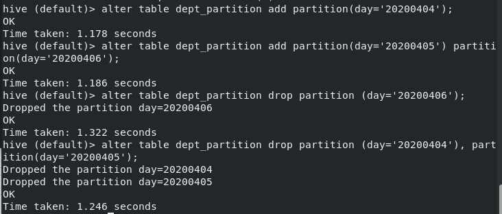

# Hive数据类型

## 基本数据类型

| Hive 数据类型 | Java 数据类型 | 长度                                                  | 例子                                  |
| ------------- | ------------- | ----------------------------------------------------- | ------------------------------------- |
| TINYINT       | byte          | 1byte 有符号整数                                      | 20                                    |
| SMALINT       | short         | 2byte 有符号整数                                      | 20                                    |
| ***INT***     | int           | 4byte 有符号整数                                      | 20                                    |
| ***BIGINT***  | long          | 8byte 有符号整数                                      | 20                                    |
| BOOLEAN       | boolean       | 布尔类型，true 或者 false                             | TRUE FALSE                            |
| FLOAT         | float         | 单精度浮点数                                          | 3.14159                               |
| ***DOUBLE***  | double        | 双精度浮点数                                          | 3.14159                               |
| ***STRING***  | string        | 字符系列。可以指定字符集。 可以使用单引号或者双引号。 | ‘now is the time’ “for all  good men” |
| TIMESTAMP     |               | 时间类型                                              |                                       |
| BINARY        |               | 字节数组                                              |                                       |

对于 Hive 的 String 类型相当于数据库的 varchar 类型，该类型是一个可变的字符串， 不过它不能声明其中最多能存储多少个字符，理论上它可以存储 2GB 的字符数。

## 集合数据类型

| 数据类型 | 描述                                                         | 语法示例                                         |
| -------- | ------------------------------------------------------------ | ------------------------------------------------ |
| STRUCT   | 和 c 语言中的 struct 类似，都可以通过“点”符号访问元素 内容。例如，如果某个列的数据类型是 STRUCT{first STRING,  last STRING},那么第 1 个元素可以通过字段.first 来引用。 | struct() 例如 struct<street:string, city:string> |
| MAP      | MAP 是一组键-值对元组集合，使用数组表示法可以访问数 据。例如，如果某个列的数据类型是 MAP，其中键->值对 是’first’->’John’和’last’->’Doe’，那么可以通过字 段名[‘last’]获取最后一个元素 | map() 例如 map<string, int>                      |
| ARRAY    | 数组是一组具有相同类型和名称的变量的集合。这些变量 称为数组的元素，每个数组元素都有一个编号，编号从零开 始。例如，数组值为[‘John’, ‘Doe’]，那么第 2 个元素 可以通过数组名[1]进行引用。 | Array() 例如 array<string>                       |

Hive 有三种复杂数据类型 ARRAY、MAP 和 STRUCT。ARRAY 和 MAP 与 Java 中的 Array 和 Map 类似，而 STRUCT 与 C 语言中的 Struct 类似，它封装了一个命名字段集合， 复杂数据类型允许任意层次的嵌套。

实例：

```
songsong,bingbing_lili,xiao song:18_xiaoxiao song:19,hui long guan_beijing
yangyang,caicai_susu,xiao yang:18_xiaoxiao yang:19,chao yang_beijing
```


```hive
create table test(
name string,
friends array<string>,
children map<string, int>,
address struct<street:string, city:string>
)
row format delimited fields terminated by ','
collection items terminated by '_'
map keys terminated by ':'
lines terminated by '\n';
```

字段解释： 

row format delimited fields terminated by ',' 		-- 列分隔符 

collection items terminated by '_' 							--MAP STRUCT 和 ARRAY 的分隔符(数据分割 符号) 

map keys terminated by ':' 										-- MAP 中的 key 与 value 的分隔符 

lines terminated by '\n'; 												-- 行分隔符

导入数据：

```hive
load data local inpath '/home/zhuweihao/opt/data/test.txt' into table test;
```

访问三种集合列里的数据，以下分别是 ARRAY，MAP，STRUCT 的访问方式：

```
select friends[1],children['xiao song'],address.city from test
where name="songsong";
```


## 类型转换

Hive 的原子数据类型是可以进行隐式转换的，类似于 Java 的类型转换，例如某表达式 使用 INT 类型，TINYINT 会自动转换为 INT 类型，但是 Hive 不会进行反向转化，例如， 某表达式使用 TINYINT 类型，INT 不会自动转换为 TINYINT 类型，它会返回错误，除非 使用 CAST 操作。

隐式类型转换规则如下：

- 任何整数类型都可以隐式地转换为一个范围更广的类型，如 TINYINT 可以转 换成 INT，INT 可以转换成 BIGINT。 
- 所有整数类型、FLOAT 和 STRING 类型都可以隐式地转换成 DOUBLE。 
- TINYINT、SMALLINT、INT 都可以转换为 FLOAT。
- BOOLEAN 类型不可以转换为任何其它的类型。

---

可以使用 CAST 操作显示进行数据类型转换：

例如，CAST('1' AS INT)将把字符串'1' 转换成整数 1；如果强制类型转换失败，如执行 CAST('X' AS INT)，表达式返回空值 NULL。

```hive
select '1'+2, cast('1'as int) + 2;
```


# DDL数据定义

文档：[LanguageManual DDL - Apache Hive - Apache Software Foundation](https://cwiki.apache.org/confluence/display/Hive/LanguageManual+DDL)

## 创建数据库

```hive
CREATE DATABASE [IF NOT EXISTS] database_name 
[COMMENT database_comment] 
[LOCATION hdfs_path] 
[WITH DBPROPERTIES (property_name=property_value, ...)]; 
```


## 创建表

```hive
CREATE [EXTERNAL] TABLE [IF NOT EXISTS] table_name 
[(col_name data_type [COMMENT col_comment], ...)] 
[COMMENT table_comment] 
[PARTITIONED BY (col_name data_type [COMMENT col_comment], ...)] 
[CLUSTERED BY (col_name, col_name, ...) 
[SORTED BY (col_name [ASC|DESC], ...)] INTO num_buckets BUCKETS] 
[ROW FORMAT row_format] 
[STORED AS file_format] 
[LOCATION hdfs_path]
[TBLPROPERTIES (property_name=property_value, ...)]
[AS select_statement]
```

字段解释：

- CREATE TABLE 创建一个指定名字的表。如果相同名字的表已经存在，则抛出异 常；用户可以用 IF NOT EXISTS 选项来忽略这个异常。 
- EXTERNAL 关键字可以让用户创建一个外部表，在建表的同时可以指定一个指向 实际数据的路径（LOCATION），在删除表的时候，内部表的元数据和数据会被一起删 除，而外部表只删除元数据，不删除数据。 
- COMMENT：为表和列添加注释。 
- PARTITIONED BY 创建分区表 
- CLUSTERED BY 创建分桶表 
- SORTED BY 不常用，对桶中的一个或多个列另外排序 
- ROW FORMAT  
  - DELIMITED 
    - [FIELDS TERMINATED BY char]
    - [COLLECTION ITEMS  TERMINATED BY char] 
    - [MAP KEYS TERMINATED BY char] 
    - [LINES TERMINATED BY char]  | 
    - SERDE serde_name [WITH SERDEPROPERTIES (property_name=property_value,  property_name=property_value, ...)] 
  - 用户在建表的时候可以自定义 SerDe 或者使用自带的 SerDe。如果没有指定 ROW  FORMAT 或者 ROW FORMAT DELIMITED，将会使用自带的 SerDe。在建表的时候，用户 还需要为表指定列，用户在指定表的列的同时也会指定自定义的 SerDe，Hive 通过 SerDe 确 定表的具体的列的数据。 SerDe 是 Serialize/Deserilize 的简称， hive 使用 Serde 进行行对象的序列与反序列化。 
- STORED AS 指定存储文件类型 常用的存储文件类型：SEQUENCEFILE（二进制序列文件）、TEXTFILE（文本）、 RCFILE（列式存储格式文件） 如果文件数据是纯文本，可以使用 STORED AS TEXTFILE。如果数据需要压缩，使 用 STORED AS SEQUENCEFILE。 
- LOCATION ：指定表在 HDFS 上的存储位置。 
- AS：后跟查询语句，根据查询结果创建表。 
- LIKE 允许用户复制现有的表结构，但是不复制数据。

### 管理表

默认创建的表都是所谓的管理表，有时也被称为内部表。因为这种表，Hive 会（或多或少地）控制着数据的生命周期。Hive 默认情况下会将这些表的数据存储在由配置项 hive.metastore.warehouse.dir(例如，/user/hive/warehouse)所定义的目录的子目录下。当我们删除一个管理表时，Hive 也会删除这个表中数据。管理表不适合和其他工具共享数据。

### 外部表

因为表是外部表，所以 Hive 并非认为其完全拥有这份数据。删除该表并不会删除掉这份数据，不过描述表的元数据信息会被删除掉。

### 分区表

分区表实际上就是对应一个 HDFS 文件系统上的独立的文件夹，该文件夹下是该分区 所有的数据文件。Hive 中的分区就是分目录，把一个大的数据集根据业务需要分割成小的 数据集。在查询时通过 WHERE 子句中的表达式选择查询所需要的指定的分区，这样的查询效率会提高很多。


# DML数据操作

文档：[LanguageManual DML - Apache Hive - Apache Software Foundation](https://cwiki.apache.org/confluence/display/Hive/LanguageManual+DML)

## 数据导入

测试：导入orc数据


### 向表中装载数据（Load）

```hive
load data [local] inpath '/opt/module/datas/student.txt' [overwrite] into table student 
[partition (partcol1=val1,…)]; 
```

- load data:表示加载数据 
- local:表示从本地加载数据到 hive 表；否则从 HDFS 加载数据到 hive 表 
- inpath:表示加载数据的路径 
- overwrite:表示覆盖表中已有数据，否则表示追加 
- into table:表示加载到哪张表 
- student:表示具体的表 
- partition:表示上传到指定分区 

实例：

```hive
create table student(id string, name string) row format delimited fields terminated by '\t'; 
```

```hive
load data local inpath '/home/zhuweihao/opt/data/student.txt' into table default.student; 
```


### 通过查询语句向表中插入数据（Insert）

创建分区表

```hive
create table student_par(id int, name string) partitioned by (month string) row format delimited fields terminated by '\t'; 
```

插入基本数据

```hive
insert into table  student_par partition(month='201709') values(1,'wangwu'),(2,'zhaoliu'); 
```

基本模式插入（根据单张表查询结果）

```hive
insert overwrite table student partition(month='201708') 
select id, name from student where month='201709'; 
```

insert into：以追加数据的方式插入到表或分区，原有数据不会删除 

insert overwrite：会覆盖表或分区中已存在的数据 

多表（多分区）插入模式（根据多张表查询结果）

```hive
from student               
insert overwrite table student partition(month='201707')               
select id, name where month='201709'               
insert overwrite table student partition(month='201706')               
select id, name where month='201709'; 
```

----

##### 问题：


----

### 查询语句中创建表并加载数据（as select）

根据查询结果创建表（查询的结果会添加到新创建的表中）

```hive
create table if not exists student3 
as select id, name from student;
```

### 创建表时通过Location指定加载数据路径

上传数据到hdfs上

```hive
dfs -mkdir /student;
dfs -put /home/zhuweihao/opt/data/student.txt /student;
```

创建表，并指定数据在hdfs上的位置

```hive
create external table if not exists student5(id int, name string) 
row format delimited fields terminated by '\t' 
location '/student';
```

## 数据导出

### Insert导出

将查询的结果格式化导出到本地

```hive
>insert overwrite local directory '/home/zhuweihao/opt/data/student'
ROW FORMAT DELIMITED FIELDS TERMINATED BY '\t'
select * from student;
```

-----

##### 问题：

不能正常导出

----


将查询的结果导出到HDFS上（没有local）

```hive
insert overwrite directory '/student'
ROW FORMAT DELIMITED FIELDS TERMINATED BY '\t'
select * from student; 
```

### Hadoop命令导出到本地

```hive
dfs -get /user/hive/warehouse/student/month=202209/000000_0 /home/zhuweihao/opt/data/student/student3.txt;
```


## 清空表

```hive
truncate table student；
```

注意：truncate只能删除管理表中数据，不能删除外部表中数据


# 查询

文档：[LanguageManual Select - Apache Hive - Apache Software Foundation](https://cwiki.apache.org/confluence/display/Hive/LanguageManual+Select)


语法

```hive
[WITH CommonTableExpression (, CommonTableExpression)*]    (Note: Only available starting with Hive 0.13.0)
SELECT [ALL | DISTINCT] select_expr, select_expr, ...
  FROM table_reference
  [WHERE where_condition]
  [GROUP BY col_list]
  [ORDER BY col_list]
  [CLUSTER BY col_list
    | [DISTRIBUTE BY col_list] [SORT BY col_list]
  ]
 [LIMIT [offset,] rows]
```

数据准备：

dept：

```
10	ACCOUNTING	1700
20	RESEARCH	1800
30	SALES	1900
40	OPERATIONS	1700
```

emp：

```
7369	SMITH	CLERK	7902	1980-12-17	800.00		20
7499	ALLEN	SALESMAN	7698	1981-2-20	1600.00	300.00	30
7521	WARD	SALESMAN	7698	1981-2-22	1250.00	500.00	30
7566	JONES	MANAGER	7839	1981-4-2	2975.00		20
7654	MARTIN	SALESMAN	7698	1981-9-28	1250.00	1400.00	30
7698	BLAKE	MANAGER	7839	1981-5-1	2850.00		30
7782	CLARK	MANAGER	7839	1981-6-9	2450.00		10
7788	SCOTT	ANALYST	7566	1987-4-19	3000.00		20
7839	KING	PRESIDENT		1981-11-17	5000.00		10
7844	TURNER	SALESMAN	7698	1981-9-8	1500.00	0.00	30
7876	ADAMS	CLERK	7788	1987-5-23	1100.00		20
7900	JAMES	CLERK	7698	1981-12-3	950.00		30
7902	FORD	ANALYST	7566	1981-12-3	3000.00		20
7934	MILLER	CLERK	7782	1982-1-23	1300.00		10
```

创建部门表：

```hive
create table if not exists dept(deptno int, dname string, loc int) 
row format delimited fields terminated by '\t'; 
```

创建员工表：

```hive
create table if not exists emp(empno int, ename string,job string, mgr int, hiredate string,sal double,comm double,deptno int) 
row format delimited fields terminated by '\t'; 
```

导入数据：

```hive
load data local inpath '/home/zhuweihao/opt/data/dept.txt' into table dept; 
load data local inpath '/home/zhuweihao/opt/data/emp.txt' into table emp; 
```


## 基本查询

### 全表和特定列查询

全表查询

```hive
select * from emp;
select empno,ename,job,mgr,hiredate,sal,comm,deptno from emp ;
```

特定列查询

```hive
select empno, ename from emp;
```

注意：

- SQL 语言大小写不敏感。  
- SQL 可以写在一行或者多行 
- 关键字不能被缩写也不能分行 
- 各子句一般要分行写。 
- 使用缩进提高语句的可读性

### 列别名

```hive
select ename as name, deptno dn from emp; 
```


### 算数运算符


```hive
select sal +1 from emp; 
```

### where语句

- 使用 WHERE 子句，将不满足条件的行过滤掉 
- WHERE 子句紧随 FROM 子句 

```hive
select * from emp where sal>1000; 
```

----

注意：where 子句中不能使用字段别名。 

执行顺序：from-where-select

---

### 比较运算符（Between/In/is null）


```hive
select * from emp where sal IN (1500, 5000); 
select * from emp where sal between 500 and 1000; 
```

### 常用函数

```hive
求总行数（count） 
select count(*) cnt from emp; 
求工资的最大值（max）
select max(sal) max_sal from emp; 
求工资的最小值（min）
select min(sal) min_sal from emp; 
求工资的总和（sum） 
select sum(sal) sum_sal from emp;  
求工资的平均值（avg） 
select avg(sal) avg_sal from emp; 
```


### like和rlike

- 使用 LIKE 运算选择类似的值 
- 选择条件可以包含字符或数字: 
  - % 代表零个或多个字符(任意个字符)。 
  - _ 代表一个字符。 
- RLIKE 子句：RLIKE 子句是 Hive 中这个功能的一个扩展，其可以通过 Java 的正则表达式这个更强大的语言来指定匹配条件。 

```hive
select * from emp where ename LIKE '_A%'; 
select * from emp where ename RLIKE '[A]'; 
```

### 逻辑运算符


## 分组

### group by语句

GROUP BY 语句通常会和聚合函数一起使用，按照一个或者多个列队结果进行分组，然后对每个组执行聚合操作。 

```hive
计算emp表每个部门的平均工资
select t.deptno, avg(t.sal) avg_sal from emp t group by t.deptno; 
计算emp表每个部门中每个岗位的最高薪水
select t.deptno, t.job, max(t.sal) max_sal from emp t group by t.deptno, t.job;
```


### having语句

having语句和where的不同点：

- where 后面不能写分组函数，而 having 后面可以使用分组函数。 
- having 只用于 group by 分组统计语句。 

```hive
求所有平均薪水大于2000的部门 
select deptno, avg(sal) avg_sal from emp group by deptno having avg_sal > 2000;
```


## Join语句

### 等值Join

Hive 支持通常的 SQL JOIN 语句。

根据员工表和部门表中的部门编号相等，查询员工编号、员工名称和部门名称； 

```hive
select e.empno, e.ename, d.deptno, d.dname from emp e join dept d on e.deptno = d.deptno; 
```

### 内连接

内连接：只有进行连接的两个表中都存在与连接条件相匹配的数据才会被保留下来。 

```hive
select e.empno, e.ename, d.deptno from emp e join dept d on e.deptno = d.deptno; 
```

### 左外连接

左外连接：JOIN 操作符左边表中符合 WHERE 子句的所有记录将会被返回。 

```hive
select e.empno, e.ename, d.deptno from emp e left join dept d on e.deptno = d.deptno; 
```

### 右外连接

右外连接：JOIN 操作符右边表中符合 WHERE 子句的所有记录将会被返回。

```hive
select e.empno, e.ename, d.deptno from emp e right join dept d on e.deptno = d.deptno; 
```

### 满外连接

满外连接：将会返回所有表中符合 WHERE 语句条件的所有记录。如果任一表的指定字
段没有符合条件的值的话，那么就使用 NULL 值替代。 

```hive
select e.empno, e.ename, d.deptno from emp e full join dept d on e.deptno = d.deptno; 
```

## 排序

### 全局排序

Order By：全局排序，只有一个 Reducer 

- 使用 ORDER BY 子句排序 
  - ASC（ascend）: 升序（默认） 
  - DESC（descend）: 降序 
- ORDER BY 子句在 SELECT 语句的结尾 

```hive
查询员工信息按工资升序排列 
select * from emp order by sal; 
查询员工信息按工资降序排列 
select * from emp order by sal desc; 
```

### 按照别名排序 

按照员工薪水的 2 倍排序 

```hive
select ename, sal*2 twosal from emp order by twosal; 
```

### 多个列排序 

按照部门和工资升序排序 

```hive
select ename, deptno, sal from emp order by deptno, sal; 
```


### 每个Reduce内部排序（Sort By） 

----

使用场景：？

----


Sort By：对于大规模的数据集 order by 的效率非常低。在很多情况下，并不需要全局排序，此时可以使用 sort by。 
Sort by 为每个 reducer 产生一个排序文件。每个 Reducer 内部进行排序，对全局结果集来说不是排序。 

```hive
hive (default)> set mapreduce.job.reduces=3; 
hive (default)> set mapreduce.job.reduces;
mapreduce.job.reduces=3
hive (default)> select * from emp sort by deptno desc; 
```


### 分区（Distribute By）

Distribute By： 在有些情况下，我们需要控制某个特定行应该到哪个 reducer，通常是为了进行后续的聚集操作。distribute by 子句可以做这件事。distribute by 类似 MR 中 partition（自定义分区），进行分区，结合 sort by 使用。  
对于 distribute by 进行测试，一定要分配多 reduce 进行处理，否则无法看到 distribute by 的效果。

先按照部门编号分区，再按照员工编号降序排序。 

```hive
hive (default)> set mapreduce.job.reduces=3; 
hive (default)> select * from emp distribute by deptno sort by empno desc; 
```


---

注意：

- distribute by 的分区规则是根据分区字段的 hash 码与 reduce 的个数进行模除后，余数相同的分到一个区。 
- Hive 要求 DISTRIBUTE BY 语句要写在 SORT BY 语句之前。 

---

### Cluster By 

当 distribute by 和 sorts by 字段相同时，可以使用 cluster by 方式。 
cluster by 除了具有 distribute by 的功能外还兼具 sort by 的功能。但是排序只能是升序排序，不能指定排序规则为 ASC 或者 DESC。 

```hive
以下两种写法等价 
select * from emp cluster by deptno; 
select * from emp distribute by deptno sort by deptno; 
```

注意：按照部门编号分区，不一定就是固定死的数值，可以是 20 号和 30 号部门分到一
个分区里面去


# 函数


## 系统内置函数

```hive
查看系统自带的函数
show functions; 
显示自带的函数的用法
desc function upper; 
详细显示自带的函数的用法
desc function extended upper; 
```

## 常用内置函数

### 空字段赋值

函数说明：

NVL：给值为 NULL 的数据赋值，它的格式是 NVL( value，default_value)。它的功能是如果 value 为 NULL，则 NVL 函数返回 default_value 的值，否则返回 value 的值，如果两个参数都为 NULL ，则返回 NULL。

如果员工的 comm 为 NULL，则用-1 代替 

```hive
select comm,nvl(comm, -1) from emp; 
```


如果员工的 comm 为 NULL，则用领导 id 代替 

```hive
select comm, nvl(comm,mgr) from emp;
```

### case when then else end

数据准备

```
wu	A	male
da	A	male
song	B	male
feng	A	female
ting	B	female
zhang	B	female
```

创建表并导入数据

```hive
create table emp_sex(name string,  dept_id string, sex string) 
row format delimited fields terminated by "\t";
```

```hive
load data local inpath '/home/zhuweihao/opt/data/emp_sex.txt' into table emp_sex;
```

求出不同部门男女各多少人。

```hive
select 
 dept_id,   
 sum(case sex when 'male' then 1 else 0 end) male_count,   
 sum(case sex when 'female' then 1 else 0 end) female_count 
from emp_sex 
group by dept_id;
```


### 行转列

----

实例：

字段A，B，C，D两两组合输出，转成（A,B),(B,C)，，，，，，

----

CONCAT(string A/col, string B/col…)：返回输入字符串连接后的结果，支持任意个输入字符串; 

CONCAT_WS(separator, str1, str2,...)：它是一个特殊形式的 CONCAT()。第一个参数剩余参数间的分隔符。分隔符可以是与剩余参数一样的字符串。如果分隔符是 NULL，返回值也将为 NULL。这个函数会跳过分隔符参数后的任何 NULL 和空字符串。分隔符将被加到被连接的字符串之间; 

注意: CONCAT_WS must be "string or array<string> 

COLLECT_SET(col)：函数只接受基本数据类型，它的主要作用是将某字段的值进行去重汇总，产生 Array 类型字段。 

数据准备：

```
sun	baiyang	A
hai	sheshou	A
song	baiyang	B
zhu	baiyang	A
feng	sheshou	A
cang	baiyang	B
```

建表并导入数据

```hive
create table person_info( name string,  constellation string,  blood_type string)  
row format delimited fields terminated by "\t"; 

load data local inpath "/home/zhuweihao/opt/data/person_info.txt" into table person_info;
```

把星座和血型一样的人归类到一起

```hive
SELECT 
	t1.c_b, CONCAT_WS("|",collect_set(t1.name)) 
FROM ( 
    SELECT 
    	NAME, CONCAT_WS(',',constellation,blood_type) c_b 
    FROM person_info )t1 
GROUP BY t1.c_b 
```


### 列转行

EXPLODE(col)：将 hive 一列中复杂的 Array 或者 Map 结构拆分成多行。 
LATERAL VIEW 
用法：LATERAL VIEW udtf(expression) tableAlias AS columnAlias 
解释：用于和 split, explode 等 UDTF 一起使用，它能够将一列数据拆成多行数据，在此基础上可以对拆分后的数据进行聚合。 

数据准备

```
Person of Interest	suspense,action,science fiction,drama 
Lie to Me	suspense,police,action,psychology,drama
Wolf Warrior 2	War,action,disaster
```


```hive
create table movie_info(movie string,category string) 
row format delimited fields terminated by "\t"; 

load data local inpath "/home/zhuweihao/opt/data/movie_info.txt" into table movie_info;
```

将电影分类中的数组数据展开

```hive
SELECT 
	movie, category_name 
FROM 
	movie_info 
lateral VIEW explode(split(category,",")) movie_info_tmp AS category_name; 
```


### 窗口函数（开窗函数）

----

spark窗口函数中的shuffle过程

比较重要

-----


#### 相关函数说明

- OVER()：指定分析函数工作的数据窗口大小，这个数据窗口大小可能会随着行的变而变化。
- CURRENT ROW：当前行 
- n PRECEDING：往前 n 行数据 
- n FOLLOWING：往后 n 行数据 
- UNBOUNDED：起点， 
  - UNBOUNDED PRECEDING 表示从前面的起点， 
  - UNBOUNDED FOLLOWING 表示到后面的终点 
- LAG(col,n,default_val)：往前第 n 行数据 
- LEAD(col,n, default_val)：往后第 n 行数据 
- NTILE(n)：把有序窗口的行分发到指定数据的组中，各个组有编号，编号从 1 开始，对于每一行，NTILE 返回此行所属的组的编号。注意：n 必须为 int 类型。 

#### 实例

数据准备

```
jack,2017-01-01,10
tony,2017-01-02,15
jack,2017-02-03,23
tony,2017-01-04,29
jack,2017-01-05,46
jack,2017-04-06,42
tony,2017-01-07,50
jack,2017-01-08,55
mart,2017-04-08,62
mart,2017-04-09,68
neil,2017-05-10,12
mart,2017-04-11,75
neil,2017-06-12,80
mart,2017-04-13,94
```

需求：

- 查询在 2017 年 4 月份购买过的顾客及总人数 
- 查询顾客的购买明细及月购买总额 
- 上述的场景, 将每个顾客的 cost 按照日期进行累加 
- 查询每个顾客上次的购买时间 
- 查询前 20%时间的订单信息 

建表导入数据：

```hive
create table business(name string,orderdate string,cost int) 
ROW FORMAT DELIMITED FIELDS TERMINATED BY ','; 
load data local inpath "/home/zhuweihao/opt/data/business.txt" into table business;
```

查询在 2017 年 4 月份购买过的顾客及总人数 

```hive
select name,count(*) over ()  
from business 
where substring(orderdate,1,7)='2017-04' 
group by name;
```


查询顾客的购买明细及月购买总额 

```hive
select name,orderdate,cost,sum(cost) over(partition by month(orderdate)) from business; 
```


将每个顾客的 cost 按照日期进行累加 

```hive
select name,orderdate,cost,
sum(cost) over() as sample1,--所有行相加
sum(cost) over(partition by name) as sample2,--按 name 分组，组内数据相加 
sum(cost) over(partition by name order by orderdate) as sample3,--按 name 分组，组内数据累加 
sum(cost) over(partition by name order by orderdate rows between UNBOUNDED PRECEDING and current row ) as sample4 ,--和 sample3 一样,由起点到 当前行的聚合
sum(cost) over(partition by name order by orderdate rows between 1 PRECEDING and current row) as sample5, --当前行和前面一行做聚合 
sum(cost) over(partition by name order by orderdate rows between 1 PRECEDING AND 1 FOLLOWING ) as sample6,--当前行和前边一行及后面一行 
sum(cost) over(partition by name order by orderdate rows between current row and UNBOUNDED FOLLOWING ) as sample7 --当前行及后面所有行 
from business;
```

rows 必须跟在 order by 子句之后，对排序的结果进行限制，使用固定的行数来限制分区中的数据行数量 


查看顾客上次的购买时间 

```hive
select name,orderdate,cost,
lag(orderdate,1,'1900-01-01') over(partition by name order by orderdate ) as time1,lag(orderdate,2) over (partition by name order by orderdate) as time2  
from business;
```


查询前 20%时间的订单信息 

```hive
select * from (
	select name,orderdate,cost, ntile(5) over(order by orderdate) sorted
	from business 
) t 
where sorted = 1; 
```

### Rank

#### 函数说明

RANK() 排序相同时会重复，总数不会变 
DENSE_RANK() 排序相同时会重复，总数会减少 
ROW_NUMBER() 会根据顺序计算 

#### 数据准备

```
sun	chinese	87
sun	math	95
sun	english	68
da	chinese	94
da	math	56
da	english	84
song	chinese	64 
song	math	86
song	english	84 
ting	english	65
ting	math	85
ting	english	78
```

建表并导入数据

```hive
create table score(name string, subject string,score int)
row format delimited fields terminated by "\t"; 
load data local inpath '/home/zhuweihao/opt/data/score.txt' into table score;
```

计算每门学科成绩排名

```hive
select name, subject, score, 
rank() over(partition by subject order by score desc) rp, 
dense_rank() over(partition by subject order by score desc) drp, row_number() over(partition by subject order by score desc) rmp 
from score; 
```


## 自定义函数

UDF、UDAF、UDTF


# 分区表和分桶表

## 分区表

分区表实际上就是对应一个 HDFS 文件系统上的独立的文件夹，该文件夹下是该分区所 有的数据文件。Hive 中的分区就是分目录，把一个大的数据集根据业务需要分割成小的数据集。在查询时通过 WHERE 子句中的表达式选择查询所需要的指定的分区，这样的查询效率 会提高很多。

### 分区表基本操作

数据准备：需要根据日期对日志进行管理

```
dept_20200401.log
10	ACCOUNTING	1700
20	RESEARCH	1800

dept_20200402.log
30	SALES	1900
40	OPERATIONS	1700

dept_20200403.log
50	TEST	2000
60	DEV	1900
```

#### 创建分区表

```hive
create table dept_partition(
deptno int, dname string, loc string
)
partitioned by (day string)
row format delimited fields terminated by '\t';
```

导入数据

```hive
load data local inpath '/home/zhuweihao/opt/data/dept_20200401.log' into table dept_partition partition(day='20200401');
load data local inpath '/home/zhuweihao/opt/data/dept_20200402.log' into table dept_partition partition(day='20200402');
load data local inpath '/home/zhuweihao/opt/data/dept_20200403.log' into table dept_partition partition(day='20200403');
```

#### 单分区查询

```hive
select * from dept_partition where day='20200401';
```


#### 多分区联合查询

```hive
select * from dept_partition where day='20200401'
union
select * from dept_partition where day='20200402';
```


```hive
select * from dept_partition where day='20200401' or day='20200402' or day='20200403';
```


#### 增加分区

创建单个分区

```hive
alter table dept_partition add partition(day='20200404');
```


同时创建多个分区

```hive
alter table dept_partition add partition(day='20200405') partition(day='20200406');
```


#### 删除分区

删除单个分区

```hive
alter table dept_partition drop partition (day='20200406');
```

 同时删除多个分区

```hive
alter table dept_partition drop partition (day='20200404'), partition(day='20200405');
```



#### 查看分区表有多少分区

```hive
show partitions dept_partition;
```


#### 查看分区表结构

```hive
desc formatted dept_partition;
```


-----

##### 问题：

```
是否会查询出分区字段（正常应该是不会查询出分区字段，会引起麻烦）
select * from dept_partition 
```

----


### 二级分区

思考: 如果一天的日志数据量也很大，如何再将数据拆分?

#### 创建二级分区表 

```hive
create table dept_partition2(deptno int, dname string, loc string)
partitioned by (day string, hour string)
row format delimited fields terminated by '\t';
```

#### 正常的加载数据 

加载数据到二级分区表中 

```hive
load data local inpath '/home/zhuweihao/opt/data/dept_20200401.log' into table dept_partition2 partition(day='20200401', hour='12');
```

 查询分区数据 

```hive
select * from dept_partition2 where day='20200401' and hour='12';
```


#### 把数据直接上传到分区目录上，让分区表和数据产生关联的三种方式

- 方式一：上传数据后修复

上传数据 

```
dfs -mkdir -p /user/hive/warehouse/dept_partition2/day=20200401/hour=13;
dfs -put /home/zhuweihao/opt/data/dept_20200401.log /user/hive/warehouse/dept_partition2/day=20200401/hour=13; 
```

查询数据（查询不到刚上传的数据）

```hive
select * from dept_partition2 where day='20200401' and hour='13'; 
```

执行修复命令

```
msck repair table dept_partition2; 
```

再次查询数据

```hive
select * from dept_partition2 where day='20200401' and hour='13'; 
```


- 方式二：上传数据后添加分区 

上传数据 

```
dfs -mkdir -p /user/hive/warehouse/dept_partition2/day=20200401/hour=14; 
dfs -put /home/zhuweihao/opt/data/dept_20200401.log /user/hive/warehouse/dept_partition2/day=20200401/hour=14; 
```

执行添加分区 

```hive
alter table dept_partition2 add partition(day='20200401',hour='14');
```

 查询数据 

```hive
select * from dept_partition2 where day='20200401' and hour='14';
```


---

删除命令

```
dfs -rm -r /user/hive/warehouse/dept_partition2/day=20200401/hour=14;
```

----

- 方式三：创建文件夹后 load 数据到分区 

创建目录 

```
dfs -mkdir -p /user/hive/warehouse/dept_partition2/day=20200401/hour=15; 
```

 上传数据 

```hive
load data local inpath '/home/zhuweihao/opt/data/dept_20200401.log' into table dept_partition2 partition(day='20200401',hour='15');
```

 查询数据 

```hive
select * from dept_partition2 where day='20200401' and hour='15';
```


### 动态分区调整

关系型数据库中，对分区表 Insert 数据时候，数据库自动会根据分区字段的值，将数据插入到相应的分区中，Hive 中也提供了类似的机制，即动态分区(Dynamic Partition)，只不过， 使用 Hive 的动态分区，需要进行相应的配置。

#### 开启动态分区参数设置

1. 开启动态分区功能（默认 true，开启）

   ```
   hive.exec.dynamic.partition=true
   ```

2. 设置为非严格模式（动态分区的模式，默认 strict，表示必须指定至少一个分区为静态分区，nonstrict 模式表示允许所有的分区字段都可以使用动态分区。） 

   ```
   hive.exec.dynamic.partition.mode=nonstrict
   ```

3. 在所有执行 MR 的节点上，最大一共可以创建多少个动态分区。默认 1000 

   ```
   hive.exec.max.dynamic.partitions=1000
   ```

4. 在每个执行 MR 的节点上，最大可以创建多少个动态分区。该参数需要根据实际的数据来设定。比如：源数据中包含了一年的数据，即 day 字段有 365 个值，那么该参数就需要设置成大于 365，如果使用默认值100，则会报错。 

   ```
   hive.exec.max.dynamic.partitions.pernode=100
   ```

5. 整个 MR Job 中，最大可以创建多少个 HDFS 文件。默认 100000 

   ```
   hive.exec.max.created.files=100000
   ```

6. 当有空分区生成时，是否抛出异常。一般不需要设置。默认 false 

   ```
   hive.error.on.empty.partition=false
   ```

#### 实例

将 dept 表中的数据按照地区（loc 字段），插入到目标表 dept_partition 的相应分区中。

创建目标分区表 

```hive
create table dept_partition_dy(id int, name string)  
partitioned by (loc int) 
row format delimited fields terminated by '\t'; 
```

设置动态分区 

```hive
set hive.exec.dynamic.partition.mode = nonstrict; 
```

插入数据

```hive
insert into table dept_partition_dy partition(loc) select deptno, dname,loc from dept; 
```

查看目标分区表的分区情况 

```hive
show partitions dept_partition;
```


## 分桶表

分区提供一个隔离数据和优化查询的便利方式。不过，并非所有的数据集都可形成合理的分区。对于一张表或者分区，Hive 可以进一步组织成桶，也就是更为细粒度的数据范围划分。 

分桶是将数据集分解成更容易管理的若干部分的另一个技术。 

分区针对的是数据的存储路径；分桶针对的是数据文件。

### 创建分桶表

数据准备

```
1001	ss1
1002	ss2
1003	ss3
1004	ss4
1005	ss5
1006	ss6
1007	ss7
1008	ss8
1009	ss9
1010	ss10
1011	ss11
1012	ss12
1013	ss13
1014	ss14
1015	ss15
1016	ss16
```

创建分桶表

```hive
create table stu_buck(id int, name string)
clustered by(id) 
into 4 buckets
row format delimited fields terminated by '\t';
```

查看表结构

```hive
desc formatted stu_buck;
```

导入数据到分桶表中，load 的方式

```hive
load data inpath '/home/zhuweihao/opt/data/test1.txt' into table stu_buck;
```

查询数据

```hive
select * from stu_buck;
```


----

分桶规则：

根据结果可知：Hive 的分桶采用对分桶字段的值进行哈希，然后除以桶的个数求余的方式决定该条记录存放在哪个桶当中

----

# 压缩和存储


## Hadoop压缩配置


