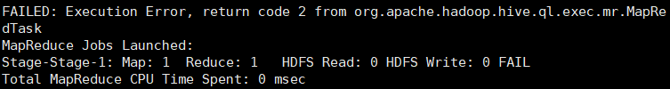
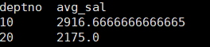
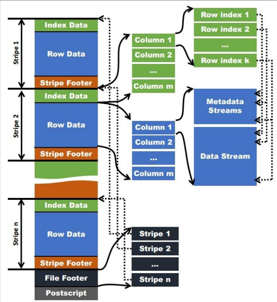
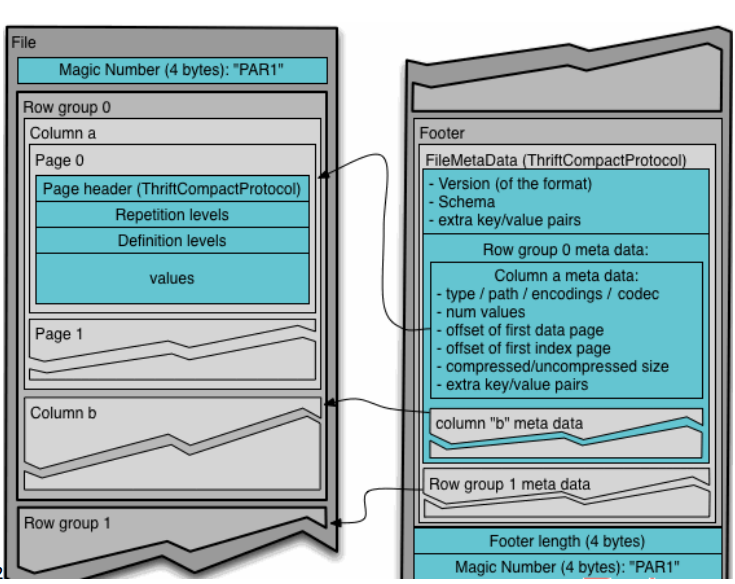

# [Home - Apache Hive - Apache Software Foundation](https://cwiki.apache.org/confluence/display/Hive/Home)


# Hive数据类型

## 基本数据类型

| Hive 数据类型 | Java 数据类型 | 长度                                                  | 例子                                  |
| ------------- | ------------- | ----------------------------------------------------- | ------------------------------------- |
| TINYINT       | byte          | 1byte 有符号整数                                      | 20                                    |
| SMALINT       | short         | 2byte 有符号整数                                      | 20                                    |
| ***INT***     | int           | 4byte 有符号整数                                      | 20                                    |
| ***BIGINT***  | long          | 8byte 有符号整数                                      | 20                                    |
| BOOLEAN       | boolean       | 布尔类型，true 或者 false                             | TRUE FALSE                            |
| FLOAT         | float         | 单精度浮点数                                          | 3.14159                               |
| ***DOUBLE***  | double        | 双精度浮点数                                          | 3.14159                               |
| ***STRING***  | string        | 字符系列。可以指定字符集。 可以使用单引号或者双引号。 | ‘now is the time’ “for all  good men” |
| TIMESTAMP     |               | 时间类型                                              |                                       |
| BINARY        |               | 字节数组                                              |                                       |

对于 Hive 的 String 类型相当于数据库的 varchar 类型，该类型是一个可变的字符串， 不过它不能声明其中最多能存储多少个字符，理论上它可以存储 2GB 的字符数。


## 集合数据类型

| 数据类型 | 描述                                                         | 语法示例                                         |
| -------- | ------------------------------------------------------------ | ------------------------------------------------ |
| STRUCT   | 和 c 语言中的 struct 类似，都可以通过“点”符号访问元素 内容。例如，如果某个列的数据类型是 STRUCT{first STRING,  last STRING},那么第 1 个元素可以通过字段.first 来引用。 | struct() 例如 struct<street:string, city:string> |
| MAP      | MAP 是一组键-值对元组集合，使用数组表示法可以访问数 据。例如，如果某个列的数据类型是 MAP，其中键->值对 是’first’->’John’和’last’->’Doe’，那么可以通过字 段名[‘last’]获取最后一个元素 | map() 例如 map<string, int>                      |
| ARRAY    | 数组是一组具有相同类型和名称的变量的集合。这些变量 称为数组的元素，每个数组元素都有一个编号，编号从零开 始。例如，数组值为[‘John’, ‘Doe’]，那么第 2 个元素 可以通过数组名[1]进行引用。 | Array() 例如 array<string>                       |

Hive 有三种复杂数据类型 ARRAY、MAP 和 STRUCT。ARRAY 和 MAP 与 Java 中的 Array 和 Map 类似，而 STRUCT 与 C 语言中的 Struct 类似，它封装了一个命名字段集合， 复杂数据类型允许任意层次的嵌套。

实例：

```
songsong,bingbing_lili,xiao song:18_xiaoxiao song:19,hui long guan_beijing
yangyang,caicai_susu,xiao yang:18_xiaoxiao yang:19,chao yang_beijing
```


```hive
create table test(
name string,
friends array<string>,
children map<string, int>,
address struct<street:string, city:string>
)
row format delimited fields terminated by ','
collection items terminated by '_'
map keys terminated by ':'
lines terminated by '\n';
```

字段解释： 

row format delimited fields terminated by ',' 		-- 列分隔符 

collection items terminated by '_' 							--MAP STRUCT 和 ARRAY 的分隔符(数据分割 符号) 

map keys terminated by ':' 										-- MAP 中的 key 与 value 的分隔符 

lines terminated by '\n'; 												-- 行分隔符

导入数据：

```hive
load data local inpath '/home/zhuweihao/opt/data/test.txt' into table test;
```

访问三种集合列里的数据，以下分别是 ARRAY，MAP，STRUCT 的访问方式：

```
select friends[1],children['xiao song'],address.city from test
where name="songsong";
```


## 类型转换

Hive 的原子数据类型是可以进行隐式转换的，类似于 Java 的类型转换，例如某表达式 使用 INT 类型，TINYINT 会自动转换为 INT 类型，但是 Hive 不会进行反向转化，例如， 某表达式使用 TINYINT 类型，INT 不会自动转换为 TINYINT 类型，它会返回错误，除非 使用 CAST 操作。

隐式类型转换规则如下：

- 任何整数类型都可以隐式地转换为一个范围更广的类型，如 TINYINT 可以转 换成 INT，INT 可以转换成 BIGINT。 
- 所有整数类型、FLOAT 和 STRING 类型都可以隐式地转换成 DOUBLE。 
- TINYINT、SMALLINT、INT 都可以转换为 FLOAT。
- BOOLEAN 类型不可以转换为任何其它的类型。

---

可以使用 CAST 操作显示进行数据类型转换：

例如，CAST('1' AS INT)将把字符串'1' 转换成整数 1；如果强制类型转换失败，如执行 CAST('X' AS INT)，表达式返回空值 NULL。

```hive
select '1'+2, cast('1'as int) + 2;
```


# DDL数据定义

文档：[LanguageManual DDL - Apache Hive - Apache Software Foundation](https://cwiki.apache.org/confluence/display/Hive/LanguageManual+DDL)

## 创建数据库

```hive
CREATE DATABASE [IF NOT EXISTS] database_name 
[COMMENT database_comment] 
[LOCATION hdfs_path] 
[WITH DBPROPERTIES (property_name=property_value, ...)]; 
```


## 创建表

```hive
CREATE [EXTERNAL] TABLE [IF NOT EXISTS] table_name 
[(col_name data_type [COMMENT col_comment], ...)] 
[COMMENT table_comment] 
[PARTITIONED BY (col_name data_type [COMMENT col_comment], ...)] 
[CLUSTERED BY (col_name, col_name, ...) 
[SORTED BY (col_name [ASC|DESC], ...)] INTO num_buckets BUCKETS] 
[ROW FORMAT row_format] 
[STORED AS file_format] 
[LOCATION hdfs_path]
[TBLPROPERTIES (property_name=property_value, ...)]
[AS select_statement]
```

字段解释：

- CREATE TABLE 创建一个指定名字的表。如果相同名字的表已经存在，则抛出异 常；用户可以用 IF NOT EXISTS 选项来忽略这个异常。 
- EXTERNAL 关键字可以让用户创建一个外部表，在建表的同时可以指定一个指向 实际数据的路径（LOCATION），在删除表的时候，内部表的元数据和数据会被一起删 除，而外部表只删除元数据，不删除数据。 
- COMMENT：为表和列添加注释。 
- PARTITIONED BY 创建分区表 
- CLUSTERED BY 创建分桶表 
- SORTED BY 不常用，对桶中的一个或多个列另外排序 
- ROW FORMAT  
  - DELIMITED 
    - [FIELDS TERMINATED BY char]
    - [COLLECTION ITEMS  TERMINATED BY char] 
    - [MAP KEYS TERMINATED BY char] 
    - [LINES TERMINATED BY char]  | 
    - SERDE serde_name [WITH SERDEPROPERTIES (property_name=property_value,  property_name=property_value, ...)] 
  - 用户在建表的时候可以自定义 SerDe 或者使用自带的 SerDe。如果没有指定 ROW  FORMAT 或者 ROW FORMAT DELIMITED，将会使用自带的 SerDe。在建表的时候，用户 还需要为表指定列，用户在指定表的列的同时也会指定自定义的 SerDe，Hive 通过 SerDe 确 定表的具体的列的数据。 SerDe 是 Serialize/Deserilize 的简称， hive 使用 Serde 进行行对象的序列与反序列化。 
- STORED AS 指定存储文件类型 常用的存储文件类型：SEQUENCEFILE（二进制序列文件）、TEXTFILE（文本）、 RCFILE（列式存储格式文件） 如果文件数据是纯文本，可以使用 STORED AS TEXTFILE。如果数据需要压缩，使 用 STORED AS SEQUENCEFILE。 
- LOCATION ：指定表在 HDFS 上的存储位置。 
- AS：后跟查询语句，根据查询结果创建表。 
- LIKE 允许用户复制现有的表结构，但是不复制数据。

### 管理表

默认创建的表都是所谓的管理表，有时也被称为内部表。因为这种表，Hive 会（或多或 少地）控制着数据的生命周期。Hive 默认情况下会将这些表的数据存储在由配置项 hive.metastore.warehouse.dir(例如，/user/hive/warehouse)所定义的目录的子目录下。当我们 删除一个管理表时，Hive 也会删除这个表中数据。管理表不适合和其他工具共享数据。

### 外部表

因为表是外部表，所以 Hive 并非认为其完全拥有这份数据。删除该表并不会删除掉这 份数据，不过描述表的元数据信息会被删除掉。

### 分区表

分区表实际上就是对应一个 HDFS 文件系统上的独立的文件夹，该文件夹下是该分区 所有的数据文件。Hive 中的分区就是分目录，把一个大的数据集根据业务需要分割成小的 数据集。在查询时通过 WHERE 子句中的表达式选择查询所需要的指定的分区，这样的查询效率会提高很多。


# DML数据操作

文档：[LanguageManual DML - Apache Hive - Apache Software Foundation](https://cwiki.apache.org/confluence/display/Hive/LanguageManual+DML)

## 数据导入

测试：导入orc数据


### 向表中装载数据（Load）

```hive
load data [local] inpath '/opt/module/datas/student.txt' [overwrite] into table student 
[partition (partcol1=val1,…)]; 
```

- load data:表示加载数据 
- local:表示从本地加载数据到 hive 表；否则从 HDFS 加载数据到 hive 表 
- inpath:表示加载数据的路径 
- overwrite:表示覆盖表中已有数据，否则表示追加 
- into table:表示加载到哪张表 
- student:表示具体的表 
- partition:表示上传到指定分区 

实例：

```hive
create table student(id string, name string) row format delimited fields terminated by '\t'; 
```

```hive
load data local inpath '/home/zhuweihao/opt/data/student.txt' into table default.student; 
```


### 通过查询语句向表中插入数据（Insert）

创建分区表

```hive
create table student_par(id int, name string) partitioned by (month string) row format delimited fields terminated by '\t'; 
```

插入基本数据

```hive
insert into table student_par partition(month='201709') values(1,'wangwu'),(2,'zhaoliu');
```

基本模式插入（根据单张表查询结果）

```hive
insert overwrite table student_par partition(month='201708') 
select id, name from student_par where month='201709'; 
```

insert into：以追加数据的方式插入到表或分区，原有数据不会删除 

insert overwrite：会覆盖表或分区中已存在的数据 

多表（多分区）插入模式（根据多张表查询结果）

```hive
from student_par
insert overwrite table student_par partition(month='201707')
select id, name where month='201709'
insert overwrite table student_par partition(month='201706')
select id, name where month='201709'; 
```

----

问题：



已解决：

表名写错了，注意是student_par不是student

----

### 查询语句中创建表并加载数据（as select）

根据查询结果创建表（查询的结果会添加到新创建的表中）

```hive
create table if not exists student3 
as select id, name from student;
```

### 创建表时通过Location指定加载数据路径

上传数据到hdfs上

```hive
dfs -mkdir /student;
dfs -put /home/zhuweihao/opt/data/student.txt /student;
```

创建表，并指定数据在hdfs上的位置

```hive
create external table if not exists student5(id int, name string) 
row format delimited fields terminated by '\t' 
location '/student';
```

## 数据导出

### Insert导出

将查询的结果格式化导出到本地

```hive
insert overwrite local directory '/home/zhuweihao/opt/data/student'
ROW FORMAT DELIMITED FIELDS TERMINATED BY '\t'
select * from student;
```

-----

问题：

不能正常导出

解决：

隔了一段时间重试了一次成功了，，，，，，


----

将查询的结果导出到HDFS上（没有local）

```hive
insert overwrite directory '/student/student'
ROW FORMAT DELIMITED FIELDS TERMINATED BY '\t'
select * from student; 
```


### Hadoop命令导出到本地

```
dfs -get /user/hive/warehouse/student_par/month=201709/000000_0 /home/zhuweihao/opt/data/student/student3.txt;
```


### Export导出到HDFS上

```hive
export table default.student_par to '/user/hive/warehouse/export/student';
```


export 和 import 主要用于两个 Hadoop 平台集群之间 Hive 表迁移。


## 清空表

```hive
truncate table student；
```

注意：truncate只能删除管理表中数据，不能删除外部表中数据


# 查询

文档：[LanguageManual Select - Apache Hive - Apache Software Foundation](https://cwiki.apache.org/confluence/display/Hive/LanguageManual+Select)


语法

```hive
[WITH CommonTableExpression (, CommonTableExpression)*]    (Note: Only available starting with Hive 0.13.0)
SELECT [ALL | DISTINCT] select_expr, select_expr, ...
  FROM table_reference
  [WHERE where_condition]
  [GROUP BY col_list]
  [ORDER BY col_list]
  [CLUSTER BY col_list
    | [DISTRIBUTE BY col_list] [SORT BY col_list]
  ]
 [LIMIT [offset,] rows]
```

数据准备：

dept：

```
10	ACCOUNTING	1700
20	RESEARCH	1800
30	SALES	1900
40	OPERATIONS	1700
```

emp：

```
7369	SMITH	CLERK	7902	1980-12-17	800.00		20
7499	ALLEN	SALESMAN	7698	1981-2-20	1600.00	300.00	30
7521	WARD	SALESMAN	7698	1981-2-22	1250.00	500.00	30
7566	JONES	MANAGER	7839	1981-4-2	2975.00		20
7654	MARTIN	SALESMAN	7698	1981-9-28	1250.00	1400.00	30
7698	BLAKE	MANAGER	7839	1981-5-1	2850.00		30
7782	CLARK	MANAGER	7839	1981-6-9	2450.00		10
7788	SCOTT	ANALYST	7566	1987-4-19	3000.00		20
7839	KING	PRESIDENT		1981-11-17	5000.00		10
7844	TURNER	SALESMAN	7698	1981-9-8	1500.00	0.00	30
7876	ADAMS	CLERK	7788	1987-5-23	1100.00		20
7900	JAMES	CLERK	7698	1981-12-3	950.00		30
7902	FORD	ANALYST	7566	1981-12-3	3000.00		20
7934	MILLER	CLERK	7782	1982-1-23	1300.00		10
```

创建部门表：

```hive
create table if not exists dept(deptno int, dname string, loc int) 
row format delimited fields terminated by '\t'; 
```

创建员工表：

```hive
create table if not exists emp(empno int, ename string,job string, mgr int, hiredate string,sal double,comm double,deptno int) 
row format delimited fields terminated by '\t'; 
```

导入数据：

```hive
load data local inpath '/home/zhuweihao/opt/data/dept.txt' into table dept; 
load data local inpath '/home/zhuweihao/opt/data/emp.txt' into table emp; 
```


## 基本查询

### 全表和特定列查询

全表查询

```hive
select * from emp;
select empno,ename,job,mgr,hiredate,sal,comm,deptno from emp ;
```

特定列查询

```hive
select empno, ename from emp;
```

注意：

- SQL 语言大小写不敏感。  
- SQL 可以写在一行或者多行 
- 关键字不能被缩写也不能分行 
- 各子句一般要分行写。 
- 使用缩进提高语句的可读性

### 列别名

```hive
select ename as name, deptno dn from emp; 
```


### 算数运算符


```hive
select sal +1 from emp; 
```

### where语句

- 使用 WHERE 子句，将不满足条件的行过滤掉 
- WHERE 子句紧随 FROM 子句 

```hive
select * from emp where sal>1000; 
```

----

注意：where 子句中不能使用字段别名。 

执行顺序：from-where-select

---

### 比较运算符（Between/In/is null）


```hive
select * from emp where sal IN (1500, 5000); 
select * from emp where sal between 500 and 1000; 
```

### 常用函数

```hive
求总行数（count） 
select count(*) cnt from emp; 
求工资的最大值（max）
select max(sal) max_sal from emp; 
求工资的最小值（min）
select min(sal) min_sal from emp; 
求工资的总和（sum） 
select sum(sal) sum_sal from emp;  
求工资的平均值（avg） 
select avg(sal) avg_sal from emp; 
```


### like和rlike

- 使用 LIKE 运算选择类似的值 
- 选择条件可以包含字符或数字: 
  - % 代表零个或多个字符(任意个字符)。 
  - _ 代表一个字符。 
- RLIKE 子句：RLIKE 子句是 Hive 中这个功能的一个扩展，其可以通过 Java 的正则表达式这个更强大的语言来指定匹配条件。 

```hive
select * from emp where ename LIKE '_A%'; 
select * from emp where ename RLIKE '[A]'; 
```

### 逻辑运算符


## 分组

### group by语句

GROUP BY 语句通常会和聚合函数一起使用，按照一个或者多个列队结果进行分组，然后对每个组执行聚合操作。 

```hive
计算emp表每个部门的平均工资
select t.deptno, avg(t.sal) avg_sal from emp t group by t.deptno; 
计算emp表每个部门中每个岗位的最高薪水
select t.deptno, t.job, max(t.sal) max_sal from emp t group by t.deptno, t.job;
```


### having语句

having语句和where的不同点：

- where 后面不能写分组函数，而 having 后面可以使用分组函数。 
- having 只用于 group by 分组统计语句。 

```hive
求所有平均薪水大于2000的部门 
select deptno, avg(sal) avg_sal from emp group by deptno having avg_sal > 2000;
```



## Join语句

### 等值Join

Hive 支持通常的 SQL JOIN 语句。

根据员工表和部门表中的部门编号相等，查询员工编号、员工名称和部门名称； 

```hive
select e.empno, e.ename, d.deptno, d.dname from emp e join dept d on e.deptno = d.deptno; 
```

### 内连接

内连接：只有进行连接的两个表中都存在与连接条件相匹配的数据才会被保留下来。 

```hive
select e.empno, e.ename, d.deptno from emp e join dept d on e.deptno = d.deptno; 
```

### 左外连接

左外连接：JOIN 操作符左边表中符合 WHERE 子句的所有记录将会被返回。 

```hive
select e.empno, e.ename, d.deptno from emp e left join dept d on e.deptno = d.deptno; 
```

### 右外连接

右外连接：JOIN 操作符右边表中符合 WHERE 子句的所有记录将会被返回。

```hive
select e.empno, e.ename, d.deptno from emp e right join dept d on e.deptno = d.deptno; 
```

### 满外连接

满外连接：将会返回所有表中符合 WHERE 语句条件的所有记录。如果任一表的指定字
段没有符合条件的值的话，那么就使用 NULL 值替代。 

```hive
select e.empno, e.ename, d.deptno from emp e full join dept d on e.deptno = d.deptno; 
```

## 排序

### 全局排序

Order By：全局排序，只有一个 Reducer 

- 使用 ORDER BY 子句排序 
  - ASC（ascend）: 升序（默认） 
  - DESC（descend）: 降序 
- ORDER BY 子句在 SELECT 语句的结尾 

```hive
查询员工信息按工资升序排列 
select * from emp order by sal; 
查询员工信息按工资降序排列 
select * from emp order by sal desc; 
```

#### 按照别名排序 

按照员工薪水的 2 倍排序 

```hive
select ename, sal*2 twosal from emp order by twosal; 
```

#### 多个列排序 

按照部门和工资升序排序 

```hive
select ename, deptno, sal from emp order by deptno, sal; 
```


### 每个Reduce内部排序（Sort By） 

----

使用场景：？

----


Sort By：对于大规模的数据集 order by 的效率非常低。在很多情况下，并不需要全局排序，此时可以使用 sort by。 
Sort by 为每个 reducer 产生一个排序文件。每个 Reducer 内部进行排序，对全局结果集来说不是排序。 

```hive
设置reduce的个数
set mapreduce.job.reduces=3;
查看reduce的个数
set mapreduce.job.reduces;
根据部门编号降序查看员工信息
select * from emp sort by deptno desc;
将查询结果导入到文件中（按照部门编号降序排序）
insert overwrite local directory '/home/zhuweihao/opt/data/sortby-result'
ROW FORMAT DELIMITED FIELDS TERMINATED BY '\t'
select * from emp sort by deptno desc;
```


### 分区（Distribute By）

Distribute By： 在有些情况下，我们需要控制某个特定行应该到哪个reducer，通常是为了进行后续的聚集操作。distribute by子句可以做这件事。distribute by类似MR中 partition（自定义分区），进行分区，结合sort by使用。
对于 distribute by 进行测试，一定要分配多 reduce 进行处理，否则无法看到 distribute by 的效果。

先按照部门编号分区，再按照员工编号降序排序。 

```hive
hive (default)> set mapreduce.job.reduces=3; 
hive (default)> select * from emp distribute by deptno sort by empno desc; 
```


---

注意：

- distribute by 的分区规则是根据分区字段的 hash 码与 reduce 的个数进行模除后，余数相同的分到一个区。 
- Hive 要求 DISTRIBUTE BY 语句要写在 SORT BY 语句之前。 

---

### Cluster By 

当 distribute by 和 sorts by 字段相同时，可以使用 cluster by 方式。 
cluster by 除了具有 distribute by 的功能外还兼具 sort by 的功能。但是排序只能是升序排序，不能指定排序规则为 ASC 或者 DESC。 

```hive
以下两种写法等价
select * from emp cluster by deptno;
select * from emp distribute by deptno sort by deptno;
```

注意：按照部门编号分区，不一定就是固定死的数值，可以是 20 号和 30 号部门分到一个分区里面去


### 总结

#### order by

- order by 会对输入做全排序，因此只有一个Reducer(多个Reducer无法保证全局有序)，然而只有一个Reducer，会导致当输入规模较大时，消耗较长的计算时间。

#### sort by

- sort by不是全局排序，其在数据进入reducer前完成排序。
- 因此，如果用sort by进行排序，并且设置mapred.reduce.mode属性的影响，sort by只会保证每个reducer的输出有序，并不保证全局有序。
- sort by 不同于 order by，它不受hive.mapred.mode属性的影响，sort by的数据只能保证在同一个reduce中的数据可以按指定字段排序。
- 使用sort by 可以指定执行的reduce个数(通过set mapred.reduce.tasks=n来指定)，对输出的数据再执行归并排序，即可得到全部结果

#### distribute by

- 是控制在map端如何拆分数据给reduce端的。
- Hive会根据distribute by后面列，对应reduce的个数进行分发，默认使用hash算法。
- sort by为每个reduce产生一个排序文件。
- 在某些情况下，为了进行后续的聚合操作，需要控制某个特定行应该到哪个reducer。
- distribute by 经常和sort by配合使用。
- distribute by 和 sort by的使用场景
  - Map输出的文件大小不均
  - Reduce输出文件大小不均
  - 小文件过多
  - 文件超大

#### cluster by

- cluster by除了具有distribute by的功能外还兼具sort by的功能。
- 但是排序只能是倒叙排序，不能指定排序规则为ASC或DESC。

# 函数


## 系统内置函数

```hive
查看系统自带的函数
show functions; 
显示自带的函数的用法
desc function upper; 
详细显示自带的函数的用法
desc function extended upper; 
```

## 常用内置函数

### 空字段赋值

函数说明：

NVL：给值为 NULL 的数据赋值，它的格式是 NVL( value，default_value)。它的功能是如果 value 为 NULL，则 NVL 函数返回 default_value 的值，否则返回 value 的值，如果两个参数都为 NULL ，则返回 NULL。

如果员工的 comm 为 NULL，则用-1 代替 

```hive
select comm,nvl(comm, -1) from emp; 
```


如果员工的 comm 为 NULL，则用领导 id 代替 

```hive
select comm, nvl(comm,mgr) from emp;
```

### case when then else end

数据准备

```
wu	A	male
da	A	male
song	B	male
feng	A	female
ting	B	female
zhang	B	female
```

创建表并导入数据

```hive
create table emp_sex(name string,  dept_id string, sex string) 
row format delimited fields terminated by "\t";
```

```hive
load data local inpath '/home/zhuweihao/opt/data/emp_sex.txt' into table emp_sex;
```

求出不同部门男女各多少人。

```hive
select 
 dept_id,   
 sum(case sex when 'male' then 1 else 0 end) male_count,   
 sum(case sex when 'female' then 1 else 0 end) female_count 
from emp_sex 
group by dept_id;
```


### 行转列

----

实例：

字段A，B，C，D两两组合输出，转成（A,B),(B,C)，，，，，，

----

CONCAT(string A/col, string B/col…)：返回输入字符串连接后的结果，支持任意个输入字符串; 

CONCAT_WS(separator, str1, str2,...)：它是一个特殊形式的 CONCAT()。第一个参数是剩余参数间的分隔符。分隔符可以是与剩余参数一样的字符串。如果分隔符是 NULL，返回值也将为 NULL。这个函数会跳过分隔符参数后的任何 NULL 和空字符串。分隔符将被加到被连接的字符串之间；

注意: CONCAT_WS must be "string or array<string>"

COLLECT_SET(col)：函数只接受基本数据类型，它的主要作用是将某字段的值进行去重汇总，产生 Array 类型字段。 

数据准备：

```
sun	baiyang	A
hai	sheshou	A
song	baiyang	B
zhu	baiyang	A
feng	sheshou	A
cang	baiyang	B
```

建表并导入数据

```hive
create table person_info( name string,  constellation string,  blood_type string)  
row format delimited fields terminated by "\t"; 

load data local inpath "/home/zhuweihao/opt/data/person_info.txt" into table person_info;
```

把星座和血型一样的人归类到一起

```hive
SELECT 
	t1.c_b, CONCAT_WS("|",collect_set(t1.name)) 
FROM ( 
    SELECT 
    	NAME, CONCAT_WS(',',constellation,blood_type) c_b 
    FROM person_info )t1 
GROUP BY t1.c_b 
```


#### 示例

出处：[(22条消息) Hive行列转换_微亮之海的博客-CSDN博客_hive 行列转换](https://blog.csdn.net/weixin_42913992/article/details/124966439)

| 姓名(name) | 学科(subject) | 成绩(score) |
| ---------- | ------------- | ----------- |
| A          | 语文          | 70          |
| A          | 数学          | 80          |
| A          | 英语          | 90          |
| B          | 语文          | 75          |
| B          | 数学          | 85          |
| B          | 英语          | 95          |

如果需要将上⾯的样例表转换为

姓名 | 语⽂成绩 | 数学成绩 | 英语成绩

这样的格式，就是 **多行转多列**

思路：
涉及到行转成列，肯定是会按照某⼀列或者某⼏列的值进⾏分组来压缩⾏数，所以会⽤到group by。
分组之后需要⽤到聚合函数，由于多列中的每列只关⼼⾃⼰对应的数据，所以要使⽤case语句进⾏选择，⾄于聚合函数，只要数据能保证唯一性，max、min、avg(数值类型)等都可以

数据准备：

```
A	chinese	70
A	math	80
A	english	90
B	chinese	75
B	math	85
B	english	95
```

建表并导入数据：

```hive
create table student_score(name string,subject string,score int) 
row format delimited fields terminated by "\t";

load data local inpath "/home/zhuweihao/opt/data/student_score.txt" into table student_score;
```

多行转多列

```hive
select
  name
  ,max(case subject when 'chinese' then score else 0 end) chinese
  ,max(case subject when 'math' then score else 0 end) math
  ,max(case subject when 'english' then score else 0 end) english
from student_score
group by name;
```


### 列转行

EXPLODE(col)：将 hive 一列中复杂的 Array 或者 Map 结构拆分成多行。 
LATERAL VIEW 
用法：LATERAL VIEW udtf(expression) tableAlias AS columnAlias 
解释：用于和 split, explode 等 UDTF 一起使用，它能够将一列数据拆成多行数据，在此基础上可以对拆分后的数据进行聚合。 

数据准备

```
Person of Interest	suspense,action,science fiction,drama 
Lie to Me	suspense,police,action,psychology,drama
Wolf Warrior 2	War,action,disaster
```


```hive
create table movie_info(movie string,category string) 
row format delimited fields terminated by "\t"; 

load data local inpath "/home/zhuweihao/opt/data/movie_info.txt" into table movie_info;
```

将电影分类中的数组数据展开

```hive
SELECT
	movie, category_name 
FROM
	movie_info
lateral VIEW explode(split(category,",")) movie_info_tmp AS category_name; 
```


### 行列转换小结

感觉行列转换这个说法不太准确，很容易给人造成误解

行转列其实就是多行转换为一行

列换行其实就是一行转换为多行


### ***窗口函数（开窗函数）

----

#### Spark中的窗口函数

spark窗口函数中的shuffle过程

比较重要

构造数据集

```scala
object test {
  def main(args: Array[String]): Unit = {
    val sparkConf = new SparkConf().setMaster("local").setAppName("windowfunction")
    val sparkSession: SparkSession = SparkSession.builder().config(sparkConf).getOrCreate()

    val data = Array(
      ("lili", "ml", 90),
      ("lucy", "ml", 85),
      ("cherry", "ml", 80),
      ("terry", "ml", 85),
      ("tracy", "cs", 82),
      ("tony", "cs", 86),
      ("tom", "cs", 75)
    )

    val schemas = Seq("name", "subject", "score")
    val df = sparkSession.createDataFrame(data).toDF(schemas: _*)
    
    df.show()
  }
}
```


一个窗口需要定义三个部分：

1. 分组问题，如何将行分组？在选取窗口数据时，只对组内数据生效
2. 排序问题，按何种方式进行排序？选取窗口数据时，会首先按指定方式排序
3. 帧(frame)选取，以当前行为基准，如何选取周围行？

对照上面的三个部分，窗口函数的语法一般为：

```hive
window_func(args) OVER ( 
    [PARTITION BY col_name, col_name, ...] 
    [ORDER BY col_name, col_name, ...] 
    [ROWS | RANGE BETWEEN 
     (CURRENT ROW | (UNBOUNDED |[num]) PRECEDING)
     AND 
     (CURRENT ROW | ( UNBOUNDED | [num]) FOLLOWING)
    ] 
)
```

其中
window_func就是窗口函数
over表示这是个窗口函数
partition by对应的就是分组，即按照什么列分组
order by对应的是排序，按什么列排序
rows则对应的帧选取。

spark中的window_func包括下面三类：

1. 排名函数(ranking function) 包括rank，dense_rank，row_number，percent_rank，ntile等。
2. 分析函数 (analytic functions) 包括cume_dist，lag等。
3. 聚合函数(aggregate functions)，就是我们常用的max, min, sum, avg等。

查看每个专业学生的排名

```scala
object test {
  def main(args: Array[String]): Unit = {
    val sparkConf = new SparkConf().setMaster("local").setAppName("windowfunction")
    val sparkSession: SparkSession = SparkSession.builder().config(sparkConf).getOrCreate()
    val sqlContext: SQLContext = sparkSession.sqlContext

    val data = Array(
      ("lili", "ml", 90),
      ("lucy", "ml", 85),
      ("cherry", "ml", 80),
      ("terry", "ml", 85),
      ("tracy", "cs", 82),
      ("tony", "cs", 86),
      ("tom", "cs", 75)
    )

    val schemas = Seq("name", "subject", "score")
    val df = sparkSession.createDataFrame(data).toDF(schemas: _*)

    df.createOrReplaceTempView("person_subject_score")

    val sqltext = "select name, subject, score, rank() over (partition by subject order by score desc) as rank from person_subject_score";
    val ret = sqlContext.sql(sqltext).explain(extended = true)
    //ret.show()
    
    Thread.sleep(500000)
  }
}
```


```
== Parsed Logical Plan ==
'Project ['name, 'subject, 'score, 'rank() windowspecdefinition('subject, 'score DESC NULLS LAST, unspecifiedframe$()) AS rank#12]
+- 'UnresolvedRelation [person_subject_score], [], false

== Analyzed Logical Plan ==
name: string, subject: string, score: int, rank: int
Project [name#6, subject#7, score#8, rank#12]
+- Project [name#6, subject#7, score#8, rank#12, rank#12]
   +- Window [rank(score#8) windowspecdefinition(subject#7, score#8 DESC NULLS LAST, specifiedwindowframe(RowFrame, unboundedpreceding$(), currentrow$())) AS rank#12], [subject#7], [score#8 DESC NULLS LAST]
      +- Project [name#6, subject#7, score#8]
         +- SubqueryAlias person_subject_score
            +- View (`person_subject_score`, [name#6,subject#7,score#8])
               +- Project [_1#0 AS name#6, _2#1 AS subject#7, _3#2 AS score#8]
                  +- LocalRelation [_1#0, _2#1, _3#2]

== Optimized Logical Plan ==
Window [rank(score#8) windowspecdefinition(subject#7, score#8 DESC NULLS LAST, specifiedwindowframe(RowFrame, unboundedpreceding$(), currentrow$())) AS rank#12], [subject#7], [score#8 DESC NULLS LAST]
+- LocalRelation [name#6, subject#7, score#8]

== Physical Plan ==
AdaptiveSparkPlan isFinalPlan=false
+- Window [rank(score#8) windowspecdefinition(subject#7, score#8 DESC NULLS LAST, specifiedwindowframe(RowFrame, unboundedpreceding$(), currentrow$())) AS rank#12], [subject#7], [score#8 DESC NULLS LAST]
   +- Sort [subject#7 ASC NULLS FIRST, score#8 DESC NULLS LAST], false, 0
      +- Exchange hashpartitioning(subject#7, 200), ENSURE_REQUIREMENTS, [id=#11]
         +- LocalTableScan [name#6, subject#7, score#8]

```

在spark UI（SQL/DataFrame）中可以进一步查看具体的执行过程


```
== Physical Plan ==
AdaptiveSparkPlan (11)
+- == Final Plan ==
   * Project (7)
   +- Window (6)
      +- * Sort (5)
         +- AQEShuffleRead (4)
            +- ShuffleQueryStage (3), Statistics(sizeInBytes=336.0 B, rowCount=7)
               +- Exchange (2)
                  +- LocalTableScan (1)
+- == Initial Plan ==
   Project (10)
   +- Window (9)
      +- Sort (8)
         +- Exchange (2)
            +- LocalTableScan (1)


(1) LocalTableScan
Output [3]: [name#6, subject#7, score#8]
Arguments: [name#6, subject#7, score#8]

(2) Exchange
Input [3]: [name#6, subject#7, score#8]
Arguments: hashpartitioning(subject#7, 200), ENSURE_REQUIREMENTS, [id=#15]

(3) ShuffleQueryStage
Output [3]: [name#6, subject#7, score#8]
Arguments: 0

(4) AQEShuffleRead
Input [3]: [name#6, subject#7, score#8]
Arguments: coalesced

(5) Sort [codegen id : 1]
Input [3]: [name#6, subject#7, score#8]
Arguments: [subject#7 ASC NULLS FIRST, score#8 DESC NULLS LAST], false, 0

(6) Window
Input [3]: [name#6, subject#7, score#8]
Arguments: [rank(score#8) windowspecdefinition(subject#7, score#8 DESC NULLS LAST, specifiedwindowframe(RowFrame, unboundedpreceding$(), currentrow$())) AS rank#12], [subject#7], [score#8 DESC NULLS LAST]

(7) Project [codegen id : 2]
Output [4]: [name#6, subject#7, cast(score#8 as string) AS score#31, cast(rank#12 as string) AS rank#32]
Input [4]: [name#6, subject#7, score#8, rank#12]

(8) Sort
Input [3]: [name#6, subject#7, score#8]
Arguments: [subject#7 ASC NULLS FIRST, score#8 DESC NULLS LAST], false, 0

(9) Window
Input [3]: [name#6, subject#7, score#8]
Arguments: [rank(score#8) windowspecdefinition(subject#7, score#8 DESC NULLS LAST, specifiedwindowframe(RowFrame, unboundedpreceding$(), currentrow$())) AS rank#12], [subject#7], [score#8 DESC NULLS LAST]

(10) Project
Output [4]: [name#6, subject#7, cast(score#8 as string) AS score#31, cast(rank#12 as string) AS rank#32]
Input [4]: [name#6, subject#7, score#8, rank#12]

(11) AdaptiveSparkPlan
Output [4]: [name#6, subject#7, score#31, rank#32]
Arguments: isFinalPlan=true
```


##### Spark SQL执行计划

在Spark SQL中，执行计划是了解SQL执行详细信息的利器。 它包含许多有用的信息，清晰地描述了计划是如何执行的。在我们发现某些SQL执行效率低下时，可以根据执行计划中的信息，来发现效率低下的问题，并可以修改部分SQL查询语句或者调整参数以获得更好的执行性能。

Spark SQL中的执行计划分为两种：

- 逻辑执行计划：
  - 逻辑执行计划是对需要执行的所有转换步骤的简单描述，并不涉及具体该怎么执行。
  - SparkContext负责生成和保存逻辑执行计划。
  - 逻辑执行计划是对特定的表进行一系列的转换操作，例如：Join、Filter、where、groupby等等，它描述的是SQL语句想要的执行图。
- 物理执行计划
  - 物理执行计划是确定连接的类型、分区的数量、过滤器、where、groupBy子句的执行顺序等等。


执行计划流程图


执行计划阶段详解：

| 阶段 | 阶段类型                | 解释                                                         |
| ---- | ----------------------- | ------------------------------------------------------------ |
| 1    | Unresolved Logical Plan | 检查 SQL 语法上是否有问题，然后生成 Unresolved（未决断）的逻辑计划， |
| 2    | Logical Plan            | 通过访问 Spark 中的 Catalog 存储库来解析验证语义、列名、类型、表名等。 |
| 3    | Optimized Logical Plan  | Catalyst 优化器根据RBO各种规则进行优化。                     |
| 4    | Physical Plan           | 优化后的逻辑执行计划转化为物理执行计划。                     |
| 5    | Cost Physical Plan      | 根据合适CBO的Cost（成本模型）将物理执行计划转化为可以执行的代码。 |
| 6    | RDDS                    | 生成最终执行的RDD。                                          |


Explain 参数详解：

```
explain(mode="simple")
```

| 序号 | 参数类型  | 解释                                                         |
| ---- | --------- | ------------------------------------------------------------ |
| 1    | simple    | 只展示物理执行计划。                                         |
| 2    | extended  | 展示物理执行计划和逻辑执行计划。                             |
| 3    | codegen   | 展示要 Codegen 生成的可执行 Java 代码。                      |
| 4    | cost      | 展示优化后的逻辑执行计划以及相关的统计。                     |
| 5    | formatted | 以分隔的方式输出，它会输出更易读的物理执行计划，并展示每个节点的详细信息。 |

执行计划关键字详解：

| 序号 | 关键字            | 解释                                                         |
| ---- | ----------------- | ------------------------------------------------------------ |
| 1    | HashAggregate     | 运算符表示数据聚合，一般 HashAggregate 是成对出现，第一个HashAggregate 是将执行节点本地的数据进行局部聚合，另一个 HashAggregate 是将各个分区的数据进一步进行聚合计算。 |
| 2    | Exchange          | 代表Shuffle，表示需要在集群上移动数据。很多时候HashAggregate 会以 Exchange 分隔开来。 |
| 3    | Project           | SQL 中的裁剪操作，就是列选择。如：select name, id…           |
| 4    | BroadcastHashJoin | 表示通过基于广播方式进行 Hash Join。                         |
| 5    | LocalTableScan    | 运算符就是全表扫描本地的表。                                 |

##### 执行计划过程详解

执行计划的总体结构是一颗树，每个节点表示一个操作符，这个操作符描述了执行的一些操作（针对物理执行计划为：对哪张表的、哪个字段操作等等）。

###### 生成Unresolved逻辑执行计划

Spark SQL中的Parser组件检查SQL语法上是否有问题，然后生成Unresolved（未决断）的逻辑计划。这也是逻辑执行计划的第一个版本。之所以叫做Unresolved逻辑执行计划，因为SQL语法可能是正确的，但有一些表名或者列名不存在。这一步是不检查表名、不检查列名的。

此外，SparkSQL中有一个名为Catalog的组件，这个组件其实是一个存储库。它里面包含了SparkSQL表信息、DataFrame、以及DataSet的所有信息，如果元数据来自于Hive，它会将MySQL存储的元数据拉入到Catalog组件中。

###### 生成Analyzed逻辑执行计划

SparkSQL中的Analyzer组件会先分析之前生成的Unresolved逻辑执行计划，并通过访问Spark中的Catalog存储库来进行表名、列名的解析、验证。例如：之前的'UnresolvedRelation [ITEMS]、'UnresolvedRelation [ORDERS]‘标记为Unresolved的关系，在这个过程会被处理为实际的表和实际的列名。

在这个类似于元数据库的Catalog中，进一步地进行语义分析、验证数据结构、模式（schema）、类型等。如果一切都很顺利，那么该逻辑执行计划会标记为Resolved逻辑执行计划。这个操作是由Spark SQL中的Analyzer组件完成的，它帮助我们从Catalog存储库中解析验证语义、列名、表名等。如果Analyzer组件无法解析表名、列名则会失败。否则，就会生成Resolved逻辑执行计划。

###### 生成Optimized逻辑执行计划

生成了Analyzed逻辑执行计划之后，该逻辑执行计划会传递给Catalyst Optimizer，Catalysts Optimizer是Spark SQL重要的优化器，它根据各种规则（例如：过滤器、聚合）进行优化。它将逻辑操作重新排序以优化逻辑执行计划。例如：

- 在多表关联查询时，它来决定执行顺序
- 尝试在进行执行Project（投影查询）之前，评估Filter来优化查询等等。

###### 生成物理执行计划

SparkSQL要能够在Spark执行，是必须要生成物理执行计划的。Spark SQL中的Planner组件依据Catalyst Optimizer基于各种策略会生成一个或多个物理执行计划。

Planner组件会基于Cost Model（成本模型）会根据执行时间和资源消耗来预测估计每个物理执行计划，并且选择其中一个作为最终的追加物理执行计划。

###### Codegen

Codegen是可选的，默认spark.sql.codegen.wholeStage为true，是打开的。如果禁用了Codegen，Spark将使用物理执行计划直接开始在每个子节点中运行。Codegen阶段其实就是对物理执行计划进一步地进行优化。它将多个物理运算符（或者是在物理执行计划树中支持codegen的子树）融合到一个Java函数中，这个过程称之为Whole-Stage Java Code Generation。


##### 小结

**Spark SQL在Spark集群中是如何执行的？**

Spark SQL会经过以下过程，

- Parser组件将SQL转换为Unresolved逻辑执行计划
- Analyzer组件通过获取Catalog存储库将Unresolved逻辑执行计划处理为Resolved逻辑执行计划
- Catalyst Optimizer组件，将Resolved逻辑执行计划转换为Optimized逻辑执行计划
- Planner组件将Optimized逻辑执行计划转换为物理执行计划
- Planner组件对上一步的物理执行计划进行评估，选择出最终的物理执行计划
- Code Generation对物理执行计划进一步优化，将一些操作串联在一起
- 生成Job（DAG）由scheduler调度到spark executors中执行

**Unresolved执行计划和Resolved执行计划的区别什么？**

Unresolved执行计划对SQL语法解析，而Resolved执行计划会从Catalog中拉取元数据，解析表名和列名。

**逻辑执行计划和物理执行计划的区别？**

逻辑执行计划只是对SQL语句中以什么样的执行顺序做一个整体描述，而物理执行计划中包含了具体要进行什么的操作。例如：是BroadcastJoin、还是SortMergeJoin等等。

**Spark SQL是如何对SQL进行优化的？**

由Catalyst Optimizer组件根据一系列规则对SQL进行优化，是对逻辑执行计划进行优化。例如：我们常听说的谓词下推就是其中一个规则。

**Spark SQL中的Codegen是个什么组件？**

用来将一些非shuffle的操作整合到一个whole-stage中，Spark SQL会针对这些操作生成Java代码放在executor中执行。

-----


#### 相关函数说明

- OVER()：指定分析函数工作的数据窗口大小，这个数据窗口大小可能会随着行的变而变化。
- CURRENT ROW：当前行 
- n PRECEDING：往前 n 行数据 
- n FOLLOWING：往后 n 行数据 
- UNBOUNDED：起点， 
  - UNBOUNDED PRECEDING 表示从前面的起点， 
  - UNBOUNDED FOLLOWING 表示到后面的终点 
- LAG(col,n,default_val)：往前第 n 行数据 
- LEAD(col,n, default_val)：往后第 n 行数据 
- NTILE(n)：把有序窗口的行分发到指定数据的组中，各个组有编号，编号从 1 开始，对于每一行，NTILE 返回此行所属的组的编号。注意：n 必须为 int 类型。 

#### 实例

数据准备

```
jack,2017-01-01,10
tony,2017-01-02,15
jack,2017-02-03,23
tony,2017-01-04,29
jack,2017-01-05,46
jack,2017-04-06,42
tony,2017-01-07,50
jack,2017-01-08,55
mart,2017-04-08,62
mart,2017-04-09,68
neil,2017-05-10,12
mart,2017-04-11,75
neil,2017-06-12,80
mart,2017-04-13,94
```

需求：

- 查询在 2017 年 4 月份购买过的顾客及总人数 
- 查询顾客的购买明细及月购买总额 
- 上述的场景, 将每个顾客的 cost 按照日期进行累加 
- 查询每个顾客上次的购买时间 
- 查询前 20%时间的订单信息 

建表导入数据：

```hive
create table business(name string,orderdate string,cost int) 
ROW FORMAT DELIMITED FIELDS TERMINATED BY ','; 
load data local inpath "/home/zhuweihao/opt/data/business.txt" into table business;
```

查询在 2017 年 4 月份购买过的顾客及总人数 

```hive
select name,count(*) over ()  
from business 
where substring(orderdate,1,7)='2017-04' 
group by name;
```


查询顾客的购买明细及月购买总额 

```hive
select name,orderdate,cost,sum(cost) over(partition by month(orderdate)) from business; 
```


将每个顾客的 cost 按照日期进行累加 

```hive
select name,orderdate,cost,
sum(cost) over() as sample1,--所有行相加
sum(cost) over(partition by name) as sample2,--按 name 分组，组内数据相加 
sum(cost) over(partition by name order by orderdate) as sample3,--按 name 分组，组内数据累加 
sum(cost) over(partition by name order by orderdate rows between UNBOUNDED PRECEDING and current row ) as sample4 ,--和 sample3 一样,由起点到当前行的聚合
sum(cost) over(partition by name order by orderdate rows between 1 PRECEDING and current row) as sample5,--当前行和前面一行做聚合 
sum(cost) over(partition by name order by orderdate rows between 1 PRECEDING AND 1 FOLLOWING ) as sample6,--当前行和前边一行及后面一行 
sum(cost) over(partition by name order by orderdate rows between current row and UNBOUNDED FOLLOWING ) as sample7 --当前行及后面所有行 
from business;
```

rows 必须跟在 order by 子句之后，对排序的结果进行限制，使用固定的行数来限制分区中的数据行数量 


查看顾客上次的购买时间 

```hive
select name,orderdate,cost,
lag(orderdate,1,'1900-01-01') over(partition by name order by orderdate ) as time1,
lag(orderdate,2) over (partition by name order by orderdate) as time2  
from business;
```


查询前 20%时间的订单信息 

```hive
hive (default)> select * from(
              > select name,orderdate,cost,ntile(5) over(order by orderdate) sorted from business) t
              > where sorted=1; 
```


### Rank

#### 函数说明

RANK() 排序相同时会重复，总数不会变 
DENSE_RANK() 排序相同时会重复，总数会减少 
ROW_NUMBER() 会根据顺序计算 

#### 数据准备

```
sun	chinese	87
sun	math	95
sun	english	68
da	chinese	94
da	math	56
da	english	84
song	chinese	64 
song	math	86
song	english	84 
ting	english	65
ting	math	85
ting	english	78
```

建表并导入数据

```hive
create table score(name string, subject string,score int)
row format delimited fields terminated by "\t"; 
load data local inpath '/home/zhuweihao/opt/data/score.txt' into table score;
```

计算每门学科成绩排名

```hive
select name, subject, score, 
rank() over(partition by subject order by score desc) rp, 
dense_rank() over(partition by subject order by score desc) drp, row_number() over(partition by subject order by score desc) rmp 
from score; 
```


## 自定义函数

UDF、UDAF、UDTF


# 分区表和分桶表

## 分区表

分区表实际上就是对应一个 HDFS 文件系统上的独立的文件夹，该文件夹下是该分区所 有的数据文件。Hive 中的分区就是分目录，把一个大的数据集根据业务需要分割成小的数据集。在查询时通过 WHERE 子句中的表达式选择查询所需要的指定的分区，这样的查询效率 会提高很多。

### 分区表基本操作

数据准备：需要根据日期对日志进行管理

```
dept_20200401.log
10	ACCOUNTING	1700
20	RESEARCH	1800

dept_20200402.log
30	SALES	1900
40	OPERATIONS	1700

dept_20200403.log
50	TEST	2000
60	DEV	1900
```

#### 创建分区表

```hive
create table dept_partition(
deptno int, dname string, loc string
)
partitioned by (day string)
row format delimited fields terminated by '\t';
```

导入数据

```hive
load data local inpath '/home/zhuweihao/opt/data/dept_20200401.log' into table dept_partition partition(day='20200401');
load data local inpath '/home/zhuweihao/opt/data/dept_20200402.log' into table dept_partition partition(day='20200402');
load data local inpath '/home/zhuweihao/opt/data/dept_20200403.log' into table dept_partition partition(day='20200403');
```

#### 单分区查询

```hive
select * from dept_partition where day='20200401';
```


#### 多分区联合查询

```hive
select * from dept_partition where day='20200401'
union
select * from dept_partition where day='20200402';
```


```hive
select * from dept_partition where day='20200401' or day='20200402' or day='20200403';
```


#### 增加分区

创建单个分区

```hive
alter table dept_partition add partition(day='20200404');
```


同时创建多个分区

```hive
alter table dept_partition add partition(day='20200405') partition(day='20200406');
```


#### 删除分区

删除单个分区

```hive
alter table dept_partition drop partition (day='20200406');
```

 同时删除多个分区

```hive
alter table dept_partition drop partition (day='20200404'), partition(day='20200405');
```


#### 查看分区表有多少分区

```hive
show partitions dept_partition;
```


#### 查看分区表结构

```hive
desc formatted dept_partition;
```


```
是否会查询出分区字段（正常应该是不会查询出分区字段，会引起麻烦）
select * from dept_partition 
```


### 二级分区

思考: 如果一天的日志数据量也很大，如何再将数据拆分?

#### 创建二级分区表 

```hive
create table dept_partition2(deptno int, dname string, loc string)
partitioned by (day string, hour string)
row format delimited fields terminated by '\t';
```

#### 正常的加载数据 

加载数据到二级分区表中 

```hive
load data local inpath '/home/zhuweihao/opt/data/dept_20200401.log' into table dept_partition2 partition(day='20200401', hour='12');
```

 查询分区数据 

```hive
select * from dept_partition2 where day='20200401' and hour='12';
```


#### 把数据直接上传到分区目录上，让分区表和数据产生关联的三种方式

- 方式一：上传数据后修复

上传数据 

```
dfs -mkdir -p /user/hive/warehouse/dept_partition2/day=20200401/hour=13;
dfs -put /home/zhuweihao/opt/data/dept_20200401.log /user/hive/warehouse/dept_partition2/day=20200401/hour=13; 
```

查询数据（查询不到刚上传的数据）

```hive
select * from dept_partition2 where day='20200401' and hour='13'; 
```

执行修复命令

```
msck repair table dept_partition2; 
```

再次查询数据

```hive
select * from dept_partition2 where day='20200401' and hour='13'; 
```


- 方式二：上传数据后添加分区 

上传数据 

```
dfs -mkdir -p /user/hive/warehouse/dept_partition2/day=20200401/hour=14; 
dfs -put /home/zhuweihao/opt/data/dept_20200401.log /user/hive/warehouse/dept_partition2/day=20200401/hour=14; 
```

执行添加分区 

```hive
alter table dept_partition2 add partition(day='20200401',hour='14');
```

 查询数据 

```hive
select * from dept_partition2 where day='20200401' and hour='14';
```


---

删除命令

```
dfs -rm -r /user/hive/warehouse/dept_partition2/day=20200401/hour=14;
```

----

- 方式三：创建文件夹后 load 数据到分区 

创建目录 

```
dfs -mkdir -p /user/hive/warehouse/dept_partition2/day=20200401/hour=15; 
```

 上传数据 

```hive
load data local inpath '/home/zhuweihao/opt/data/dept_20200401.log' into table dept_partition2 partition(day='20200401',hour='15');
```

 查询数据 

```hive
select * from dept_partition2 where day='20200401' and hour='15';
```


### 动态分区调整

关系型数据库中，对分区表 Insert 数据时候，数据库自动会根据分区字段的值，将数据插入到相应的分区中，Hive 中也提供了类似的机制，即动态分区(Dynamic Partition)，只不过， 使用 Hive 的动态分区，需要进行相应的配置。

#### 开启动态分区参数设置

1. 开启动态分区功能（默认 true，开启）

   ```
   hive.exec.dynamic.partition=true
   ```

2. 设置为非严格模式（动态分区的模式，默认 strict，表示必须指定至少一个分区为静态分区，nonstrict 模式表示允许所有的分区字段都可以使用动态分区。） 

   ```
   hive.exec.dynamic.partition.mode=nonstrict
   ```

3. 在所有执行 MR 的节点上，最大一共可以创建多少个动态分区。默认 1000 

   ```
   hive.exec.max.dynamic.partitions=1000
   ```

4. 在每个执行 MR 的节点上，最大可以创建多少个动态分区。该参数需要根据实际的数据来设定。比如：源数据中包含了一年的数据，即 day 字段有 365 个值，那么该参数就需要设置成大于 365，如果使用默认值100，则会报错。 

   ```
   hive.exec.max.dynamic.partitions.pernode=100
   ```

5. 整个 MR Job 中，最大可以创建多少个 HDFS 文件。默认 100000 

   ```
   hive.exec.max.created.files=100000
   ```

6. 当有空分区生成时，是否抛出异常。一般不需要设置。默认 false 

   ```
   hive.error.on.empty.partition=false
   ```

#### 实例

将 dept 表中的数据按照地区（loc 字段），插入到目标表 dept_partition 的相应分区中。

创建目标分区表 

```hive
create table dept_partition_dy(id int, name string)  
partitioned by (loc int) 
row format delimited fields terminated by '\t'; 
```

设置动态分区 

```hive
set hive.exec.dynamic.partition.mode = nonstrict; 
```

插入数据

```hive
insert into table dept_partition_dy partition(loc) select deptno, dname,loc from dept; 
```

查看目标分区表的分区情况 

```hive
show partitions dept_partition;
```


## 分桶表

分区提供一个隔离数据和优化查询的便利方式。不过，并非所有的数据集都可形成合理的分区。对于一张表或者分区，Hive 可以进一步组织成桶，也就是更为细粒度的数据范围划分。 

分桶是将数据集分解成更容易管理的若干部分的另一个技术。 

分区针对的是数据的存储路径；分桶针对的是数据文件。

### 创建分桶表

数据准备

```
1001	ss1
1002	ss2
1003	ss3
1004	ss4
1005	ss5
1006	ss6
1007	ss7
1008	ss8
1009	ss9
1010	ss10
1011	ss11
1012	ss12
1013	ss13
1014	ss14
1015	ss15
1016	ss16
```

创建分桶表

```hive
create table stu_buck(id int, name string)
clustered by(id) 
into 4 buckets
row format delimited fields terminated by '\t';
```

查看表结构

```hive
desc formatted stu_buck;
```

导入数据到分桶表中，load 的方式

```hive
load data inpath '/home/zhuweihao/opt/data/test1.txt' into table stu_buck;
```

查询数据

```hive
select * from stu_buck;
```


----

分桶规则：

根据结果可知：Hive 的分桶采用对分桶字段的值进行哈希，然后除以桶的个数求余的方式决定该条记录存放在哪个桶当中

----

<<<<<<< HEAD
分桶策略的实际使用

与shuffle的关系

spark中的分桶
=======
# 压缩和存储


## Hadoop压缩配置


### MR支持的压缩编码

| 压缩格式 | 算法    | 文件扩展名 | 是否可切分 |
| -------- | ------- | ---------- | ---------- |
| DEFLATE  | DEFLATE | .deflate   | 否         |
| Gzip     | DEFLATE | .gz        | 否         |
| bzip     | bzip2   | .bz2       | 是         |
| LZO      | LZO     | .lzo       | 是         |
| Snappy   | Snappy  | .snappy    | 否         |

为了支持多种压缩/解压缩算法，Hadoop 引入了编码/解码器

| 压缩格式 | 对应的编码/解码器                          |
| -------- | ------------------------------------------ |
| DEFLATE  | org.apache.hadoop.io.compress.DefaultCodec |
| Gzip     | org.apache.hadoop.io.compress.GzipCodec    |
| bzip     | org.apache.hadoop.io.compress.BZip2Codec   |
| LZO      | com.hadoop.compression.lzo.LzopCodec       |
| Snappy   | org.apache.hadoop.io.compress.SnappyCodec  |

压缩性能比较：

> On a single core of a Core i7 processor in 64-bit mode, Snappy compresses at about 250 MB/sec or more and decompresses at about 500 MB/sec or more. http://google.github.io/snappy/

| 压缩算法 | 原始文件大小 | 压缩文件大小 | 压缩速度 | 解压速度 |
| :------- | :----------- | :----------- | :------- | :------- |
| gzip     | 8.3GB        | 1.8GB        | 17.5MB/s | 58MB/s   |
| bzip2    | 8.3GB        | 1.1GB        | 2.4MB/s  | 9.5MB/s  |
| LZO      | 8.3GB        | 2.9GB        | 49.3MB/s | 74.6MB/s |

### 压缩参数配置

要在 Hadoop 中启用压缩，可以配置如下参数（mapred-site.xml 文件中）：

| 参数                                                   | 默认值                                                       | 阶段         | 备注                                              |
| ------------------------------------------------------ | ------------------------------------------------------------ | ------------ | ------------------------------------------------- |
| io.compression.codecs<br />（在 core-site.xml 中配置） | org.apache.hadoop.io.compress.DefaultCodec,  org.apache.hadoop.io.compress.GzipCodec,  org.apache.hadoop.io.compress.BZip2Codec, org.apache.hadoop.io.compress.Lz4Codec | 输入压缩     | Hadoop 使用文件扩展 名判断是否支持某种 编解码器   |
| mapreduce.map.output.com press                         | false                                                        | mapper 输出  | 这个参数设为 true 启 用压缩                       |
| mapreduce.map.output.com press.codec                   | org.apache.hadoop.io.compress.DefaultCodec                   | mapper 输出  | 使用 LZO、LZ4 或 snappy 编解码器在此 阶段压缩数据 |
| mapreduce.output.fileoutput format.compress            | false                                                        | reducer 输出 | 这个参数设为 true 启 用压缩                       |
| mapreduce.output.fileoutput format.compress.codec      | org.apache.hadoop.io.compress. DefaultCodec                  | reducer 输出 | 使用标准工具或者编 解码器，如 gzip 和 bzip2       |
| mapreduce.output.fileoutput format.compress.type       | RECORD                                                       | reducer 输出 | SequenceFile 输出使用 的压缩类型：NONE 和 BLOCK   |


## 开启 Map 输出阶段压缩（MR 引擎）

开启 map 输出阶段压缩可以减少 job 中 map 和 Reduce task 间数据传输量。具体配置如下：

案例实操： 

开启 hive 中间传输数据压缩功能 

```hive
hive (default)>set hive.exec.compress.intermediate=true;
```

 开启 mapreduce 中 map 输出压缩功能

```hive
hive (default)>set mapreduce.map.output.compress=true;
```

 设置 mapreduce 中 map 输出数据的压缩方式

```hive
hive (default)>set mapreduce.map.output.compress.codec=org.apache.hadoop.io.compress.SnappyCodec;
```

执行查询语句 

```hive
hive (default)> select count(ename) name from emp;
```


## 开启 Reduce 输出阶段压缩

当 Hive 将输出写入到表中时，输出内容同样可以进行压缩。属性 hive.exec.compress.output控制着这个功能。用户可能需要保持默认设置文件中的默认值false， 这样默认的输出就是非压缩的纯文本文件了。用户可以通过在查询语句或执行脚本中设置这个值为 true，来开启输出结果压缩功能。 

案例实操： 

开启 hive 最终输出数据压缩功能 

```hive
set hive.exec.compress.output=true;
```

开启 mapreduce 最终输出数据压缩 

```hive
set mapreduce.output.fileoutputformat.compress=true; 
```

设置 mapreduce 最终数据输出压缩方式 

```hive
set mapreduce.output.fileoutputformat.compress.codec=org.apache.hadoop.io.compress.SnappyCodec; 
```

设置 mapreduce 最终数据输出压缩为块压缩 

```hive
set mapreduce.output.fileoutputformat.compress.type=BLOCK;
```

测试一下输出结果是否是压缩文件 

```hive
insert overwrite local directory '/home/zhuweihao/opt/data/distribute-result' select * from emp distribute by deptno sort by empno desc;
```

## 文件存储格式

Hive 支持的存储数据的格式主要有：TEXTFILE 、SEQUENCEFILE、ORC、PARQUET。

### 行式存储和列式存储


如图所示左边为逻辑表，右边第一个为行式存储，第二个为列式存储。

- 行存储的特点：查询满足条件的一整行数据的时候，列存储则需要去每个聚集的字段找到对应的每个列的值，行存储只需要找到其中一个值，其余的值都在相邻地方，所以此时行存储查询的速度更快。

- 列存储的特点：因为每个字段的数据聚集存储，在查询只需要少数几个字段的时候，能大大减少读取的数据量；每个字段的数据类型一定是相同的，列式存储可以针对性的设计更好的设计压缩算法。

TEXTFILE 和 SEQUENCEFILE 的存储格式都是基于行存储的； ORC 和 PARQUET 是基于列式存储的。

### TextFile 格式

默认格式，数据不做压缩，磁盘开销大，数据解析开销大。可结合 Gzip、Bzip2 使用， 但使用 Gzip 这种方式，hive 不会对数据进行切分，从而无法对数据进行并行操作。

### Orc 格式

Orc (Optimized Row Columnar)是 Hive 0.11 版里引入的新的存储格式。 

如下图所示可以看到每个 Orc 文件由 1 个或多个 stripe 组成，每个 stripe 一般为 HDFS 的块大小，每一个 stripe 包含多条记录，这些记录按照列进行独立存储，对应到 Parquet 中的 row group 的概念。每个 Stripe 里有三部分组成，分别是 Index Data，Row Data，Stripe  Footer



- Index Data：一个轻量级的 index，默认是每隔 1W 行做一个索引。这里做的索引应该只是记录某行的各字段在 Row Data 中的 offset。 
- Row Data：存的是具体的数据，先取部分行，然后对这些行按列进行存储。对每个列进行了编码，分成多个 Stream 来存储。 
- Stripe Footer：存的是各个Stream的类型，长度等信息。 

每个文件有一个File Footer，这里面存的是每个Stripe的行数，每个 Column 的数据类型信息等；每个文件的尾部是一个PostScript，这里面记录了整个文件的压缩类型以及 FileFooter 的长度信息等。在读取文件时，会seek到文件尾部读PostScript，从里面解析到File Footer长度，再读FileFooter，从里面解析到各个Stripe信息，再读各个Stripe，即从后往前读。

### Parquet 格式

Parquet文件是以二进制方式存储的，所以是不可以直接读取的，文件中包括该文件的数据和元数据，因此 Parquet 格式文件是自解析的。 

- 行组(Row Group)：每一个行组包含一定的行数，在一个 HDFS 文件中至少存储一 个行组，类似于 orc 的 stripe 的概念。 
- 列块(Column Chunk)：在一个行组中每一列保存在一个列块中，行组中的所有列连续的存储在这个行组文件中。一个列块中的值都是相同类型的，不同的列块可能使用不同的算法进行压缩。 
- 页(Page)：每一个列块划分为多个页，一个页是最小的编码的单位，在同一个列块的不同页可能使用不同的编码方式。 通常情况下，在存储Parquet数据的时候会按照Block大小设置行组的大小，由于一般情况下每一个Mapper任务处理数据的最小单位是一个 Block，这样可以把每一个行组由一 个Mapper任务处理，增大任务执行并行度。Parquet文件的格式。



上图展示了一个 Parquet 文件的内容，一个文件中可以存储多个行组，文件的首位都是该文件的 Magic Code，用于校验它是否是一个Parquet 文件，Footer length 记录了文件元数据的大小，通过该值和文件长度可以计算出元数据的偏移量，文件的元数据中包括每一个行组的元数据信息和该文件存储数据的 Schema 信息。除了文件中每一个行组的元数据，每一 页的开始都会存储该页的元数据，在Parquet 中，有三种类型的页：数据页、字典页和索引页。数据页用于存储当前行组中该列的值，字典页存储该列值的编码字典，每一个列块中最多包含一个字典页，索引页用来存储当前行组下该列的索引，目前 Parquet 中还不支持索引页。

### 主流文件存储格式对比实验

从存储文件的压缩比和查询速度两个角度对比。


####  存储文件的压缩比测试：

##### Textfile

创建表，存储数据格式为 

```hive
create table log_text (
track_time string,
url string,
session_id string,
referer string,
ip string,
end_user_id string,
city_id string
)
row format delimited fields terminated by '\t'
stored as textfile;
```

向表中加载数据 

```hive
load data local inpath '/home/zhuweihao/opt/data/log.data' into table log_text;
```

查看表中数据大小 

```hive
dfs -du -h /user/hive/warehouse/log_text;
```


##### ORC

创建表，存储数据格式为 ORC

```HIVE
create table log_orc(
track_time string,
url string,
session_id string,
referer string,
ip string,
end_user_id string,
city_id string
)
row format delimited fields terminated by '\t'
stored as orc
tblproperties("orc.compress"="NONE"); -- 设置 orc 存储不使用压缩
```

向表中加载数据

```HIVE
insert into table log_orc select * from log_text;
```

查看表中数据大小

```
dfs -du -h /user/hive/warehouse/log_orc/;
```


##### Parquet

创建表，存储数据格式为 parquet

```
create table log_parquet(
track_time string,
url string,
session_id string,
referer string,
ip string,
end_user_id string,
city_id string
)
row format delimited fields terminated by '\t'
stored as parquet;
```

向表中加载数据

```hive
insert into table log_parquet select * from log_text;
```

查看表中数据大小

```
dfs -du -h /user/hive/warehouse/log_parquet/;
```


对比结果：orc>parquet>textfile

#### 存储文件的查询速度测试：

textfile

```hive
insert overwrite local directory '/home/zhuweihao/opt/data/log_text' select substring(url,1,4) from log_text;
```


orc

```hive
insert overwrite local directory '/home/zhuweihao/opt/data/log_orc' select substring(url,1,4) from log_orc;
```


parquet

```hive
insert overwrite local directory '/home/zhuweihao/opt/data/log_parquet' select substring(url,1,4) from log_parquet;
```


## 存储和压缩结合

#### 创建一个 ZLIB 压缩的 ORC 存储方式

```HIVE
create table log_orc_zlib(
track_time string,
url string,
session_id string,
referer string,
ip string,
end_user_id string,
city_id string
)
row format delimited fields terminated by '\t'
stored as orc
tblproperties("orc.compress"="ZLIB");
```

注意：所有关于 ORCFile 的参数都是在 HQL 语句的 TBLPROPERTIES 字段里面出现

插入数据

```hive
insert into log_orc_zlib select * from log_text;
```

查看插入后数据

```
dfs -du -h /user/hive/warehouse/log_orc_zlib;
```


#### 创建一个 SNAPPY 压缩的 ORC 存储方式

建表

```hive
create table log_orc_snappy(
track_time string,
url string,
session_id string,
referer string,
ip string,
end_user_id string,
city_id string
)
row format delimited fields terminated by '\t'
stored as orc
tblproperties("orc.compress"="SNAPPY");
```

插入数据

```hive
insert into log_orc_snappy select * from log_text;
```

查看插入后数据

```
dfs -du -h /user/hive/warehouse/log_orc_snappy;
```


#### 创建一个 SNAPPY 压缩的 parquet 存储方式

建表

```hive
create table log_parquet_snappy(
track_time string,
url string,
session_id string,
referer string,
ip string,
end_user_id string,
city_id string
)
row format delimited fields terminated by '\t'
stored as parquet
tblproperties("parquet.compression"="SNAPPY");
```

插入数据

```hive
insert into log_parquet_snappy select * from log_text;
```

查看大小

```
dfs -du -h /user/hive/warehouse/log_parquet_snappy/;
```


在实际的项目开发当中，hive 表的数据存储格式一般选择：orc 或 parquet。压缩方式一 般选择 snappy，lzo。


## 小结

### 对于 Hive表文件存储方式的一些建议

目前针对存储格式的选择上，主要由TEXTFILE、ORC、Parquet等数据格式。

### Hive中 TEXTFILE 文件存储格式使用场景

TEXTFILE主要使用场景在数据贴源层 ODS 或 STG 层，针对需要使用脚本load加载数据到Hive数仓表中的情况。

> 数据仓库的三层架构
>
> (1)业务数据层：包含 STG(数据缓冲层)与 ODS(操作数据层)两层，这两层数据结构与业务数据几乎一致。
>
> STG：也叫数据准备区，定位是缓存来自 DB 抽取、消息、日志解析落地的临时数据，结构与业务系统保持一致；负责对垃圾数据、不规范数据进行清洗转换；该层只为 ODS 层服务；
>
> ODS：操作数据层定位于业务明细数据保留区，负责保留数据接入时点后历史变更数据，数据原则上全量保留。模型设计依据业务表数据变更特性采取拉链、流水表两种形式。
>
> (2)公共数据层：细分为 DWD(明细数据层)、DWS(汇总数据层)、DIM(公共维度层) 三层，主要用于加工存放整合后的明细业务过程数据，以及经过轻度或重度汇总粒度公共维度指标数据。公共数据层作为仓库核心层，定位于业务视角，提炼出对数据仓库具有共性的数据访问、统计需求，从而构建面向支持应用、提供共享数据访问服务的公共数据。
>
> DWD：这一层是整合后的业务过程明细数据，负责各业务场景垂直与水平数据整合、常用公共维度冗余加工，以及明细业务标签信息加工；
>
> DWS：汇总数据层按照主题对共性维度指标数据进行轻度、高度聚合；
>
> DIM：对维度进行统一标准化定义，实现维度信息共享。
>
> (3)应用数据层：DWA 层，主要用于各产品或各业务条线个性化的数据加工，例如商业化产品数据、搜索推荐，风控等。

### Hive中 Parquet 文件存储格式使用场景

Parquet 主要使用场景在Impala和Hive共享数据和元数据的场景。

> Impala是基于Hive的大数据实时分析查询引擎，直接使用Hive的元数据库Metadata，意味着impala元数据都存储在Hive的metastore中。并且impala兼容Hive的sql解析，实现了Hive的SQL语义的子集，功能还在不断的完善中。
>
> Impala 与Hive都是构建在Hadoop之上的数据查询工具各有不同的侧重适应面，但从客户端使用来看Impala与Hive有很多的共同之处，如数据表元数 据、ODBC/JDBC驱动、SQL语法、灵活的文件格式、存储资源池等。
>
> **Hive适合于长时间的批处理查询分析**，**而Impala适合于实时交互式SQL查询**，Impala给数据分析人员提供了快速实验、验证想法的大数 据分析工具。可以先使用hive进行数据转换处理，之后使用Impala在Hive处理后的结果数据集上进行快速的数据分析。
>
> 参考博客：[Impala和Hive的区别 - Denghejing - 博客园 (cnblogs.com)](https://www.cnblogs.com/Denghejing/p/15797905.html)

Parquet的核心思想是使用“record shredding and assembly algorithm”来表示复杂的嵌套数据类型，同时辅以按列的高效压缩和编码技术，实现降低存储空间，提高IO效率，降低上层应用延迟。Parquet是语言无关的，而且不与任何一种数据处理框架绑定在一起，适配多种语言和组件。

能够与Parquet配合的组件有：

| 组件类型 | 组件                                  |
| :------- | :------------------------------------ |
| 查询引擎 | Hive、Impala、Pig                     |
| 计算框架 | MapReduce、Spark、Cascading           |
| 数据模型 | Avro、Thrift、Protocol Buffers、POJOs |

### Hive中 ORC 文件存储格式使用场景

ORC文件格式可以提供一种高效的方法来存储Hive数据，运用ORC可以提高Hive的读、写以及处理数据的性能，但如果有以下两种场景可以考虑不使用ORC，文本文件加载到ORC格式的Hive表的场景及Hive表作为计算结果数据。

文本文件加载到ORC格式的Hive表的场景：由于文本格式到ORC，需要耗费较高的CPU计算资源，相比于直接落地成文本格式Hive表而言加载性能会低很多；

Hive表作为计算结果数据，导出给Hadoop之外的外部系统读取使用的场景：ORC格式的结果数据，相比于文本格式的结果数据而言其易读性低很多。

除此之外，其他场景均建议使用ORC作为Hive表的存储格式。

------

实际工作中对于Hive存储格式和压缩方式的使用需要根据场景和需求来定，如果是数据源的话，采用TEXTfile的方式，这样可以很大程度上节省磁盘空间；

而在计算的过程中，为了不影响执行的速度，可以浪费一点磁盘空间，建议采用RCFile+snappy的方式，这样可以整体提升hive的执行速度。针对很多文章中说的lzo的方式，也可以在计算过程中使用，只不过综合考虑（速度和压缩比）的话还是建议snappy。

最后稍作总结，在实际的项目开发当中，hive表的数据存储格式一般选择：orc或parquet。压缩方式一般选择snappy。

但如果文件过大的情况下，使用ORC+SNAPPY会有性能瓶颈


