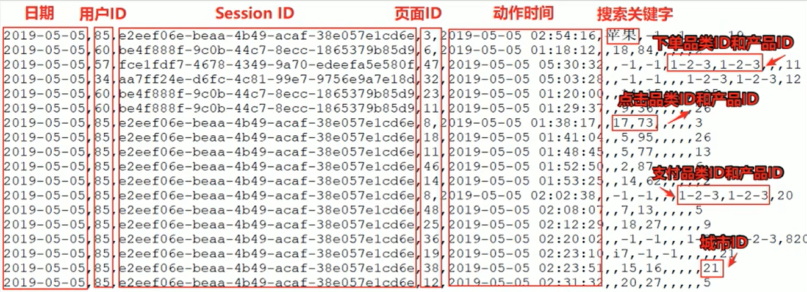
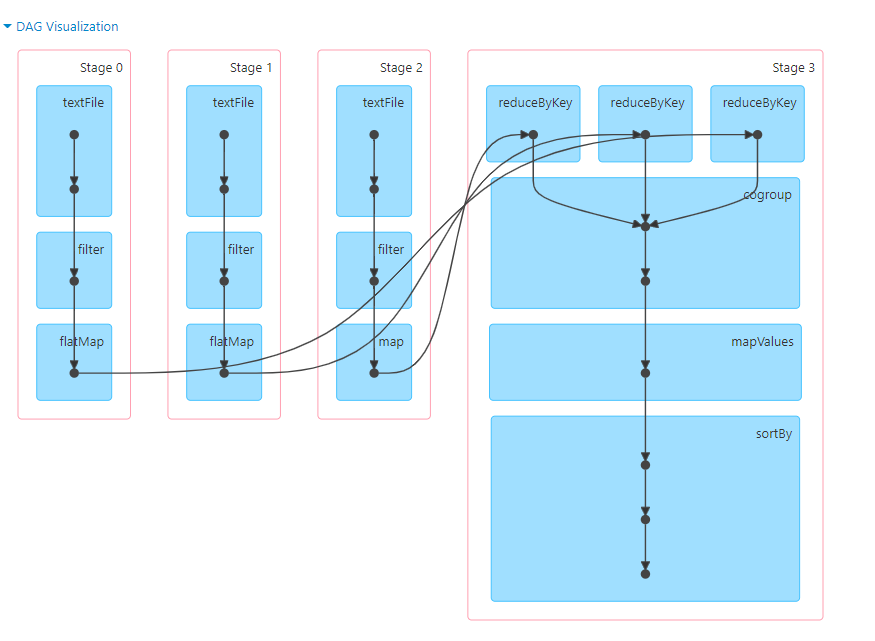
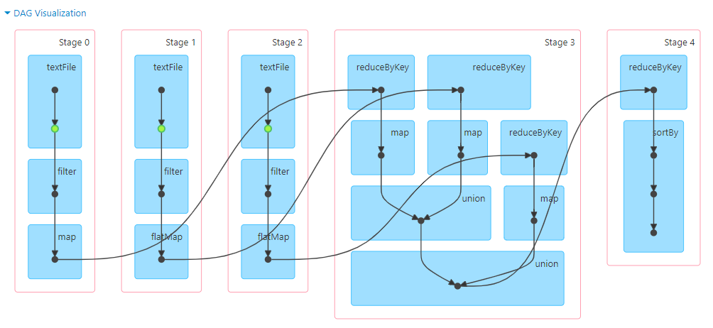
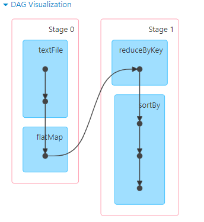
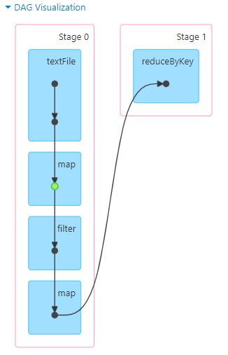
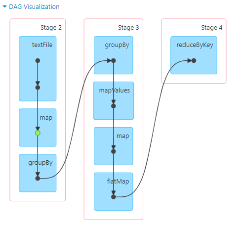
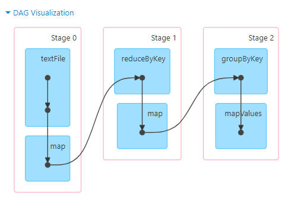
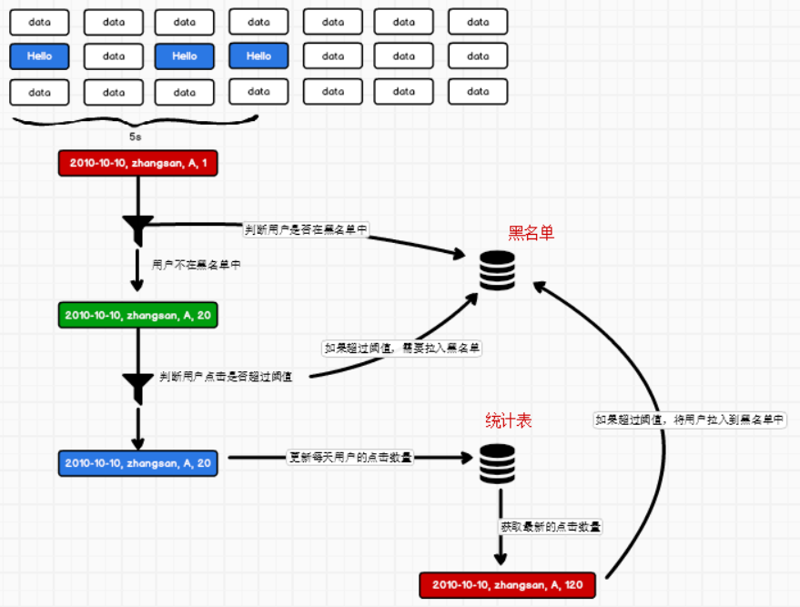
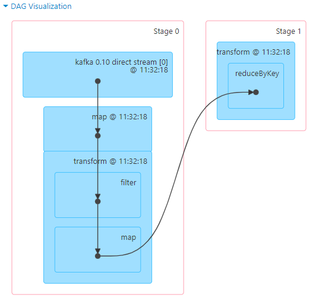

# 案例一

## 数据

日期，用户ID，Session ID，页面ID，动作时间，搜索关键字

主要包含用户的4种行为：搜索，点击，下单，支付。



数据规则如下：

- 数据文件由每行数据采用下划线分隔数据
- 每一行数据表示用户的一次行为，这个行为只能是4种行为中的一种
- 如果搜索关键字为null，表示数据不是走索数据
- 如果点击的品类ID和产品ID为-1，表示数据不是点击数据
- 针对于下单行为，一次可以下单多个商品，所以品类ID和产品ID可以是多个，ID之间采用逗号分隔，如果本次不是下单行为，则数据采用null表示
- 支付行为和下单行为类似

详细字段说明：

| 编号 | 字段名称           | 字段类型 | 字段含义                     |
| ---- | ------------------ | -------- | ---------------------------- |
| 1    | date               | String   | 用户点击行为的日期           |
| 2    | user_id            | Long     | 用户的ID                     |
| 3    | session_id         | String   | Session的ID                  |
| 4    | page_id            | Long     | 某个页面的ID                 |
| 5    | action_time        | String   | 动作的时间点                 |
| 6    | search_keyword     | String   | 用户搜索的关键词             |
| 7    | click_category_id  | Long     | 某一个商品品类的ID           |
| 8    | click_product_id   | Long     | 某一个商品的ID               |
| 9    | order_category_ids | String   | 一次订单中所有的品类的ID集合 |
| 10   | order_product_ids  | String   | 一次订单中所有的商品的ID集合 |
| 11   | pay_category_ids   | String   | 一次支付中所有的品类的ID集合 |
| 12   | pay_product_ids    | String   | 一次支付中所有的商品的ID集合 |
| 13   | city_id            | Long     | 城市ID                       |

## 需求一

Top10 热门品类


品类是指产品的分类，大型电商网站品类分多级，本案例中的品类只有一级。

我们按照每个品类的点击、下单、支付的量来统计热门品类。

例如，综合排名=点击数×20%+下单数×30%+支付数×50%

在本案例中，先按照点击数排名，靠前的就排名高，如果点击数相同，再比较下单数，下单数再相同，就比较支付数量。


## 实现

### 方式一

```scala
object Case01 {
  def main(args: Array[String]): Unit = {

    // TODO : Top10热门品类
    val sparConf = new SparkConf().setMaster("local[*]").setAppName("HotCategoryTop10Analysis")
    val sc = new SparkContext(sparConf)

    // 1. 读取原始日志数据
    val actionRDD = sc.textFile("Spark/src/main/resources/user_visit_action.txt")

    // 2. 统计品类的点击数量：（品类ID，点击数量）
    val clickActionRDD = actionRDD.filter(
      action => {
        val datas = action.split("_")
        datas(6) != "-1"
      }
    )

    val clickCountRDD: RDD[(String, Int)] = clickActionRDD.map(
      action => {
        val datas = action.split("_")
        (datas(6), 1)
      }
    ).reduceByKey(_ + _)

    // 3. 统计品类的下单数量：（品类ID，下单数量）
    val orderActionRDD = actionRDD.filter(
      action => {
        val datas = action.split("_")
        datas(8) != "null"
      }
    )

    // orderid => 1,2,3
    // 【(1,1)，(2,1)，(3,1)】
    val orderCountRDD = orderActionRDD.flatMap(
      action => {
        val datas = action.split("_")
        val cid = datas(8)
        val cids = cid.split(",")
        cids.map(id => (id, 1))
      }
    ).reduceByKey(_ + _)

    // 4. 统计品类的支付数量：（品类ID，支付数量）
    val payActionRDD = actionRDD.filter(
      action => {
        val datas = action.split("_")
        datas(10) != "null"
      }
    )

    // orderid => 1,2,3
    // 【(1,1)，(2,1)，(3,1)】
    val payCountRDD = payActionRDD.flatMap(
      action => {
        val datas = action.split("_")
        val cid = datas(10)
        val cids = cid.split(",")
        cids.map(id => (id, 1))
      }
    ).reduceByKey(_ + _)

    // 5. 将品类进行排序，并且取前10名
    //    点击数量排序，下单数量排序，支付数量排序
    //    元组排序：先比较第一个，再比较第二个，再比较第三个，依此类推
    //    ( 品类ID, ( 点击数量, 下单数量, 支付数量 ) )
    //
    //  cogroup = connect + group
    val cogroupRDD: RDD[(String, (Iterable[Int], Iterable[Int], Iterable[Int]))] =
    clickCountRDD.cogroup(orderCountRDD, payCountRDD)
    val analysisRDD = cogroupRDD.mapValues {
      case (clickIter, orderIter, payIter) => {

        var clickCnt = 0
        val iter1 = clickIter.iterator
        if (iter1.hasNext) {
          clickCnt = iter1.next()
        }
        var orderCnt = 0
        val iter2 = orderIter.iterator
        if (iter2.hasNext) {
          orderCnt = iter2.next()
        }
        var payCnt = 0
        val iter3 = payIter.iterator
        if (iter3.hasNext) {
          payCnt = iter3.next()
        }

        (clickCnt, orderCnt, payCnt)
      }
    }

    val resultRDD = analysisRDD.sortBy(_._2, false).take(10)

    // 6. 将结果采集到控制台打印出来
    resultRDD.foreach(println)

    Thread.sleep(500000)

    sc.stop()
  }
}
```




### 方式二

```scala
object Case01_2 {
  def main(args: Array[String]): Unit = {

    // TODO : Top10热门品类
    val sparConf = new SparkConf().setMaster("local[*]").setAppName("HotCategoryTop10Analysis")
    val sc = new SparkContext(sparConf)

    // Q : actionRDD重复使用
    // Q : cogroup性能可能较低(可能存在shuffle）

    // 1. 读取原始日志数据
    val actionRDD = sc.textFile("Spark/src/main/resources/user_visit_action.txt")
    actionRDD.cache()

    // 2. 统计品类的点击数量：（品类ID，点击数量）
    val clickActionRDD = actionRDD.filter(
      action => {
        val datas = action.split("_")
        datas(6) != "-1"
      }
    )

    val clickCountRDD: RDD[(String, Int)] = clickActionRDD.map(
      action => {
        val datas = action.split("_")
        (datas(6), 1)
      }
    ).reduceByKey(_ + _)

    // 3. 统计品类的下单数量：（品类ID，下单数量）
    val orderActionRDD = actionRDD.filter(
      action => {
        val datas = action.split("_")
        datas(8) != "null"
      }
    )

    // orderid => 1,2,3
    // 【(1,1)，(2,1)，(3,1)】
    val orderCountRDD = orderActionRDD.flatMap(
      action => {
        val datas = action.split("_")
        val cid = datas(8)
        val cids = cid.split(",")
        cids.map(id=>(id, 1))
      }
    ).reduceByKey(_+_)

    // 4. 统计品类的支付数量：（品类ID，支付数量）
    val payActionRDD = actionRDD.filter(
      action => {
        val datas = action.split("_")
        datas(10) != "null"
      }
    )

    // orderid => 1,2,3
    // 【(1,1)，(2,1)，(3,1)】
    val payCountRDD = payActionRDD.flatMap(
      action => {
        val datas = action.split("_")
        val cid = datas(10)
        val cids = cid.split(",")
        cids.map(id=>(id, 1))
      }
    ).reduceByKey(_+_)

    // (品类ID, 点击数量) => (品类ID, (点击数量, 0, 0))
    // (品类ID, 下单数量) => (品类ID, (0, 下单数量, 0))
    //                    => (品类ID, (点击数量, 下单数量, 0))
    // (品类ID, 支付数量) => (品类ID, (0, 0, 支付数量))
    //                    => (品类ID, (点击数量, 下单数量, 支付数量))
    // ( 品类ID, ( 点击数量, 下单数量, 支付数量 ) )

    // 5. 将品类进行排序，并且取前10名
    //    点击数量排序，下单数量排序，支付数量排序
    //    元组排序：先比较第一个，再比较第二个，再比较第三个，依此类推
    //    ( 品类ID, ( 点击数量, 下单数量, 支付数量 ) )
    //
    val rdd1 = clickCountRDD.map{
      case ( cid, cnt ) => {
        (cid, (cnt, 0, 0))
      }
    }
    val rdd2 = orderCountRDD.map{
      case ( cid, cnt ) => {
        (cid, (0, cnt, 0))
      }
    }
    val rdd3 = payCountRDD.map{
      case ( cid, cnt ) => {
        (cid, (0, 0, cnt))
      }
    }

    // 将三个数据源合并在一起，统一进行聚合计算
    val soruceRDD: RDD[(String, (Int, Int, Int))] = rdd1.union(rdd2).union(rdd3)

    val analysisRDD = soruceRDD.reduceByKey(
      ( t1, t2 ) => {
        ( t1._1+t2._1, t1._2 + t2._2, t1._3 + t2._3 )
      }
    )

    val resultRDD = analysisRDD.sortBy(_._2, false).take(10)

    // 6. 将结果采集到控制台打印出来
    resultRDD.foreach(println)

    Thread.sleep(5000000)

    sc.stop()
  }
}
```




### 方式三

```scala
object Case01_3 {
  def main(args: Array[String]): Unit = {

    // TODO : Top10热门品类
    val sparConf = new SparkConf().setMaster("local[*]").setAppName("HotCategoryTop10Analysis")
    val sc = new SparkContext(sparConf)

    // Q : 存在大量的shuffle操作（reduceByKey）
    // reduceByKey 聚合算子，spark会提供优化，缓存

    // 1. 读取原始日志数据
    val actionRDD = sc.textFile("Spark/src/main/resources/user_visit_action.txt")

    // 2. 将数据转换结构
    //    点击的场合 : ( 品类ID，( 1, 0, 0 ) )
    //    下单的场合 : ( 品类ID，( 0, 1, 0 ) )
    //    支付的场合 : ( 品类ID，( 0, 0, 1 ) )
    val flatRDD: RDD[(String, (Int, Int, Int))] = actionRDD.flatMap(
      action => {
        val datas = action.split("_")
        if (datas(6) != "-1") {
          // 点击的场合
          List((datas(6), (1, 0, 0)))
        } else if (datas(8) != "null") {
          // 下单的场合
          val ids = datas(8).split(",")
          ids.map(id => (id, (0, 1, 0)))
        } else if (datas(10) != "null") {
          // 支付的场合
          val ids = datas(10).split(",")
          ids.map(id => (id, (0, 0, 1)))
        } else {
          Nil
        }
      }
    )

    // 3. 将相同的品类ID的数据进行分组聚合
    //    ( 品类ID，( 点击数量, 下单数量, 支付数量 ) )
    val analysisRDD = flatRDD.reduceByKey(
      (t1, t2) => {
        (t1._1 + t2._1, t1._2 + t2._2, t1._3 + t2._3)
      }
    )

    // 4. 将统计结果根据数量进行降序处理，取前10名
    val resultRDD = analysisRDD.sortBy(_._2, false).take(10)

    // 5. 将结果采集到控制台打印出来
    resultRDD.foreach(println)
    Thread.sleep(5000000)

    sc.stop()
  }
}
```




### 方式四

```scala
object Case01_4 {
  def main(args: Array[String]): Unit = {

    // TODO : Top10热门品类
    val sparConf = new SparkConf().setMaster("local[*]").setAppName("HotCategoryTop10Analysis")
    val sc = new SparkContext(sparConf)

    // 1. 读取原始日志数据
    val actionRDD = sc.textFile("Spark/src/main/resources/user_visit_action.txt")

    val acc = new HotCategoryAccumulator
    sc.register(acc, "hotCategory")

    // 2. 将数据转换结构
    actionRDD.foreach(
      action => {
        val datas = action.split("_")
        if (datas(6) != "-1") {
          // 点击的场合
          acc.add((datas(6), "click"))
        } else if (datas(8) != "null") {
          // 下单的场合
          val ids = datas(8).split(",")
          ids.foreach(
            id => {
              acc.add((id, "order"))
            }
          )
        } else if (datas(10) != "null") {
          // 支付的场合
          val ids = datas(10).split(",")
          ids.foreach(
            id => {
              acc.add((id, "pay"))
            }
          )
        }
      }
    )

    val accVal: mutable.Map[String, HotCategory] = acc.value
    val categories: mutable.Iterable[HotCategory] = accVal.map(_._2)

    val sort = categories.toList.sortWith(
      (left, right) => {
        if (left.clickCnt > right.clickCnt) {
          true
        } else if (left.clickCnt == right.clickCnt) {
          if (left.orderCnt > right.orderCnt) {
            true
          } else if (left.orderCnt == right.orderCnt) {
            left.payCnt > right.payCnt
          } else {
            false
          }
        } else {
          false
        }
      }
    )

    // 5. 将结果采集到控制台打印出来
    sort.take(10).foreach(println)
    Thread.sleep(5000000)
    sc.stop()
  }

  case class HotCategory(cid: String, var clickCnt: Int, var orderCnt: Int, var payCnt: Int)

  /**
   * 自定义累加器
   * 1. 继承AccumulatorV2，定义泛型
   * IN : ( 品类ID, 行为类型 )
   * OUT : mutable.Map[String, HotCategory]
   * 2. 重写方法（6）
   */
  class HotCategoryAccumulator extends AccumulatorV2[(String, String), mutable.Map[String, HotCategory]] {

    private val hcMap = mutable.Map[String, HotCategory]()

    override def isZero: Boolean = {
      hcMap.isEmpty
    }

    override def copy(): AccumulatorV2[(String, String), mutable.Map[String, HotCategory]] = {
      new HotCategoryAccumulator()
    }

    override def reset(): Unit = {
      hcMap.clear()
    }

    override def add(v: (String, String)): Unit = {
      val cid = v._1
      val actionType = v._2
      val category: HotCategory = hcMap.getOrElse(cid, HotCategory(cid, 0, 0, 0))
      if (actionType == "click") {
        category.clickCnt += 1
      } else if (actionType == "order") {
        category.orderCnt += 1
      } else if (actionType == "pay") {
        category.payCnt += 1
      }
      hcMap.update(cid, category)
    }

    override def merge(other: AccumulatorV2[(String, String), mutable.Map[String, HotCategory]]): Unit = {
      val map1 = this.hcMap
      val map2 = other.value

      map2.foreach {
        case (cid, hc) => {
          val category: HotCategory = map1.getOrElse(cid, HotCategory(cid, 0, 0, 0))
          category.clickCnt += hc.clickCnt
          category.orderCnt += hc.orderCnt
          category.payCnt += hc.payCnt
          map1.update(cid, category)
        }
      }
    }

    override def value: mutable.Map[String, HotCategory] = hcMap
  }
}
```

## 需求二

在需求一的基础上，增加每个品类用户session的点击统计

```scala
object Case02 {
  def main(args: Array[String]): Unit = {

    // TODO : Top10热门品类
    val sparConf = new SparkConf().setMaster("local[*]").setAppName("HotCategoryTop10Analysis")
    val sc = new SparkContext(sparConf)

    val actionRDD = sc.textFile("Spark/src/main/resources/user_visit_action.txt")
    actionRDD.cache()
    val top10Ids: Array[String] = top10Category(actionRDD)

    // 1. 过滤原始数据,保留点击和前10品类ID
    val filterActionRDD = actionRDD.filter(
      action => {
        val datas = action.split("_")
        if (datas(6) != "-1") {
          top10Ids.contains(datas(6))
        } else {
          false
        }
      }
    )

    // 2. 根据品类ID和sessionid进行点击量的统计
    val reduceRDD: RDD[((String, String), Int)] = filterActionRDD.map(
      action => {
        val datas = action.split("_")
        ((datas(6), datas(2)), 1)
      }
    ).reduceByKey(_ + _)

    // 3. 将统计的结果进行结构的转换
    //  (（ 品类ID，sessionId ）,sum) => ( 品类ID，（sessionId, sum） )
    val mapRDD = reduceRDD.map {
      case ((cid, sid), sum) => {
        (cid, (sid, sum))
      }
    }

    // 4. 相同的品类进行分组
    val groupRDD: RDD[(String, Iterable[(String, Int)])] = mapRDD.groupByKey()

    // 5. 将分组后的数据进行点击量的排序，取前10名
    val resultRDD = groupRDD.mapValues(
      iter => {
        iter.toList.sortBy(_._2)(Ordering.Int.reverse).take(10)
      }
    )

    resultRDD.collect().foreach(println)

    Thread.sleep(5000000)

    sc.stop()
  }

  def top10Category(actionRDD: RDD[String]) = {
    val flatRDD: RDD[(String, (Int, Int, Int))] = actionRDD.flatMap(
      action => {
        val datas = action.split("_")
        if (datas(6) != "-1") {
          // 点击的场合
          List((datas(6), (1, 0, 0)))
        } else if (datas(8) != "null") {
          // 下单的场合
          val ids = datas(8).split(",")
          ids.map(id => (id, (0, 1, 0)))
        } else if (datas(10) != "null") {
          // 支付的场合
          val ids = datas(10).split(",")
          ids.map(id => (id, (0, 0, 1)))
        } else {
          Nil
        }
      }
    )

    val analysisRDD = flatRDD.reduceByKey(
      (t1, t2) => {
        (t1._1 + t2._1, t1._2 + t2._2, t1._3 + t2._3)
      }
    )

    analysisRDD.sortBy(_._2, false).take(10).map(_._1)
  }
}
```

# 案例二

计算页面单跳转换率。

比如一个用户在一次Session的过程中访问的页面路径3，5，7，9，10，21，那么页面3跳到页面5叫一次单挑，7到9也叫一次单跳，单跳转化率就是要统计页面点击的概率。

例：计算3-5的单跳转化率，先获取符合条件的Session对于页面3的访问次数（PV）为A，然后获取符合条件的Session中访问了页面3又紧接着访问了页面5的次数为B，那么B/A就是3-5的页面单跳转化率。

## 需求分析


## 实现

```scala
object Case03 {
  def main(args: Array[String]): Unit = {

    // TODO : Top10热门品类
    val sparConf = new SparkConf().setMaster("local[*]").setAppName("HotCategoryTop10Analysis")
    val sc = new SparkContext(sparConf)

    val actionRDD = sc.textFile("Spark/src/main/resources/user_visit_action.txt")

    val actionDataRDD = actionRDD.map(
      action => {
        val datas = action.split("_")
        UserVisitAction(
          datas(0),
          datas(1).toLong,
          datas(2),
          datas(3).toLong,
          datas(4),
          datas(5),
          datas(6).toLong,
          datas(7).toLong,
          datas(8),
          datas(9),
          datas(10),
          datas(11),
          datas(12).toLong
        )
      }
    )
    actionDataRDD.cache()

    // TODO 对指定的页面连续跳转进行统计
    // 1-2,2-3,3-4,4-5,5-6,6-7
    val ids = List[Long](1, 2, 3, 4, 5, 6, 7)
    val okflowIds: List[(Long, Long)] = ids.zip(ids.tail)

    // TODO 计算分母
    val pageidToCountMap: Map[Long, Long] = actionDataRDD.filter(
      action => {
        ids.init.contains(action.page_id)
      }
    ).map(
      action => {
        (action.page_id, 1L)
      }
    ).reduceByKey(_ + _).collect().toMap

    // TODO 计算分子

    // 根据session进行分组
    val sessionRDD: RDD[(String, Iterable[UserVisitAction])] = actionDataRDD.groupBy(_.session_id)

    // 分组后，根据访问时间进行排序（升序）
    val mvRDD: RDD[(String, List[((Long, Long), Int)])] = sessionRDD.mapValues(
      iter => {
        val sortList: List[UserVisitAction] = iter.toList.sortBy(_.action_time)

        // 【1，2，3，4】
        // 【1，2】，【2，3】，【3，4】
        // 【1-2，2-3，3-4】
        // Sliding : 滑窗
        // 【1，2，3，4】
        // 【2，3，4】
        // zip : 拉链
        val flowIds: List[Long] = sortList.map(_.page_id)
        val pageflowIds: List[(Long, Long)] = flowIds.zip(flowIds.tail)

        // 将不合法的页面跳转进行过滤
        pageflowIds.filter(
          t => {
            okflowIds.contains(t)
          }
        ).map(
          t => {
            (t, 1)
          }
        )
      }
    )
    // ((1,2),1)
    val flatRDD: RDD[((Long, Long), Int)] = mvRDD.map(_._2).flatMap(list => list)
    // ((1,2),1) => ((1,2),sum)
    val dataRDD = flatRDD.reduceByKey(_ + _)

    // TODO 计算单跳转换率
    // 分子除以分母
    dataRDD.foreach {
      case ((pageid1, pageid2), sum) => {
        val lon: Long = pageidToCountMap.getOrElse(pageid1, 0L)

        println(s"页面${pageid1}跳转到页面${pageid2}单跳转换率为:" + (sum.toDouble / lon))
      }
    }


    Thread.sleep(5000000)

    sc.stop()
  }

  //用户访问动作表
  case class UserVisitAction(
                              date: String, //用户点击行为的日期
                              user_id: Long, //用户的ID
                              session_id: String, //Session的ID
                              page_id: Long, //某个页面的ID
                              action_time: String, //动作的时间点
                              search_keyword: String, //用户搜索的关键词
                              click_category_id: Long, //某一个商品品类的ID
                              click_product_id: Long, //某一个商品的ID
                              order_category_ids: String, //一次订单中所有品类的ID集合
                              order_product_ids: String, //一次订单中所有商品的ID集合
                              pay_category_ids: String, //一次支付中所有品类的ID集合
                              pay_product_ids: String, //一次支付中所有商品的ID集合
                              city_id: Long
                            ) //城市 id
}
```





# 案例三

## 数据准备

agent.log：时间戳，省份，城市，用户，广告，中间字段使用空格分隔

## 需求描述

需求：统计出每一个省份中被点击数量排行的Top3的广告

## 实现

```scala
object Case {
  def main(args: Array[String]): Unit = {
    val sparkConf = new SparkConf().setMaster("local").setAppName("Operator")
    val sparkContext = new SparkContext(sparkConf)
    
    //1.获取原始数据：时间戳，省份，城市，用户，广告
    val dataRDD: RDD[String] = sparkContext.textFile("Spark/src/main/resources/agent.log")
    //2.将原始数据进行结构的转换。方便统计
    //时间戳，省份，城市，用户，广告 =》 （（省份，广告），1）
    val mapRDD: RDD[((String, String), Int)] = dataRDD.map(
      line => {
        val datas: Array[String] = line.split(" ")
        ((datas(1), datas(4)), 1)
      }
    )
    //3.将转换结构后的数据进行分组聚合
    //（（省份，广告），1）=》（（省份，广告），sum）
    val reduceRDD: RDD[((String, String), Int)] = mapRDD.reduceByKey(_ + _)
    //4.将聚合的结果进行结构的转换
    //（（省份，广告），sum）=》（省份，（广告，sum））
    val mapRDD1: RDD[(String, (String, Int))] = reduceRDD.map {
      case ((prv, ad), sum) => {
        (prv, (ad, sum))
      }
    }
    //5.将转换结构后的数据根据省份进行分组
    //（省份，【（广告A，sumA）,（广告B，sumB）,（广告C，sumC）】）
    val groupRDD: RDD[(String, Iterable[(String, Int)])] = mapRDD1.groupByKey()
    //6.将分组后的数据进行组内排序（降序），取前三名
    val resultRDD: RDD[(String, List[(String, Int)])] = groupRDD.mapValues(
      iter => {
        iter.toList.sortBy(_._2)(Ordering.Int.reverse).take(3)
      }
    )
    //7.采集数据打印在控制台
    resultRDD.collect().foreach(println)
    
    sparkContext.stop()
  }
}
```



# 案例四

## 数据准备

利用程序模拟实时数据

```scala
object MockData {
  def main(args: Array[String]): Unit = {

    // 生成模拟数据
    // 格式 ：timestamp area city userid adid
    // 含义： 时间戳   区域  城市 用户 广告

    // Application => Kafka => SparkStreaming => Analysis
    val prop = new Properties()
    // 添加配置
    prop.put(ProducerConfig.BOOTSTRAP_SERVERS_CONFIG, "172.22.5.12:9092")
    prop.put(ProducerConfig.KEY_SERIALIZER_CLASS_CONFIG, "org.apache.kafka.common.serialization.StringSerializer")
    prop.put(ProducerConfig.VALUE_SERIALIZER_CLASS_CONFIG, "org.apache.kafka.common.serialization.StringSerializer")
    val producer = new KafkaProducer[String, String](prop)

    while (true) {

      mockdata().foreach(
        data => {
          // 向Kafka中生成数据
          val record = new ProducerRecord[String, String]("case04", data)
          producer.send(record)
          println(data)
        }
      )
      Thread.sleep(2000)
    }
  }

  def mockdata() = {
    val list = ListBuffer[String]()
    val areaList = ListBuffer[String]("华北", "华东", "华南")
    val cityList = ListBuffer[String]("北京", "上海", "深圳")

    for (i <- 1 to new Random().nextInt(50)) {

      val area = areaList(new Random().nextInt(3))
      val city = cityList(new Random().nextInt(3))
      var userid = new Random().nextInt(6) + 1
      var adid = new Random().nextInt(6) + 1

      list.append(s"${System.currentTimeMillis()} ${area} ${city} ${userid} ${adid}")
    }
    list
  }
}
```

## 需求一


创建表

存放黑名单用户的表

```sql
create table black_list (userid char(1) primary key);
```

存放单日各用户点击每个广告的次数

```sql
create table user_ad_count(
	dt varchar(255),
    userid char(1),
    adid char(1),
    count bigint,
    primary key (dt,userid,adid)
);
```


### 需求分析

实现实时的动态黑名单机制：将每天对某个广告点击超过100次的用户拉黑。

将黑名单保存到MySQL

思路分析：

1. 读取kafka数据之后，对MySQL中存储的黑名单数据做校验
2. 校验通过则对给用户点击广告次数累加一并存入MySQL
3. 在存入MySQL之后对数据做校验，如果单日超过100次则将该用户加入黑名单



### 实现

```scala
object Case04 {
  def main(args: Array[String]): Unit = {

    val sparkConf = new SparkConf().setMaster("local[*]").setAppName("SparkStreaming")
    val ssc = new StreamingContext(sparkConf, Seconds(3))

    val kafkaPara: Map[String, Object] = Map[String, Object](
      ConsumerConfig.BOOTSTRAP_SERVERS_CONFIG -> "172.22.5.12:9092",
      ConsumerConfig.GROUP_ID_CONFIG -> "case",
      "key.deserializer" -> "org.apache.kafka.common.serialization.StringDeserializer",
      "value.deserializer" -> "org.apache.kafka.common.serialization.StringDeserializer"
    )

    val kafkaDataDS: InputDStream[ConsumerRecord[String, String]] = KafkaUtils.createDirectStream[String, String](
      ssc,
      LocationStrategies.PreferConsistent,
      ConsumerStrategies.Subscribe[String, String](Set("case04"), kafkaPara)
    )
    val adClickData = kafkaDataDS.map(
      kafkaData => {
        val data = kafkaData.value()
        val datas = data.split(" ")
        AdClickData(datas(0),datas(1),datas(2),datas(3),datas(4))
      }
    )

    val ds = adClickData.transform(
      rdd => {
        // TODO 通过JDBC周期性获取黑名单数据
        val blackList = ListBuffer[String]()

        val conn = JDBCUtil.getConnection
        val pstat = conn.prepareStatement("select userid from black_list")

        val rs: ResultSet = pstat.executeQuery()
        while ( rs.next() ) {
          blackList.append(rs.getString(1))
        }

        rs.close()
        pstat.close()
        conn.close()

        // TODO 判断点击用户是否在黑名单中
        val filterRDD = rdd.filter(
          data => {
            !blackList.contains(data.user)
          }
        )

        // TODO 如果用户不在黑名单中，那么进行统计数量（每个采集周期）
        filterRDD.map(
          data => {
            val sdf = new SimpleDateFormat("yyyy-MM-dd")
            val day = sdf.format(new java.util.Date( data.ts.toLong ))
            val user = data.user
            val ad = data.ad

            (( day, user, ad ), 1) // (word, count)
          }
        ).reduceByKey(_+_)
      }
    )

    ds.foreachRDD(
      rdd => {
        // rdd. foreach方法会每一条数据创建连接
        // foreach方法是RDD的算子，算子之外的代码是在Driver端执行，算子内的代码是在Executor端执行
        // 这样就会涉及闭包操作，Driver端的数据就需要传递到Executor端，需要将数据进行序列化
        // 数据库的连接对象是不能序列化的。

        // RDD提供了一个算子可以有效提升效率 : foreachPartition
        // 可以一个分区创建一个连接对象，这样可以大幅度减少连接对象的数量，提升效率
        rdd.foreachPartition(iter => {
          val conn = JDBCUtil.getConnection
          iter.foreach{
            case ( ( day, user, ad ), count ) => {

            }
          }
          conn.close()
        }
        )

        rdd.foreach{
          case ( ( day, user, ad ), count ) => {
            println(s"${day} ${user} ${ad} ${count}")
            if ( count >= 30 ) {
              // TODO 如果统计数量超过点击阈值(30)，那么将用户拉入到黑名单
              val conn = JDBCUtil.getConnection
              val sql = """
                          |insert into black_list (userid) values (?)
                          |on DUPLICATE KEY
                          |UPDATE userid = ?
                                      """.stripMargin
              JDBCUtil.executeUpdate(conn, sql, Array( user, user ))
              conn.close()
            } else {
              // TODO 如果没有超过阈值，那么需要将当天的广告点击数量进行更新。
              val conn = JDBCUtil.getConnection
              val sql = """
                          | select
                          |     *
                          | from user_ad_count
                          | where dt = ? and userid = ? and adid = ?
                                      """.stripMargin
              val flg = JDBCUtil.isExist(conn, sql, Array( day, user, ad ))

              // 查询统计表数据
              if ( flg ) {
                // 如果存在数据，那么更新
                val sql1 = """
                             | update user_ad_count
                             | set count = count + ?
                             | where dt = ? and userid = ? and adid = ?
                                           """.stripMargin
                JDBCUtil.executeUpdate(conn, sql1, Array(count, day, user, ad))
                // TODO 判断更新后的点击数据是否超过阈值，如果超过，那么将用户拉入到黑名单。
                val sql2 = """
                             |select
                             |    *
                             |from user_ad_count
                             |where dt = ? and userid = ? and adid = ? and count >= 30
                                           """.stripMargin
                val flg1 = JDBCUtil.isExist(conn, sql2, Array( day, user, ad ))
                if ( flg1 ) {
                  val sql3 = """
                               |insert into black_list (userid) values (?)
                               |on DUPLICATE KEY
                               |UPDATE userid = ?
                                              """.stripMargin
                  JDBCUtil.executeUpdate(conn, sql3, Array( user, user ))
                }
              } else {
                val sql4 = """
                             | insert into user_ad_count ( dt, userid, adid, count ) values ( ?, ?, ?, ? )
                                           """.stripMargin
                JDBCUtil.executeUpdate(conn, sql4, Array( day, user, ad, count ))
              }
              conn.close()
            }
          }
        }
      }
    )

    ssc.start()
    ssc.awaitTermination()
  }
  // 广告点击数据
  case class AdClickData( ts:String, area:String, city:String, user:String, ad:String )

}
```



## 需求二

### 需求分析

描述：实时统计每天各地区各城市各广告的点击总流量，并将其存入MySQL

思路分析：

1. 单个批次内对数据进行按照天维度的聚合统计
2. 集合MySQL数据跟当前批次数据更新原有的数据


```sql
CREATE TABLE `area_city_ad_count` (
  `dt` varchar(200) NOT NULL,
  `area` varchar(200) NOT NULL,
  `city` varchar(200) NOT NULL,
  `adid` varchar(200) NOT NULL,
  `count` bigint DEFAULT NULL,
  PRIMARY KEY (`dt`,`area`,`city`,`adid`)
) ENGINE=InnoDB DEFAULT CHARSET=utf8mb3;
```

### 实现

```scala
object Case04_2 {
  def main(args: Array[String]): Unit = {

    val sparkConf = new SparkConf().setMaster("local[*]").setAppName("SparkStreaming")
    val ssc = new StreamingContext(sparkConf, Seconds(3))

    val kafkaPara: Map[String, Object] = Map[String, Object](
      ConsumerConfig.BOOTSTRAP_SERVERS_CONFIG -> "172.22.5.12:9092",
      ConsumerConfig.GROUP_ID_CONFIG -> "case",
      "key.deserializer" -> "org.apache.kafka.common.serialization.StringDeserializer",
      "value.deserializer" -> "org.apache.kafka.common.serialization.StringDeserializer"
    )

    val kafkaDataDS: InputDStream[ConsumerRecord[String, String]] = KafkaUtils.createDirectStream[String, String](
      ssc,
      LocationStrategies.PreferConsistent,
      ConsumerStrategies.Subscribe[String, String](Set("case04"), kafkaPara)
    )
    val adClickData = kafkaDataDS.map(
      kafkaData => {
        val data = kafkaData.value()
        val datas = data.split(" ")
        AdClickData(datas(0),datas(1),datas(2),datas(3),datas(4))
      }
    )

    val reduceDS = adClickData.map(
      data => {
        val sdf = new SimpleDateFormat("yyyy-MM-dd")
        val day = sdf.format(new java.util.Date( data.ts.toLong ))
        val area = data.area
        val city = data.city
        val ad = data.ad

        ( ( day, area, city, ad ), 1 )
      }
    ).reduceByKey(_+_)

    reduceDS.foreachRDD(
      rdd => {
        rdd.foreachPartition(
          iter => {
            val conn = JDBCUtil.getConnection
            val pstat = conn.prepareStatement(
              """
                | insert into area_city_ad_count ( dt, area, city, adid, count )
                | values ( ?, ?, ?, ?, ? )
                | on DUPLICATE KEY
                | UPDATE count = count + ?
                            """.stripMargin)
            iter.foreach{
              case ( ( day, area, city, ad ), sum ) => {
                pstat.setString(1,day )
                pstat.setString(2,area )
                pstat.setString(3, city)
                pstat.setString(4, ad)
                pstat.setInt(5, sum)
                pstat.setInt(6,sum )
                pstat.executeUpdate()
              }
            }
            pstat.close()
            conn.close()
          }
        )
      }
    )


    ssc.start()
    ssc.awaitTermination()
  }
  // 广告点击数据
  case class AdClickData( ts:String, area:String, city:String, user:String, ad:String )
}

```

