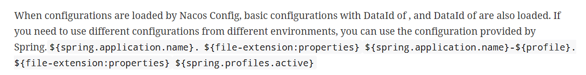

# SpringCloudAlibaba

官方文档（2.2.9RELEASE）：[Spring Cloud Alibaba Reference Documentation (spring-cloud-alibaba-group.github.io)](https://spring-cloud-alibaba-group.github.io/github-pages/hoxton/en-us/index.html)

## Nacos

##### 注册中心和配置中心

官网有完整的关于nacos注册中心和配置中心的相关示例，代码简单不做介绍。

> 注意：如果按照下面的方法搭建集群后，要注意修改server-addr的端口，由于nacos2.0的gRPC端口均通过主端口的偏移量计算产生，因此端口转发也需要满足该偏移量。
>
> 


> 注意yaml格式的配置文件命名要求
>
> 

##### 集群搭建

要求：一个nginx，三个nacos，一个mysql

使用docker进行集群环境搭建

###### Nacos

参照官方文档：https://nacos.io/zh-cn/docs/v2/quickstart/quick-start-docker.html

注意官方为docker compose提供的yaml文件中配置了mysql，直接使用会生成一个mysql容器，建议删除，手动初始化，数据库初始化所用的sql文件可以在nacos的github对应版本源码中找到，手动初始化后注意对配置文件进行修改。


这里使用的是cluster-hostname.yaml


> 修改后的nacos-hostname.env内容如下
>
> ```bash
> PREFER_HOST_MODE=hostname
> NACOS_SERVERS=nacos1:8848 nacos2:8848 nacos3:8848
> MYSQL_SERVICE_HOST=172.22.5.12
> MYSQL_SERVICE_DB_NAME=nacos_config
> MYSQL_SERVICE_PORT=3309
> MYSQL_SERVICE_USER=root
> MYSQL_SERVICE_PASSWORD=03283x
> MYSQL_SERVICE_DB_PARAM=characterEncoding=utf8&connectTimeout=1000&socketTimeout=3000&autoReconnect=true&useSSL=false&allowPublicKeyRetrieval=true
> ```
>
> 坑：原始文件中MYSQL_SERVICE_HOST=mysql是默认配置，这个mysql是默认生成的mysql容器的hostname，这里要修改成服务器的公网ip，否则会报错no datasource set，非常的折磨人，根本看不出怎么错的。
>
> 猜测原因是：我的mysql容器是之前就存在的，现在要配置的nacos容器和mysql容器不在一个网段，无法访问，所以设置成公网ip，如果是直接按照官网提供的yaml启动容器，不会有错误。


###### Nginx

```bash
# 生成容器
docker run --name nginx -p 9001:80 -d nginx
# 将容器nginx.conf文件复制到宿主机
docker cp nginx:/etc/nginx/nginx.conf /home/zwh/nginx/conf/nginx.conf
# 将容器conf.d文件夹下内容复制到宿主机
docker cp nginx:/etc/nginx/conf.d /home/zwh/nginx/conf/conf.d
# 将容器中的html文件夹复制到宿主机
docker cp nginx:/usr/share/nginx/html /home/zwh/nginx/
```

结束后删除容器

```bash
docker run \
--name zwh_nginx \
-p 9002:80 \
-p 9999:9999 \
-p 8999:8999 \
-v /home/zwh/nginx/conf/nginx.conf:/etc/nginx/nginx.conf \
-v /home/zwh/nginx/conf/conf.d:/etc/nginx/conf.d \
-v /home/zwh/nginx/log:/var/log/nginx \
-v /home/zwh/nginx/html:/usr/share/nginx/html \
-d nginx:1.22.1-perl
```

配置文件nginx.conf中添加以下内容

```bash
stream{
    upstream nacos-cluster-grpc{
        server 172.22.5.12:2111;
        server 172.22.5.12:3222;
        server 172.22.5.12:4333;
    }
    server{
        listen 9999;
        proxy_pass nacos-cluster-grpc;
    }
}
#对应的nacos集群启动配置，注意端口偏移量为1000
services:
  nacos1:
    hostname: nacos1
    container_name: zwh_nacos1
    image: nacos/nacos-server:${NACOS_VERSION}
    volumes:
      - ./cluster-logs/nacos1:/home/nacos/logs
    ports:
      - "1111:8848"
      - "2111:9848"
      - "9555:9555"
    env_file:
      - ../env/nacos-hostname.env
    restart: always
  nacos2:
    hostname: nacos2
    image: nacos/nacos-server:${NACOS_VERSION}
    container_name: zwh_nacos2
    volumes:
      - ./cluster-logs/nacos2:/home/nacos/logs
    ports:
      - "2222:8848"
      - "3222:9848"
    env_file:
      - ../env/nacos-hostname.env
    restart: always
  nacos3:
    hostname: nacos3
    image: nacos/nacos-server:${NACOS_VERSION}
    container_name: zwh_nacos3
    volumes:
      - ./cluster-logs/nacos3:/home/nacos/logs
    ports:
      - "3333:8848"
      - "4333:9848"
    env_file:
      - ../env/nacos-hostname.env
    restart: always
```

上面配置的是tcp请求

> [(33条消息) 记一次使用nacos2踩到的坑_nacos 9848_linyb极客之路的博客-CSDN博客](https://blog.csdn.net/kingwinstar/article/details/126409445)
>
> 此处有坑，nacos2.0增加了RPC通信，通信端口是根据主端口进行固定量的偏移产生的，详情见上面的博客。
>
> nginx端口转发也应该满足偏移量。
>
> 
>
> 官方文档说明：[Nacos 2.0.0 兼容性文档](https://nacos.io/zh-cn/docs/v2/upgrading/2.0.0-compatibility.html)

下面配置的是http请求

```bash
#添加内容
upstream nacosserver{
    server 172.22.5.12:1111;
    server 172.22.5.12:2222;
    server 172.22.5.12:3333;
}
server {
	listen 80;
	server_name localhost;
	#这里是添加的内容
    location /nacos/ {
        proxy_pass http://nacosserver/nacos/;
    }
}
```

注意更改配置文件后重新启动容器


# SpringCloudGateway

> Spring Cloud Gateway使用的Webflux中的reactor-netty响应式编程组件底层使用了Netty通讯框架。
>
> 基于异步非阻塞模型进行开发。
>
> Webflux文档见spring framework文档

工作流程：

客户端向Spring Cloud Gateway发出请求，然后在Gateway Handler Mapping中找到与请求相匹配的路由，将其发送到Gateway Web Handler。Handler通过指定的过滤器链来讲请求发送到我们实际的服务执行业务逻辑，然后返回。

过滤器可以在发送代理请求之前（“pre”）或者之后（“post”）执行业务逻辑。

“pre”类型的过滤器可以做参数校验，权限校验，流量监控，日志输出，协议转换等。

“post”类型的过滤器中可以做响应内容、响应头的修改，日志输出，流量监控等。

核心逻辑：路由转发+执行过滤器链

##### 动态路由


应用场景，一个服务有多个实例，如果在配置中将uri写死，将不能进行负载均衡，应使用如下配置方法


使用方法：

```
lb://服务名称
```

###### nacos

配合nacos实现动态路由，使用到nacos作为配置中心的功能


如果需要对路由配置进行修改，只要在nacos控制台修改发布即可。

##### 常用断言

官方文档：[Spring Cloud Gateway](https://docs.spring.io/spring-cloud-gateway/docs/3.0.8/reference/html/#gateway-request-predicates-factories)

##### 过滤器

官方文档：[Spring Cloud Gateway](https://docs.spring.io/spring-cloud-gateway/docs/3.0.8/reference/html/#gatewayfilter-factories)

- GatewayFilter Factories
- Global Filters

###### 自定义全局Global Filter

简单示例

```java
@Component
public class MyLogGatewayFilter implements GlobalFilter, Ordered {
    @Override
    public Mono<Void> filter(ServerWebExchange exchange, GatewayFilterChain chain) {
        String uname = exchange.getRequest().getQueryParams().getFirst("uname");
        if (uname == null) {
            System.out.println("请输入用户名");
            exchange.getResponse().setStatusCode(HttpStatus.NOT_ACCEPTABLE);
            return exchange.getResponse().setComplete();
        }
        return chain.filter(exchange);
    }

    @Override
    public int getOrder() {
        return 0;//配置过滤器优先顺序，越小越优先
    }
}
```

###### 网关鉴权

通过自定义过滤器进行实现，整体流程如下图所示，相比于上面的简单示例，实际应用中会在用户登录时生成token并存储在redis中间件中，用户后面的请求必须携带token进行验证，服务器从redis读取token进行校验，通过则继续过滤器链，否则报错。


