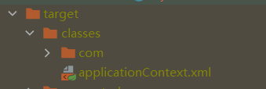

# IOC

## IOC原理

xml解析 -> 工厂模式 -> 反射

ioc容器底层就是对象工厂

Spring提供IOC容器的两种实现方式（两个接口）

- BeanFactory：IOC容器基本实现，加载配置文件的时候不会创建对象，在获取（使用）对象的时候才去创建对象
- ApplicationContext：BeanFactory的子接口，加载配置文件的时候就会创建对象


## Bean管理

bean管理指的是两个操作

- spring创建对象
- spring注入属性

bean管理操作有两种方式

- 基于xml配置文件方式
- 基于注解方式

### 基于xml方式

#### 创建对象


- id：唯一标识
- class：全路径名

创建对象的时候默认执行无参构造方法完成对象创建

#### 注入属性

DI：dependency injection，依赖注入，是IOC的一种实现方式

属性注入方法：

- 使用set方法进行注入


- 有参构造方法注入，要编写有参构造函数


- p空间注入，其实也是用set方法进行注入，可以在set方法上打断点进行观察，“q”是可以自定义的


#### 注入其他类型属性

> 字面量

##### 空值


##### 属性值包含特殊符号

> 把特殊字符进行转义

把特殊字符内容写到CDATA


##### 外部bean


##### 内部bean和级联赋值


##### 注入集合属性


```xml
    <util:list id="courseList">
        <value>数据结构</value>
        <value>算法设计与分析</value>
    </util:list>

    <bean id="stu" class="com.zhuweihao.SpringFramework.pojo.Stu">
        <property name="course" ref="courseList"/>
        <property name="score">
            <array>
                <value>12</value>
                <value>45</value>
            </array>
        </property>
        <property name="performance">
            <map>
                <entry key="JAVA" value="34"/>
                <entry key="C++" value="67"/>
            </map>
        </property>
        <property name="classmate">
            <set>
                <ref bean="user"/>
            </set>
        </property>
    </bean>
```

> 应用中可能有一部分是公用的，我们可以将其抽取出来，要在xml配置文件中添加下面的内容
>
> 

#### 工厂bean（FactoryBean）

> 普通bean：在配置文件中定义的bean类型就是返回类型
>
> 工厂bean：在配置文件中定义的bean类型可以和返回类型不一样

使用方法：

1. 创建类，实现接口FactoryBean
2. 实现接口里面的方法，在实现的方法中定义返回的bean类型

> 一般情况下，Spring通过反射机制利用<bean>的class属性指定实现类实例化Bean，在某些情况下，实例化Bean过程比较复杂，如果按照传统的方式，则需要在<bean>中提供大量的配置信息。配置方式的灵活性是受限的，这时采用编码的方式可能会得到一个简单的方案。Spring为此提供了一个org.springframework.bean.factory.FactoryBean的工厂类接口，用户可以通过实现该接口定制实例化Bean的逻辑。FactoryBean接口对于Spring框架来说占用重要的地位，Spring自身就提供了70多个FactoryBean的实现。它们隐藏了实例化一些复杂Bean的细节，给上层应用带来了便利。从Spring3.0开始，FactoryBean开始支持泛型，即接口声明改为FactoryBean<T>的形式

```java
public class myFactoryBean implements FactoryBean<Book> {

    //定义返回bean
    @Override
    public Book getObject() throws Exception {
        Book book = new Book("算法设计","张三");
        return book;
    }

    @Override
    public Class<?> getObjectType() {
        return null;
    }
}
```


#### Bean的作用域

在Spring中，可以设置创建的bean实例是单实例还是多实例，默认情况下创建的bean是一个单实例对象

使用<scope>标签进行配置，可取值：

- singleton，默认值，表示是单实例对象，在加载spring配置文件时就会创建对象
- prototype，表示是多实例对象，不会再加载配置文件时创建，在获取对象的时候才会创建


#### bean生命周期

1. 创建对象，注入属性
2. 调用初始化方法
3. 对象获取成功，可以使用
4. 销毁对象


一般的数据对象不需要额外的配置，但是一些资源服务对象有初始化和销毁的必要

###### bean的后置处理器

配置后置处理器的方法：实现接口BeanPostProcessor

```java
public class myBeanPostProcessor implements BeanPostProcessor {
    @Override
    public Object postProcessBeforeInitialization(Object bean, String beanName) throws BeansException {
        System.out.println("初始化之前执行的方法");
        return BeanPostProcessor.super.postProcessBeforeInitialization(bean, beanName);
    }

    @Override
    public Object postProcessAfterInitialization(Object bean, String beanName) throws BeansException {
        System.out.println("初始化之后执行的方法");
        return BeanPostProcessor.super.postProcessAfterInitialization(bean, beanName);
    }
}
```

**在applicationContext.xml配置bean后，所有的bean在被实例化的时候都会执行上面的方法**

#### 自动装配

上面通过property，value，ref等标签配置的方式指定属性值（不是String等普通属性）的方式为手动装配

自动装配：根据指定装配规则（属性名称或者属性类型），Spring自动将匹配的属性值注入。

- 根据属性名称
- 根据属性类型


#### 外部属性文件

示例：配置德鲁伊连接池


### 基于注解方式

#### 创建对象

要使用下面的注解，要开启组件扫描


```java
@Component(value = "fruitController")   //<bean id="fruitController" class="com.zhuweihao.SpringFramework.controller.FruitController"/>
@Controller //默认值是将类名称的首字母小写形式，这个注解和上面的效果相同
public class FruitController {
    public void test(){
        System.out.println("注解方式创建对象");
    }
}
```

测试方法：


> 下面的四个注解效果相同，但是为了代码可读性，不可混用

###### @Component

###### @Service

###### @Controller

###### @Repository

#### 注入属性


###### @Autowired

根据属性类型进行注入

当有多个相同类型的属性的时候，可以配合@Qualifier一起使用

###### @Qualifier

根据属性名称进行注入

###### @Resource

可以根据类型注入，也可以根据名称注入


注意这不是spring官方的注解

###### @Value

注入普通类型属性

可用于读取配置文件

#### 完全注解开发

创建配置类


测试类


# AOP

## 代理模式（Proxy）

### 基本介绍

代理模式：为一个对象提供一个替身，以控制对这个对象的访问。即通过代理对象访问目标对象，这样做的好处是，可以在目标对象实现的基础上，增强额外的功能操作，即扩展对象的功能。

被代理的对象可以是远程对象，创建开销大的对象或需要安全控制的对象

代理模式有不同的形式，主要有三种：

- 静态代理
- 动态代理（JDK代理、接口代理）
- CGLIB代理：可以在内存动态的创建对象，不需要实现接口，有些地方他把划作动态代理的范畴

### 静态代理

静态代理在使用时，需要定义接口或者父类，被代理对象与代理对象一起实现相同的接口或者继承相同的父类。


- 优点：在不修改目标对象的功能前提下，能通过代理对象对目标功能扩展
- 缺点：因为代理对象需要与目标对象实现一样的接口，所以会有很多代理类，一旦接口增加方法，目标对象与代理对象都需要维护

### 动态代理

代理对象不需要实现接口，但是目标对象要实现接口，否则不能用动态代理

代理对象的生成是利用JDK的API，动态的在内存中构建代理对象

动态代理也叫做：JDK代理，接口代理

JDK中生成代理对象的API：

- java.lang.reflect.Proxy：https://docs.oracle.com/javase/8/docs/api/index.html


```java
public class ProxyFactory {
    //维护一个目标对象
    private Object target;

    public ProxyFactory(Object target) {
        this.target = target;
    }

    //给目标对象生成一个代理对象
    public Object getProxyInstance(){

        /**
         *     public static Object newProxyInstance(ClassLoader loader,
         *                                           Class<?>[] interfaces,
         *                                           InvocationHandler h)
         *     1.ClassLoader loader:指定当前目标对象使用的类加载器，获取加载器的方法固定
         *     2.Class<?>[] interfaces：目标对象实现的接口类型，使用泛型方法确认类型
         *     3.InvocationHandler h：InvocationHandler是一个接口，h是他的匿名实现类。每个代理实例都有一个关联的调用处理程序。当我们通过动态代理对象调用一个方法时候，这个方法的调用就会被转发到实现InvocationHandler接口类的invoke方法来调用。
         */
        return Proxy.newProxyInstance(target.getClass().getClassLoader(),
                target.getClass().getInterfaces(),
                new InvocationHandler() {
                    /**
                     * proxy:代理类代理的真实代理对象com.sun.proxy.$Proxy0
                     * method:我们所要调用某个对象真实的方法的Method对象
                     * args:指代代理对象方法传递的参数
                     */
                    @Override
                    public Object invoke(Object proxy, Method method, Object[] args) throws Throwable {
                        System.out.println("JDK代理开始");
                        //通过反射机制调用目标对象的方法
                        Object invoke = method.invoke(target, args);
                        System.out.println("JDK代理提交");
                        return invoke;
                    }
                });
    }
}
```


测试方法：


> 需要追踪一下源码，好好理解

### CGLIB代理

静态代理和JDK代理模式都要求目标对象是实现一个接口，但是有时候目标对象只是一个单独的对象，并没有实现任何接口，这个时候可使用目标对象子类来实现代理，这就是CGLIB代理。

CGLIB代理也叫做子类代理，它是内存中构建一个子类对象从而实现对目标对象功能扩展，有些书也将CGLIB代理归属到动态代理。

CGLIB是一个强大的高性能的代码生成包，它可以在运行期扩展java类和实现Java接口，它广泛的被许多AOP框架使用，例如Spring AOP，实现方法拦截

在AOP编程中如何选择代理模式：

- 目标对象需要实现接口，用JDK代理
- 目标对象不需要实现接口，用CGLIB代理

CGLIB包的底层是通过使用字节码处理框架ASM来转换字节码并生成新的类

在内存中动态构建子类，注意代理的类不能为final

目标对象的方法如果为final/static，那么就不会被拦截，即不会执行目标对象额外的业务方法。

> CGLIB原理：动态生成一个要代理类的子类，子类重写要代理的类的所有不是final的方法。在子类中采用方法拦截的技术拦截所有父类方法的调用，顺势织入横切逻辑。它比使用java反射的JDK动态代理要快。
>
> CGLIB底层：使用字节码处理框架ASM，来转换字节码并生成新的类。不鼓励直接使用ASM，因为它要求你必须对JVM内部结构包括class文件的格式和指令集都很熟悉。
>
> CGLIB缺点：对于final方法，无法进行代理。


```java
public class ProxyFactory implements MethodInterceptor {

    /**
     * 维护一个目标对象
     */
    private Object target;

    /**
     * 构造器，传入一个被代理的对象
     */
    public ProxyFactory(Object target) {
        this.target = target;
    }

    /**
     * @return 返回一个代理对象，是target对象的代理对象
     */
    public Object getProxyInstance() {
        //1.创建一个工具类
        Enhancer enhancer = new Enhancer();
        //2.设置父类
        enhancer.setSuperclass(target.getClass());
        //3.设置回调函数
        enhancer.setCallback(this);
        //4.创建子类对象
        return enhancer.create();
    }

    /**
     * 重写intercept方法，拦截父类方法调用
     *
     * @param o
     * @param method
     * @param objects
     * @param methodProxy
     * @return
     * @throws Throwable
     */
    @Override
    public Object intercept(Object o, Method method, Object[] objects, MethodProxy methodProxy) throws Throwable {
        System.out.println("cglib代理模式开始");
        Object invoke = method.invoke(target, objects);
        System.out.println("cglib代理模式提交");
        return invoke;
    }
}
```


### 代理模式（Proxy）的变体

#### 防火墙代理

内网通过代理穿透防火墙，实现对公网的访问

#### 缓存代理

比如，当请求图片文件等资源时，先到缓存代理取，如果取到资源则结束，如果取不到资源再到公网或者数据库取，然后缓存

#### 远程代理

远程对象的本地代表，通过它可以把远程对象当本地对象来调用，远程代理通过网络和真正的远程对象沟通信息

#### 同步代理

主要使用在多线程编程中，完成多线程间同步工作

## 基本概念

参考博客：https://zhuanlan.zhihu.com/p/37497663，https://blog.csdn.net/jjclove/article/details/124386972

-----

AOP：Aspect Oriented Programming，面向切面编程

- AOP全称（Aspect Oriented Programming）面向切片编程的简称。AOP面向方面编程基于IOC，是对OOP的有益补充；
- AOP利用一种称为“横切”的技术，剖解开封装的对象内部，并将那些影响了 多个类的公共行为封装到一个可重用模块，并将其名为“Aspect”，即方面。所谓“方面”，简单地说，就是将那些与业务无关，却为业务模块所共同调用的 逻辑或责任封装起来，比如日志记录，便于减少系统的重复代码，降低模块间的耦合度，并有利于未来的可操作性和可维护性。
- 实现AOP的技术，主要分为两大类：一是采用动态代理技术，利用截取消息的方式，对该消息进行装饰，以取代原有对象行为的执行；二是采用静态织入的方式，引入特定的语法创建“方面”，从而使得编译器可以在编译期间织入有关“方面”的代码。
- Spring实现AOP：JDK动态代理和CGLIB代理。JDK动态代理：其代理对象必须是某个接口的实现，它是通过在运行期间创建一个接口的实现类来完成对目标对象的代理；其核心的两个类是InvocationHandler和Proxy。 CGLIB代理：实现原理类似于JDK动态代理，只是它在运行期间生成的代理对象是针对目标类扩展的子类。CGLIB是高效的代码生成包，底层是依靠ASM（开源的java字节码编辑类库）操作字节码实现的，性能比JDK强；需要引入包asm.jar和cglib.jar。使用AspectJ注入式切面和@AspectJ注解驱动的切面实际上底层也是通过动态代理实现的

> AspectJ不是Spring组成部分，是一个独立的AOP框架，在开发中配合起来使用进行AOP操作较为方便

**AOP的作用：**

1. 面向切面编程（AOP）提供另外一种角度来思考程序结构，通过这种方式弥补了面向对象编程（OOP）的不足。
2. 利用AOP对业务逻辑的各个部分进行隔离，降低业务逻辑的耦合性，提高程序的可重用型和开发效率。
3. 主要用于对同一对象层次的公用行为建模

-----------------


**这里先给出一个比较专业的概念定义**：

- `Aspect`（切面）： Aspect 声明类似于 Java 中的类声明，在 Aspect 中会包含着一些 Pointcut 以及相应的 Advice。**把增强应用到切入点的过程**
- `Joint point`（连接点）：表示在程序中明确定义的点，典型的包括方法调用，对类成员的访问以及异常处理程序块的执行等等，它自身还可以嵌套其它 joint point。**类里面哪些方法可以被增强，这些方法称为连接点**
- `Pointcut`（切点）：表示一组 joint point，这些 joint point 或是通过逻辑关系组合起来，或是通过通配、正则表达式等方式集中起来，它定义了相应的 Advice 将要发生的地方。**真正被增强的方法，称为切入点**
- `Advice`（增强）：Advice 定义了在 `Pointcut` 里面定义的程序点具体要做的操作，它通过 before、after 和 around 来区别是在每个 joint point 之前、之后还是代替执行的代码。
- `Target`（目标对象）：织入 `Advice` 的目标对象.。
- `Weaving`（织入）：将 `Aspect` 和其他对象连接起来, 并创建 `Advice` object 的过程

----------------


## 基于AspectJ实现AOP操作

- 基于xml配置文件实现
- 基于注解方式实现（常用）

切入点表达式

作用：知道对哪个类里面的哪个方法进行增强

语法结构：execution(\[权限修饰符][返回类型]\[带类全路径的方法名称](\[参数列表]))

#### 注解方式

```java
@Component
@Aspect
@Order(1)   //如果一个类有多个代理类，可以通过这个注解配置优先级，数字小的先执行
public class TeacherProxy {
    /**
     * 相同的切入点可以进行抽取
     */
    @Pointcut(value = "execution(* com.zhuweihao.SpringFramework.dao.impl.TeacherDaoImpl.teach(..))")
    public void pointCut(){}

    @Before(value = "pointCut()")
    public void before(){
        System.out.println("before.........");
    }
    @After(value = "pointCut()")
    public void after(){
        System.out.println("after..........");
    }
    @Around(value = "pointCut()")
    public void around(ProceedingJoinPoint proceedingJoinPoint) throws Throwable {
        System.out.println("环绕之前。。。。。");
        //被增强的方法执行
        proceedingJoinPoint.proceed();
        System.out.println("环绕之后。。。。。。");
        throw new Exception();
    }
    @AfterReturning(value = "pointCut()")
    public void afterReturning(){
        System.out.println("afterReturning.......");
    }
    @AfterThrowing(value = "pointCut()")
    public void afterThrowing(){
        System.out.println("afterThrowing.........");
    }
}
```

配置类需要添加注解


#### AspectJ配置文件


# JdbcTemplate

Spring框架对JDBC框架进行封装，方便实现对数据库的操作。


# 日志测试等功能


#### 整合JUnit5单元测试框架

##### JUnit4


注意点：

- locations为编译后路径
- 注意与后面的方法所导入的包不同

依赖引入：

```xml

        <dependency>
            <groupId>junit</groupId>
            <artifactId>junit</artifactId>
            <version>4.13.2</version>
            <scope>test</scope>
        </dependency>
```


##### 整合JUnit5


依赖包如下


```xml
        <dependency>
            <groupId>org.junit.jupiter</groupId>
            <artifactId>junit-jupiter-api</artifactId>
            <version>5.7.2</version>
            <scope>test</scope>
        </dependency>
```

