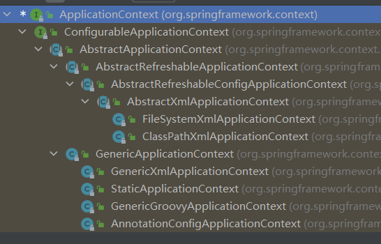
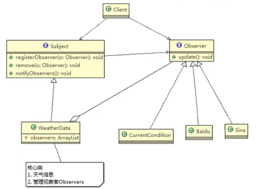
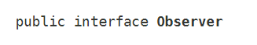
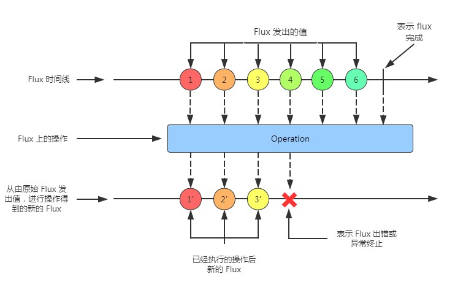
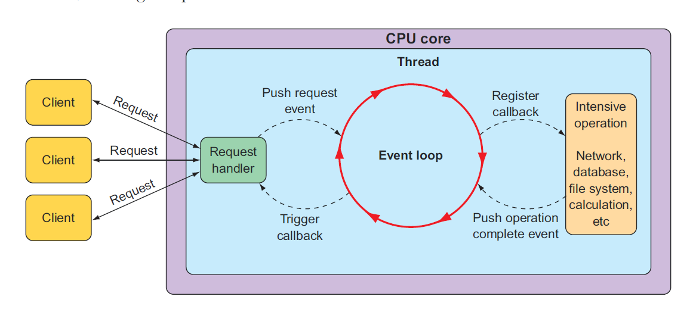
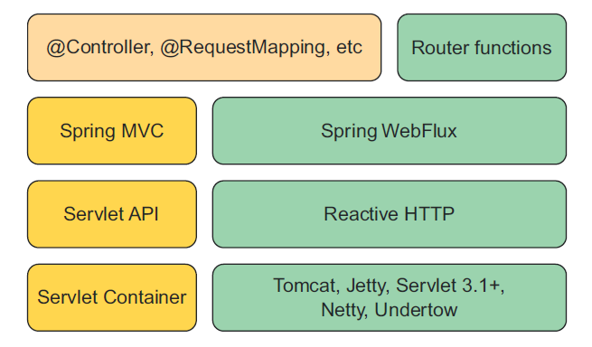

Spring实战（第五版）：https://ebook.qicoder.com/spring-in-action-5th/


# IOC

## IOC原理

xml解析 -> 工厂模式 -> 反射

ioc容器底层就是对象工厂

Spring提供IOC容器的两种实现方式（两个接口）

- BeanFactory：IOC容器基本实现，加载配置文件的时候不会创建对象，在获取（使用）对象的时候才去创建对象
- ApplicationContext：BeanFactory的子接口，加载配置文件的时候就会创建对象




## Bean管理

bean管理指的是两个操作

- spring创建对象
- spring注入属性

bean管理操作有两种方式

- 基于xml配置文件方式
- 基于注解方式

### 基于xml方式

#### 创建对象


- id：唯一标识
- class：全路径名

创建对象的时候默认执行无参构造方法完成对象创建

#### 注入属性

DI：dependency injection，依赖注入，是IOC的一种实现方式

属性注入方法：

- 使用set方法进行注入


- 有参构造方法注入，要编写有参构造函数


- p空间注入，其实也是用set方法进行注入，可以在set方法上打断点进行观察，“q”是可以自定义的


#### 注入其他类型属性

> 字面量

##### 空值


##### 属性值包含特殊符号

> 把特殊字符进行转义

把特殊字符内容写到CDATA


##### 外部bean


##### 内部bean和级联赋值


##### 注入集合属性


```xml
    <util:list id="courseList">
        <value>数据结构</value>
        <value>算法设计与分析</value>
    </util:list>

    <bean id="stu" class="com.zhuweihao.SpringFramework.pojo.Stu">
        <property name="course" ref="courseList"/>
        <property name="score">
            <array>
                <value>12</value>
                <value>45</value>
            </array>
        </property>
        <property name="performance">
            <map>
                <entry key="JAVA" value="34"/>
                <entry key="C++" value="67"/>
            </map>
        </property>
        <property name="classmate">
            <set>
                <ref bean="user"/>
            </set>
        </property>
    </bean>
```

> 应用中可能有一部分是公用的，我们可以将其抽取出来，要在xml配置文件中添加下面的内容
>
> 

#### 工厂bean（FactoryBean）

> 普通bean：在配置文件中定义的bean类型就是返回类型
>
> 工厂bean：在配置文件中定义的bean类型可以和返回类型不一样

使用方法：

1. 创建类，实现接口FactoryBean
2. 实现接口里面的方法，在实现的方法中定义返回的bean类型

> 一般情况下，Spring通过反射机制利用<bean>的class属性指定实现类实例化Bean，在某些情况下，实例化Bean过程比较复杂，如果按照传统的方式，则需要在<bean>中提供大量的配置信息。配置方式的灵活性是受限的，这时采用编码的方式可能会得到一个简单的方案。Spring为此提供了一个org.springframework.bean.factory.FactoryBean的工厂类接口，用户可以通过实现该接口定制实例化Bean的逻辑。FactoryBean接口对于Spring框架来说占用重要的地位，Spring自身就提供了70多个FactoryBean的实现。它们隐藏了实例化一些复杂Bean的细节，给上层应用带来了便利。从Spring3.0开始，FactoryBean开始支持泛型，即接口声明改为FactoryBean<T>的形式

```java
public class myFactoryBean implements FactoryBean<Book> {

    //定义返回bean
    @Override
    public Book getObject() throws Exception {
        Book book = new Book("算法设计","张三");
        return book;
    }

    @Override
    public Class<?> getObjectType() {
        return null;
    }
}
```


#### Bean的作用域

在Spring中，可以设置创建的bean实例是单实例还是多实例，默认情况下创建的bean是一个单实例对象

使用<scope>标签进行配置，可取值：

- singleton，默认值，表示是单实例对象，在加载spring配置文件时就会创建对象
- prototype，表示是多实例对象，不会再加载配置文件时创建，在获取对象的时候才会创建


#### bean生命周期

1. 创建对象，注入属性
2. 调用初始化方法
3. 对象获取成功，可以使用
4. 销毁对象


一般的数据对象不需要额外的配置，但是一些资源服务对象有初始化和销毁的必要

###### bean的后置处理器

配置后置处理器的方法：实现接口BeanPostProcessor

```java
public class myBeanPostProcessor implements BeanPostProcessor {
    @Override
    public Object postProcessBeforeInitialization(Object bean, String beanName) throws BeansException {
        System.out.println("初始化之前执行的方法");
        return BeanPostProcessor.super.postProcessBeforeInitialization(bean, beanName);
    }

    @Override
    public Object postProcessAfterInitialization(Object bean, String beanName) throws BeansException {
        System.out.println("初始化之后执行的方法");
        return BeanPostProcessor.super.postProcessAfterInitialization(bean, beanName);
    }
}
```

**在applicationContext.xml配置bean后，所有的bean在被实例化的时候都会执行上面的方法**

#### 自动装配

上面通过property，value，ref等标签配置的方式指定属性值（不是String等普通属性）的方式为手动装配

自动装配：根据指定装配规则（属性名称或者属性类型），Spring自动将匹配的属性值注入。

- 根据属性名称
- 根据属性类型


#### 外部属性文件

示例：配置德鲁伊连接池


### 基于注解方式

#### 创建对象

要使用下面的注解，要开启组件扫描


```java
@Component(value = "fruitController")   //<bean id="fruitController" class="com.zhuweihao.SpringFramework.controller.FruitController"/>
@Controller //默认值是将类名称的首字母小写形式，这个注解和上面的效果相同
public class FruitController {
    public void test(){
        System.out.println("注解方式创建对象");
    }
}
```

测试方法：


> 下面的四个注解效果相同，但是为了代码可读性，不可混用

###### @Component

###### @Service

###### @Controller

###### @Repository

#### 注入属性


###### @Autowired

根据属性类型进行注入

当有多个相同类型的属性的时候，可以配合@Qualifier一起使用

###### @Qualifier

根据属性名称进行注入

###### @Resource

可以根据类型注入，也可以根据名称注入


注意这不是spring官方的注解

###### @Value

注入普通类型属性

可用于读取配置文件

#### 完全注解开发

创建配置类


测试类


# AOP

## 代理模式（Proxy）

### 基本介绍

代理模式：为一个对象提供一个替身，以控制对这个对象的访问。即通过代理对象访问目标对象，这样做的好处是，可以在目标对象实现的基础上，增强额外的功能操作，即扩展对象的功能。

被代理的对象可以是远程对象，创建开销大的对象或需要安全控制的对象

代理模式有不同的形式，主要有三种：

- 静态代理
- 动态代理（JDK代理、接口代理）
- CGLIB代理：可以在内存动态的创建对象，不需要实现接口，有些地方他把划作动态代理的范畴

### 静态代理

静态代理在使用时，需要定义接口或者父类，被代理对象与代理对象一起实现相同的接口或者继承相同的父类。


- 优点：在不修改目标对象的功能前提下，能通过代理对象对目标功能扩展
- 缺点：因为代理对象需要与目标对象实现一样的接口，所以会有很多代理类，一旦接口增加方法，目标对象与代理对象都需要维护

### 动态代理

代理对象不需要实现接口，但是目标对象要实现接口，否则不能用动态代理

代理对象的生成是利用JDK的API，动态的在内存中构建代理对象

动态代理也叫做：JDK代理，接口代理

JDK中生成代理对象的API：

- java.lang.reflect.Proxy：https://docs.oracle.com/javase/8/docs/api/index.html


```java
public class ProxyFactory {
    //维护一个目标对象
    private Object target;

    public ProxyFactory(Object target) {
        this.target = target;
    }

    //给目标对象生成一个代理对象
    public Object getProxyInstance(){

        /**
         *     public static Object newProxyInstance(ClassLoader loader,
         *                                           Class<?>[] interfaces,
         *                                           InvocationHandler h)
         *     1.ClassLoader loader:指定当前目标对象使用的类加载器，获取加载器的方法固定
         *     2.Class<?>[] interfaces：目标对象实现的接口类型，使用泛型方法确认类型
         *     3.InvocationHandler h：InvocationHandler是一个接口，h是他的匿名实现类。每个代理实例都有一个关联的调用处理程序。当我们通过动态代理对象调用一个方法时候，这个方法的调用就会被转发到实现InvocationHandler接口类的invoke方法来调用。
         */
        return Proxy.newProxyInstance(target.getClass().getClassLoader(),
                target.getClass().getInterfaces(),
                new InvocationHandler() {
                    /**
                     * proxy:代理类代理的真实代理对象com.sun.proxy.$Proxy0
                     * method:我们所要调用某个对象真实的方法的Method对象
                     * args:指代代理对象方法传递的参数
                     */
                    @Override
                    public Object invoke(Object proxy, Method method, Object[] args) throws Throwable {
                        System.out.println("JDK代理开始");
                        //通过反射机制调用目标对象的方法
                        Object invoke = method.invoke(target, args);
                        System.out.println("JDK代理提交");
                        return invoke;
                    }
                });
    }
}
```


测试方法：


> 需要追踪一下源码，好好理解

### CGLIB代理

静态代理和JDK代理模式都要求目标对象是实现一个接口，但是有时候目标对象只是一个单独的对象，并没有实现任何接口，这个时候可使用目标对象子类来实现代理，这就是CGLIB代理。

CGLIB代理也叫做子类代理，它是内存中构建一个子类对象从而实现对目标对象功能扩展，有些书也将CGLIB代理归属到动态代理。

CGLIB是一个强大的高性能的代码生成包，它可以在运行期扩展java类和实现Java接口，它广泛的被许多AOP框架使用，例如Spring AOP，实现方法拦截

在AOP编程中如何选择代理模式：

- 目标对象需要实现接口，用JDK代理
- 目标对象不需要实现接口，用CGLIB代理

CGLIB包的底层是通过使用字节码处理框架ASM来转换字节码并生成新的类

在内存中动态构建子类，注意代理的类不能为final

目标对象的方法如果为final/static，那么就不会被拦截，即不会执行目标对象额外的业务方法。

> CGLIB原理：动态生成一个要代理类的子类，子类重写要代理的类的所有不是final的方法。在子类中采用方法拦截的技术拦截所有父类方法的调用，顺势织入横切逻辑。它比使用java反射的JDK动态代理要快。
>
> CGLIB底层：使用字节码处理框架ASM，来转换字节码并生成新的类。不鼓励直接使用ASM，因为它要求你必须对JVM内部结构包括class文件的格式和指令集都很熟悉。
>
> CGLIB缺点：对于final方法，无法进行代理。


```java
public class ProxyFactory implements MethodInterceptor {

    /**
     * 维护一个目标对象
     */
    private Object target;

    /**
     * 构造器，传入一个被代理的对象
     */
    public ProxyFactory(Object target) {
        this.target = target;
    }

    /**
     * @return 返回一个代理对象，是target对象的代理对象
     */
    public Object getProxyInstance() {
        //1.创建一个工具类
        Enhancer enhancer = new Enhancer();
        //2.设置父类
        enhancer.setSuperclass(target.getClass());
        //3.设置回调函数
        enhancer.setCallback(this);
        //4.创建子类对象
        return enhancer.create();
    }

    /**
     * 重写intercept方法，拦截父类方法调用
     *
     * @param o
     * @param method
     * @param objects
     * @param methodProxy
     * @return
     * @throws Throwable
     */
    @Override
    public Object intercept(Object o, Method method, Object[] objects, MethodProxy methodProxy) throws Throwable {
        System.out.println("cglib代理模式开始");
        Object invoke = method.invoke(target, objects);
        System.out.println("cglib代理模式提交");
        return invoke;
    }
}
```


### 代理模式（Proxy）的变体

#### 防火墙代理

内网通过代理穿透防火墙，实现对公网的访问

#### 缓存代理

比如，当请求图片文件等资源时，先到缓存代理取，如果取到资源则结束，如果取不到资源再到公网或者数据库取，然后缓存

#### 远程代理

远程对象的本地代表，通过它可以把远程对象当本地对象来调用，远程代理通过网络和真正的远程对象沟通信息

#### 同步代理

主要使用在多线程编程中，完成多线程间同步工作

## 基本概念

参考博客：https://zhuanlan.zhihu.com/p/37497663，https://blog.csdn.net/jjclove/article/details/124386972

-----

AOP：Aspect Oriented Programming，面向切面编程

- AOP全称（Aspect Oriented Programming）面向切片编程的简称。AOP面向方面编程基于IOC，是对OOP的有益补充；
- AOP利用一种称为“横切”的技术，剖解开封装的对象内部，并将那些影响了 多个类的公共行为封装到一个可重用模块，并将其名为“Aspect”，即方面。所谓“方面”，简单地说，就是将那些与业务无关，却为业务模块所共同调用的 逻辑或责任封装起来，比如日志记录，便于减少系统的重复代码，降低模块间的耦合度，并有利于未来的可操作性和可维护性。
- 实现AOP的技术，主要分为两大类：一是采用动态代理技术，利用截取消息的方式，对该消息进行装饰，以取代原有对象行为的执行；二是采用静态织入的方式，引入特定的语法创建“方面”，从而使得编译器可以在编译期间织入有关“方面”的代码。
- Spring实现AOP：JDK动态代理和CGLIB代理。JDK动态代理：其代理对象必须是某个接口的实现，它是通过在运行期间创建一个接口的实现类来完成对目标对象的代理；其核心的两个类是InvocationHandler和Proxy。 CGLIB代理：实现原理类似于JDK动态代理，只是它在运行期间生成的代理对象是针对目标类扩展的子类。CGLIB是高效的代码生成包，底层是依靠ASM（开源的java字节码编辑类库）操作字节码实现的，性能比JDK强；需要引入包asm.jar和cglib.jar。使用AspectJ注入式切面和@AspectJ注解驱动的切面实际上底层也是通过动态代理实现的

> AspectJ不是Spring组成部分，是一个独立的AOP框架，在开发中配合起来使用进行AOP操作较为方便

**AOP的作用：**

1. 面向切面编程（AOP）提供另外一种角度来思考程序结构，通过这种方式弥补了面向对象编程（OOP）的不足。
2. 利用AOP对业务逻辑的各个部分进行隔离，降低业务逻辑的耦合性，提高程序的可重用型和开发效率。
3. 主要用于对同一对象层次的公用行为建模

-----------------


**这里先给出一个比较专业的概念定义**：

- `Aspect`（切面）： Aspect 声明类似于 Java 中的类声明，在 Aspect 中会包含着一些 Pointcut 以及相应的 Advice。**把增强应用到切入点的过程**
- `Joint point`（连接点）：表示在程序中明确定义的点，典型的包括方法调用，对类成员的访问以及异常处理程序块的执行等等，它自身还可以嵌套其它 joint point。**类里面哪些方法可以被增强，这些方法称为连接点**
- `Pointcut`（切点）：表示一组 joint point，这些 joint point 或是通过逻辑关系组合起来，或是通过通配、正则表达式等方式集中起来，它定义了相应的 Advice 将要发生的地方。**真正被增强的方法，称为切入点**
- `Advice`（增强）：Advice 定义了在 `Pointcut` 里面定义的程序点具体要做的操作，它通过 before、after 和 around 来区别是在每个 joint point 之前、之后还是代替执行的代码。
- `Target`（目标对象）：织入 `Advice` 的目标对象.。
- `Weaving`（织入）：将 `Aspect` 和其他对象连接起来, 并创建 `Advice` object 的过程

----------------


## 基于AspectJ实现AOP操作

- 基于xml配置文件实现
- 基于注解方式实现（常用）

切入点表达式

作用：知道对哪个类里面的哪个方法进行增强

语法结构：execution(\[权限修饰符][返回类型]\[带类全路径的方法名称](\[参数列表]))

#### 注解方式

```java
@Component
@Aspect
@Order(1)   //如果一个类有多个代理类，可以通过这个注解配置优先级，数字小的先执行
public class TeacherProxy {
    /**
     * 相同的切入点可以进行抽取
     */
    @Pointcut(value = "execution(* com.zhuweihao.SpringFramework.dao.impl.TeacherDaoImpl.teach(..))")
    public void pointCut(){}

    @Before(value = "pointCut()")
    public void before(){
        System.out.println("before.........");
    }
    @After(value = "pointCut()")
    public void after(){
        System.out.println("after..........");
    }
    @Around(value = "pointCut()")
    public void around(ProceedingJoinPoint proceedingJoinPoint) throws Throwable {
        System.out.println("环绕之前。。。。。");
        //被增强的方法执行
        proceedingJoinPoint.proceed();
        System.out.println("环绕之后。。。。。。");
        throw new Exception();
    }
    @AfterReturning(value = "pointCut()")
    public void afterReturning(){
        System.out.println("afterReturning.......");
    }
    @AfterThrowing(value = "pointCut()")
    public void afterThrowing(){
        System.out.println("afterThrowing.........");
    }
}
```

配置类需要添加注解


#### AspectJ配置文件


# JdbcTemplate

Spring框架对JDBC框架进行封装，方便实现对数据库的操作。

```java
@Repository
public class FruitDaoImpl implements FruitDao {
    @Autowired
    private JdbcTemplate jdbcTemplate;

    @Override
    public Fruit selectById(Integer id) {
        String sql = "select * from Fruit where fid = ?";
        return jdbcTemplate.queryForObject(sql,new BeanPropertyRowMapper<>(Fruit.class),id);
    }

    @Override
    public void addFruit(Fruit fruit) {
        String sql="insert into Fruit(fname,price,fcount,remark) values(?,?,?,?)";
        jdbcTemplate.update(sql,fruit.getFname(),fruit.getFcount(),fruit.getPrice(),fruit.getRemark());
    }

    @Override
    public void deleteById(Integer id) {
        String sql="delete from Fruit where fid=?";
        jdbcTemplate.update(sql,id);
    }

    @Override
    public void updatePriceById(Integer id, Integer price) {
        String sql="update Fruit set price=? where fid=?";
        jdbcTemplate.update(sql,price,id);
    }

    @Override
    public void updateBatch(List<Object[]> bathgArgs) {
        String sql="update Fruit set price=? where fid=?";
        jdbcTemplate.batchUpdate(sql,bathgArgs);
    }
}
```

# 事务操作


事务是数据库操作最基本单元，逻辑上一组操作，要么都成功，如果有一个失败所有操作都失败。

典型示例：银行转账。

事务特性（ACID）：

- 原子性：**Atomicity**，原子性是指事务是一个不可分割的工作单位，事务中的操作要么都发生，要么都不发生。
- 一致性：**Consistency**，事务前后数据的完整性必须保持一致。
- 隔离性：**Isolation**，事务的隔离性是多个用户并发访问数据库时，数据库为每一个用户开启的事务，不能被其他事务的操作数据所干扰，多个并发事务之间要相互隔离。
- 持久性：**Durability**，持久性是指一个事务一旦被提交，它对数据库中数据的改变就是永久性的，接下来即使数据库发生故障也不应该对其有任何影响

在Spring进行声明式事务管理，底层使用到AOP原理

```java
@Service
public class BankServiceImpl implements BankService {
    @Resource
    private BankDao bankDao;

    @Override
    @Transactional  //这个注解可以添加到类上面，也可以添加到方法上面
    public void transferAccounts(String transferOutAccount, String transferInAccount, Integer transferAmount) {
        //手动实现事务管理
//        Integer outAccountBalance = bankDao.getAccountBalance(transferOutAccount);
//        if(outAccountBalance<transferAmount){
//            System.out.println("账号余额不足");
//        }else{
//            Integer inAccountBalance = bankDao.getAccountBalance(transferInAccount);
//            try{
//                //开启事务
//                //进行业务操作
//                bankDao.updateMoneyByAccount(transferOutAccount,outAccountBalance-transferAmount);
//                //模拟异常
//                int i=10/0;
//                bankDao.updateMoneyByAccount(transferInAccount,inAccountBalance+transferAmount);
//                //没有发生异常，提交事务
//            }catch (Exception e){
//                //出现异常，事务回滚
//            }
//        }

        //基于注解@Transcational
        Integer outAccountBalance = bankDao.getAccountBalance(transferOutAccount);
        if (outAccountBalance < transferAmount) {
            System.out.println("账号余额不足");
        } else {
            Integer inAccountBalance = bankDao.getAccountBalance(transferInAccount);
            bankDao.updateMoneyByAccount(transferOutAccount, outAccountBalance - transferAmount);
            //模拟异常
            int i = 10 / 0;
            bankDao.updateMoneyByAccount(transferInAccount, inAccountBalance + transferAmount);
        }
    }
}
```

#### 事务注解参数

##### 事务传播行为

参考博客：**https://blog.csdn.net/soonfly/article/details/70305683**


##### 隔离级别

事务的隔离性使得多事务操作之间不会产生影响。不考虑隔离性会产生很多问题

有三个问题：

- 脏读：一个未提交事务读取到另一个未提交事务的数据，这是相当危险的，因为很可能所有的操作都被回滚。
- 不可重复读：一个事务对同一行数据重复读取两次，但是却得到了不同的结果。比如事务T1读取某一数据后，事务T2对其做了修改，当事务T1再次读该数据时得到与前一次不同的值。又叫虚读。
- 虚（幻）读：事务在操作过程中进行两次查询，第二次查询的结果包含了第一次查询中未出现的数据或者缺少了第一次查询中出现的数据（这里并不要求两次查询的SQL语句相同）。这是因为在两次查询过程中有另外一个事务插入数据造成的。

“脏读”、“不可重复读”和“幻读”，其实都是数据库读一致性问题，必须由数据库提供一定的事务隔离机制来解决。

为了避免上面出现的几种情况，在标准SQL规范中，定义了4个事务隔离级别，由低到高依次为Read uncommitted、Read committed、Repeatable read、Serializable，这四个级别可以逐个解决脏读、不可重复读、幻读这几类问题。


未提交读取（Read Uncommitted）
Spring标识：ISOLATION_READ_UNCOMMITTED。允许脏读取，但不允许更新丢失。如果一个事务已经开始写数据，则另外一个事务则不允许同时进行写操作，但允许其他事务读此行数据。该隔离级别可以通过“排他写锁”实现。

已提交读取（Read Committed）
Spring标识：ISOLATION_READ_COMMITTED。允许不可重复读取，但不允许脏读取。这可以通过“瞬间共享读锁”和“排他写锁”实现。读取数据的事务允许其他事务继续访问该行数据，但是未提交的写事务将会禁止其他事务访问该行。

可重复读取（Repeatable Read）
Spring标识：ISOLATION_REPEATABLE_READ。禁止不可重复读取和脏读取，但是有时可能出现幻读数据。这可以通过“共享读锁”和“排他写锁”实现。读取数据的事务将会禁止写事务（但允许读事务），写事务则禁止任何其他事务。

序列化（Serializable）
Spring标识：ISOLATION_SERIALIZABLE。提供严格的事务隔离。它要求事务序列化执行，事务只能一个接着一个地执行，不能并发执行。仅仅通过“行级锁”是无法实现事务序列化的，必须通过其他机制保证新插入的数据不会被刚执行查询操作的事务访问到。

##### Timeout

事务需要在一定的时间内进行提交，如果规定时间内不提交就会进行回滚

默认值是-1，即不会超时

##### readOnly

readOnly默认值为false，表示可以查询，也可以添加修改删除操作

设置为true，则只可以进行查询操作

##### rollbackFor

设置出现哪些异常进行事务回滚

##### noRollbackFor

设置出现哪些异常不进行事务回滚

#### xml


# 整合日志框架

```xml
        <!-- 引入日志管理相关依赖-->
        <!--slf4j与log4j2实现所需要的日志依赖   start-->
        <dependency>
            <groupId>org.apache.logging.log4j</groupId>
            <artifactId>log4j-core</artifactId>
            <version>2.13.3</version>
        </dependency>
        <!--log4j-core中有log4j-api的依赖包 ,所以可以不添加og4j-api依赖-->
<!--        <dependency>-->
<!--            <groupId>org.apache.logging.log4j</groupId>-->
<!--            <artifactId>log4j-api</artifactId>-->
<!--            <version>2.13.3</version>-->
<!--        </dependency>-->
        <!--log4j2和slf4j的连接包 需要绑定到log4j2 core核心包上-->
        <dependency>
            <groupId>org.apache.logging.log4j</groupId>
            <artifactId>log4j-slf4j-impl</artifactId>
            <version>2.13.3</version>
        </dependency>
        <!--slf4j 日志门面-->
        <dependency>
            <groupId>org.slf4j</groupId>
            <artifactId>slf4j-api</artifactId>
            <version>1.7.30</version>
        </dependency>
```

# @Nullable注解

可以使用的位置：

- 方法上面：表示返回值可以为空
- 属性上面：表示属性值可以为空
- 参数上面：表示参数值可以为空

# 函数式风格GenericApplicationContext/AnnotationConfigApplicationContext

```java
public class testGenericApplicationContext {
    @Test
    public void test(){
        GenericApplicationContext genericApplicationContext = new GenericApplicationContext();
        genericApplicationContext.refresh();
        genericApplicationContext.registerBean("generic",TestGeneric.class,()-> {
            return new TestGeneric();
        });
        TestGeneric generic = (TestGeneric) genericApplicationContext.getBean("generic");
        System.out.println("generic = " + generic);
    }
}
```

# 整合JUnit5单元测试框架

##### JUnit4


注意点：

- locations为编译后路径
- 注意与后面的方法所导入的包不同

依赖引入：

```xml

        <dependency>
            <groupId>junit</groupId>
            <artifactId>junit</artifactId>
            <version>4.13.2</version>
            <scope>test</scope>
        </dependency>
```


##### 整合JUnit5


依赖包如下


```xml
        <dependency>
            <groupId>org.junit.jupiter</groupId>
            <artifactId>junit-jupiter-api</artifactId>
            <version>5.7.2</version>
            <scope>test</scope>
        </dependency>
```

# WebFlux

## 观察者模式

天气预报demo，传统方式

```java
//第三方
public class CurrentConditions {
    //温度，气压，湿度
    private float temperature;
    private float pressure;
    private float humidity;

    //weatherData调用
    public void update(float temperature,float pressure,float humidity){
        this.temperature=temperature;
        this.pressure=pressure;
        this.humidity=humidity;
        display();
    }

    private void display() {
        System.out.println("temperature = " + temperature);
        System.out.println("pressure = " + pressure);
        System.out.println("humidity = " + humidity);
    }
}
```


```java
//数据生产方
public class WeatherData {
    private float temperature;
    private float pressure;
    private float humidity;
    private CurrentConditions currentConditions;

    public WeatherData(CurrentConditions currentConditions) {
        this.currentConditions = currentConditions;
    }

    public float getTemperature() {
        return temperature;
    }

    public float getPressure() {
        return pressure;
    }

    public float getHumidity() {
        return humidity;
    }
    //调用接入方更新方法
    public void dataChange(){
        currentConditions.update(temperature,pressure,humidity);
    }
    //数据更新时进行调用
    public void setData(float temperature,float pressure,float humidity){
        this.temperature=temperature;
        this.pressure=pressure;
        this.humidity=humidity;
        //将最新消息推送给接入方currentConditions
        dataChange();
    }
}
```


缺点：

- 无法动态添加第三方
- 如果要添加第三方会违反ocp原则（开闭原则，对扩展开放，对修改关闭）

可以使用观察者模式进行改进

### 原理

观察者模式：对象之间是多对一依赖的一种设计方案，被依赖的对象为Subject，依赖的对象为Observer，Subject通知Observer变化，例如，在上面的例子中

气象局（数据生产方）：Subject

第三方（数据消费方）：Observer




```java
public class WeatherData implements Subject {
    private float temperature;
    private float pressure;
    private float humidity;
    private ArrayList<Observer> observers;

    public void setData(float temperature, float pressure, float humidity) {
        this.temperature = temperature;
        this.pressure = pressure;
        this.humidity = humidity;
        //将最新消息推送给接入方currentConditions
        notifyObservers();
    }

    public WeatherData() {
        observers = new ArrayList<Observer>();
    }

    @Override
    public void registerObserver(Observer o) {
        observers.add(o);
    }

    @Override
    public void removeObserver(Observer o) {
        observers.remove(o);
    }

    //遍历所有观察者，并遍历
    @Override
    public void notifyObservers() {
        for (int i = 0; i < observers.size(); i++) {
            observers.get(i).update(this.temperature, this.pressure, this.humidity);
        }
    }
}
```


```java

public class BaiduSite implements Observer{
    private float temperature;
    private float pressure;
    private float humidity;

    //weatherData调用
    @Override
    public void update(float temperature,float pressure,float humidity){
        this.temperature=temperature;
        this.pressure=pressure;
        this.humidity=humidity;
        display();
    }

    private void display() {
        System.out.println("baidu temperature = " + temperature);
        System.out.println("baidu pressure = " + pressure);
        System.out.println("baidu humidity = " + humidity);
    }
}
```

测试


### Observable

观察者模式在java中的应用：Observer，Observable

官方文档：

https://docs.oracle.com/javase/8/docs/api/java/util/Observer.html

https://docs.oracle.com/javase/8/docs/api/java/util/Observable.html

-------------




注意：

Observable是类，不是接口，类中已经实现了核心的方法，等价于前面说过的Subject

Oberver就是上面例子中的Observer


## 响应式编程

### 基本介绍

背景：响应式编程是一种新的编程技术，其目的是构建响应式系统。对于响应式系统而言，任何时候都需要确保具备即时响应性，这是大多数日常业务场景所需要的，但却是一项非常复杂而有挑战性的任务。
说明：所谓的“响应式”并不是一件颠覆式的事情，而只是一种新型的编程模式。它不局限于某种开发框架，也并非解决分布式环境下所有问题的银弹，而是随着技术的发展自然而然诞生的一种技术体系。

### 原因

#### 传统 Web 请求

在服务 A（服务消费者）调用服务 B（服务提供者）场景中，当服务 A 向服务 B 发送 HTTP 请求时，线程 A 只有在发起请求和响应结果的一小部分时间内在有效使用 CPU，而更多的时间则只是在 阻塞式 地等待来自服务 B 中线程的处理结果。显然，整个过程的 CPU 利用效率是很低的，很多时间线程被浪费在了 I/O 阻塞上，无法执行其他的处理过程，如下图所示：


同理，在一个服务内部（以经典的 Web 分层服务为例），也存在着这种阻塞的情况， Controller 层访问 Service 层，Service 层访问 Repository 数据层，数据层访问数据库，然后再依次返回。在这个过程中，每一步的操作过程都存在着前面描述的线程等待问题。也就是说，整个技术栈中的每一个环节都可能是同步阻塞的。

#### 处理方式

针对上面提到的阻塞问题，在 Java 中，为了实现异步非阻塞，常用的方式有两种：回调和 Future，但是这两种方式，都存在一些局限性。

> 回调
> 回调体现的是一种双向的调用方式，实现了服务间的解耦，服务调用方会提供一个 callback 回调方法。在这个 callback 回调方法中，回调的执行是由任务的结果（服务提供方）来触发的，所以我们就可以异步来执行某项任务，从而使得调用链路不发生任何的阻塞。
> 回调的最大问题是复杂性，一旦在执行流程中包含了多层的异步执行和回调，那么就会形成一种嵌套结构，给代码的开发和调试带来很大的挑战。所以回调很难大规模地组合起来使用，因为很快就会导致代码难以理解和维护，从而造成所谓的“回调地狱”问题。
>
> Future
> Future 模式简单理解为这样一种场景：我们有一个需要处理的任务，然后把这个任务提交到 Future，Future 就会在一定时间内完成这个任务，而在这段时间内我们可以去做其他事情。
> 但从本质上讲，Future 以及由 Future 所衍生出来的 CompletableFuture 等各种优化方案就是一种多线程技术。多线程假设一些线程可以共享一个 CPU，而 CPU 时间能在多个线程之间共享，这一点就引入了“上下文切换”的概念。
> 如果想要恢复线程，就需要涉及加载和保存寄存器等一系列计算密集型的操作。因此，大量线程之间的相互协作同样会导致资源利用效率低下。


### 响应式编程实现方法

#### 观察者模式和发布-订阅模式

了解响应式编程技术之前，我们先回顾一下两种设计模式：观察者模式和发布-订阅模式。

观察者模式
观察者模式拥有一个主题（Subject），其中包含其依赖者列表，这些依赖者被称为观察者（Observer）。主题可以通过一定的机制将任何状态变化通知到观察者。

发布-订阅模式

java9中新添加的类：https://docs.oracle.com/javase/9/docs/api/java/util/concurrent/Flow.html

发布-订阅模式，可以认为是对观察者模式的一种改进。因为观察者模式，容易和场景绑定（如：一个场景一个观察者模式），而发布-订阅模式具有更强的通用性。
在这一模式中，发布者和订阅者之间可以没有直接的交互，而是通过发送事件到事件处理平台的方式来完成整合，如下图所示：


了解了这两种模式，我们再来看有什么方式可以处理前面提到的阻塞问题？
如果将获取数据这件事情，通过发布订阅来实现，是不是就可以处理阻塞问题？在一个服务的内部，从 Web 服务层到数据访问层，再到数据库的整个调用链路，同样可以采用发布-订阅模式进行重构。这时候，我们希望当数据库中的数据一有变化（事件）就通知上游组件（通知机制），而不是上游组件通过主动拉取数据的方式来获取数据（阻塞）。

> 调用方不再阻塞等待，而是订阅事件，当事件发生变化的时候，调用方再来处理。


#### 数据流与响应式

基于上面的实现，那么在一个系统中，就会存在很多很多的 事件，每一种事件会基于用户的操作或者系统自身的行为而被触发，并形成了一个事件的集合。针对事件的集合，我们可以把它们看成是一串串联起来的数据流，而系统的响应能力就体现在对这些数据流的即时响应过程上。
数据流对于技术栈而言是一个全流程的概念。也就是说，无论是从底层数据库，向上到达服务层，最后到 Web 服务层，抑或是在这个流程中所包含的任意中间层组件，整个数据传递链路都应该是采用事件驱动的方式来进行运作的。
这样，我们就可以不采用传统的同步调用方式来处理数据，而是由处于数据库上游的各层组件自动来执行事件。这就是响应式编程的核心特点。
相较传统开发所普遍采用的“拉”模式，在响应式编程下，基于事件的触发和订阅机制，这就形成了一种类似“推”的工作方式。这种工作方式的优势就在于，生成事件和消费事件的过程是异步执行的，所以线程的生命周期都很短，也就意味着资源之间的竞争关系较少，服务器的响应能力也就越高。

### 背压机制

#### 基本概念

（1）流
所谓的流就是由生产者生产并由一个或多个消费者消费的元素序列。这种生产者/消费者模型也可以被称为发布者/订阅者模型。

（2）流的处理模型
流的处理，存在两种基本的实现机制：一种就是传统开发模式下的“拉”模式，即消费者主动从生产者拉取元素；而另一种就是上面提到的“推”模式。
在“推”模式下，生产者将元素推送给消费者。相较于“拉”模式，该模式下的数据处理的资源利用率更好。但是，这也引入了流量控制的问题，即如果数据的生产者和消费者处理数据的速度是不一致的，我们应该如何确保系统的稳定性呢？

#### 流量控制

（1）生产者生产数据的速率小于消费者的场景
在这种情况下，因为消费者消费数据没有任何压力，也就不需要进行流量的控制。

（2）生产者生产数据的速率大于消费者消费数据的场景
这种情况比较复杂，因为消费者可能因为无法处理过多的数据而发生崩溃。针对这种情况的一种常见解决方案是在生产者和消费者之间添加一种类似于消息队列的机制。我们知道队列具有存储并转发的功能，所以可以由它来进行一定的流量控制，效果如下图所示:


那么流量控制问题的关键就转变为了如何设计一种合适的队列？通常，我们可以选择三种不同类型的队列来分别支持不同的功能特性。

- 无界队列（Unbounded Queue）

  这种队列原则上拥有无限大小的容量，可以存放所有生产者所生产的消息；同样，因为无界，但系统资源确是有限的，容易出现内存耗尽情况，导致系统崩溃。

- 有界丢弃队列

  与无界队列相对的，更合适的方案是选择一种有界队列。它避免内存溢出的情况，但可能会出现消息丢失的情况，因此，它比较适合用于允许丢消息的业务场景，但在消息重要性很高的场景显然不可能采取这种队列。

- 有界阻塞队列

  如果需要确保消息不丢失，则需要引入有界阻塞队列。在这种队列中，我们会在队列消息数量达到上限后阻塞生产者，而不是直接丢弃消息。显然，这种阻塞行为是不可能实现异步操作的，即：有界阻塞队列都不是我们想要的解决方案。

#### 背压机制

通过对流量控制的分析，可以明确，纯“推”模式下的数据流量会有很多不可控制的因素，并不能直接应用，而是需要在“推”模式和“拉”模式之间考虑一定的平衡性，从而优雅地实现流量控制。这就需要引出响应式系统中非常重要的一个概念——背压机制（Backpressure）。
什么是背压？简单来说就是下游能够向上游反馈流量请求的机制。我们知道，如果消费者消费数据的速度赶不上生产者生产数据的速度时，它就会持续消耗系统的资源，直到这些资源被消耗殆尽。
这个时候，就需要有一种机制使得消费者可以根据自身当前的处理能力通知生产者来调整生产数据的速度，这种机制就是背压。采用背压机制，消费者会根据自身的处理能力来请求数据，而生产者也会根据消费者的能力来生产数据，从而在两者之间达成一种动态的平衡，确保系统的即时响应性。

#### 实现

为了实现这种动态的平衡，出现了一套响应式流规范，而针对流量控制的解决方案以及背压机制都包含在响应式流规范中，其中包含了响应式编程的各个核心组件。

### 响应式流规范

Reactive Streams 是 2013 年底由 Netflix、Lightbend 和 Pivotal（Spring 背后的公司）的工程师发起的一项计划。响应式流旨在为无阻塞异步流处理提供一个标准。

我们已经谈到了响应式编程的异步特性；它使我们能够并行执行任务以获得更大的可伸缩性。Backpressure（[如何形象的描述反应式编程中的背压(Backpressure)机制？](https://www.zhihu.com/question/49618581/answer/237078934) ）是一种手段，通过对用户愿意处理的数据量设定限制，数据消费者可以避免被生产速度过快的数据淹没。

> **Java Streams** 与 **Reactive Streams** 对比
>
> 在 Java 流和响应式流之间有很大的相似性。首先，它们的名字中都含有 Streams。它们也都为处理数据提供函数式接口。事实上，稍后当学到容器的时候，你会看到，其实它们有很多共同操作。
>
> 然而，Java 流通常是同步的，同时只能处理有限数据集。它们本质上是使用函数式进行集合迭代的一种手段。
>
> 响应式流支持任何大小的数据集，包括无限数据集的异步处理。它们使实时处理数据成为了可能。

响应式流的规范可以通过四个接口定义来概括：Publisher，Subscriber，Subscription 和 Processor。Publisher 为每一个 Subscription 的 Subscriber 生产数据。Publisher 接口声明了一个 subscribe() 方法，通过这个方法 Subscriber 可以订阅 Publisher：

```java
public interface Publisher<T> {
    void subscribe(Subscriber<? super T> subscriber);
}
Copy
```

Subscriber 一旦进行了订阅，就可以从 Publisher 中接收消息，这些消息都是通过 Subscriber 接口中的方法进行发送：

```java
public interface Subscriber<T> {
    void onSubscribe(Subscription sub);
    void onNext(T item);
    void onError(Throwable ex);
    void onComplete();
}
Copy
```

> Subscriber 接口包含了一组方法，这些方法构成了数据流请求和处理的基本流程。
> onSubscribe() 方法：
>
> 从命名上看就是一个回调方法，当发布者的 subscribe() 方法被调用时就会触发这个回调。而在该方法中有一个参数 Subscription，可以把这个 Subscription 看作是一种用于订阅的上下文对象。Subscription 对象中包含了这次回调中订阅者想要向发布者请求的数据个数。
>
> onNext() 方法：
>
> 当订阅关系已经建立，那么发布者就可以调用订阅者的 onNext() 方法向订阅者发送一个数据。这个过程是持续不断的，直到所发送的数据已经达到 Subscription 对象中所请求的数据个数。
>
> onComplete() 方法：
>
> 当所发送的数据已经达到 Subscription 对象中所请求的数据个数时，这时候 onComplete() 方法就会被触发，代表这个数据流已经全部发送结束。
>
> onError() 方法：
>
> 一旦在在数据流发送过程中出现了异常，那么就会触发 onError() 方法，我们可以通过这个方法捕获到具体的异常信息进行处理，而数据流也就自动终止了。

Subscriber 通过调用 onSubscribe() 函数将会收到第一个消息。当 Publisher 调用 onSubscribe()，它通过一个 Subscription 对象将消息传输给 Subscriber。消息是通过 Subscription 进行传递的，Subscriber 可以管理他自己的订阅内容：

```java
public interface Subscription {
    void request(long n);
    void cancel();
}
Copy
```

Subscriber 可以调用 request() 去请求被被发送了的数据，或者调用 cancel() 来表明他对接收的数据不感兴趣，并取消订阅。当调用 request() 时，Subscriber 通过传递一个 long 值的参数来表示它将会接收多少数据。这时就会引进 backpressure，用以阻止 Publisher 发送的数据超过 Subscriber 能够处理的数据。在 Publisher 发送了足够的被请求的数据后，Subscriber 可以再次调用 request() 来请求更多的数据。

一旦 Subcriber 已经接收到数据，数据就通过流开始流动了。每一个 Publisher 发布的项目都会通过调用 onNext() 方法将数据传输到 Subscriber。如果出现错误，onError() 方法将被调用。如果 Publisher 没有更多的数据需要发送了，同时也不会再生产任何数据了，将会调用 onComplete() 方法来告诉 Subscriber，它已经结束了。

对于 Processor 接口而言，它连接了 Subscriber 和 Publisher：

```java
public interface Processor<T, R> extends Subscriber<T>, Publisher<R> {}
Copy
```

作为 Subscriber，Processor 将会接收数据然后以一定的方式处理这些数据。然后它会摇身一变，变为一个 Publisher，将处理的结果发布到 Subscriber。

正如你所看到的，响应式流规范相当地简单。关于如何从 Publisher 开始建立起一个数据处理的通道，这也是一件很容易的事情了，通过将数据不输入或是输入到多个 Processor 中，然后将最终结果传递到 Subscriber 中就行了。

## Reactor

Reactor有两个核心类，Mono和Flux，这两个类实现接口Publisher，提供丰富操作符。Flux对象实现发布者，返回N个元素；Mono实现翻发布者，返回0或者1个元素。

Flux和Mono都是数据流的发布者，使用Flux和Mono都可以发出三种数据信号

- 元素值
- 错误信号
- 完成信号

错误信号和完成信号都代表终止信号，终止信号用于告诉订阅者数据流结束了，错误信号终止数据流的同时会把错误信息传递给订阅者

错误信号和完成信号不可以共存




#### 添加Reactor依赖

让我们开始使用 Reactor 吧，把一下依赖添加到项目构建中：

```xml
<dependency>
    <groupId>io.projectreactor</groupId>
    <artifactId>reactor-core</artifactId>
</dependency>
```

Reactor 还提供了测试支持。你会写在你的 Reactor 代码周围写很多的测试，所以你肯定会想把这个依赖添加到项目构建中：

```xml
<dependency>
    <groupId>io.projectreactor</groupId>
    <artifactId>reactor-test</artifactId>
    <scope>test</scope>
</dependency>
```

我假定你要向 Spring Boot 项目中添加这些依赖，它可以为你处理的依赖管理，所以没有必要指定依赖的 \<version> 元素。但是如果你想在非 Spring Boot 项目中使用 Reactor，那么你需要在构建中设置 Reactor 的 BOM（物料清单）。下面的依赖管理条目增加了 Reactor 的 Bismuth-RELEASE 到构建中：

```xml
<dependencyManagement>
    <dependencies>
        <dependency>
            <groupId>io.projectreactor</groupId>
            <artifactId>reactor-bom</artifactId>
            <version>Bismuth-RELEASE</version>
            <type>pom</type>
            <scope>import</scope>
        </dependency>
    </dependencies>
</dependencyManagement>
```

现在，Reactor 在你的项目构建中了，可以使用 Mono 和 Flux 开始创建响应式管道了。

#### 创建响应式类型

##### 从对象创建

如果想从 Flux 或是 Mono 创建一个或多个对象，可以 Flux 或 Mono 中的静态方法 just() 去创建一个响应式类型，其中的数据由这些对象驱动。例如，下面这个测试方法就是使用 5 个 String 对象来创建一个 Flux：

```java
@Test
public void createAFlux_just() {
    Flux<String> fruitFlux = Flux
        .just("Apple", "Orange", "Grape", "Banana", "Strawberry");
}
```

这样就创建了一个 Flux，但它没有订阅者。要是没有订阅者，数据不会流动。以花园软管的思路进行类比，你已经把软管接到出水口了，另一端就是从自来水公司流出的水。但是水不会流动，除非你打开水龙头。对响应式类型的订阅就是打开数据流的方式。

要添加一个订阅者，可以调用 Flux 中的 subscribe() 方法：

```java
fruitFlux.subscribe(
    f -> System.out.println("Here's some fruit: " + f);
);
```

subscribe() 中的 lambda 表达式实际上是 java.util.Consumer，用于创建响应式流的 Subscriber。由于调用了 subscribe() 方法，数据开始流动了。在这个例子中，不存在中间操作，因此数据直接从 Flux 流到了 Subscriber。

为了在运行过程中观察响应式类型，一个好方法就是将 Flux 或 Mono 打印到控制台里面。但是，测试 Flux 或 Mono 更好的方式是使用 Reactor 中的 StepVerifier。给定一个 Flux 或 Mono，StepVerifier 订阅这个响应式类型，然后对流中流动的数据应用断言，最后验证流以预期方式完成。

例如，为了验证规定的数据流经 fruitFlux，可以写一个测试，如下所示：

```java
StepVerifier.create(fruitFlux)
    .expectNext("Apple")
    .expectNext("Orange")
    .expectNext("Grape")
    .expectNext("Banana")
    .expectNext("Strawberry")
    .verifyComplete();
```

这个例子中，StepVerifier 订阅了 Flux，然后对每一个匹配到的期望的水果名字做断言。最后，它验证了 Strawberry 是由 Flux 生成的，对 Flux 的验证完毕。

##### 从集合创建

Flux 也可从任何的集合创建，如 Iterable 或是 Java Stream。使用弹珠图绘制了这是如何运行的：


为了从数组创建一个 Flux，调用静态方法 fromArray()，然后将数组作为数据源传入：

```java
@Test
public void createAFlux_fromArray() {
    String[] fruits = new String[] {
        "Apple", "Orange", "Grape", "Banana", "Strawberry" };

    Flux<String> fruitFlux = Flux.fromArray(fruits);
    StepVerifier.create(fruitFlux)
        .expectNext("Apple")
        .expectNext("Orange")
        .expectNext("Grape")
        .expectNext("Banana")
        .expectNext("Strawberry")
        .verifyComplete();
}
Copy
```

因为当你从对象列表中创建 Flux 的时候，源数组包含了你使用到的相同的水果名称，所以被 Flux 所命中的数据有相同的值。这样一来，你就在验证这个 Flux 之前使用相同的 StepVerifier。

如果你需要从 java.util.List、java.util.Set 或任何实现了 java.lang.Iterable 接口的类创建 Flux，你可以将它传入静态方法 fromIterable() 中：

```java
@Test
public void createAFlux_fromIterable() {
    List<String> fruitList = new ArrayList<>();
    fruitList.add("Apple");
    fruitList.add("Orange");
    fruitList.add("Grape");
    fruitList.add("Banana");
    fruitList.add("Strawberry");
    Flux<String> fruitFlux = Flux.fromIterable(fruitList);
    // ... verify steps
}
```

或是，如果你突然想要把你用得顺手的 Java Stream 作为 Flux 的源，你将会用到 fromStream() 方法：

```java
@Test
public void createAFlux_fromStream() {
    Stream<String> fruitStream =
        Stream.of("Apple", "Orange", "Grape", "Banana", "Strawberry");
    Flux<String> fruitFlux = Flux.fromStream(fruitStream);
    // ... verify steps
}
```

这里还是一样地使用 StepVerifier 去验证需要发布到 Flux 的数据。

##### 生成flux数据

有时你没有任何数据可供使用，只需要使用 Flux 作为计数器，发出一个随每个新值递增的数字。要创建计数器 Flux，可以使用静态 range() 方法。图展示了 range() 是如何工作的。


下面的测试方法展示了如何创建一个范围的 Flux：

```java
@Test
public void createAFlux_range() {
    Flux<Integer> intervalFlux = Flux.range(1, 5);
    StepVerifier.create(intervalFlux)
        .expectNext(1)
        .expectNext(2)
        .expectNext(3)
        .expectNext(4)
        .expectNext(5)
        .verifyComplete();
}
```

在本例中，创建的范围 Flux 的起始值为 1，结束值为 5。StepVerifier 证明它将发布五个项目，即从 1 到 5 的整数。

另一个类似 range() 的 Flux 创建方法是 interval()。与 range() 方法一样，interval() 创建一个发出递增值的 Flux。但是 interval() 的特殊之处在于，你不必给它一个起始值和结束值，而是指定一个持续时间或一个值的发出频率。图展示了 interval() 创建方法的弹珠图。


例如，可以使用静态的 interval() 方法来创建每秒发送一个值的 Flux，如下所示：

```java
@Test
public void createAFlux_interval() {
    Flux<Long> intervalFlux = Flux.interval(Duration.ofSeconds(1)).take(5);
    StepVerifier.create(intervalFlux)
        .expectNext(0L)
        .expectNext(1L)
        .expectNext(2L)
        .expectNext(3L)
        .expectNext(4L)
        .verifyComplete();
}
```

请注意，间隔 Flux 发出的值以 0 开始，并在每个连续项上递增。另外，由于 interval() 没有给定最大值，因此它可能永远运行。因此，还可以使用 take() 操作将结果限制为前 5 个条目。

#### 响应式类型结合

##### **合并响应式类型**

假设你有两个 Flux 流，并需要建立一个汇聚结果的 Flux，它会因为能够得到上流的 Flux 流，所以能够产生数据。为了将一个 Flux 与另一个合并，可以使用 mergeWith() 操作，如在下图展示的弹珠图一样：


例如，假设第一个 Flux 其值是电视和电影人物的名字，第二个 Flux 其值是食品的名称。下面的测试方法将展示如何使用 mergeWith() 方法合并两个 Flux 对象：

```java
@Test
public void mergeFluxes() {
    Flux<String> characterFlux = Flux
        .just("Garfield", "Kojak", "Barbossa")
        .delayElements(Duration.ofMillis(500));

    Flux<String> foodFlux = Flux
        .just("Lasagna", "Lollipops", "Apples")
        .delaySubscription(Duration.ofMillis(250))
        .delayElements(Duration.ofMillis(500));

    Flux<String> mergedFlux = characterFlux.mergeWith(foodFlux);

    StepVerifier.create(mergedFlux)
        .expectNext("Garfield")
        .expectNext("Lasagna")
        .expectNext("Kojak")
        .expectNext("Lollipops")
        .expectNext("Barbossa")
        .expectNext("Apples")
        .verifyComplete();
}
```

通常情况下，Flux 会尽可能快的快地发送数据。因此，需要在创建 Flux 的时候使用 delayElements() 操作，用来将数据发送速度减慢 —— 每 0.5s 发送一个数据。此外，你将 delaySubscription() 操作应用于 foodFlux，使得它在延迟 250ms 后才会发送数据，因此 foodFlux 将会在 characterFlux 之后执行。

合并这两个 Flux 对象后，新的合并后的 Flux 被创建。当 StepVerifier 订阅合并后的 Flux 时，它会依次订阅两个 Flux 源。

合并后的 Flux 发出的数据的顺序，与源发出的数据的时间顺序一致。由于两个 Flux 都被设置为固定频率发送数据，因此值会通过合并后的 Flux 交替出现 —— character...food...character...food 一直这样下去。如何其中任何一个 Flux 的发送时间被修改了的话，你可能会看到 2 个 charater 跟在 1 个 food 后面或是 2 个 food 跟在 1 个 character 后面的情况。

因为 mergeWith() 不能保证源之间的完美交替，所以可能需要考虑使用 zip() 操作。当两个 Flux 对象压缩在一起时，会产生一个新的 Flux，该 Flux 生成一个元组，其中元组包含来自每个源 Flux 的一个项。下图说明了如何将两个 Flux 对象压缩在一起。


为了看看 zip() 操作的执行情况，参考一下下面的测试方法，它把 character Flux 和 food Flux 压缩在了一起：

```java
@Test
public void zipFluxes() {
    Flux<String> characterFlux = Flux.just("Garfield", "Kojak", "Barbossa");
    Flux<String> foodFlux = Flux.just("Lasagna", "Lollipops", "Apples");

    Flux<Tuple2<String, String>> zippedFlux = Flux.zip(characterFlux, foodFlux);

    StepVerifier.create(zippedFlux)
        .expectNextMatches(p ->
            p.getT1().equals("Garfield") &&
            p.getT2().equals("Lasagna"))
        .expectNextMatches(p ->
            p.getT1().equals("Kojak") &&
            p.getT2().equals("Lollipops"))
        .expectNextMatches(p ->
            p.getT1().equals("Barbossa") &&
            p.getT2().equals("Apples"))
        .verifyComplete();
}
```

注意，与 mergeWith() 不同的是，zip() 操作是一个静态的创建操作，通过它创建的 Flux 使 character 和 food 完美对齐。从压缩后的 Flux 发送出来的每个项目都是 Tuple2（包含两个对象的容器），其中包含每一个源 Flux 的数据。

如果你不想使用 Tuple2，而是想用一些使用其他类型，你可以提供给 zip() 你想产生任何对象的 Function 接口。


例如，以下的试验方法说明了如何压缩的 character Flux 和 food Flux，使得它产生 String 类型的的 Flux 对象：

```java
@Test
public void zipFluxesToObject() {
    Flux<String> characterFlux = Flux.just("Garfield", "Kojak", "Barbossa");
    Flux<String> foodFlux = Flux.just("Lasagna", "Lollipops", "Apples");

    Flux<String> zippedFlux = Flux.zip(characterFlux, foodFlux,
                                   (c, f) -> c + " eats " + f);

    StepVerifier.create(zippedFlux)
        .expectNext("Garfield eats Lasagna")
        .expectNext("Kojak eats Lollipops")
        .expectNext("Barbossa eats Apples")
        .verifyComplete();
}
```

给 zip() 的 Function 接口（这里给出一个 lambda 表达式）简单地把两个值连接成一句话，由压缩后的 Flux 进行数据发送。

##### **选择第一个响应式类型进行发布**

假设你有两个 Flux 对象，你只是想创建一个新的发送从第一个 Flux 产生值的 Flux，而不是将两个 Flux 合并在一起。如图所示，first() 操作选择两个 Flux 对象的第一个对象然后输出它的值。


下面的测试方法创建一个 fast Flux 和 slow Flux（这里的 “slow” 的意思是它在订阅之后 100ms 才发布数据）。通过使用 first()，它创建了一个新的 Flux，将只会发布从第一个源 Flux 发布的数据：

(译者注：在 reactor 3.4 版本中，first() 方法已被废弃，并将在 3.5 版本中被移除，替代方法是 firstWithSignal()，选择第一个发出 Signal 的 Flux 对象)

```java
@Test
public void firstFlux() {
    Flux<String> slowFlux = Flux.just("tortoise", "snail", "sloth")
        .delaySubscription(Duration.ofMillis(100));
    Flux<String> fastFlux = Flux.just("hare", "cheetah", "squirrel");

    // reactor 3.5: Flux<String> firstFlux = Flux.firstWithSignal(slowFlux, fastFlux);
    Flux<String> firstFlux = Flux.first(slowFlux, fastFlux);

    StepVerifier.create(firstFlux)
        .expectNext("hare")
        .expectNext("cheetah")
        .expectNext("squirrel")
        .verifyComplete();
}
```

在这种情况下，因为在 fast Flux 已经开始发布后 100ms，slow Flux 才开始发布数据，这样导致新创建的 Flux 将完全忽略 slow Flux，而只发布 fast flux 中的数据。

#### 转换和过滤响应式流

当数据流过 stream，你可能需要过滤或是修改一些值。在本节中，我们将看到的是转换和过滤流过响应式流中的数据。

##### **从响应式类型中过滤数据**

当数据从 Flux 中流出时，过滤数据的最基本方法之一就是简单地忽略前几个条目。如下图所示，skip() 操作正是这样做的。


给定一个包含多个条目的 Flux，skip() 操作将创建一个新的 Flux，该 Flux 在从源 Flux 发出剩余项之前跳过指定数量的项。下面的测试方法演示如何使用 skip()：

```java
@Test
public void skipAFew() {
    Flux<String> skipFlux = Flux.just(
        "one", "two", "skip a few", "ninety nine", "one hundred")
        .skip(3);

    StepVerifier.create(skipFlux)
        .expectNext("ninety nine", "one hundred")
        .verifyComplete();
}
```

在本例中，有五个字符串项的流。对该流调用 skip(3) 将生成一个新的流，该流跳过前三个项，并且只发布最后两个项。

你也许不是想跳过特定数量的项目，而是需要过一段时间再跳过前几个项目。skip() 操作的另一种形式是生成一个流，该流在从源流发出项之前等待一段指定的时间。


下面的测试方法使用 skip() 创建一个在发出任何值之前等待 4 秒的 Flux。由于该 Flux 是从项之间具有 1 秒延迟（使用 delayElements()）的 Flux 创建的，因此只会发出最后两个项：

```java
@Test
public void skipAFewSeconds() {
    Flux<String> skipFlux = Flux.just(
        "one", "two", "skip a few", "ninety nine", "one hundred")
        .delayElements(Duration.ofSeconds(1))
        .skip(Duration.ofSeconds(4));

    StepVerifier.create(skipFlux)
        .expectNext("ninety nine", "one hundred")
        .verifyComplete();
}
```

你已经看到了 take() 操作的一个例子，但是根据 skip() 操作，take() 可以看作是 skip() 的反面。skip() 跳过前几个项，take() 只发出前几个项（如图 10.12 所示）：

```java
@Test
public void take() {
    Flux<String> nationalParkFlux = Flux.just(
        "Yellowstone", "Yosemite", "Grand Canyon","Zion", "Grand Teton")
        .take(3);

    StepVerifier.create(nationalParkFlux)
        .expectNext("Yellowstone", "Yosemite", "Grand Canyon")
        .verifyComplete();
}
```


与 skip() 一样，take() 也有一个基于持续时间而不是项目计数的可选项。它会在一段时间之后，将接收并发出与通过源 Flux 一样多的项。如图 10.13 所示：


以下测试方法使用 take() 的替代形式在订阅后的前 3.5 秒内发出尽可能多的项：

```java
@Test
public void take() {
    Flux<String> nationalParkFlux = Flux.just(
        "Yellowstone", "Yosemite", "Grand Canyon","Zion", "Grand Teton")
        .delayElements(Duration.ofSeconds(1))
        .take(Duration.ofMillis(3500));

    StepVerifier.create(nationalParkFlux)
        .expectNext("Yellowstone", "Yosemite", "Grand Canyon")
        .verifyComplete();
}
```

skip() 和 take() 操作可以看作是基于计数或持续时间的筛选条件的操作。对于更通用的 Flux 值过滤，会发现filter() 操作非常有用。

给定一个决定一个项是否通过 Flux 的 Predicate，filter() 操作允许你根据需要的任何条件有选择地发布。下图中的弹珠图显示了 filter() 的工作原理。


要查看 filter() 的运行情况，请考虑以下测试方法：

```java
@Test
public void filter() {
    Flux<String> nationalParkFlux = Flux.just(
        "Yellowstone", "Yosemite", "Grand Canyon","Zion", "Grand Teton")
        .filter(np -> !np.contains(" "));

    StepVerifier.create(nationalParkFlux)
        .expectNext("Yellowstone", "Yosemite", "Zion")
        .verifyComplete();
}
```

这里，filter() 被赋予一个 Predicate，它只接受没有空格的 String。因此，“Grand Canyon” 和 “Grand Teton” 被过滤掉。

也许你需要过滤的是你已经收到的任何项目。distinct() 操作产生一个只发布源 Flux 中尚未发布的项的 Flux。


在下面的测试中，只有唯一的 String 值将从不同的 Flux 中发出：

```java
@Test
public void distinct() {
    Flux<String> animalFlux = Flux.just(
        "dog", "cat", "bird", "dog", "bird", "anteater")
        .distinct();

    StepVerifier.create(animalFlux)
        .expectNext("dog", "cat", "bird", "anteater")
        .verifyComplete();
}
```

尽管 “dog” 和 “bird” 分别从源 Flux 中发布两次，但在 distinct Flux 中只发布一次。

##### **映射响应式数据**

对于 Flux 或 Mono，最常用的操作之一是将已发布的项转换为其他形式或类型。Reactor 为此提供 map() 和flatMap() 操作。

map() 操作会创建一个 Flux，该 Flux 在重新发布之前，按照给定函数对其接收的每个对象执行指定的转换。下图说明了 map() 操作的工作原理。


在以下测试方法中，表示篮球运动员的 String 值的 Flux 映射到 Player 对象的新 Flux：

```java
@Test
public void map() {
    Flux<Player> playerFlux = Flux
        .just("Michael Jordan", "Scottie Pippen", "Steve Kerr")
        .map(n -> {
            String[] split = n.split("\\s");
            return new Player(split[0], split[1]);
        });

    StepVerifier.create(playerFlux)
        .expectNext(new Player("Michael", "Jordan"))
        .expectNext(new Player("Scottie", "Pippen"))
        .expectNext(new Player("Steve", "Kerr"))
        .verifyComplete();
}
```

给 map() 的 Function 接口（作为 lambda）将传入 String 以空格进行拆分，并使用生成的字符串数组创建 Player 对象。虽然用 just() 创建的流携带的是 String 对象，但是由 map() 生成的流携带的是 Player 对象。

关于 map() 的重要理解是，映射是同步执行的，因为每个项都是由源 Flux 发布的。如果要异步执行映射，应考虑使用 flatMap() 操作。

flatMap() 操作需要一些思考和实践才能变得很熟练。如图所示，flatMap() 不是简单地将一个对象映射到另一个对象，而是将每个对象映射到一个新的 Mono 或 Flux。Mono 或 Flux 的结果被压成一个新的 Flux。当与subscribeOn() 一起使用时，flatMap() 可以释放 Reactor 类型的异步能力。


下面的测试方法展示了 flatMap() 和 subscribeOn() 的用法：

```java
@Test
public void flatMap() {
    Flux<Player> playerFlux = Flux
        .just("Michael Jordan", "Scottie Pippen", "Steve Kerr")
        .flatMap(n -> Mono.just(n).map(p -> {
            String[] split = p.split("\\s");
            return new Player(split[0], split[1]);
        })
        .subscribeOn(Schedulers.parallel())
        );

    List<Player> playerList = Arrays.asList(
        new Player("Michael", "Jordan"),
        new Player("Scottie", "Pippen"Pippen"),
        new Player("Steve", "Kerr"));

    StepVerifier.create(playerFlux)
        .expectNextMatches(p -> playerList.contains(p))
        .expectNextMatches(p -> playerList.contains(p))
        .expectNextMatches(p -> playerList.contains(p))
        .verifyComplete();
}
```

请注意，flatMap() 被赋予一个 lambda 函数，该函数将传入 String 转换为 String 类型的 Mono。然后对 Mono 应用 map() 操作，将 String 转换为 Player。

如果你停在那里，产生的 Flux 将携带 Player 对象，以与 map() 示例相同的顺序同步生成。但是对 Mono 做的最后一件事是调用 subscribeOn() 来指示每个订阅应该在一个并行线程中进行。因此，可以异步和并行地执行多个传入 String 对象的映射操作。

尽管 subscribeOn() 的名称与 subscribe() 类似，但它们却截然不同。subscribe() 是一个动词，它订阅一个响应式流并有效地将其启动，而 subscribeOn() 则更具描述性，它指定了应该 *如何* 并发地处理订阅。Reactor 不强制任何特定的并发模型；通过 subscribeOn() 可以使用 Schedulers 程序中的一个静态方法指定要使用的并发模型。在本例中，使用了 parallel()，它是使用固定大小线程池的工作线程（大小与 CPU 内核的数量一样）。但是调度程序支持多个并发模型，如下表所示：

| Schedulers 方法 | 描述                                                         |
| :-------------- | :----------------------------------------------------------- |
| .immediate()    | 在当前线程中执行订阅                                         |
| .single()       | 在单个可重用线程中执行订阅，对所有调用方重复使用同一线程     |
| .newSingle()    | 在每个调用专用线程中执行订阅                                 |
| .elastic()      | 在从无限弹性池中提取的工作进程中执行订阅，根据需要创建新的工作线程，并释放空闲的工作线程（默认情况下 60 秒） |
| .parallel()     | 在从固定大小的池中提取的工作进程中执行订阅，该池的大小取决于 CPU 核心的数量。 |

使用 flatMap() 和 subscribeOn() 的好处是，可以通过将工作分成多个并行线程来增加流的吞吐量。但由于这项工作是并行完成的，无法保证先完成哪项工作，因此无法知道产生的 Flux 中排放的项目的顺序。因此，StepVerifier 只能验证发出的每个项是否存在于 Player 对象的预期列表中，并且在 Flux 完成之前将有三个这样的项。

##### **在响应式流上缓冲数据**

在处理流经 Flux 的数据的过程中，你可能会发现将数据流分解成比特大小的块是有帮助的。buffer() 操作（如图所示）可以解决这个问题。


给定一个 String 值的 Flux，每个值都包含一个水果的名称，你可以创建一个新的 List 集合的 Flux，其中每个 List 的元素数不超过指定的数目：

```java
@Test
public void buffer() {
    Flux<String> fruitFlux = Flux.just(
        "apple", "orange", "banana", "kiwi", "strawberry");

    Flux<List<String>> bufferedFlux = fruitFlux.buffer(3);

    StepVerifier
        .create(bufferedFlux)
        .expectNext(Arrays.asList("apple", "orange", "banana"))
        .expectNext(Arrays.asList("kiwi", "strawberry"))
        .verifyComplete();
}
```

在这种情况下，String 元素的 Flux 被缓冲到一个 List 集合的新 Flux 中，每个 List 集合包含的项不超过三个。因此，发出 5 个 String 的原始 Flux 将转换为发出两个List 集合的 Flux，一个包含 3 个水果，另一个包含 2 个水果。

那又怎么样？将值从响应式 Flux 缓冲到非响应式 List 集合似乎适得其反。但是，当将buffer() 与 flatMap() 结合使用时，它可以并行处理每个 List 集合：

```java
Flux.just("apple", "orange", "banana", "kiwi", "strawberry")
    .buffer(3)
    .flatMap(x -> 
         Flux.fromIterable(x)
             .map(y -> y.toUpperCase())
             .subscribeOn(Schedulers.parallel())
             .log()
    ).subscribe();
```

在这个新示例中，仍然将 5 个 String 值的 Flux 缓冲到 List 集合的新 Flux 中，然后将 flatMap() 应用于 List 集合的 Flux。这将获取每个 List 缓冲区并从其元素创建一个新的 Flux，然后对其应用 map() 操作。因此，每个缓冲 List 在单独的线程中进一步并行处理。

为了证明它是有效的，我还包含了一个要应用于每个子 Flux 的 log() 操作。log() 操作只记录所有的 Reactor Streams 事件，这样你就可以看到真正发生了什么。因此，以下条目将写入日志（为了简洁起见，删除了时间组件）：

```text
[main] INFO reactor.Flux.SubscribeOn.1 - onSubscribe(FluxSubscribeOn.SubscribeOnSubscriber)
[main] INFO reactor.Flux.SubscribeOn.1 - request(32)
[main] INFO reactor.Flux.SubscribeOn.2 - onSubscribe(FluxSubscribeOn.SubscribeOnSubscriber)
[main] INFO reactor.Flux.SubscribeOn.2 - request(32)
[parallel-1] INFO reactor.Flux.SubscribeOn.1 - onNext(APPLE)
[parallel-2] INFO reactor.Flux.SubscribeOn.2 - onNext(KIWI)
[parallel-1] INFO reactor.Flux.SubscribeOn.1 - onNext(ORANGE)
[parallel-2] INFO reactor.Flux.SubscribeOn.2 - onNext(STRAWBERRY)
[parallel-1] INFO reactor.Flux.SubscribeOn.1 - onNext(BANANA)
[parallel-1] INFO reactor.Flux.SubscribeOn.1 - onComplete()
[parallel-2] INFO reactor.Flux.SubscribeOn.2 - onComplete()
```

日志条目清楚地显示，第一个缓冲区（apple、orange 和 banana）中的水果在 parallel-1 线程中处理。同时，在第二个缓冲区（kiwi 和 strawberry）中的水果在 parallel-2 线程中进行处理。从每个缓冲区的日志条目交织在一起这一事实可以明显看出，这两个缓冲区是并行处理的。

如果出于某种原因，需要将 Flux 发出的所有内容收集到 List 中，则可以调用不带参数的 buffer()：

```java
Flux<List<List>> bufferedFlux = fruitFlux.buffer();
```

这将产生一个新的 Flux，该 Flux 会发出一个包含源 Flux 发布的所有项的 List。使用 collectList() 操作也可以实现同样的功能，如图中的弹珠图所示：


collectList() 生成一个发布 List 的 Mono，而不是生成一个发布 List 的 Flux。以下测试方法说明了如何使用它：

```java
@Test
public void collectList() {
    Flux<String> fruitFlux = Flux.just(
        "apple", "orange", "banana", "kiwi", "strawberry");
    Mono<List<String>> fruitListMono = fruitFlux.collectList();

    StepVerifier
        .create(fruitListMono)
        .expectNext(Arrays.asList(
            "apple", "orange", "banana", "kiwi", "strawberry"))
        .verifyComplete();
}
```

一种更有趣的收集 Flux 发送的项目的方法是把它们存到 Map 中。如图所示，collectMap() 操作产生一个 Mono，它发布一个 Map，其中填充了由给定 Function 计算其键值的条目。

 (2) (2) (2) (2) (2) (1).png)

要查看 collectMap() 的实际操作，请查看以下测试方法：

```java
@Test
public void collectMap() {
    Flux<String> animalFlux = Flux.just(
        "aardvark", "elephant", "koala", "eagle", "kangaroo");
    Mono<Map<Character, String>> animalMapMono =
        animalFlux.collectMap(a -> a.charAt(0));

    StepVerifier
        .create(animalMapMono)
        .expectNextMatches(map -> {
            return
                map.size() == 3 &&
                map.get('a').equals("aardvark") &&
                map.get('e').equals("eagle") &&
                map.get('k').equals("kangaroo");
        })
        .verifyComplete();
}
```

源 Flux 发出了一些动物的名字。在该 Flux 中，可以使用 collectMap() 创建一个新的 Mono，该 Mono 发送一个 Map，其中的键值由动物名称的第一个字母确定，并且该值是动物名称本身。如果两个动物名以同一个字母开头（如 *elephant* 和 *eagle* 或 *koala* 和 *kangaroo*），则流经流的最后一个条目将覆盖所有先前的条目。

#### 对反应类型执行逻辑操作

有时你只需要知道 Mono 或 Flux 发布的条目是否符合某些条件。all() 和 any() 操作将执行这样的逻辑。下图说明了 all() 和 any() 是如何工作的：


假设你想知道由 Flux 发布的每个 String 都包含字母 *a* 或字母 *k*。下面的测试演示如何使用 all() 检查该条件：

```java
@Test
public void all() {
    Flux<String> animalFlux = Flux.just(
        "aardvark", "elephant", "koala", "eagle", "kangaroo");

    Mono<Boolean> hasAMono = animalFlux.all(a -> a.contains("a"));
    StepVerifier.create(hasAMono)
        .expectNext(true)
        .verifyComplete();

    Mono<Boolean> hasKMono = animalFlux.all(a -> a.contains("k"));
    StepVerifier.create(hasKMono)
        .expectNext(false)
        .verifyComplete();
}
```

在第一个 StepVerifier 中，检查字母 *a*。all 操作应用于源 Flux，从而生成 Boolean 类型的 Mono。在本例中，所有的动物名都包含字母 *a*，因此从产生的 Mono 发出 true。但是在第二个 StepVerifier 中，得到的 Mono 将发出 false，因为并非所有的动物名都包含 k。

与其执行全部满足或完全不满足的检查，不如满足至少有一个条目匹配。在这种情况下，any() 操作就是你所需要的。这个新的测试用例使用 any() 检查字母 *t* 和 *z*：

```java
@Test
public void any() {
    Flux<String> animalFlux = Flux.just(
        "aardvark", "elephant", "koala", "eagle", "kangaroo");

    Mono<Boolean> hasAMono = animalFlux.any(a -> a.contains("t"));
    StepVerifier.create(hasAMono)
        .expectNext(true)
        .verifyComplete();

    Mono<Boolean> hasZMono = animalFlux.any(a -> a.contains("z"));
    StepVerifier.create(hasZMono)
        .expectNext(false)
        .verifyComplete();
}
```

在第一个 StepVerifier 中，你会看到生成的 Mono 发出 true，因为至少有一个动物名有字母 *t*（特别是 *elephant*）。在第二个 StepVerifier 中，生成的 Mono 发出 false，因为没有一个动物名包含 *z*。

#### 总结

- 响应式编程包括创建数据流通过的管道。
- Reactor Stream 规范定义了四种类型：Publisher、Subscriber、Subscription 和 Transformer（Publisher 和 Subscriber 的组合）。
- Project Reactor 实现了 Reactive Steam，并将流定义抽象为两种主要类型，Flux 和 Mono，每种类型都提供数百个操作。
- Spring 5 利用 Reactor 创建响应式控制器、存储库、REST 客户端和其他响应式框架支持。

## Spring WebFlux

典型的基于 Servlet 的 web 框架，比如 Spring MVC，本质上是阻塞和多线程的，每个连接使用一个线程。在处理请求时，将从线程池中提取一个工作线程来处理该请求。同时，请求线程被阻塞，直到工作线程通知它已完成为止。

因此，在请求量很大的情况下，阻塞 web 框架不能有效地扩展。慢工作线程中的延迟使情况更糟，因为工作线程池准备处理另一个请求所需的时间更长。在某些用例中，这种工作方式是完全可以接受的。事实上，这在很大程度上是大多数 web 应用程序十多年来的开发方式，但时代在变。

这些 web 应用程序伴随着 HTTP API，已经从人们偶尔浏览网站成长为人们经常消费内容和使用应用程序。现在，所谓的 *物联网*（其中甚至没有人参与）产生的汽车、喷气发动机以及其他非传统的客户不断地通过 web API 交换数据。随着越来越多的客户使用 web 应用程序，扩展性比以往任何时候都更加重要。

相比之下，异步 web 框架实现用较少的线程达到更高的可扩展性，通常一个 CPU 一个线程。通过应用被称为 *event looping* 的技术（如图所示），这些框架的每个线程都能够处理许多请求，使得每个连接的成本低 。



在一个 event loop 中，一切皆为事件，其中包括像是数据库和网络操作这种密集操作的请求与回调。当需要完成一个重要的操作时，event loop 并行地为那个操作注册一个回调，然后它继续去处理其他事件。

当操作完成后，它会被 event loop 视为一个 event，对于请求也是一样的操作。这样异步 web 框架就能够使用更少的线程应对繁重的请求，从而实现更好的扩展性，这样做的结果就是降低了线程管理的开销。

Spring 5 已经基于 Project Reactor 推出了一个非阻塞异步 web 框架，以解决在 web 应用程序和 API 更大的可扩展性。让我们来看看 Spring WebFlux（一个响应式 web 框架）。

### 介绍

当 Spring 团队正在考虑如何添加一个响应式编程模型的网络层，很快就发现，如果不在 Spring MVC 做很大的改动，很明显这样做是很困难的。这将涉及到分支代码来决定是否响应式地处理请求。在本质上，其结果将是把两个 web 框架打包成一个，用 if 语句来分离响应式与非响应式。

最终决定创建一个单独的响应式 web 框架，这个框架尽可能的借鉴 Spring MVC，而不是强行把响应式编程模型塞进 Spring MVC 中。Spring WebFlux 就是这个框架了。图 11.2 展示了由 Spring 5 所定义的完整的 web 开发技术栈。



在图的左侧，可以看到 SpringMVC 技术栈，它是在 Spring 框架的 2.5 版中引入的。SpringMVC位于 Java Servlet API 之上，它需要一个 Servlet 容器（比如 Tomcat）来执行。

相比之下，Spring WebFlux（在右侧）与 Servlet API 没有关系，因此它构建在一个响应式 HTTP API 之上，这个方式与使用 Servlet API 提供的相同的响应式功能类似。而且由于 Spring WebFlux 没有耦合到 Servlet API，因此它不需要运行一个 Servlet 容器。相反，它可以在任何非阻塞 web 容器上运行，包括 Netty、Undertow、Tomcat、Jetty 或任何 Servlet3.1 或更高版本的容器。

图中最值得注意的是左上角的框，它表示了 Spring MVC 和 Spring WebFlux 之间常见的组件，主要是用于定义 controller 的注解。由于 Spring MVC 和 Spring WebFlux 共享相同的注解，Spring WebFlux 在许多方面与 Spring MVC 没有区别。

右上角的框表示另一种编程模型，该模型使用函数式编程范式而不是使用注解来定义 controller。

Spring MVC 和 Spring WebFlux 之间最显著的区别就是添加到构建中的依赖项不同。在使用 Spring WebFlux 时，需要添加 Spring Boot WebFlux starter 依赖项，而不是标准的 web starter（例如，spring-boot-starter-web）。在项目的 pom.xml 文件中，如下所示：

``` xml
<dependency>
    <groupId>org.springframework.boot</groupId>
    <artifactId>spring-boot-starter-webflux</artifactId>
</dependency>
```

> 注意：与大多数 Spring Boot 的 starter 依赖项一样，这个 starter 也可以通过选中 initializer 中的 Reactive Web 复选框添加到项目中。

使用 WebFlux 而不是 Spring MVC 的一个有趣的副作用是，WebFlux 的默认嵌入式服务器是 Netty 而不是 Tomcat。Netty 是少数几个异步的事件驱动的服务器之一，它自然适合像 Spring WebFlux 这样的响应式 web 框架。

除了使用不同的 starter 依赖项之外，Spring WebFlux controller 方法通常接受并返回响应式类型，比如 Mono 和 Flux，而不是域类型和集合。Spring WebFlux 控制器还可以处理 RxJava 类型，比如 Observable、Single 和 Completable。

**响应式 Spring MVC？**

尽管 Spring WebFlux controller 通常返回 Mono 和 Flux，但这并不意味着 Spring MVC 在处理响应式类型时没有办法。如果你愿意，Spring MVC controller 方法也可以返回 Mono 或 Flux。

不同之处在于如何使用这些类型。Spring WebFlux 是一个真正的响应式 web 框架，允许在 event loop 中处理请求，而 Spring MVC 是基于 Servlet 的，依赖多线程处理多个请求。


Spring 框架中包含的原始 Web 框架 Spring Web MVC 是专门为 Servlet API 和 Servlet 容器构建的。响应式 Web 框架 Spring WebFlux 是后来在5.0版本中添加的。它是完全非阻塞的，支持反应流背压，并运行在 Netty，Undertwow 和 Servlet 3.1 + 容器等服务器上。

这两个 Web 框架都反映了它们源模块的名称(Spring-webmvc 和 Spring-webflow) ，并且在 Spring 框架中并存。每个模块都是可选的。应用程序可以使用其中一个模块，或者在某些情况下使用两个模块ーー例如，带有反应式 WebClient 的 Spring MVC 控制器。

### 异步非阻塞

WebFlux是一种异步非阻塞的框架

异步和同步：针对调用者，调用者发送请求，如果等着对方回应之后才去做其他事情就是同步，如果发送请求之后不等着对方回应就去做其他事情就是异步。

阻塞和非阻塞：针对被调用者，被调用者收到请求之后，做完请求任务之后才给出反馈就是阻塞，收到请求之后马上给出反馈然后再去做其他事情就是非阻塞。

### webflux特点：

- 反应式编程和非阻塞：反应和非阻塞通常不会使应用程序运行得更快。但在某些情况下，它们可以，例如，如果使用 WebClient 并行运行远程调用。总的来说，以非阻塞方式做事情需要更多的工作，这可能会略微增加所需的处理时间。

  反应式和非阻塞性的主要预期好处是能够使用少量、固定数量的线程和更少的内存进行伸缩。这使得应用程序在负载下更具弹性，因为它们以更可预测的方式扩展。然而，为了观察这些好处，您需要一些延迟(包括慢速和不可预测的网络 I/O 的混合)。这就是反应堆开始显示其优势的地方，而且差异可能是巨大的。

- 函数式编程：webflux中可以使用java8函数式编程方式实现路由请求

### Spring MVC or WebFlux?


- 两个框架都可以使用注解方式，都运行在Tomcat等容器中
- SpringMVC采用命令式编程，WebFlux采用异步响应式编程

举例：

SpringCloud Gateway是基于Spring WebFlux的，因为网关要处理大量请求，需要异步非阻塞的框架。

### 执行流程和核心API

SpringWebFlux基于Reactor，默认使用容器是Netty，Netty是高性能的NIO框架，是异步非阻塞的。

BIO：


NIO：


#### 此章节依托答辩，建议自己看源码

SpringWebFlux执行过程和SpringMVC相似

SpringWebFlux核心控制器DispatchHandler，实现接口WebHandler


这个方法在DispatcherHandler中的实现如下

```java
public Mono<Void> handle(ServerWebExchange exchange) {//放http请求响应消息
    return this.handlerMappings == null ? this.createNotFoundError() : Flux.fromIterable(this.handlerMappings).concatMap((mapping) -> {
        return mapping.getHandler(exchange);//根据请求地址获取对应mapping
    }).next().switchIfEmpty(this.createNotFoundError()).flatMap((handler) -> {
        return this.invokeHandler(exchange, handler);//调用具体的业务方法
    }).flatMap((result) -> {
        return this.handleResult(exchange, result);//处理结果返回
    });
}
```

DispatherHandler：负责请求的处理


- HandlerMapping：根据客户端请求，查询处理请求的方法
- HandlerAdaper：负责请求处理
- HandlerResultHandler：响应结果处理

实现函数式编程：

RounterFunction：路由处理

HandlerFunction：处理函数

## 注解编程


## 函数式编程

- 在使用函数式编程时需要自己初始化服务器
- 两个核心接口，核心任务定义两个函数式接口的实现并启动需要的服务器
  - RouterFunction：实现路由功能，请求转发给对应的handler
  - HandlerFunction：处理请求生成的函数
- SpringWebflux请求和响应不再是ServletRequest和ServletResponse，而是ServerRequest和ServerRseponse


## WebClient
