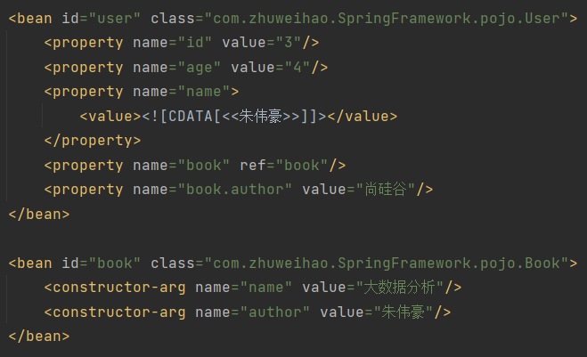

# IOC

## IOC原理

xml解析 -> 工厂模式 -> 反射

ioc容器底层就是对象工厂

Spring提供IOC容器的两种实现方式（两个接口）

- BeanFactory：IOC容器基本实现，加载配置文件的时候不会创建对象，在获取（使用）对象的时候才去创建对象
- ApplicationContext：BeanFactory的子接口，加载配置文件的时候就会创建对象


## Bean管理

bean管理指的是两个操作

- spring创建对象
- spring注入属性

bean管理操作有两种方式

- 基于xml配置文件方式
- 基于注解方式

### 基于xml方式

#### 创建对象


- id：唯一标识
- class：全路径名

创建对象的时候默认执行无参构造方法完成对象创建

#### 注入属性

DI：dependency injection，依赖注入，是IOC的一种实现方式

属性注入方法：

- 使用set方法进行注入


- 有参构造方法注入，要编写有参构造函数


- p空间注入，其实也是用set方法进行注入，可以在set方法上打断点进行观察，“q”是可以自定义的


#### 注入其他类型属性

> 字面量

##### 空值


##### 属性值包含特殊符号

> 把特殊字符进行转义

把特殊字符内容写到CDATA


##### 外部bean


##### 内部bean和级联赋值




##### 注入集合属性


```xml
    <util:list id="courseList">
        <value>数据结构</value>
        <value>算法设计与分析</value>
    </util:list>

    <bean id="stu" class="com.zhuweihao.SpringFramework.pojo.Stu">
        <property name="course" ref="courseList"/>
        <property name="score">
            <array>
                <value>12</value>
                <value>45</value>
            </array>
        </property>
        <property name="performance">
            <map>
                <entry key="JAVA" value="34"/>
                <entry key="C++" value="67"/>
            </map>
        </property>
        <property name="classmate">
            <set>
                <ref bean="user"/>
            </set>
        </property>
    </bean>
```

> 应用中可能有一部分是公用的，我们可以将其抽取出来，要在xml配置文件中添加下面的内容
>
> 

#### 工厂bean（FactoryBean）

> 普通bean：在配置文件中定义的bean类型就是返回类型
>
> 工厂bean：在配置文件中定义的bean类型可以和返回类型不一样

使用方法：

1. 创建类，实现接口FactoryBean
2. 实现接口里面的方法，在实现的方法中定义返回的bean类型

> 一般情况下，Spring通过反射机制利用<bean>的class属性指定实现类实例化Bean，在某些情况下，实例化Bean过程比较复杂，如果按照传统的方式，则需要在<bean>中提供大量的配置信息。配置方式的灵活性是受限的，这时采用编码的方式可能会得到一个简单的方案。Spring为此提供了一个org.springframework.bean.factory.FactoryBean的工厂类接口，用户可以通过实现该接口定制实例化Bean的逻辑。FactoryBean接口对于Spring框架来说占用重要的地位，Spring自身就提供了70多个FactoryBean的实现。它们隐藏了实例化一些复杂Bean的细节，给上层应用带来了便利。从Spring3.0开始，FactoryBean开始支持泛型，即接口声明改为FactoryBean<T>的形式

```java
public class myFactoryBean implements FactoryBean<Book> {

    //定义返回bean
    @Override
    public Book getObject() throws Exception {
        Book book = new Book("算法设计","张三");
        return book;
    }

    @Override
    public Class<?> getObjectType() {
        return null;
    }
}
```


#### Bean的作用域

在Spring中，可以设置创建的bean实例是单实例还是多实例，默认情况下创建的bean是一个单实例对象

使用<scope>标签进行配置，可取值：

- singleton，默认值，表示是单实例对象，在加载spring配置文件时就会创建对象
- prototype，表示是多实例对象，不会再加载配置文件时创建，在获取对象的时候才会创建


#### bean生命周期

1. 创建对象，注入属性
2. 调用初始化方法
3. 对象获取成功，可以使用
4. 销毁对象


一般的数据对象不需要额外的配置，但是一些资源服务对象有初始化和销毁的必要

###### bean的后置处理器

配置后置处理器的方法：实现接口BeanPostProcessor

```java
public class myBeanPostProcessor implements BeanPostProcessor {
    @Override
    public Object postProcessBeforeInitialization(Object bean, String beanName) throws BeansException {
        System.out.println("初始化之前执行的方法");
        return BeanPostProcessor.super.postProcessBeforeInitialization(bean, beanName);
    }

    @Override
    public Object postProcessAfterInitialization(Object bean, String beanName) throws BeansException {
        System.out.println("初始化之后执行的方法");
        return BeanPostProcessor.super.postProcessAfterInitialization(bean, beanName);
    }
}
```

**在applicationContext.xml配置bean后，所有的bean在被实例化的时候都会执行上面的方法**

#### 自动装配

上面通过property，value，ref等标签配置的方式指定属性值（不是String等普通属性）的方式为手动装配

自动装配：根据指定装配规则（属性名称或者属性类型），Spring自动将匹配的属性值注入。

- 根据属性名称
- 根据属性类型


#### 外部属性文件

示例：配置德鲁伊连接池


### 基于注解方式

#### 创建对象

要使用下面的注解，要开启组件扫描


```java
@Component(value = "fruitController")   //<bean id="fruitController" class="com.zhuweihao.SpringFramework.controller.FruitController"/>
@Controller //默认值是将类名称的首字母小写形式，这个注解和上面的效果相同
public class FruitController {
    public void test(){
        System.out.println("注解方式创建对象");
    }
}
```

测试方法：


> 下面的四个注解效果相同，但是为了代码可读性，不可混用

###### @Component

###### @Service

###### @Controller

###### @Repository

#### 注入属性


###### @Autowired

根据属性类型进行注入

当有多个相同类型的属性的时候，可以配合@Qualifier一起使用

###### @Qualifier

根据属性名称进行注入

###### @Resource

可以根据类型注入，也可以根据名称注入


注意这不是spring官方的注解

###### @Value

注入普通类型属性

可用于读取配置文件

#### 完全注解开发

创建配置类


测试类


# AOP

## 基本原理

参考博客：https://zhuanlan.zhihu.com/p/37497663，https://blog.csdn.net/jjclove/article/details/124386972

-----

AOP：Aspect Oriented Programming，面向切面编程

- AOP全称（Aspect Oriented Programming）面向切片编程的简称。AOP面向方面编程基于IOC，是对OOP的有益补充；
- AOP利用一种称为“横切”的技术，剖解开封装的对象内部，并将那些影响了 多个类的公共行为封装到一个可重用模块，并将其名为“Aspect”，即方面。所谓“方面”，简单地说，就是将那些与业务无关，却为业务模块所共同调用的 逻辑或责任封装起来，比如日志记录，便于减少系统的重复代码，降低模块间的耦合度，并有利于未来的可操作性和可维护性。
- 实现AOP的技术，主要分为两大类：一是采用动态代理技术，利用截取消息的方式，对该消息进行装饰，以取代原有对象行为的执行；二是采用静态织入的方式，引入特定的语法创建“方面”，从而使得编译器可以在编译期间织入有关“方面”的代码。
- Spring实现AOP：JDK动态代理和CGLIB代理 JDK动态代理：其代理对象必须是某个接口的实现，它是通过在运行期间创建一个接口的实现类来完成对目标对象的代理；其核心的两个类是InvocationHandler和Proxy。 CGLIB代理：实现原理类似于JDK动态代理，只是它在运行期间生成的代理对象是针对目标类扩展的子类。CGLIB是高效的代码生成包，底层是依靠ASM（开源的java字节码编辑类库）操作字节码实现的，性能比JDK强；需要引入包asm.jar和cglib.jar。使用AspectJ注入式切面和@AspectJ注解驱动的切面实际上底层也是通过动态代理实现的

**AOP的作用：**

1. 面向切面编程（AOP）提供另外一种角度来思考程序结构，通过这种方式弥补了面向对象编程（OOP）的不足。
2. 利用AOP对业务逻辑的各个部分进行隔离，降低业务逻辑的耦合性，提高程序的可重用型和开发效率。
3. 主要用于对同一对象层次的公用行为建模

-----------------


**这里先给出一个比较专业的概念定义**：

- `Aspect`（切面）： Aspect 声明类似于 Java 中的类声明，在 Aspect 中会包含着一些 Pointcut 以及相应的 Advice。

- `Joint point`（连接点）：表示在程序中明确定义的点，典型的包括方法调用，对类成员的访问以及异常处理程序块的执行等等，它自身还可以嵌套其它 joint point。

- `Pointcut`（切点）：表示一组 joint point，这些 joint point 或是通过逻辑关系组合起来，或是通过通配、正则表达式等方式集中起来，它定义了相应的 Advice 将要发生的地方。

- `Advice`（增强）：Advice 定义了在 `Pointcut` 里面定义的程序点具体要做的操作，它通过 before、after 和 around 来区别是在每个 joint point 之前、之后还是代替执行的代码。

- `Target`（目标对象）：织入 `Advice` 的目标对象.。

- `Weaving`（织入）：将 `Aspect` 和其他对象连接起来, 并创建 `Advice`d object 的过程


----------------


# 日志测试等功能


#### 整合JUnit5单元测试框架

##### JUnit4


注意点：

- locations为编译后路径
- 注意与后面的方法所导入的包不同

依赖引入：

```xml

        <dependency>
            <groupId>junit</groupId>
            <artifactId>junit</artifactId>
            <version>4.13.2</version>
            <scope>test</scope>
        </dependency>
```


##### 整合JUnit5


依赖包如下


```xml
        <dependency>
            <groupId>org.junit.jupiter</groupId>
            <artifactId>junit-jupiter-api</artifactId>
            <version>5.7.2</version>
            <scope>test</scope>
        </dependency>
```

