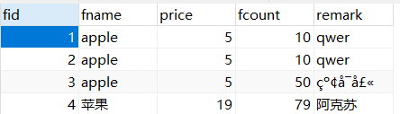
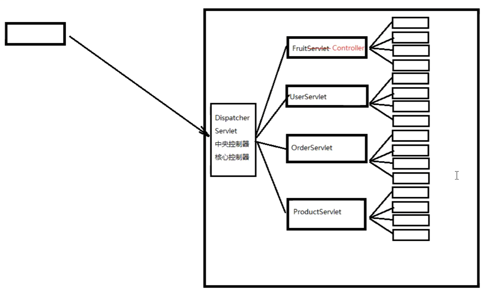

文档：https://heavy_code_industry.gitee.io/code_heavy_industry/pro001-javaweb/lecture/

-------

CS：客户端服务器架构模式

- 优点：充分利用客户端机器的资源，减轻服务器的负荷（一部分安全要求不高的计算任务存储任务放在客户端执行，减轻服务器压力，减少网络通信）
- 缺点：需要安装；升级维护成本较高；

BS：浏览器服务器架构模式

- 优点：客户端不需要安装；维护成本低
- 缺点：所有任务都在服务器端进行，服务器运算存储压力大；需要大量的网络通信。

---------

#### Tomcat

Tomcat是一种轻量级，免费的javaweb服务器，提供对jsp和Servlet的支持

##### 安装和配置

下载：[Index of /apache/tomcat/tomcat-8/v8.5.85/bin (tsinghua.edu.cn)](https://mirrors.tuna.tsinghua.edu.cn/apache/tomcat/tomcat-8/v8.5.85/bin/)

解压：目录不要有中文，不要有空格

目录结构：


配置环境变量：tomcat是用java和C来编写的，需要配置JAVA_HOME

启动tomcat：运行bin目录下的start.bat

访问主页：https://localhost:8080

项目部署：就是把文件夹拷贝到webapps下，示例见webapps/examples。启动tomcat后访问http://localhost:8080/examples/index.html

#### idea下创建javaweb项目-部署-运行

创建java项目后右击项目，选择Add Framework Support


勾选Web Application


完成后完整目录如下


配置如下即可启动项目，需要注意的是，application context是可以自定义的


下面的设置中需要注意的有：

URL默认没有/hello01.html，需要手动添加

On 'Update' ations和On frame deactivation最好按照如图示修改，这样在修改代码后可以实现页面动态调整，无需重新启动


# Servlet

## 入门

1. 新建项目-新建模块
2. 在模块中添加web application
3. 创建artifact - 部署包
4. lib - artifact 
   - 先有artifact，后来才添加的mysql驱动jar包，此时，这个jar包没有添加到部署包中，有两种解决方案
     - 在Project Structure中Problems会有提示，点击fix选择add to
     - 可以直接将lib文件夹放在WEB-INF下，但是这样只能当前一个模块独享
5. 在部署的时候，修改application Context。然后再回到server选项卡，检查URL的值。URL的值指的是tomcat启动完成后自动打开指定浏览器的默认访问地址。
   - 如果我们的URL是https://localhost:8080/test/，那么我们访问的是index.html，如果没有这个页面则会报404
6. 405问题。当前请求的方法不支持。比如，表单中method=post，servlet必须对应doPost，否则报405错误。
7. 注意<url-pattern>中以斜杠开头。

## 设置编码

输入中文会出现如下乱码


```java
//get方式目前不需要设置编码（基于tomcat8）,tomcat8之前get请求的中文数据，需要如下转码方式
String fname = req.getParameter("fname");
//1.将字符串打散成字节数据
byte[] bytes = fname.getBytes("ISO-8859-1");
fname = new String(bytes, "UTF-8");

//post方式下，需要设置编码，防止中文乱码
req.setCharacterEncoding("UTF-8");
```



如果仍然出现中文乱码问题，有可能是数据库编码问题。

## Servlet的继承关系

### 继承关系

- javax.servlet.Servlet接口
  - javax.servlet.GenericServlet抽象类
    - javax.servlet.http.HttpServlet抽象子类

### 方法

javax.servlet.Servlet接口

- void init(config) - 初始化方法
- void service(request,response) - 服务方法
- void destory() - 销毁方法

javax.servlet.GenericServlet抽象类

- void service(request,response) - 仍然是抽象方法

javax.servlet.http.HttpServlet抽象子类

- void service(requset,response) - 不是抽象方法

  - ```java
    //获取请求方式
    String method = req.getMethod();
    ```

  - 根据请求方式不同，调用不同的do方法

  - 在HttpServlet这个抽象类中中的do方法如果被调用则会报错，方法都差不多，示例如下

  - ```java
    protected void doPost(HttpServletRequest req, HttpServletResponse resp) throws ServletException, IOException {
        String msg = lStrings.getString("http.method_post_not_supported");
        this.sendMethodNotAllowed(req, resp, msg);
    }
        private void sendMethodNotAllowed(HttpServletRequest req, HttpServletResponse resp, String msg) throws IOException {
            String protocol = req.getProtocol();
            if (protocol.length() != 0 && !protocol.endsWith("0.9") && !protocol.endsWith("1.0")) {
                resp.sendError(405, msg);
            } else {
                resp.sendError(400, msg);
            }
    
        }
    ```

### 小结

1. 继承关系：HttpServlet -> GenericServlet -> Servlet
2. Servlet中的核心方法：inti()，service()，destroy()
3. 服务方法：当有请求时，service方法会自动相应（其实是tomcat容器调用的）。
4. 在HttpServlet中我们会去分析请求的方式，根据请求方式调用do方法，在HttpServlet中这些do方法都是405或400的报错实现，要求子类实现对应的方法，否则会报错。

## Servlet的生命周期

默认情况下，第一次接受请求时，Servlet会进行实例化（构造方法），初始化（init方法），然后开始服务（service方法），后面的请求只会调用service方法，当容器关闭时，所有的servlet实例会被销毁，调用destroy方法。

实例化是tomcat在收到请求时，通过反射实现的

```java
public class AddServlet extends HttpServlet {

    @Override
    public void service(ServletRequest req, ServletResponse res) throws ServletException, IOException {
        System.out.println("正在服务");
    }

    @Override
    public void destroy() {
        System.out.println("正在销毁");
    }

    @Override
    public void init() throws ServletException {
        System.out.println("正在初始化");
    }
}
```

<load-on-startup>的作用：

- 默认servlet是在第一次请求时进行实例化和初始化，如果设置了<load-on-startup>，则会随tomcat容器启动一起进行实例化和初始化。
- 如果有多个servlet可以配置servlet的启动顺序。0->1->2

```xml
<servlet>
    <servlet-name>AddServlet</servlet-name>
    <servlet-class>com.zhuweihao.servlets.AddServlet</servlet-class>
    <load-on-startup>1</load-on-startup>
</servlet>
```

Servlet在容器中是单例的，线程不安全的

- 单例：所有的请求都由一个servlet进行相应，不会实例化第二个servlet
- 线程不安全：两个线程同时被响应时，一个线程改变了成员变量可能会导致另一个线程代码执行路径发生改变，引起错误。
- 因此，尽量不要在servlet中定义成员变量，如果必须定义，注意不要修改成员变量的值，不要根据成员变量进行逻辑判断

## 会话控制

HTTP协议本身是无状态的。单靠HTTP协议本身无法判断一个请求来自于哪一个浏览器，所以也就没法识别用户的身份状态。

### Cookie


### Session

- 服务器端没调用request.getSession()方法：什么都不会发生
- 服务器端调用了request.getSession()方法
  - 服务器端检查当前请求中是否携带了JSESSIONID的Cookie
    - 有：根据JSESSIONID在服务器端查找对应的HttpSession对象
      - 能找到：将找到的HttpSession对象作为request.getSession()方法的返回值返回
      - 找不到：服务器端新建一个HttpSession对象作为request.getSession()方法的返回值返回
    - 无：服务器端新建一个HttpSession对象作为request.getSession()方法的返回值返回


```java
@Override
protected void service(HttpServletRequest request, HttpServletResponse resp) throws ServletException, IOException {
    // 1.调用request对象的方法尝试获取HttpSession对象
    HttpSession session = request.getSession();
    // 2.调用HttpSession对象的isNew()方法
    boolean wetherNew = session.isNew();
    // 3.打印HttpSession对象是否为新对象
    System.out.println("wetherNew = " + (wetherNew ? "HttpSession对象是新的" : "HttpSession对象是旧的"));
    // 4.调用HttpSession对象的getId()方法
    String id = session.getId();
    // 5.打印JSESSIONID的值
    System.out.println("JSESSIONID = " + id);
}
```

服务器端给Session对象设置最大闲置时间，默认为1800秒

```java
// 获取默认的最大闲置时间
int maxInactiveIntervalSecond = session.getMaxInactiveInterval();
System.out.println("maxInactiveIntervalSecond = " + maxInactiveIntervalSecond);
// 设置默认的最大闲置时间
session.setMaxInactiveInterval(15);
```


强制关闭session

```java
session.invalidate();
```


## 请求转发和重定向

发一个请求给Servlet，接力棒就传递到了Servlet手中。而绝大部分情况下，Servlet不能独自完成一切，需要把接力棒继续传递下去，此时我们就需要请求的**『转发』**或**『重定向』**。

### 转发

在请求的处理过程中，Servlet完成了自己的任务，需要把请求转交给下一个资源继续处理。


```java
//服务器内部转发
req.getRequestDispatcher("add").forward(req,resp);
```


### 重定向

在请求的处理过程中，Servlet完成了自己的任务，然后以一个响应的方式告诉浏览器：“要完成这个任务还需要你另外再访问下一个资源”。


```java
//客户端重定向
resp.sendRedirect("add");
```


注意：

- 地址栏发生变化
- 状态码为302
- 响应头中Location标明了重定向的资源

## 保存作用域

保存作用域有四个

- page，页面级别，JSP使用，现在基本不用
- request：请求域，一次请求响应范围
- session：会话域，一次会话范围
- application：应用域，整个应用程序范围


# Thymeleaf

服务器端模板技术


Thymeleaf优势：

- SpringBoot官方推荐使用的视图模板技术，和SpringBoot完美整合。
- 不经过服务器运算仍然可以直接查看原始值，对前端工程师更友好。


### 物理视图和逻辑视图

在Servlet中，将请求转发到一个HTML页面文件时，使用的完整的转发路径就是**物理视图**。


如果我们把所有的HTML页面都放在某个统一的目录下，那么转发地址就会呈现出明显的规律：

/add.html；/index.html；

路径的开头都是：/

路径的结尾都是：.html

所以，路径开头的部分我们称之为**视图前缀**，路径结尾的部分我们称之为**视图后缀**。


物理视图=视图前缀+逻辑视图+视图后缀

### 基本语法

```html
<table id="tbl_fruit">
    <tr>
        <th class="w20">名称</th>
        <th class="w20">单价</th>
        <th class="w20">库存</th>
        <th>操作</th>
    </tr>
    <tr th:if="${#lists.isEmpty(session.fruitList)}">
        <td colspan="4">对不起，库存为空！</td>
    </tr>
    <tr th:unless="${#lists.isEmpty(session.fruitList)}" th:each="fruit : ${session.fruitList}">
        <td th:text="${fruit.fname}">苹果</td>
        <td th:text="${fruit.price}">5</td>
        <td th:text="${fruit.fcount}">20</td>
        <td></td>
    </tr>
</table>
```

##### 修改标签文本

```html
<p th:text="标签体新值">标签体原始值</p>
```

- 不经过服务器解析，直接用浏览器打开HTML文件，看到的是『标签体原始值』
- 经过服务器解析，Thymeleaf引擎根据th:text属性指定的『标签体新值』去**替换**『标签体原始值』

##### 修改指定属性值

```html
<input type="text" name="username" th:value="文本框新值" value="文本框旧值" />
```

任何HTML标签原有的属性，前面加上『th:』就都可以通过Thymeleaf来设定新值

##### 直接执行表达式

servlet代码

```java
request.setAttribute("reqAttrName", "<span>hello-value</span>");
```

页面代码

```html
<p>有转义效果：[[${reqAttrName}]]</p>
<p>无转义效果：[(${reqAttrName})]</p>
```

执行效果


##### 访问域对象

###### 请求域

在请求转发的场景下，我们可以借助HttpServletRequest对象内部给我们提供的存储空间，帮助我们携带数据，把数据发送给转发的目标资源。

请求域：HttpServletRequest对象内部给我们提供的存储空间


Servlet中代码：

```java
String requestAttrName = "helloRequestAttr";
String requestAttrValue = "helloRequestAttr-VALUE";

request.setAttribute(requestAttrName, requestAttrValue);
```

Thymeleaf表达式：

```html
<p th:text="${helloRequestAttr}">request field value</p>
```

###### 会话域


Servlet中代码：

```java
// ①通过request对象获取session对象
HttpSession session = request.getSession();

// ②存入数据
session.setAttribute("helloSessionAttr", "helloSessionAttr-VALUE");
```

Thymeleaf表达式：

```html
<p th:text="${session.helloSessionAttr}">这里显示会话域数据</p>
```


##### 分支和迭代

###### if和unless

让标记了th:if、th:unless的标签根据条件决定是否显示。

```html
    <tr th:if="${#lists.isEmpty(employeeList)}">
        <td colspan="3">抱歉！没有查询到你搜索的数据！</td>
    </tr>
    <tr th:if="${not #lists.isEmpty(employeeList)}">
        <td colspan="3">有数据！</td>
    </tr>
    <tr th:unless="${#lists.isEmpty(employeeList)}">
        <td colspan="3">有数据！</td>
    </tr>
```

if配合not关键词和unless配合原表达式效果是一样的，看自己的喜好。

###### switch

```html
<h3>测试switch</h3>
<div th:switch="${user.memberLevel}">
    <p th:case="level-1">银牌会员</p>
    <p th:case="level-2">金牌会员</p>
    <p th:case="level-3">白金会员</p>
    <p th:case="level-4">钻石会员</p>
</div>
```

###### 迭代

```html
<tr th:unless="${#lists.isEmpty(session.fruitList)}" th:each="fruit : ${session.fruitList}">
        <td th:text="${fruit.fname}">苹果</td>
        <td th:text="${fruit.price}">5</td>
        <td th:text="${fruit.fcount}">20</td>
        <td></td>
    </tr>
```

# 水果库存系统实现

### 功能实现


##### 首页


```java
@WebServlet("/index")
public class IndexServlet extends ViewBaseServlet {

    private FruitDAOImpl fruitDAO = new FruitDAOImpl();

    @Override
    protected void doGet(HttpServletRequest req, HttpServletResponse resp) throws ServletException, IOException {
        //默认当前为第一页
        Integer page = 1;
        //获取当前页
        String pageStr = req.getParameter("page");
        if (StringUtil.idNotEmpty(pageStr)) {
            page = Integer.parseInt(pageStr);
        }
        HttpSession session = req.getSession();
        Connection connection = JDBCUtils.getConnection();
        //获取总页数
        Long fruitCount = fruitDAO.getCount(connection);
        Long pageCount = (fruitCount + 5 - 1) / 5;
        session.setAttribute("pageCount", pageCount);

        //判断翻页逻辑
        if (page <= 1) {
            page = 1;
            List<Fruit> fruitList = fruitDAO.getFruitList(connection, page);
            //保存到session作用域
            session.setAttribute("fruitList", fruitList);
            session.setAttribute("page", page);
        } else if (page <= pageCount) {
            List<Fruit> fruitList = fruitDAO.getFruitList(connection, page);
            //保存到session作用域
            session.setAttribute("fruitList", fruitList);
            session.setAttribute("page", page);
        } else {
            page = pageCount.intValue();
            List<Fruit> fruitList = fruitDAO.getFruitList(connection, page);
            //保存到session作用域
            session.setAttribute("fruitList", fruitList);
            session.setAttribute("page", page);
        }
        super.processTemplate("index", req, resp);
    }
}
```

##### 库存信息的增删改

###### 修改

点击库存名称进入修改页面


输入所要修改的信息后点击修改会重新跳转到首页


> 注意：修改完信息跳转回首页时不需要重新渲染首页，而是采用重定向的方式跳转
>
> ```java
> //重定向，获取最新的库存信息
> resp.sendRedirect("index");
> ```

```java
@WebServlet("/update.do")
public class UpdateServlet extends ViewBaseServlet {
    private FruitDAOImpl fruitDAO = new FruitDAOImpl();

    @Override
    protected void doPost(HttpServletRequest req, HttpServletResponse resp) throws ServletException, IOException {
        req.setCharacterEncoding("utf-8");
        String fname = req.getParameter("fname");
        int price = Integer.parseInt(req.getParameter("price"));
        String remark = req.getParameter("remark");
        int fcount = Integer.parseInt(req.getParameter("fcount"));
        int fid = Integer.parseInt(req.getParameter("fid"));
        fruitDAO.updataById(JDBCUtils.getConnection(), new Fruit(fid, fname, price, fcount, remark));
        //重定向，获取最新的库存信息
        resp.sendRedirect("index");
    }
}
```

###### 添加


##### 库存信息查询功能


##### 分页功能

实现该功能时应注意，判断注意翻页时的逻辑判断。

例如，如果当前页为首页，点击上一页时应保持不变，这需要我们进行一定的逻辑判断，否则会出错。

### MVC


下面的方法虽然可以达到目的，但是如果有很多方法，使用起来十分的不方便。

```java
@WebServlet("/fruit.do")
public class FruitServlet extends ViewBaseServlet {
    private FruitDAOImpl fruitDAO = new FruitDAOImpl();

    @Override
    protected void service(HttpServletRequest req, HttpServletResponse resp) throws ServletException, IOException {
        req.setCharacterEncoding("utf-8");

        String operate = req.getParameter("operate");
        if(StringUtil.isEmpty(operate)){
            operate="index";
        }

        switch (operate){
            case "index":
                index(req,resp);
                break;
            case "add":
                add(req,resp);
                break;
            case "del":
                del(req, resp);
                break;
            case "update":
                update(req, resp);
                break;
            case "search":
                search(req, resp);
                break;
            case "edit":
                edit(req, resp);
                break;
            default:
                throw new RuntimeException("operate值异常");
        }

    }
    private void index(HttpServletRequest req, HttpServletResponse resp) throws ServletException, IOException {}

    private void add(HttpServletRequest req, HttpServletResponse resp) throws ServletException, IOException {}

    private void del(HttpServletRequest req, HttpServletResponse resp) throws ServletException, IOException {}

    private void update(HttpServletRequest req, HttpServletResponse resp) throws ServletException, IOException {}

    private void search(HttpServletRequest req, HttpServletResponse resp) throws ServletException, IOException { }

    private void edit(HttpServletRequest req, HttpServletResponse resp) throws ServletException, IOException {}
    
}
```

##### 使用反射

```java
@Override
protected void service(HttpServletRequest req, HttpServletResponse resp) throws ServletException, IOException {
    req.setCharacterEncoding("utf-8");

    String operate = req.getParameter("operate");
    if(StringUtil.isEmpty(operate)){
        operate="index";
    }

    //获取当前类中的所有方法
    Method[] declaredMethods = this.getClass().getDeclaredMethods();
    for (Method m :
            declaredMethods) {
        //获取方法名称
        String mName = m.getName();
        if (operate.equals(mName)){
            //找到和operate同名的方法，通过反射技术进行调用
            try {
                m.invoke(this,req,resp);
                return;
            } catch (IllegalAccessException e) {
                throw new RuntimeException(e);
            } catch (InvocationTargetException e) {
                throw new RuntimeException(e);
            }
        }
    }

    throw new RuntimeException("operate值异常");

}
```

##### 引入DispatcherServlet


