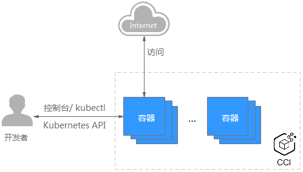

# CCI

[成长地图_云容器实例 CCI_华为云 (huaweicloud.com)](https://support.huaweicloud.com/cci/index.html)

-----------

云容器实例（Cloud Container Instance，CCI）服务提供Serverless Container（无服务器容器）引擎，让您无需创建和管理服务器集群即可直接运行容器。

Serverless是一种架构理念，是指不用创建和管理服务器、不用担心服务器的运行状态（服务器是否在工作等），只需动态申请应用需要的资源，把服务器留给专门的维护人员管理和维护，进而专注于应用开发，提升应用开发效率、节约企业IT成本。传统上使用Kubernetes运行容器，首先需要创建运行容器的Kubernetes服务器集群，然后再创建容器负载。

云容器实例的Serverless Container就是从使用角度，无需创建、管理Kubernetes集群，也就是从使用的角度看不见服务器（Serverless），直接通过控制台、kubectl、Kubernetes API创建和使用容器负载，且只需为容器所使用的资源付费。




# CCE

[成长地图_云容器引擎 CCE_华为云 (huaweicloud.com)](https://support.huaweicloud.com/cce/index.html)

----------

云容器引擎（Cloud Container Engine，简称CCE）提供高度可扩展的、高性能的企业级Kubernetes集群，支持运行Docker容器。借助云容器引擎，您可以在云上轻松部署、管理和扩展容器化应用程序。

#### 名词对照

| **云容器引擎CCE**    | **原生Kubernetes**    |
| -------------------- | --------------------- |
| 集群                 | Cluster               |
| 节点                 | Node                  |
| 节点池               | NodePool              |
| 容器                 | Container             |
| 镜像                 | Image                 |
| 命名空间             | Namespace             |
| 无状态工作负载       | Deployment            |
| 有状态工作负载       | StatefulSet           |
| 守护进程集           | DaemonSet             |
| 普通任务             | Job                   |
| 定时任务             | CronJob               |
| 实例（容器组）       | Pod                   |
| 服务（Service）      | Service               |
| 虚拟集群IP           | Cluster IP            |
| 节点端口             | NodePort              |
| 负载均衡             | LoadBalancer          |
| 七层负载均衡（路由） | Ingress               |
| 网络策略             | NetworkPolicy         |
| 模板                 | Template              |
| 配置项               | ConfigMap             |
| 密钥                 | Secret                |
| 标签                 | Label                 |
| 选择器               | LabelSelector         |
| 注解                 | Annotation            |
| 存储卷               | PersistentVolume      |
| 存储声明             | PersistentVolumeClaim |
| 弹性伸缩             | HPA                   |
| 节点亲和性           | NodeAffinity          |
| 节点反亲和性         | NodeAntiAffinity      |
| 工作负载亲和性       | PodAffinity           |
| 工作负载反亲和性     | PodAntiAffinity       |
| 触发器               | Webhook               |
| 终端节点             | Endpoint              |
| 资源配额             | Resource Quota        |
| 资源限制             | Limit Range           |

# Kubernetes

[Kubernetes 文档 | Kubernetes](https://kubernetes.io/zh-cn/docs/home/)

---------------

负载均衡、弹性伸缩

## 概念


# OpenFeign

官网：[Spring Cloud OpenFeign](https://spring.io/projects/spring-cloud-openfeign)

-----------

Feign是一个声明式WebService客户端。使用Feign能让编写WebSerice客户端更加简单。

它的使用方法时定义一个服务接口然后在上面添加注解，Feign也支持可插拔式的编码器和解码器。

SpringCloud对Feign进行了封装，使其支持了SpringMVC标准注解和HttpMessageConverters。

Feign可以与Eureka和Ribbon组合使用以支持负载均衡。


默认Feign客户端只等待一秒钟，需要设置Feign客户端的超时控制。


Feign日志打印：


# Swagger

https://blog.csdn.net/m0_61682705/article/details/125239542

----------


```java
@Api：用在请求的类上，表示对类的说明
    tags="说明该类的作用，可以在UI界面上看到的注解"
    value="该参数没什么意义，在UI界面上也看到，所以不需要配置"
 
 
@ApiOperation：用在请求的方法上，说明方法的用途、作用
    value="说明方法的用途、作用"
    notes="方法的备注说明"
 
 
@ApiImplicitParams：用在请求的方法上，表示一组参数说明
    @ApiImplicitParam：用在@ApiImplicitParams注解中，指定一个请求参数的各个方面
        name：参数名
        value：参数的汉字说明、解释
        required：参数是否必须传
        paramType：参数放在哪个地方
            · header --> 请求参数的获取：@RequestHeader
            · query --> 请求参数的获取：@RequestParam
            · path（用于restful接口）--> 请求参数的获取：@PathVariable
            · body（不常用）
            · form（不常用）    
        dataType：参数类型，默认String，其它值dataType="Integer"       
        defaultValue：参数的默认值
 
 
@ApiResponses：用在请求的方法上，表示一组响应
    @ApiResponse：用在@ApiResponses中，一般用于表达一个错误的响应信息
        code：数字，例如400
        message：信息，例如"请求参数没填好"
        response：抛出异常的类
 
 
@ApiModel：用于响应类上，表示一个返回响应数据的信息
            （这种一般用在post创建的时候，使用@RequestBody这样的场景，
            请求参数无法使用@ApiImplicitParam注解进行描述的时候）
    @ApiModelProperty：用在属性上，描述响应类的属性
```

# Mybatis-Plus

[简介 | MyBatis-Plus (baomidou.com)](https://baomidou.com/pages/24112f/)

---------

通用mapper：BaseMapper

通用service：IService接口及其实现类，ServiceImpl

条件构造器


# 各种工具类

## PageCL

分页工具

关键方法：

- ```java
  public PageCL<T> getPageInfo(int pageNum, int pageSize, List<T> list)
  ```

  

- ```java
  public PageCL<T> getPageByPageHelper(Page page, List<T> list)
  ```

  

- ```java
  public PageCL<T> getPageByPageHelper(IPage page, List<T> list)
  ```


## ModelMapper

对Orika的一些用法进行了封装

#### Orika

[Orika reference guide (orika-mapper.github.io)](http://orika-mapper.github.io/orika-docs/index.html)

------------

Orika是java Bean映射框架，可以实现从一个对象递归拷贝数据至另一个对象。在开发多层应用程序中非常有用。在这些层之间交换数据时，通常为了适应不同API需要转换一个实例至另一个实例。

有很多方法可以实现：硬代码拷贝或Dozer实现bean映射等。总之，需要简化不同层对象之间映射过程。

Orika使用字节码生成器创建开销最小的快速映射，比其他基于反射方式实现（如，Dozer）更快。之前使用Bean Copy 性能非常慢，发现在这个领域业界还是有很多新秀的。 Orika 应该就算一个比较好的吧。

----------


# 注解

## @Param


##### 概述

首先明确这个注解是为SQL语句中参数赋值而服务的。

@Param的作用就是给参数命名，比如在mapper里面某方法A（int id），当添加注解后A（@Param("userId") int id），也就是说外部想要取出传入的id值，只需要取它的参数名userId就可以了。将参数值传如SQL语句中，通过#{userId}进行取值给SQL的参数赋值。

##### 实例：

实例一：@Param注解基本类型的参数

mapper中的方法：

```java
public User selectUser(@Param("userName") String name,@Param("password") String pwd);

```

映射到xml中的\<select>标签
```xml
<select id="selectUser" resultMap="User">  
   select * from user  where user_name = #{userName} and user_password=#{password}  
</select>
```

其中where user_name = #{userName} and user_password = #{password}中的userName和password都是从注解@Param（）里面取出来的，取出来的值就是方法中形式参数 String name 和 String pwd的值。

实例二：@Param注解JavaBean对象

SQL语句通过@Param注解中的别名把对象中的属性取出来然后复制

mapper中的方法： 

```java
public List<User> getAllUser(@Param("user") User u);

```

映射到xml中的\<select>标签

```xml
<select id="getAllUser" parameterType="com.vo.User" resultMap="userMapper">  
        select   
        from user t where 1=1  
             and   t.user_name = #{user.userName}  
              and   t.user_age = #{user.userAge}  
    </select>  
```

##### 注意点

当使用了@Param注解来声明参数的时候，SQL语句取值使用#{}，${}取值都可以。

当不使用@Param注解声明参数的时候，必须使用的是#{}来取参数。使用${}方式取值会报错。

不使用@Param注解时，参数只能有一个，并且是Javabean。在SQL语句里可以引用JavaBean的属性，而且只能引用JavaBean的属性。


```sql
@Select("SELECT * from Table where id = #{id}")
Enchashment selectUserById(User user);
```

## @SuppressWarnings


```
    注释类型：
        当你的编码可能存在警告时，比如安全警告，可以用它来消除。

        api中是这样描述的：
            指示应该在注释元素（以及包含在该注释元素中的所有程序元素）中取消显示指定的编译器警告。
            注意，在给定元素中取消显示的警告集是所有包含元素中取消显示的警告的超集。
            例如，如果注释一个类来取消显示某个警告，同时注释一个方法来取消显示另一个警告，那么将在此方法中同时取消显示这两个警告。

            根据风格不同，程序员应该始终在最里层的嵌套元素上使用此注释，在那里使用才有效。
            如果要在特定的方法中取消显示某个警告，则应该注释该方法而不是注释它的类。
```


```java
这时候我们在方法上加上@SuppressWarnings注解就可以消除这些警告的产生，注解的使用有三种：
 
1. @SuppressWarnings("unchecked")  [^ 抑制单类型的警告]
2. @SuppressWarnings("unchecked","rawtypes")  [^ 抑制多类型的警告]
3. @SuppressWarnings("all")  [^ 抑制所有类型的警告]
***
> 通过源码分析可知@SuppressWarnings其注解目标为类、字段、函数、函数入参、构造函数和函数的局部变量。建议把注解放在最近进警告发生的位置。
下面列举警告关键字：
```

<div class="table-box"><table><thead><tr><th><strong>关键字</strong></th><th><strong>用途</strong></th></tr></thead><tbody><tr><td>all</td><td>to suppress all warnings （抑制所有警告）</td></tr><tr><td>boxing</td><td>to suppress warnings relative to boxing/unboxing operations （抑制装箱、拆箱操作时候的警告）</td></tr><tr><td>cast</td><td>to suppress warnings relative to cast operations （抑制映射相关的警告）</td></tr><tr><td>dep-ann</td><td>to suppress warnings relative to deprecated annotation （抑制启用注释的警告）</td></tr><tr><td>deprecation</td><td>to suppress warnings relative to deprecation （抑制过期方法警告）</td></tr><tr><td>fallthrough</td><td>to suppress warnings relative to missing breaks in switch statements （抑制确在switch中缺失breaks的警告）</td></tr><tr><td>finally</td><td>to suppress warnings relative to finally block that don’t return （抑制finally模块没有返回的警告）</td></tr><tr><td>hiding</td><td>to suppress warnings relative to locals that hide variable（抑制相对于隐藏变量的局部变量的警告）</td></tr><tr><td>incomplete-switch</td><td>to suppress warnings relative to missing entries in a switch statement (enum case)（忽略没有完整的switch语句）</td></tr><tr><td>nls</td><td>to suppress warnings relative to non-nls string literals（ 忽略非nls格式的字符）</td></tr><tr><td>null</td><td>to suppress warnings relative to null analysis（ 忽略对null的操作）</td></tr><tr><td>rawtypes</td><td>to suppress warnings relative to un-specific types when using generics on class params（ 使用generics时忽略没有指定相应的类型）</td></tr><tr><td>restriction</td><td>to suppress warnings relative to usage of discouraged or forbidden references（ 抑制禁止使用劝阻或禁止引用的警告）</td></tr><tr><td>serial</td><td>to suppress warnings relative to missing serialVersionUID field for a serializable class（ 忽略在serializable类中没有声明serialVersionUID变量）</td></tr><tr><td>static-access</td><td>to suppress warnings relative to incorrect static access（ 抑制不正确的静态访问方式警告）</td></tr><tr><td>synthetic-access</td><td>to suppress warnings relative to unoptimized access from inner classes（ 抑制子类没有按最优方法访问内部类的警告）</td></tr><tr><td>unchecked</td><td>to suppress warnings relative to unchecked operations（ 抑制没有进行类型检查操作的警告）</td></tr><tr><td>unqualified-field-access</td><td>to suppress warnings relative to field access unqualified（ 抑制没有权限访问的域的警告）</td></tr><tr><td>unused</td><td>to suppress warnings relative to unused code（ 抑制没被使用过的代码的警告）</td></tr></tbody></table></div>


# Error

#### Command line is too lang


解决办法：添加下图中注释的内容，文件为.idea/workspace.xml


#### 未注入但是不报错


可以运行

#### flyway可以生成flyway_schema_history，但是没有初始化数据表

原因，脚本命名为V1__init.sql

flyway会自动将当前的数据库记录为V1版本，然后执行升级脚本。这也表示用户所准备的脚本中，V1版本的脚本会被跳过，只有V1之后的版本才会被执行。

解决办法：

1、flyway.baseline-version设置为0，flyway就不会跳过V1版本

2、使用比1更大的版本号，如下图


```
flyway.baseline-description对执行迁移时基准版本的描述.
flyway.baseline-on-migrate当迁移时发现目标schema非空，而且带有没有元数据的表时，是否自动执行基准迁移，默认false.
flyway.baseline-version开始执行基准迁移时对现有的schema的版本打标签，默认值为1.
flyway.check-location检查迁移脚本的位置是否存在，默认false.
flyway.clean-on-validation-error当发现校验错误时是否自动调用clean，默认false.
flyway.enabled是否开启flywary，默认true.
flyway.encoding设置迁移时的编码，默认UTF-8.
flyway.ignore-failed-future-migration当读取元数据表时是否忽略错误的迁移，默认false.
flyway.init-sqls当初始化好连接时要执行的SQL.
flyway.locations迁移脚本的位置，默认db/migration.
flyway.out-of-order是否允许无序的迁移，默认false.
flyway.password目标数据库的密码.
flyway.placeholder-prefix设置每个placeholder的前缀，默认${.
flyway.placeholder-replacementplaceholders是否要被替换，默认true.
flyway.placeholder-suffix设置每个placeholder的后缀，默认}.
flyway.placeholders.[placeholder name]设置placeholder的value
flyway.schemas设定需要flywary迁移的schema，大小写敏感，默认为连接默认的schema.
flyway.sql-migration-prefix迁移文件的前缀，默认为V.
flyway.sql-migration-separator迁移脚本的文件名分隔符，默认__
flyway.sql-migration-suffix迁移脚本的后缀，默认为.sql
flyway.tableflyway使用的元数据表名，默认为schema_version
flyway.target迁移时使用的目标版本，默认为latest version
flyway.url迁移时使用的JDBC URL，如果没有指定的话，将使用配置的主数据源
flyway.user迁移数据库的用户名
flyway.validate-on-migrate迁移时是否校验，默认为true.
```


#### 空指针

##### VirtualService


# Mission

## 版本回滚

```java
//ApplicationController
public ResultModle<List<UpgradeEntity>> prepare(@PathVariable("mesh_id") String meshId,
                            @PathVariable("namespace") String namespace,
                            @PathVariable("name") String name){
    //返回该应用的所有版本，用于前端展示
}

//用哪些请求参数？
//
public ResultModle rollback(@PathVariable("mesh_id") String meshId,
                            @PathVariable("namespace") String namespace,
                            @PathVariable("name") String name,
                            @PathVariable("cuurent_version") String current_version,
                            @PathVariable("rollback_version") String rollback_version){
    ResultModel resultModel = new ResultModel();
    try{
        resultModel=applicationService.rollback(clusterId,namespace,name,current_version,rollback_version);
    } catch(){
        //异常处理
    }
    return；
}


//ApplicationServiceImpl
public ResultModle rollback(@PathVariable("mesh_id") String meshId,
                            @PathVariable("namespace") String namespace,
                            @PathVariable("name") String name,
                            @PathVariable("cuurent_version") String current_version,
                            @PathVariable("rollback_version") String rollback_version){
    ResultModel resultModel = new ResultModel();
    try{
        //查询应用详情
        UpgradeEntity currentUpgradeEntity = upgradeMapper.selectOne(queryWrapper);
        //查询gray_upgrade_record表，判断currentUpgradeEntity状态是否能够回滚
        if(true){
            //判断部署类型，部署应用
            if(WorkloadEnum.DEPLOY == currentUpgradeEntity.getType()){
                //获取deployment对象
                ......;    
                kubernetesManageService.createOrUpdateDeployment(meshId, deployment);
            }else if(WorkloadEnum.STS == currentUpgradeEntity.getType()){
                ......;
                kubernetesManageService.createOrUpdateStatefulSet(meshId, statefulSetEntity);
            }......;
            KubernetesClient client = kubernetesManageService.getKubernetesClient(meshId);
            //DestinationRule没看懂，istio待学
            
            //VirtualService
            
            //更新upgrade_entiy表
            upgradeMapper.updateById(currentUpgradeEntity);
            upgradeMapper.updateById(rollbackUpgradeEntity);
            //更新gray_upgrade_record表？删除or添加新纪录
        }else{
            return ;
        }
        
    } catch(){
        //异常处理
    }
    
}
```


# 周一


工作内容：

1、周一周二在进行培训。

2、周三分配任务，到周五完成服务治理模块-回滚功能的后端接口开发，完成自测，这周和前端进行联调。

问题：

1、进行功能开发的时候对业务理解不够，例如，一些数据库表的字段含义不理解，功能要实现的效果不明确，代码实现的时候需要经常问，通过和杨丁山交流都得以解决。

2、对Kubernetes不熟悉，例如，我在写功能的时候遇到的，创建一个新的无状态服务，底层的创建流程不明白，虽然功能写出来了，但是都是之前写好的接口，感觉有点不明所以。

下周：

1、首先是完成功能和前端的联调，

2、然后是如果分配新任务的话完成新功能的开发

3、学习kubernetes和istio的知识。
