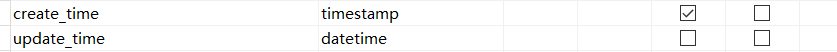
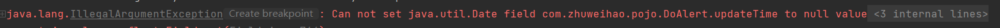
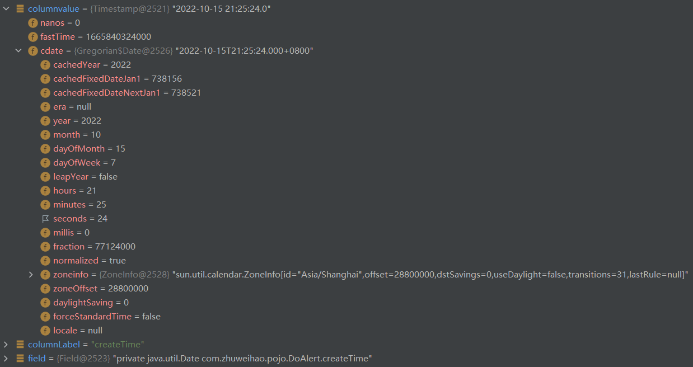
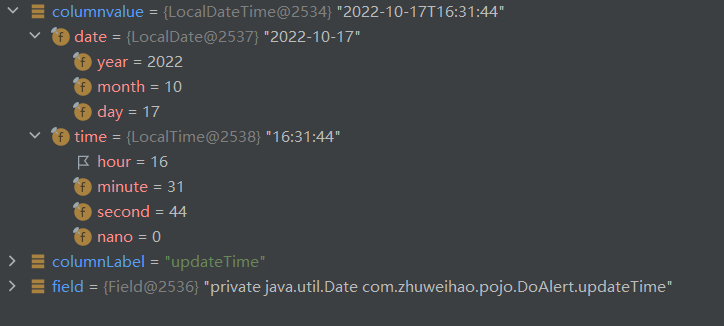
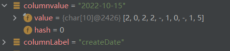
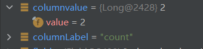

# 第一周

1. 将sql文件中的告警表导入到mysql的数据库中
2. 根据sql按照驼峰标识原则创建一个对应的类
3. 使用JDBC实现对导入表的增删改查，要求使用防止注入攻击的方式
4. 统计表中每天、每周、每日的告警次数

#### ORM映射

https://blog.csdn.net/weixin_39902545/article/details/110584999

----

面向对象编程把所有实体看成对象（object），关系型数据库则是采用实体之间的关系（relation）连接数据。很早就有人提出，关系也可以用对象表达，这样的话，就能使用面向对象编程，来操作关系型数据库。

ORM 就是通过实例对象的语法，完成关系型数据库的操作的技术，是"对象-关系映射"（Object-Relational Mapping） 的缩写。

注：有关ORM映射的编码规范可查看《Java开发手册》

#### Lombok

官网：https://projectlombok.org/

#### 注入攻击

-------

https://blog.csdn.net/lady_killer9/article/details/107300079?spm=1001.2101.3001.6661.1&utm_medium=distribute.pc_relevant_t0.none-task-blog-2%7Edefault%7EOPENSEARCH%7ERate-1-107300079-blog-128384474.pc_relevant_aa&depth_1-utm_source=distribute.pc_relevant_t0.none-task-blog-2%7Edefault%7EOPENSEARCH%7ERate-1-107300079-blog-128384474.pc_relevant_aa&utm_relevant_index=1

--------

##### 原理

程序员没有遵循代码与数据分离原则，使用户数据作为代码执行。

##### SQL注入条件

- 用户可以控制数据的输入。
- 原本要运行的代码拼接了用户的输入并运行。

示例：

后台代码：

```sql
String sql="select * from user where account='"+account+"' and password='"+password+"'";
```

攻击：

```sql
# 账号：' or 1=1-- （--后面有一个空格）
# 密码：
# 当我们输入了这个账号和密码，那么SQL语句就变成：
String sql="select * from user where account='' or 1=1 -- ' and password=''";

#账号：';drop database test;-- （--后面有一个空格）
#密码：
#当我们输入了这个账号和密码，那么SQL语句就变成：

String sql="select * from user where account='';drop database test;-- ' and password=''";
```

##### 防御SQL注入的方法

- 使用预编译语句：例，preparestatement
- 检查数据类型

#### 格式


#### Bug

##### datetime接收出错

用Date接收createTime和updateTime时，updateTime失败

mysql类型



报错



createTime



updateTime



解决办法：使用LocalDateTime进行接收

##### 注意mysql内部函数的返回值





date_format（）返回值应该用String接收

count（）返回值应该用Long接收