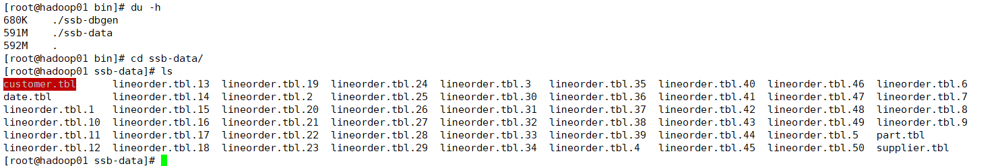
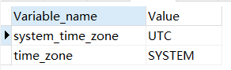
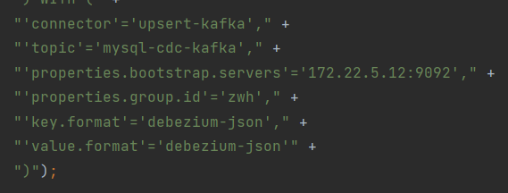
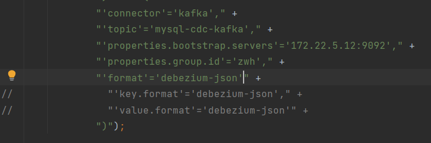

# 数据集

## Star-Schema-Benchmark

参考：https://blog.csdn.net/docsz/article/details/127570028

https://clickhouse.com/docs/zh/getting-started/example-datasets/star-schema/

https://doris.apache.org/zh-CN/docs/benchmark/ssb

----

本文采用doris源码中提供的脚本进行数据集生成


```
cd bin
sh build-ssb-dbgen.sh
#根据想要生成的数据集大小选择参数-s
#-c表示并发线程生成lineorder表的线程个数，有多少个线程就会生成多少个lineorder.tbl文件
sh gen-ssb-data.sh -s 1 -c 50
```

上述步骤会在bin目录下生成一个ssb-data文件夹，里面存放有生成的数据文件



生成的数据集大小：

| Table     | Rows             | Size | File Number |
| --------- | ---------------- | ---- | ----------- |
| lineorder | 600万（6001215） | 600M | 50          |
| customer  | 3万（30000）     | 2.8M | 1           |
| part      | 20万（200000）   | 17M  | 1           |
| supplier  | 2千（2000）      | 164K | 1           |
| dates     | 2556             | 228K | 1           |


### 将数据导入MySQL

| 容器名称  |     访问地址     |  密码  |
| :-------: | :--------------: | :----: |
| zwh_mysql | 172.22.5.12:3309 | 03283x |

#### 建表

```sql
create database ssb;

CREATE TABLE IF NOT EXISTS `lineorder` (
  `lo_orderkey` int(11) NOT NULL COMMENT "",
  `lo_linenumber` int(11) NOT NULL COMMENT "",
  `lo_custkey` int(11) NOT NULL COMMENT "",
  `lo_partkey` int(11) NOT NULL COMMENT "",
  `lo_suppkey` int(11) NOT NULL COMMENT "",
  `lo_orderdate` int(11) NOT NULL COMMENT "",
  `lo_orderpriority` varchar(16) NOT NULL COMMENT "",
  `lo_shippriority` int(11) NOT NULL COMMENT "",
  `lo_quantity` int(11) NOT NULL COMMENT "",
  `lo_extendedprice` int(11) NOT NULL COMMENT "",
  `lo_ordtotalprice` int(11) NOT NULL COMMENT "",
  `lo_discount` int(11) NOT NULL COMMENT "",
  `lo_revenue` int(11) NOT NULL COMMENT "",
  `lo_supplycost` int(11) NOT NULL COMMENT "",
  `lo_tax` int(11) NOT NULL COMMENT "",
  `lo_commitdate` int(11) NOT NULL COMMENT "",
  `lo_shipmode` varchar(11) NOT NULL COMMENT ""
);

CREATE TABLE IF NOT EXISTS `customer` (
  `c_custkey` int(11) NOT NULL COMMENT "",
  `c_name` varchar(26) NOT NULL COMMENT "",
  `c_address` varchar(41) NOT NULL COMMENT "",
  `c_city` varchar(11) NOT NULL COMMENT "",
  `c_nation` varchar(16) NOT NULL COMMENT "",
  `c_region` varchar(13) NOT NULL COMMENT "",
  `c_phone` varchar(16) NOT NULL COMMENT "",
  `c_mktsegment` varchar(11) NOT NULL COMMENT ""
);

CREATE TABLE IF NOT EXISTS `dates` (
  `d_datekey` int(11) NOT NULL COMMENT "",
  `d_date` varchar(20) NOT NULL COMMENT "",
  `d_dayofweek` varchar(10) NOT NULL COMMENT "",
  `d_month` varchar(11) NOT NULL COMMENT "",
  `d_year` int(11) NOT NULL COMMENT "",
  `d_yearmonthnum` int(11) NOT NULL COMMENT "",
  `d_yearmonth` varchar(9) NOT NULL COMMENT "",
  `d_daynuminweek` int(11) NOT NULL COMMENT "",
  `d_daynuminmonth` int(11) NOT NULL COMMENT "",
  `d_daynuminyear` int(11) NOT NULL COMMENT "",
  `d_monthnuminyear` int(11) NOT NULL COMMENT "",
  `d_weeknuminyear` int(11) NOT NULL COMMENT "",
  `d_sellingseason` varchar(14) NOT NULL COMMENT "",
  `d_lastdayinweekfl` int(11) NOT NULL COMMENT "",
  `d_lastdayinmonthfl` int(11) NOT NULL COMMENT "",
  `d_holidayfl` int(11) NOT NULL COMMENT "",
  `d_weekdayfl` int(11) NOT NULL COMMENT ""
);

 CREATE TABLE IF NOT EXISTS `supplier` (
  `s_suppkey` int(11) NOT NULL COMMENT "",
  `s_name` varchar(26) NOT NULL COMMENT "",
  `s_address` varchar(26) NOT NULL COMMENT "",
  `s_city` varchar(11) NOT NULL COMMENT "",
  `s_nation` varchar(16) NOT NULL COMMENT "",
  `s_region` varchar(13) NOT NULL COMMENT "",
  `s_phone` varchar(16) NOT NULL COMMENT ""
);

CREATE TABLE IF NOT EXISTS `part` (
  `p_partkey` int(11) NOT NULL COMMENT "",
  `p_name` varchar(23) NOT NULL COMMENT "",
  `p_mfgr` varchar(7) NOT NULL COMMENT "",
  `p_category` varchar(8) NOT NULL COMMENT "",
  `p_brand` varchar(10) NOT NULL COMMENT "",
  `p_color` varchar(12) NOT NULL COMMENT "",
  `p_type` varchar(26) NOT NULL COMMENT "",
  `p_size` int(11) NOT NULL COMMENT "",
  `p_container` varchar(11) NOT NULL COMMENT ""
);

create table if not exists `lineorder_flat` (
  `lo_orderdate` int(11) not null comment "",
  `lo_orderkey` int(11) not null comment "",
  `lo_linenumber` tinyint(4) not null comment "",
  `lo_custkey` int(11) not null comment "",
  `lo_partkey` int(11) not null comment "",
  `lo_suppkey` int(11) not null comment "",
  `lo_orderpriority` varchar(100) not null comment "",
  `lo_shippriority` tinyint(4) not null comment "",
  `lo_quantity` tinyint(4) not null comment "",
  `lo_extendedprice` int(11) not null comment "",
  `lo_ordtotalprice` int(11) not null comment "",
  `lo_discount` tinyint(4) not null comment "",
  `lo_revenue` int(11) not null comment "",
  `lo_supplycost` int(11) not null comment "",
  `lo_tax` tinyint(4) not null comment "",
  `lo_commitdate` date not null comment "",
  `lo_shipmode` varchar(100) not null comment "",
  `c_name` varchar(100) not null comment "",
  `c_address` varchar(100) not null comment "",
  `c_city` varchar(100) not null comment "",
  `c_nation` varchar(100) not null comment "",
  `c_region` varchar(100) not null comment "",
  `c_phone` varchar(100) not null comment "",
  `c_mktsegment` varchar(100) not null comment "",
  `s_name` varchar(100) not null comment "",
  `s_address` varchar(100) not null comment "",
  `s_city` varchar(100) not null comment "",
  `s_nation` varchar(100) not null comment "",
  `s_region` varchar(100) not null comment "",
  `s_phone` varchar(100) not null comment "",
  `p_name` varchar(100) not null comment "",
  `p_mfgr` varchar(100) not null comment "",
  `p_category` varchar(100) not null comment "",
  `p_brand` varchar(100) not null comment "",
  `p_color` varchar(100) not null comment "",
  `p_type` varchar(100) not null comment "",
  `p_size` tinyint(4) not null comment "",
  `p_container` varchar(100) not null comment ""
);
```

#### 导入数据

此处需要注意，lineorder.tbl如果是多线程生成的需要多次导入，有点麻烦，可以在生成数据集时单线程生成数据

```sql
load data local infile '/data/ssb-data/lineorder.tbl' into table lineorder fields terminated by '|' lines terminated by '|\n';

load data local infile '/data/ssb-data/supplier.tbl' into table supplier fields terminated by '|' lines terminated by '|\n';

load data local infile '/data/ssb-data/customer.tbl' into table customer fields terminated by '|' lines terminated by '|\n';

load data local infile '/data/ssb-data/part.tbl' into table part fields terminated by '|' lines terminated by '|\n';

load data local infile '/data/ssb-data/date.tbl' into table dates fields terminated by '|' lines terminated by '|\n';
```


```sql
insert into lineorder_flat select `lo_orderkey` , `lo_orderdate` , `lo_linenumber` , `lo_custkey` , `lo_partkey` , `lo_suppkey` , `lo_orderpriority` , `lo_shippriority` , `lo_quantity` , `lo_extendedprice` , `lo_ordtotalprice` , `lo_discount` , `lo_revenue` , `lo_supplycost` , `lo_tax` , `lo_commitdate` , `lo_shipmode` , `c_name` , `c_address` , `c_city` , `c_nation` , `c_region` , `c_phone` , `c_mktsegment` , `s_name` , `s_address` , `s_city` , `s_nation` , `s_region` , `s_phone` , `p_name` , `p_mfgr` , `p_category` , `p_brand` , `p_color` , `p_type` , `p_size` , `p_container` from lineorder l inner join customer c on (c.c_custkey = l.lo_custkey)  inner join supplier s on (s.s_suppkey = l.lo_suppkey)  inner join part p on  (p.p_partkey = l.lo_partkey) where year(lo_orderdate) in (1992, 1993);

insert into lineorder_flat select `lo_orderkey` , `lo_orderdate` , `lo_linenumber` , `lo_custkey` , `lo_partkey` , `lo_suppkey` , `lo_orderpriority` , `lo_shippriority` , `lo_quantity` , `lo_extendedprice` , `lo_ordtotalprice` , `lo_discount` , `lo_revenue` , `lo_supplycost` , `lo_tax` , `lo_commitdate` , `lo_shipmode` , `c_name` , `c_address` , `c_city` , `c_nation` , `c_region` , `c_phone` , `c_mktsegment` , `s_name` , `s_address` , `s_city` , `s_nation` , `s_region` , `s_phone` , `p_name` , `p_mfgr` , `p_category` , `p_brand` , `p_color` , `p_type` , `p_size` , `p_container` from lineorder l inner join customer c on (c.c_custkey = l.lo_custkey)  inner join supplier s on (s.s_suppkey = l.lo_suppkey)  inner join part p on  (p.p_partkey = l.lo_partkey) where year(lo_orderdate) in (1994, 1995);

insert into lineorder_flat select `lo_orderkey` , `lo_orderdate` , `lo_linenumber` , `lo_custkey` , `lo_partkey` , `lo_suppkey` , `lo_orderpriority` , `lo_shippriority` , `lo_quantity` , `lo_extendedprice` , `lo_ordtotalprice` , `lo_discount` , `lo_revenue` , `lo_supplycost` , `lo_tax` , `lo_commitdate` , `lo_shipmode` , `c_name` , `c_address` , `c_city` , `c_nation` , `c_region` , `c_phone` , `c_mktsegment` , `s_name` , `s_address` , `s_city` , `s_nation` , `s_region` , `s_phone` , `p_name` , `p_mfgr` , `p_category` , `p_brand` , `p_color` , `p_type` , `p_size` , `p_container` from lineorder l inner join customer c on (c.c_custkey = l.lo_custkey)  inner join supplier s on (s.s_suppkey = l.lo_suppkey)  inner join part p on  (p.p_partkey = l.lo_partkey) where year(lo_orderdate) in (1996, 1997);

insert into lineorder_flat select `lo_orderkey` , `lo_orderdate` , `lo_linenumber` , `lo_custkey` , `lo_partkey` , `lo_suppkey` , `lo_orderpriority` , `lo_shippriority` , `lo_quantity` , `lo_extendedprice` , `lo_ordtotalprice` , `lo_discount` , `lo_revenue` , `lo_supplycost` , `lo_tax` , `lo_commitdate` , `lo_shipmode` , `c_name` , `c_address` , `c_city` , `c_nation` , `c_region` , `c_phone` , `c_mktsegment` , `s_name` , `s_address` , `s_city` , `s_nation` , `s_region` , `s_phone` , `p_name` , `p_mfgr` , `p_category` , `p_brand` , `p_color` , `p_type` , `p_size` , `p_container` from lineorder l inner join customer c on (c.c_custkey = l.lo_custkey)  inner join supplier s on (s.s_suppkey = l.lo_suppkey)  inner join part p on  (p.p_partkey = l.lo_partkey) where year(lo_orderdate) in (1998);
```


#### 创建索引

```sql
alter table dates add primary key (d_datekey);
alter table dates add index d_year(d_year);

alter table part add primary key (p_partkey);
alter table part add index p_brand(p_brand);

alter table supplier add primary key (s_suppkey);
alter table supplier add index s_city(s_city);
alter table supplier add index s_nation(s_nation);
alter table supplier add index s_region(s_region);

alter table customer add primary key (c_custkey);
alter table customer add index c_nation(c_nation);
alter table customer add index c_region(c_region);

alter table lineorder add index lo_orderkey(lo_orderkey);
alter table lineorder add index lo_linenumber(lo_linenumber);
alter table lineorder add index lo_custkey(lo_custkey);
alter table lineorder add index lo_partkey(lo_partkey);
alter table lineorder add index lo_suppkey(lo_suppkey);
alter table lineorder add index lo_orderdate(lo_orderdate);
alter table lineorder add index lo_revenue(lo_revenue);
alter table lineorder add index lo_supplycost(lo_supplycost);

alter table lineorder_flat add index lo_orderkey(lo_orderkey);
alter table lineorder_flat add index lo_orderdate(lo_orderdate);
alter table lineorder_flat add index lo_custkey(lo_custkey);
alter table lineorder_flat add index lo_partkey(lo_partkey);
alter table lineorder_flat add index lo_suppkey(lo_suppkey);
alter table lineorder_flat add index lo_quantity(lo_quantity);
alter table lineorder_flat add index p_brand(p_brand);
alter table lineorder_flat add index c_nation(c_nation);
alter table lineorder_flat add index c_city(c_city);
alter table lineorder_flat add index s_city(s_city);
alter table lineorder_flat add index c_region(c_region);
alter table lineorder_flat add index s_region(s_region);
alter table lineorder_flat add index  p_mfgr(p_mfgr);
```


## UserBehavior

数据集链接：https://tianchi.aliyun.com/dataset/649

-----

### 导入到MySQL

#### 建表

```sql
DROP TABLE IF EXISTS `userbehavior`;
CREATE TABLE `userbehavior`  (
  `user_id` int NOT NULL,
  `item_id` int NOT NULL,
  `category_id` int NOT NULL,
  `behavior_type` varchar(45) CHARACTER SET utf8mb4 COLLATE utf8mb4_0900_ai_ci NOT NULL,
  `timestamp` int NOT NULL
) ENGINE = InnoDB CHARACTER SET = utf8mb4 COLLATE = utf8mb4_0900_ai_ci ROW_FORMAT = Dynamic;
```

#### 导入数据


# 双流JOIN


## Window Join


# CDC

### Mysql CDC

#### mysql cdc 单表全增量自动化接入kafka


# ERROR

```
ERROR org.apache.flink.runtime.source.coordinator.SourceCoordinator  - Failed to create Source Enumerator for source Source: MySQL Source
org.apache.flink.table.api.ValidationException: The MySQL server has a timezone offset (0 seconds ahead of UTC) which does not match the configured timezone Asia/Shanghai. Specify the right server-time-zone to avoid inconsistencies for time-related fields.
	at com.ververica.cdc.connectors.mysql.MySqlValidator.checkTimeZone(MySqlValidator.java:191)
	at com.ververica.cdc.connectors.mysql.MySqlValidator.validate(MySqlValidator.java:81)
	at com.ververica.cdc.connectors.mysql.source.MySqlSource.createEnumerator(MySqlSource.java:170)
	at org.apache.flink.runtime.source.coordinator.SourceCoordinator.start(SourceCoordinator.java:124)
	at org.apache.flink.runtime.operators.coordination.RecreateOnResetOperatorCoordinator$DeferrableCoordinator.resetAndStart(RecreateOnResetOperatorCoordinator.java:389)
	at org.apache.flink.runtime.operators.coordination.RecreateOnResetOperatorCoordinator.lambda$resetToCheckpoint$6(RecreateOnResetOperatorCoordinator.java:144)
	at java.util.concurrent.CompletableFuture.uniWhenComplete(CompletableFuture.java:774)
	at java.util.concurrent.CompletableFuture$UniWhenComplete.tryFire(CompletableFuture.java:750)
	at java.util.concurrent.CompletableFuture.postComplete(CompletableFuture.java:488)
	at java.util.concurrent.CompletableFuture.complete(CompletableFuture.java:1975)
	at org.apache.flink.runtime.operators.coordination.ComponentClosingUtils.lambda$closeAsyncWithTimeout$0(ComponentClosingUtils.java:77)
	at java.lang.Thread.run(Thread.java:750)
```


```sql
select @@global.time_zone,@@session.time_zone;
```

> System代表采用系统时区
> CST 是一种比较乱的时区，它包括了4个时区
> CST可视为美国、澳大利亚、古巴或中国的标准时间。
> 同时代表了下面4个时区：
> 1、CST Central Standard Time(USA)UT-6：00。
> 2、CST Central Standard Time(Australia)UT9：30。
> 3、CST China Standard Time UT8：00。
> 4、CST Cuba Standard Time UT-4：00。
> 由于世界各国家与地区经度不同，地方时也有所不同，因此会划分为不同的时区。正式的时区划分包括24个时区，每一时区由一个英文字母表示。每隔经度15°划分一个时区，有一个例外，每个时区有一条中央子午线；例如，GMT属于“z”区，因此其时间后通常添加后缀“Z”


```sql
show variables like '%time_zone%';
```



```sql
查看当前时间
select NOW();
```


解决办法：在mysql配置文件中加入以下配置，重启mysql服务

```
[mysql]
default-time_zone = '+8:00'
```


```
//        tableEnv.executeSql("CREATE TABLE supplier_source(" +
//                "test STRING primary key" +
//                ") with (" +
//                " 'connector' = 'mysql-cdc'," +
//                " 'hostname' = '172.22.5.12'," +
//                " 'port' = '3309'," +
//                " 'username' = 'root'," +
//                " 'password' = '03283x'," +
//                " 'database-name' = 'ssb'," +
//                " 'table-name' = 'test'" +
//                ")");
```


```
Caused by: org.apache.flink.table.api.ValidationException: 'upsert-kafka' connector doesn't support 'debezium-json' as key format, because 'debezium-json' is not in insert-only mode.

```




使用json格式或者csv格式在删除数据时会报空指针异常，添加和修改数据正常，upsert-kafka又不支持debezium-json格式

如果使用kafka连接器，格式使用json，则会报错如下

```
Caused by: org.apache.flink.table.api.ValidationException: The Kafka table 'default_catalog.default_database.supplier_sink' with 'json' format doesn't support defining PRIMARY KEY constraint on the table, because it can't guarantee the semantic of primary key.
```

解决办法：



连接器应该使用kafka，网上教程参差不齐，建议直接参考官网文档

> 被下面的教程所误导：https://www.ikeguang.com/article/2055


```
0    [SourceCoordinator-Source: TableSourceScan(table=[[default_catalog, default_database, lineorder_source]], fields=[lo_orderkey, lo_linenumber, lo_custkey, lo_partkey, lo_suppkey, lo_orderdate, lo_orderpriority, lo_shippriority, lo_quantity, lo_extendedprice, lo_ordtotalprice, lo_discount, lo_revenue, lo_supplycost, lo_tax, lo_commitdate, lo_shipmode])] ERROR org.apache.flink.runtime.source.coordinator.SourceCoordinator  - Uncaught exception in the SplitEnumerator for Source Source: TableSourceScan(table=[[default_catalog, default_database, lineorder_source]], fields=[lo_orderkey, lo_linenumber, lo_custkey, lo_partkey, lo_suppkey, lo_orderdate, lo_orderpriority, lo_shippriority, lo_quantity, lo_extendedprice, lo_ordtotalprice, lo_discount, lo_revenue, lo_supplycost, lo_tax, lo_commitdate, lo_shipmode]) while handling operator event RequestSplitEvent (host='') from subtask 17. Triggering job failover.
org.apache.flink.util.FlinkRuntimeException: InterruptedException while waiting for asynchronously snapshot split
	at com.ververica.cdc.connectors.mysql.source.assigners.MySqlSnapshotSplitAssigner.getNext(MySqlSnapshotSplitAssigner.java:295)
	at com.ververica.cdc.connectors.mysql.source.assigners.MySqlHybridSplitAssigner.getNext(MySqlHybridSplitAssigner.java:123)
	at com.ververica.cdc.connectors.mysql.source.enumerator.MySqlSourceEnumerator.assignSplits(MySqlSourceEnumerator.java:201)
	at com.ververica.cdc.connectors.mysql.source.enumerator.MySqlSourceEnumerator.handleSplitRequest(MySqlSourceEnumerator.java:117)
	at org.apache.flink.runtime.source.coordinator.SourceCoordinator.lambda$handleEventFromOperator$1(SourceCoordinator.java:157)
	at org.apache.flink.runtime.source.coordinator.SourceCoordinator.lambda$runInEventLoop$8(SourceCoordinator.java:329)
	at org.apache.flink.util.ThrowableCatchingRunnable.run(ThrowableCatchingRunnable.java:40)
	at java.util.concurrent.Executors$RunnableAdapter.call(Executors.java:511)
	at java.util.concurrent.FutureTask.run(FutureTask.java:266)
	at java.util.concurrent.ScheduledThreadPoolExecutor$ScheduledFutureTask.access$201(ScheduledThreadPoolExecutor.java:180)
	at java.util.concurrent.ScheduledThreadPoolExecutor$ScheduledFutureTask.run(ScheduledThreadPoolExecutor.java:293)
	at java.util.concurrent.ThreadPoolExecutor.runWorker(ThreadPoolExecutor.java:1149)
	at java.util.concurrent.ThreadPoolExecutor$Worker.run(ThreadPoolExecutor.java:624)
	at java.lang.Thread.run(Thread.java:750)

```

