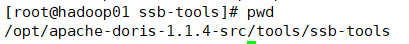

# 数据集

## Star-Schema-Benchmark

参考：https://blog.csdn.net/docsz/article/details/127570028

https://clickhouse.com/docs/zh/getting-started/example-datasets/star-schema/

https://doris.apache.org/zh-CN/docs/benchmark/ssb

----

本文采用doris源码中提供的脚本进行数据集生成



```
cd bin
sh build-ssb-dbgen.sh
#根据想要生成的数据集大小选择参数-s
#-c表示并发线程生成lineorder表的线程个数，有多少个线程就会生成多少个lineorder.tbl文件
sh gen-ssb-data.sh -s 1 -c 50
```

上述步骤会在bin目录下生成一个ssb-data文件夹，里面存放有生成的数据文件


生成的数据集大小：

| Table     | Rows             | Size | File Number |
| --------- | ---------------- | ---- | ----------- |
| lineorder | 600万（6001215） | 600M | 50          |
| customer  | 3万（30000）     | 2.8M | 1           |
| part      | 20万（200000）   | 17M  | 1           |
| supplier  | 2千（2000）      | 164K | 1           |
| dates     | 2556             | 228K | 1           |


### 将数据导入MySQL

| 容器名称  |     访问地址     |  密码  |
| :-------: | :--------------: | :----: |
| zwh_mysql | 172.22.5.12:3309 | 03283x |

#### 建表

```sql
create database ssb;

CREATE TABLE IF NOT EXISTS `lineorder` (
  `lo_orderkey` int(11) NOT NULL COMMENT "",
  `lo_linenumber` int(11) NOT NULL COMMENT "",
  `lo_custkey` int(11) NOT NULL COMMENT "",
  `lo_partkey` int(11) NOT NULL COMMENT "",
  `lo_suppkey` int(11) NOT NULL COMMENT "",
  `lo_orderdate` int(11) NOT NULL COMMENT "",
  `lo_orderpriority` varchar(16) NOT NULL COMMENT "",
  `lo_shippriority` int(11) NOT NULL COMMENT "",
  `lo_quantity` int(11) NOT NULL COMMENT "",
  `lo_extendedprice` int(11) NOT NULL COMMENT "",
  `lo_ordtotalprice` int(11) NOT NULL COMMENT "",
  `lo_discount` int(11) NOT NULL COMMENT "",
  `lo_revenue` int(11) NOT NULL COMMENT "",
  `lo_supplycost` int(11) NOT NULL COMMENT "",
  `lo_tax` int(11) NOT NULL COMMENT "",
  `lo_commitdate` int(11) NOT NULL COMMENT "",
  `lo_shipmode` varchar(11) NOT NULL COMMENT ""
);

CREATE TABLE IF NOT EXISTS `customer` (
  `c_custkey` int(11) NOT NULL COMMENT "",
  `c_name` varchar(26) NOT NULL COMMENT "",
  `c_address` varchar(41) NOT NULL COMMENT "",
  `c_city` varchar(11) NOT NULL COMMENT "",
  `c_nation` varchar(16) NOT NULL COMMENT "",
  `c_region` varchar(13) NOT NULL COMMENT "",
  `c_phone` varchar(16) NOT NULL COMMENT "",
  `c_mktsegment` varchar(11) NOT NULL COMMENT ""
);

CREATE TABLE IF NOT EXISTS `dates` (
  `d_datekey` int(11) NOT NULL COMMENT "",
  `d_date` varchar(20) NOT NULL COMMENT "",
  `d_dayofweek` varchar(10) NOT NULL COMMENT "",
  `d_month` varchar(11) NOT NULL COMMENT "",
  `d_year` int(11) NOT NULL COMMENT "",
  `d_yearmonthnum` int(11) NOT NULL COMMENT "",
  `d_yearmonth` varchar(9) NOT NULL COMMENT "",
  `d_daynuminweek` int(11) NOT NULL COMMENT "",
  `d_daynuminmonth` int(11) NOT NULL COMMENT "",
  `d_daynuminyear` int(11) NOT NULL COMMENT "",
  `d_monthnuminyear` int(11) NOT NULL COMMENT "",
  `d_weeknuminyear` int(11) NOT NULL COMMENT "",
  `d_sellingseason` varchar(14) NOT NULL COMMENT "",
  `d_lastdayinweekfl` int(11) NOT NULL COMMENT "",
  `d_lastdayinmonthfl` int(11) NOT NULL COMMENT "",
  `d_holidayfl` int(11) NOT NULL COMMENT "",
  `d_weekdayfl` int(11) NOT NULL COMMENT ""
);

 CREATE TABLE IF NOT EXISTS `supplier` (
  `s_suppkey` int(11) NOT NULL COMMENT "",
  `s_name` varchar(26) NOT NULL COMMENT "",
  `s_address` varchar(26) NOT NULL COMMENT "",
  `s_city` varchar(11) NOT NULL COMMENT "",
  `s_nation` varchar(16) NOT NULL COMMENT "",
  `s_region` varchar(13) NOT NULL COMMENT "",
  `s_phone` varchar(16) NOT NULL COMMENT ""
);

CREATE TABLE IF NOT EXISTS `part` (
  `p_partkey` int(11) NOT NULL COMMENT "",
  `p_name` varchar(23) NOT NULL COMMENT "",
  `p_mfgr` varchar(7) NOT NULL COMMENT "",
  `p_category` varchar(8) NOT NULL COMMENT "",
  `p_brand` varchar(10) NOT NULL COMMENT "",
  `p_color` varchar(12) NOT NULL COMMENT "",
  `p_type` varchar(26) NOT NULL COMMENT "",
  `p_size` int(11) NOT NULL COMMENT "",
  `p_container` varchar(11) NOT NULL COMMENT ""
);

create table if not exists `lineorder_flat` (
  `lo_orderkey` int(11) not null comment "",
  `lo_orderdate` int(11) not null comment "",
  `lo_linenumber` tinyint(4) not null comment "",
  `lo_custkey` int(11) not null comment "",
  `lo_partkey` int(11) not null comment "",
  `lo_suppkey` int(11) not null comment "",
  `lo_orderpriority` varchar(100) not null comment "",
  `lo_shippriority` tinyint(4) not null comment "",
  `lo_quantity` tinyint(4) not null comment "",
  `lo_extendedprice` int(11) not null comment "",
  `lo_ordtotalprice` int(11) not null comment "",
  `lo_discount` tinyint(4) not null comment "",
  `lo_revenue` int(11) not null comment "",
  `lo_supplycost` int(11) not null comment "",
  `lo_tax` tinyint(4) not null comment "",
  `lo_commitdate` date not null comment "",
  `lo_shipmode` varchar(100) not null comment "",
  `c_name` varchar(100) not null comment "",
  `c_address` varchar(100) not null comment "",
  `c_city` varchar(100) not null comment "",
  `c_nation` varchar(100) not null comment "",
  `c_region` varchar(100) not null comment "",
  `c_phone` varchar(100) not null comment "",
  `c_mktsegment` varchar(100) not null comment "",
  `s_name` varchar(100) not null comment "",
  `s_address` varchar(100) not null comment "",
  `s_city` varchar(100) not null comment "",
  `s_nation` varchar(100) not null comment "",
  `s_region` varchar(100) not null comment "",
  `s_phone` varchar(100) not null comment "",
  `p_name` varchar(100) not null comment "",
  `p_mfgr` varchar(100) not null comment "",
  `p_category` varchar(100) not null comment "",
  `p_brand` varchar(100) not null comment "",
  `p_color` varchar(100) not null comment "",
  `p_type` varchar(100) not null comment "",
  `p_size` tinyint(4) not null comment "",
  `p_container` varchar(100) not null comment ""
);
```

#### 导入数据

此处需要注意，lineorder.tbl如果是多线程生成的需要多次导入，有点麻烦，可以在生成数据集时单线程生成数据

```sql
load data local infile '/data/ssb-data/lineorder.tbl' into table lineorder fields terminated by '|' lines terminated by '|\n';

load data local infile '/data/ssb-data/supplier.tbl' into table supplier fields terminated by '|' lines terminated by '|\n';

load data local infile '/data/ssb-data/customer.tbl' into table customer fields terminated by '|' lines terminated by '|\n';

load data local infile '/data/ssb-data/part.tbl' into table part fields terminated by '|' lines terminated by '|\n';

load data local infile '/data/ssb-data/date.tbl' into table dates fields terminated by '|' lines terminated by '|\n';
```


```sql
insert into lineorder_flat select `lo_orderkey` , `lo_orderdate` , `lo_linenumber` , `lo_custkey` , `lo_partkey` , `lo_suppkey` , `lo_orderpriority` , `lo_shippriority` , `lo_quantity` , `lo_extendedprice` , `lo_ordtotalprice` , `lo_discount` , `lo_revenue` , `lo_supplycost` , `lo_tax` , `lo_commitdate` , `lo_shipmode` , `c_name` , `c_address` , `c_city` , `c_nation` , `c_region` , `c_phone` , `c_mktsegment` , `s_name` , `s_address` , `s_city` , `s_nation` , `s_region` , `s_phone` , `p_name` , `p_mfgr` , `p_category` , `p_brand` , `p_color` , `p_type` , `p_size` , `p_container` from lineorder l inner join customer c on (c.c_custkey = l.lo_custkey)  inner join supplier s on (s.s_suppkey = l.lo_suppkey)  inner join part p on  (p.p_partkey = l.lo_partkey) where year(lo_orderdate) in (1992, 1993);

insert into lineorder_flat select `lo_orderkey` , `lo_orderdate` , `lo_linenumber` , `lo_custkey` , `lo_partkey` , `lo_suppkey` , `lo_orderpriority` , `lo_shippriority` , `lo_quantity` , `lo_extendedprice` , `lo_ordtotalprice` , `lo_discount` , `lo_revenue` , `lo_supplycost` , `lo_tax` , `lo_commitdate` , `lo_shipmode` , `c_name` , `c_address` , `c_city` , `c_nation` , `c_region` , `c_phone` , `c_mktsegment` , `s_name` , `s_address` , `s_city` , `s_nation` , `s_region` , `s_phone` , `p_name` , `p_mfgr` , `p_category` , `p_brand` , `p_color` , `p_type` , `p_size` , `p_container` from lineorder l inner join customer c on (c.c_custkey = l.lo_custkey)  inner join supplier s on (s.s_suppkey = l.lo_suppkey)  inner join part p on  (p.p_partkey = l.lo_partkey) where year(lo_orderdate) in (1994, 1995);

insert into lineorder_flat select `lo_orderkey` , `lo_orderdate` , `lo_linenumber` , `lo_custkey` , `lo_partkey` , `lo_suppkey` , `lo_orderpriority` , `lo_shippriority` , `lo_quantity` , `lo_extendedprice` , `lo_ordtotalprice` , `lo_discount` , `lo_revenue` , `lo_supplycost` , `lo_tax` , `lo_commitdate` , `lo_shipmode` , `c_name` , `c_address` , `c_city` , `c_nation` , `c_region` , `c_phone` , `c_mktsegment` , `s_name` , `s_address` , `s_city` , `s_nation` , `s_region` , `s_phone` , `p_name` , `p_mfgr` , `p_category` , `p_brand` , `p_color` , `p_type` , `p_size` , `p_container` from lineorder l inner join customer c on (c.c_custkey = l.lo_custkey)  inner join supplier s on (s.s_suppkey = l.lo_suppkey)  inner join part p on  (p.p_partkey = l.lo_partkey) where year(lo_orderdate) in (1996, 1997);

insert into lineorder_flat select `lo_orderkey` , `lo_orderdate` , `lo_linenumber` , `lo_custkey` , `lo_partkey` , `lo_suppkey` , `lo_orderpriority` , `lo_shippriority` , `lo_quantity` , `lo_extendedprice` , `lo_ordtotalprice` , `lo_discount` , `lo_revenue` , `lo_supplycost` , `lo_tax` , `lo_commitdate` , `lo_shipmode` , `c_name` , `c_address` , `c_city` , `c_nation` , `c_region` , `c_phone` , `c_mktsegment` , `s_name` , `s_address` , `s_city` , `s_nation` , `s_region` , `s_phone` , `p_name` , `p_mfgr` , `p_category` , `p_brand` , `p_color` , `p_type` , `p_size` , `p_container` from lineorder l inner join customer c on (c.c_custkey = l.lo_custkey)  inner join supplier s on (s.s_suppkey = l.lo_suppkey)  inner join part p on  (p.p_partkey = l.lo_partkey) where year(lo_orderdate) in (1998);
```


#### 创建索引

```sql
alter table dates add primary key (d_datekey);
alter table dates add index d_year(d_year);

alter table part add primary key (p_partkey);
alter table part add index p_brand(p_brand);

alter table supplier add primary key (s_suppkey);
alter table supplier add index s_city(s_city);
alter table supplier add index s_nation(s_nation);
alter table supplier add index s_region(s_region);

alter table customer add primary key (c_custkey);
alter table customer add index c_nation(c_nation);
alter table customer add index c_region(c_region);

alter table lineorder add index lo_orderkey(lo_orderkey);
alter table lineorder add index lo_linenumber(lo_linenumber);
alter table lineorder add index lo_custkey(lo_custkey);
alter table lineorder add index lo_partkey(lo_partkey);
alter table lineorder add index lo_suppkey(lo_suppkey);
alter table lineorder add index lo_orderdate(lo_orderdate);
alter table lineorder add index lo_revenue(lo_revenue);
alter table lineorder add index lo_supplycost(lo_supplycost);

alter table lineorder_flat add index lo_orderkey(lo_orderkey);
alter table lineorder_flat add index lo_orderdate(lo_orderdate);
alter table lineorder_flat add index lo_custkey(lo_custkey);
alter table lineorder_flat add index lo_partkey(lo_partkey);
alter table lineorder_flat add index lo_suppkey(lo_suppkey);
alter table lineorder_flat add index lo_quantity(lo_quantity);
alter table lineorder_flat add index p_brand(p_brand);
alter table lineorder_flat add index c_nation(c_nation);
alter table lineorder_flat add index c_city(c_city);
alter table lineorder_flat add index s_city(s_city);
alter table lineorder_flat add index c_region(c_region);
alter table lineorder_flat add index s_region(s_region);
alter table lineorder_flat add index  p_mfgr(p_mfgr);
```


## UserBehavior

数据集链接：https://tianchi.aliyun.com/dataset/649

-----

### 导入到MySQL

#### 建表

```sql
DROP TABLE IF EXISTS `userbehavior`;
CREATE TABLE `userbehavior`  (
  `user_id` int NOT NULL,
  `item_id` int NOT NULL,
  `category_id` int NOT NULL,
  `behavior_type` varchar(45) CHARACTER SET utf8mb4 COLLATE utf8mb4_0900_ai_ci NOT NULL,
  `timestamp` int NOT NULL
) ENGINE = InnoDB CHARACTER SET = utf8mb4 COLLATE = utf8mb4_0900_ai_ci ROW_FORMAT = Dynamic;
```

#### 导入数据

```sql
load data local infile '/data/UserBehavior.csv' into table userbehavior fields terminated by ',';
```


#### 选取100万条数据导入

```python
if __name__ == '__main__':
    n = 100
    userbehavior = pandas.read_csv(r"C:\\Users\\ZWH\\Desktop\\linux\\UserBehavior.csv", header=0,
                                   skiprows=lambda i: i % n != 0)
    userbehavior.info()
    userbehavior.to_csv("./userbehavior_0.01.csv", header=None, index=None)
```

上面的代码可以实现等间隔采样。也可以采用随机采样的方式

```python
if __name__ == '__main__':
    userbehavior = pandas.read_csv(r"C:\\Users\\ZWH\\Desktop\\linux\\UserBehavior.csv", header=0,
                                   skiprows=lambda i: i > 0 and random.random() > 0.01)
    userbehavior.info()
    userbehavior.to_csv("./userbehavior_0.01_random.csv", header=None, index=None)
```


```sql
DROP TABLE IF EXISTS `userbehavior_0.01`;
CREATE TABLE `userbehavior_0.01`  (
  `user_id` int NOT NULL,
  `item_id` int NOT NULL,
  `category_id` int NOT NULL,
  `behavior_type` varchar(45) CHARACTER SET utf8mb4 COLLATE utf8mb4_0900_ai_ci NOT NULL,
  `timestamp` int NOT NULL,
	PRIMARY KEY (`user_id`,`item_id`,`timestamp`)
) ENGINE = InnoDB CHARACTER SET = utf8mb4 COLLATE = utf8mb4_0900_ai_ci ROW_FORMAT = Dynamic;

LOAD DATA LOCAL INFILE 'F:\\Python_ZWH\\userbehavior_0.01.csv' INTO TABLE `userbehavior_0.01` FIELDS TERMINATED BY ',';
```


# 双流JOIN


## Window Join

Flink提供了一个窗口联结（window join）算子，可以定义时间窗口，并将两条流中共享一个公共键（key）的数据放在窗口中进行配对处理，实现将两条流的数据进行合并、且同样针对某段时间进行处理和统计。

窗口联结在代码中的实现，首先需要调用DataStream的.join()方法来合并两条流，得到一 个 JoinedStreams；接着通过.where()和.equalTo()方法指定两条流中联结的key；然后通过.window()开窗口，并调用.apply()传入联结窗口函数进行处理计算。通用调用形式如下：

```java
stream1.join(stream2)
	.where(<KeySelector>)
	.equalTo(<KeySelector>)
	.window(<WindowAssigner>)
	.apply(<JoinFunction>)
```

调用.apply()可以看作实现了一个特殊的窗口函数。注意这里只能调用.apply()，没有其他替代的方法。 传入的JoinFunction也是一个函数类接口，使用时需要实现内部的.join()方法。这个方法有两个参数，分别表示两条流中成对匹配的数据。

```java
public interface JoinFunction<IN1, IN2, OUT> extends Function, Serializable {
	OUT join(IN1 first, IN2 second) throws Exception;
}
```

两条流的数据到来之后，首先会按照key分组、进入对应的窗口中存储；当到达窗口结束时间时，算子会先统计出窗口内两条流的数据的所有组合，也就是对两条流中的数据做一个笛卡尔积（相当于表的交叉连接，cross join），然后进行遍历，把每一对匹配的数据，作为参数 (first，second)传入JoinFunction的.join()方法进行计算处理，得到的结果直接输出。所以窗口中每有一对数据成功联结匹配，JoinFunction的.join()方法就会被调用一次，并输出一个结果。


除了JoinFunction，在.apply()方法中还可以传入FlatJoinFunction，用法非常类似，只是内部需要实现的.join()方法没有返回值。结果的输出是通过收集器（Collector）来实现的，所以对于一对匹配数据可以输出任意条结果。

示例程序

```java
public class TumblingWindowJoin {

    private static OutputTag<lineorder> URGENT = new OutputTag<lineorder>("1") {
    };
    private static OutputTag<lineorder> HIGH = new OutputTag<lineorder>("2") {
    };
    private static OutputTag<lineorder> MEDIUM = new OutputTag<lineorder>("3") {
    };
    private static OutputTag<lineorder> NOT_SPECIFIED = new OutputTag<lineorder>("4") {
    };
    private static OutputTag<lineorder> LOW = new OutputTag<lineorder>("5") {
    };

    public static void main(String[] args) throws Exception {
        StreamExecutionEnvironment executionEnvironment = StreamExecutionEnvironment.getExecutionEnvironment();
        executionEnvironment.setParallelism(1);

        KafkaSource<String> lineorder_source = KafkaSource.<String>builder()
                .setBootstrapServers("172.22.5.12:9092")
                .setTopics("lineorder-cdc")
                .setStartingOffsets(OffsetsInitializer.earliest())
                .setValueOnlyDeserializer(new SimpleStringSchema())
                .build();

        SingleOutputStreamOperator<lineorder> process = executionEnvironment
                .fromSource(lineorder_source, WatermarkStrategy.forMonotonousTimestamps(), "lineorder")
                .process(new ProcessFunction<String, lineorder>() {
                    @Override
                    public void processElement(String s, ProcessFunction<String, lineorder>.Context context, Collector<lineorder> collector) throws Exception {
                        lineorder lineorder = JSONUtil.jsonToPojo(JSON.parseObject(s).getString("after"), lineorder.class);
                        String lo_orderpriority = null;
                        if (lineorder != null) {
                            lo_orderpriority = lineorder.getLo_orderpriority();
                        }
                        if (lo_orderpriority.equalsIgnoreCase("1-URGENT")) {
                            context.output(URGENT, lineorder);
                        } else if (lo_orderpriority.equalsIgnoreCase("2-HIGH")) {
                            context.output(HIGH, lineorder);
                        } else if (lo_orderpriority.equalsIgnoreCase("3-MEDIUM")) {
                            context.output(MEDIUM, lineorder);
                        } else if (lo_orderpriority.equalsIgnoreCase("4-NOT SPECIFIED")) {
                            context.output(NOT_SPECIFIED, lineorder);
                        } else if (lo_orderpriority.equalsIgnoreCase("5-LOW")) {
                            context.output(LOW, lineorder);
                        }

                    }
                });
        DataStream<lineorder> urgent = process.getSideOutput(URGENT);
        DataStream<lineorder> high = process.getSideOutput(HIGH);
        DataStream<lineorder> medium = process.getSideOutput(MEDIUM);
        DataStream<lineorder> not_specified = process.getSideOutput(NOT_SPECIFIED);
        DataStream<lineorder> low = process.getSideOutput(LOW);

        urgent
                .join(high)
                .where(r -> r.getLo_suppkey())
                .equalTo(r -> r.getLo_suppkey())
                .window(SlidingEventTimeWindows.of(Time.seconds(20),Time.seconds(10)))
                .apply(new JoinFunction<lineorder, lineorder, Tuple3<Integer, Integer, Integer>>() {
                    @Override
                    public Tuple3<Integer, Integer, Integer> join(lineorder lineorder, lineorder lineorder2) throws Exception {

                        return Tuple3.of(lineorder.getLo_suppkey(), lineorder.getLo_custkey(), lineorder2.getLo_custkey());
                    }
                }).print();

        executionEnvironment.execute();

    }
}
```


# CDC

### Mysql CDC

官网：https://ververica.github.io/flink-cdc-connectors/master/content/connectors/mysql-cdc%28ZH%29.html

注意connector版本选择，官网有详细的版本选择介绍

```xml
        <dependency>
            <groupId>com.ververica</groupId>
            <artifactId>flink-connector-mysql-cdc</artifactId>
            <version>2.3.0</version>
            <scope>${compileMode}</scope>
        </dependency>
```

#### mysql cdc 单表全增量自动化接入kafka

##### DataStream API

示例程序：

```java
public class MySqlBinlogSource {
    public static void main(String[] args) throws Exception {
        MySqlSource<String> mySqlSource = MySqlSource.<String>builder()
                .hostname("172.22.5.12")
                .port(3309)
                .databaseList("ssb") // 设置捕获的数据库， 如果需要同步整个数据库，请将 tableList 设置为 ".*".
                .tableList("ssb.supplier") // 设置捕获的表，格式为 库名.表名 ，可以多张表，用逗号分隔开
                .username("root")
                .password("03283x")
                .deserializer(new CustomerJsonDeserializationSchema()) // 将 SourceRecord 转换为 JSON 字符串
                .build();

        StreamExecutionEnvironment env = StreamExecutionEnvironment.getExecutionEnvironment();

        // 设置 3s 的 checkpoint 间隔
        env.enableCheckpointing(3000);

        KafkaSink<String> kafkaSink = KafkaSink.<String>builder()
                .setBootstrapServers("172.22.5.12:9092")
                .setRecordSerializer(KafkaRecordSerializationSchema.builder()
                        .setTopic("mysql-cdc-kafka")
                        .setKeySerializationSchema(new SimpleStringSchema())
                        .setValueSerializationSchema(new SimpleStringSchema())
                        .build()
                )
                .setDeliverGuarantee(DeliveryGuarantee.AT_LEAST_ONCE)
                .build();
        env
                .fromSource(mySqlSource, WatermarkStrategy.noWatermarks(), "MySQL Source")
                // 设置 source 节点的并行度为 4
                .setParallelism(4)
                .sinkTo(kafkaSink)
                .setParallelism(1);

        env.execute("Print MySQL Snapshot + Binlog");

    }
}
```

程序解释

- CustomerJsonDeserializationSchema是自定义的反序列化器，也可以使用自带的反序列化器，如JsonDebeziumDeserializationSchema()，new StringDebeziumDeserializationSchema()，自定义的序列化器相比来说更为灵活。
- 获取到数据流之后可以根据需求sink到不同的系统，示例程序sink到了kafka中

注意：

- 要实现增量同步必须开启checkpoint，默认是不开启的，示例程序为3秒

- 配置选项`scan.startup.mode`指定 MySQL CDC 使用者的启动模式。有效枚举包括：

  - `initial` （默认）：在第一次启动时对受监视的数据库表执行初始快照，并继续读取最新的 binlog。
  - `earliest-offset`：跳过快照阶段，从可读取的最早 binlog 位点开始读取
  - `latest-offset`：首次启动时，从不对受监视的数据库表执行快照， 连接器仅从 binlog 的结尾处开始读取，这意味着连接器只能读取在连接器启动之后的数据更改。
  - `specific-offset`：跳过快照阶段，从指定的 binlog 位点开始读取。位点可通过 binlog 文件名和位置指定，或者在 GTID 在集群上启用时通过 GTID 集合指定。
  - `timestamp`：跳过快照阶段，从指定的时间戳开始读取 binlog 事件。

- 注意下面的这种方法在flink1.14版本添加了过期声明，应使用示例程序中的方法

  ```java
          streamSource
                  .addSink(new FlinkKafkaProducer<String>(
                          "clicks",
                          new SimpleStringSchema(),
                          properties
                  ));
  ```

##### Table API/SQL

示例程序

```java
public class SupplierCDC {
    public static void main(String[] args) {
        StreamExecutionEnvironment env = StreamExecutionEnvironment.getExecutionEnvironment();
        env.enableCheckpointing(3000);

        StreamTableEnvironment tableEnvironment = StreamTableEnvironment.create(env);

        tableEnvironment.executeSql("CREATE TABLE `supplier_source`(" +
                "`s_suppkey` INT PRIMARY KEY NOT ENFORCED," +
                "`s_name` STRING," +
                "`s_address` STRING," +
                "`s_city` STRING," +
                "`s_nation` STRING," +
                "`s_region` STRING," +
                "`s_phone` STRING" +
                ") WITH (" +
                "'connector'='mysql-cdc'," +
                "'hostname'='172.22.5.12'," +
                "'port'='3309'," +
                "'username'='root'," +
                "'password'='03283x'," +
                "'database-name'='ssb'," +
                "'table-name'='supplier'" +
                ")");
        tableEnvironment.executeSql("CREATE TABLE `supplier_sink`(" +
                "`s_suppkey` INT PRIMARY KEY NOT ENFORCED," +
                "`s_name` STRING," +
                "`s_address` STRING," +
                "`s_city` STRING," +
                "`s_nation` STRING," +
                "`s_region` STRING," +
                "`s_phone` STRING" +
                ") WITH (" +
                "'connector'='kafka'," +
                "'topic'='supplier-cdc'," +
                "'properties.bootstrap.servers'='172.22.5.12:9092'," +
                "'properties.group.id'='zwh'," +
                "'format'='debezium-json'," +
                "'scan.startup.mode' = 'latest-offset'" +
                ")");

        tableEnvironment.executeSql("insert into supplier_sink select * from supplier_source");
    }
}
```

注意：

- 表必须定义主键，否则会报错，详情见[ERROR](#error3)
- mysql-cdc connector支持正则表达式匹配多库多表
- 只能使用kafka connector不能使用upsert kafka connector，详情见[ERROR](#error2)

##### 小结

上面的两种方式使用起来各有优劣

- DataStream API可以同时监控多库多表（此处指的多库多表是指表结构完全不同），但是Flink SQL API不能同时监控多库多表

- DataStream需要自己实现反序列化器，比较麻烦

问题：

使用DataStream API时，全量读取阶段操作类型为READ，即r；增量读取阶段为CREATE，即c；修改操作操作类型为UPDATE，即u


使用Flink SQL时，全量和增量读取阶段操作类型全部都为c；修改操作会产生两条消息，操作类型分别为d，c


# ERROR

##### mysql时区

```
ERROR org.apache.flink.runtime.source.coordinator.SourceCoordinator  - Failed to create Source Enumerator for source Source: MySQL Source
org.apache.flink.table.api.ValidationException: The MySQL server has a timezone offset (0 seconds ahead of UTC) which does not match the configured timezone Asia/Shanghai. Specify the right server-time-zone to avoid inconsistencies for time-related fields.
	at com.ververica.cdc.connectors.mysql.MySqlValidator.checkTimeZone(MySqlValidator.java:191)
	at com.ververica.cdc.connectors.mysql.MySqlValidator.validate(MySqlValidator.java:81)
	at com.ververica.cdc.connectors.mysql.source.MySqlSource.createEnumerator(MySqlSource.java:170)
	at org.apache.flink.runtime.source.coordinator.SourceCoordinator.start(SourceCoordinator.java:124)
	at org.apache.flink.runtime.operators.coordination.RecreateOnResetOperatorCoordinator$DeferrableCoordinator.resetAndStart(RecreateOnResetOperatorCoordinator.java:389)
	at org.apache.flink.runtime.operators.coordination.RecreateOnResetOperatorCoordinator.lambda$resetToCheckpoint$6(RecreateOnResetOperatorCoordinator.java:144)
	at java.util.concurrent.CompletableFuture.uniWhenComplete(CompletableFuture.java:774)
	at java.util.concurrent.CompletableFuture$UniWhenComplete.tryFire(CompletableFuture.java:750)
	at java.util.concurrent.CompletableFuture.postComplete(CompletableFuture.java:488)
	at java.util.concurrent.CompletableFuture.complete(CompletableFuture.java:1975)
	at org.apache.flink.runtime.operators.coordination.ComponentClosingUtils.lambda$closeAsyncWithTimeout$0(ComponentClosingUtils.java:77)
	at java.lang.Thread.run(Thread.java:750)
```


```sql
select @@global.time_zone,@@session.time_zone;
```

> System代表采用系统时区
> CST 是一种比较乱的时区，它包括了4个时区
> CST可视为美国、澳大利亚、古巴或中国的标准时间。
> 同时代表了下面4个时区：
> 1、CST Central Standard Time(USA)UT-6：00。
> 2、CST Central Standard Time(Australia)UT9：30。
> 3、CST China Standard Time UT8：00。
> 4、CST Cuba Standard Time UT-4：00。
> 由于世界各国家与地区经度不同，地方时也有所不同，因此会划分为不同的时区。正式的时区划分包括24个时区，每一时区由一个英文字母表示。每隔经度15°划分一个时区，有一个例外，每个时区有一条中央子午线；例如，GMT属于“z”区，因此其时间后通常添加后缀“Z”


```sql
show variables like '%time_zone%';
```


```sql
查看当前时间
select NOW();
```


解决办法：在mysql配置文件中加入以下配置，重启mysql服务

```
[mysql]
default-time_zone = '+8:00'
```


```
//        tableEnv.executeSql("CREATE TABLE supplier_source(" +
//                "test STRING primary key" +
//                ") with (" +
//                " 'connector' = 'mysql-cdc'," +
//                " 'hostname' = '172.22.5.12'," +
//                " 'port' = '3309'," +
//                " 'username' = 'root'," +
//                " 'password' = '03283x'," +
//                " 'database-name' = 'ssb'," +
//                " 'table-name' = 'test'" +
//                ")");
```


##### <a id="error2"> </a>连接器 kafka upsert-kafka ，传输格式选择

```
Caused by: org.apache.flink.table.api.ValidationException: 'upsert-kafka' connector doesn't support 'debezium-json' as key format, because 'debezium-json' is not in insert-only mode.

```


使用json格式或者csv格式在删除数据时会报空指针异常，添加和修改数据正常，upsert-kafka又不支持debezium-json格式

如果使用kafka连接器，格式使用json，则会报错如下

```
Caused by: org.apache.flink.table.api.ValidationException: The Kafka table 'default_catalog.default_database.supplier_sink' with 'json' format doesn't support defining PRIMARY KEY constraint on the table, because it can't guarantee the semantic of primary key.
```

解决办法：


连接器应该使用kafka，网上教程参差不齐，建议直接参考官网文档

> 被下面的教程所误导：https://www.ikeguang.com/article/2055


##### <a id="error3"> </a>cdc要捕获的表格必须带有主键

原因：lineorder表格没有设置主键

```
0    [SourceCoordinator-Source: TableSourceScan(table=[[default_catalog, default_database, lineorder_source]], fields=[lo_orderkey, lo_linenumber, lo_custkey, lo_partkey, lo_suppkey, lo_orderdate, lo_orderpriority, lo_shippriority, lo_quantity, lo_extendedprice, lo_ordtotalprice, lo_discount, lo_revenue, lo_supplycost, lo_tax, lo_commitdate, lo_shipmode])] ERROR org.apache.flink.runtime.source.coordinator.SourceCoordinator  - Uncaught exception in the SplitEnumerator for Source Source: TableSourceScan(table=[[default_catalog, default_database, lineorder_source]], fields=[lo_orderkey, lo_linenumber, lo_custkey, lo_partkey, lo_suppkey, lo_orderdate, lo_orderpriority, lo_shippriority, lo_quantity, lo_extendedprice, lo_ordtotalprice, lo_discount, lo_revenue, lo_supplycost, lo_tax, lo_commitdate, lo_shipmode]) while handling operator event RequestSplitEvent (host='') from subtask 17. Triggering job failover.
org.apache.flink.util.FlinkRuntimeException: InterruptedException while waiting for asynchronously snapshot split
	at com.ververica.cdc.connectors.mysql.source.assigners.MySqlSnapshotSplitAssigner.getNext(MySqlSnapshotSplitAssigner.java:295)
	at com.ververica.cdc.connectors.mysql.source.assigners.MySqlHybridSplitAssigner.getNext(MySqlHybridSplitAssigner.java:123)
	at com.ververica.cdc.connectors.mysql.source.enumerator.MySqlSourceEnumerator.assignSplits(MySqlSourceEnumerator.java:201)
	at com.ververica.cdc.connectors.mysql.source.enumerator.MySqlSourceEnumerator.handleSplitRequest(MySqlSourceEnumerator.java:117)
	at org.apache.flink.runtime.source.coordinator.SourceCoordinator.lambda$handleEventFromOperator$1(SourceCoordinator.java:157)
	at org.apache.flink.runtime.source.coordinator.SourceCoordinator.lambda$runInEventLoop$8(SourceCoordinator.java:329)
	at org.apache.flink.util.ThrowableCatchingRunnable.run(ThrowableCatchingRunnable.java:40)
	at java.util.concurrent.Executors$RunnableAdapter.call(Executors.java:511)
	at java.util.concurrent.FutureTask.run(FutureTask.java:266)
	at java.util.concurrent.ScheduledThreadPoolExecutor$ScheduledFutureTask.access$201(ScheduledThreadPoolExecutor.java:180)
	at java.util.concurrent.ScheduledThreadPoolExecutor$ScheduledFutureTask.run(ScheduledThreadPoolExecutor.java:293)
	at java.util.concurrent.ThreadPoolExecutor.runWorker(ThreadPoolExecutor.java:1149)
	at java.util.concurrent.ThreadPoolExecutor$Worker.run(ThreadPoolExecutor.java:624)
	at java.lang.Thread.run(Thread.java:750)

```


```
1    [SourceCoordinator-Source: TableSourceScan(table=[[default_catalog, default_database, lineorder_source]], fields=[lo_orderkey, lo_linenumber, lo_custkey, lo_partkey, lo_suppkey, lo_orderdate, lo_orderpriority, lo_shippriority, lo_quantity, lo_extendedprice, lo_ordtotalprice, lo_discount, lo_revenue, lo_supplycost, lo_tax, lo_commitdate, lo_shipmode])] ERROR org.apache.flink.runtime.source.coordinator.SourceCoordinator  - Uncaught exception in the SplitEnumerator for Source Source: TableSourceScan(table=[[default_catalog, default_database, lineorder_source]], fields=[lo_orderkey, lo_linenumber, lo_custkey, lo_partkey, lo_suppkey, lo_orderdate, lo_orderpriority, lo_shippriority, lo_quantity, lo_extendedprice, lo_ordtotalprice, lo_discount, lo_revenue, lo_supplycost, lo_tax, lo_commitdate, lo_shipmode]) while handling operator event RequestSplitEvent (host='') from subtask 1. Triggering job failover.
org.apache.flink.util.FlinkRuntimeException: InterruptedException while waiting for asynchronously snapshot split
	at com.ververica.cdc.connectors.mysql.source.assigners.MySqlSnapshotSplitAssigner.getNext(MySqlSnapshotSplitAssigner.java:295)
	at com.ververica.cdc.connectors.mysql.source.assigners.MySqlHybridSplitAssigner.getNext(MySqlHybridSplitAssigner.java:123)
	at com.ververica.cdc.connectors.mysql.source.enumerator.MySqlSourceEnumerator.assignSplits(MySqlSourceEnumerator.java:201)
	at com.ververica.cdc.connectors.mysql.source.enumerator.MySqlSourceEnumerator.handleSplitRequest(MySqlSourceEnumerator.java:117)
	at org.apache.flink.runtime.source.coordinator.SourceCoordinator.lambda$handleEventFromOperator$1(SourceCoordinator.java:157)
	at org.apache.flink.runtime.source.coordinator.SourceCoordinator.lambda$runInEventLoop$8(SourceCoordinator.java:329)
	at org.apache.flink.util.ThrowableCatchingRunnable.run(ThrowableCatchingRunnable.java:40)
	at java.util.concurrent.Executors$RunnableAdapter.call(Executors.java:511)
	at java.util.concurrent.FutureTask.run(FutureTask.java:266)
	at java.util.concurrent.ScheduledThreadPoolExecutor$ScheduledFutureTask.access$201(ScheduledThreadPoolExecutor.java:180)
	at java.util.concurrent.ScheduledThreadPoolExecutor$ScheduledFutureTask.run(ScheduledThreadPoolExecutor.java:293)
	at java.util.concurrent.ThreadPoolExecutor.runWorker(ThreadPoolExecutor.java:1149)
	at java.util.concurrent.ThreadPoolExecutor$Worker.run(ThreadPoolExecutor.java:624)
	at java.lang.Thread.run(Thread.java:750)
802  [SourceCoordinator-Source: TableSourceScan(table=[[default_catalog, default_database, lineorder_source]], fields=[lo_orderkey, lo_linenumber, lo_custkey, lo_partkey, lo_suppkey, lo_orderdate, lo_orderpriority, lo_shippriority, lo_quantity, lo_extendedprice, lo_ordtotalprice, lo_discount, lo_revenue, lo_supplycost, lo_tax, lo_commitdate, lo_shipmode])] ERROR org.apache.flink.runtime.source.coordinator.SourceCoordinator  - Uncaught exception in the SplitEnumerator for Source Source: TableSourceScan(table=[[default_catalog, default_database, lineorder_source]], fields=[lo_orderkey, lo_linenumber, lo_custkey, lo_partkey, lo_suppkey, lo_orderdate, lo_orderpriority, lo_shippriority, lo_quantity, lo_extendedprice, lo_ordtotalprice, lo_discount, lo_revenue, lo_supplycost, lo_tax, lo_commitdate, lo_shipmode]) while handling operator event RequestSplitEvent (host='') from subtask 1. Triggering job failover.
org.apache.flink.util.FlinkRuntimeException: Chunk splitting has encountered exception
	at com.ververica.cdc.connectors.mysql.source.assigners.MySqlSnapshotSplitAssigner.checkSplitterErrors(MySqlSnapshotSplitAssigner.java:522)
	at com.ververica.cdc.connectors.mysql.source.assigners.MySqlSnapshotSplitAssigner.getNext(MySqlSnapshotSplitAssigner.java:278)
	at com.ververica.cdc.connectors.mysql.source.assigners.MySqlSnapshotSplitAssigner.getNext(MySqlSnapshotSplitAssigner.java:298)
	at com.ververica.cdc.connectors.mysql.source.assigners.MySqlHybridSplitAssigner.getNext(MySqlHybridSplitAssigner.java:123)
	at com.ververica.cdc.connectors.mysql.source.enumerator.MySqlSourceEnumerator.assignSplits(MySqlSourceEnumerator.java:201)
	at com.ververica.cdc.connectors.mysql.source.enumerator.MySqlSourceEnumerator.handleSplitRequest(MySqlSourceEnumerator.java:117)
	at org.apache.flink.runtime.source.coordinator.SourceCoordinator.lambda$handleEventFromOperator$1(SourceCoordinator.java:157)
	at org.apache.flink.runtime.source.coordinator.SourceCoordinator.lambda$runInEventLoop$8(SourceCoordinator.java:329)
	at org.apache.flink.util.ThrowableCatchingRunnable.run(ThrowableCatchingRunnable.java:40)
	at java.util.concurrent.Executors$RunnableAdapter.call(Executors.java:511)
	at java.util.concurrent.FutureTask.run(FutureTask.java:266)
	at java.util.concurrent.ScheduledThreadPoolExecutor$ScheduledFutureTask.access$201(ScheduledThreadPoolExecutor.java:180)
	at java.util.concurrent.ScheduledThreadPoolExecutor$ScheduledFutureTask.run(ScheduledThreadPoolExecutor.java:293)
	at java.util.concurrent.ThreadPoolExecutor.runWorker(ThreadPoolExecutor.java:1149)
	at java.util.concurrent.ThreadPoolExecutor$Worker.run(ThreadPoolExecutor.java:624)
	at java.lang.Thread.run(Thread.java:750)
Caused by: java.lang.IllegalStateException: Error when splitting chunks for ssb.lineorder
	at com.ververica.cdc.connectors.mysql.source.assigners.MySqlSnapshotSplitAssigner.splitTable(MySqlSnapshotSplitAssigner.java:246)
	at com.ververica.cdc.connectors.mysql.source.assigners.MySqlSnapshotSplitAssigner.splitChunksForRemainingTables(MySqlSnapshotSplitAssigner.java:505)
	at java.util.concurrent.Executors$RunnableAdapter.call(Executors.java:511)
	at java.util.concurrent.FutureTask.run(FutureTask.java:266)
	... 3 more
Caused by: java.lang.RuntimeException: Fail to analyze table in chunk splitter.
	at com.ververica.cdc.connectors.mysql.source.assigners.MySqlChunkSplitter.analyzeTable(MySqlChunkSplitter.java:154)
	at com.ververica.cdc.connectors.mysql.source.assigners.MySqlChunkSplitter.splitChunks(MySqlChunkSplitter.java:117)
	at com.ververica.cdc.connectors.mysql.source.assigners.MySqlSnapshotSplitAssigner.splitTable(MySqlSnapshotSplitAssigner.java:244)
	... 6 more
Caused by: org.apache.flink.table.api.ValidationException: Incremental snapshot for tables requires primary key, but table ssb.lineorder doesn't have primary key.
	at com.ververica.cdc.connectors.mysql.source.utils.ChunkUtils.getChunkKeyColumn(ChunkUtils.java:55)
	at com.ververica.cdc.connectors.mysql.source.assigners.MySqlChunkSplitter.analyzeTable(MySqlChunkSplitter.java:148)
	... 8 more
803  [SourceCoordinator-Source: TableSourceScan(table=[[default_catalog, default_database, lineorder_source]], fields=[lo_orderkey, lo_linenumber, lo_custkey, lo_partkey, lo_suppkey, lo_orderdate, lo_orderpriority, lo_shippriority, lo_quantity, lo_extendedprice, lo_ordtotalprice, lo_discount, lo_revenue, lo_supplycost, lo_tax, lo_commitdate, lo_shipmode])] ERROR org.apache.flink.runtime.source.coordinator.SourceCoordinator  - Uncaught exception in the SplitEnumerator for Source Source: TableSourceScan(table=[[default_catalog, default_database, lineorder_source]], fields=[lo_orderkey, lo_linenumber, lo_custkey, lo_partkey, lo_suppkey, lo_orderdate, lo_orderpriority, lo_shippriority, lo_quantity, lo_extendedprice, lo_ordtotalprice, lo_discount, lo_revenue, lo_supplycost, lo_tax, lo_commitdate, lo_shipmode]) while handling operator event RequestSplitEvent (host='') from subtask 0. Triggering job failover.
org.apache.flink.util.FlinkRuntimeException: Chunk splitting has encountered exception
	at com.ververica.cdc.connectors.mysql.source.assigners.MySqlSnapshotSplitAssigner.checkSplitterErrors(MySqlSnapshotSplitAssigner.java:522)
	at com.ververica.cdc.connectors.mysql.source.assigners.MySqlSnapshotSplitAssigner.getNext(MySqlSnapshotSplitAssigner.java:278)
	at com.ververica.cdc.connectors.mysql.source.assigners.MySqlHybridSplitAssigner.getNext(MySqlHybridSplitAssigner.java:123)
	at com.ververica.cdc.connectors.mysql.source.enumerator.MySqlSourceEnumerator.assignSplits(MySqlSourceEnumerator.java:201)
	at com.ververica.cdc.connectors.mysql.source.enumerator.MySqlSourceEnumerator.handleSplitRequest(MySqlSourceEnumerator.java:117)
	at org.apache.flink.runtime.source.coordinator.SourceCoordinator.lambda$handleEventFromOperator$1(SourceCoordinator.java:157)
	at org.apache.flink.runtime.source.coordinator.SourceCoordinator.lambda$runInEventLoop$8(SourceCoordinator.java:329)
	at org.apache.flink.util.ThrowableCatchingRunnable.run(ThrowableCatchingRunnable.java:40)
	at java.util.concurrent.Executors$RunnableAdapter.call(Executors.java:511)
	at java.util.concurrent.FutureTask.run(FutureTask.java:266)
	at java.util.concurrent.ScheduledThreadPoolExecutor$ScheduledFutureTask.access$201(ScheduledThreadPoolExecutor.java:180)
	at java.util.concurrent.ScheduledThreadPoolExecutor$ScheduledFutureTask.run(ScheduledThreadPoolExecutor.java:293)
	at java.util.concurrent.ThreadPoolExecutor.runWorker(ThreadPoolExecutor.java:1149)
	at java.util.concurrent.ThreadPoolExecutor$Worker.run(ThreadPoolExecutor.java:624)
	at java.lang.Thread.run(Thread.java:750)
Caused by: java.lang.IllegalStateException: Error when splitting chunks for ssb.lineorder
	at com.ververica.cdc.connectors.mysql.source.assigners.MySqlSnapshotSplitAssigner.splitTable(MySqlSnapshotSplitAssigner.java:246)
	at com.ververica.cdc.connectors.mysql.source.assigners.MySqlSnapshotSplitAssigner.splitChunksForRemainingTables(MySqlSnapshotSplitAssigner.java:505)
	at java.util.concurrent.Executors$RunnableAdapter.call(Executors.java:511)
	at java.util.concurrent.FutureTask.run(FutureTask.java:266)
	... 3 more
Caused by: java.lang.RuntimeException: Fail to analyze table in chunk splitter.
	at com.ververica.cdc.connectors.mysql.source.assigners.MySqlChunkSplitter.analyzeTable(MySqlChunkSplitter.java:154)
	at com.ververica.cdc.connectors.mysql.source.assigners.MySqlChunkSplitter.splitChunks(MySqlChunkSplitter.java:117)
	at com.ververica.cdc.connectors.mysql.source.assigners.MySqlSnapshotSplitAssigner.splitTable(MySqlSnapshotSplitAssigner.java:244)
	... 6 more
Caused by: org.apache.flink.table.api.ValidationException: Incremental snapshot for tables requires primary key, but table ssb.lineorder doesn't have primary key.
	at com.ververica.cdc.connectors.mysql.source.utils.ChunkUtils.getChunkKeyColumn(ChunkUtils.java:55)
	at com.ververica.cdc.connectors.mysql.source.assigners.MySqlChunkSplitter.analyzeTable(MySqlChunkSplitter.java:148)
	... 8 more
803  [SourceCoordinator-Source: TableSourceScan(table=[[default_catalog, default_database, lineorder_source]], fields=[lo_orderkey, lo_linenumber, lo_custkey, lo_partkey, lo_suppkey, lo_orderdate, lo_orderpriority, lo_shippriority, lo_quantity, lo_extendedprice, lo_ordtotalprice, lo_discount, lo_revenue, lo_supplycost, lo_tax, lo_commitdate, lo_shipmode])] ERROR org.apache.flink.runtime.source.coordinator.SourceCoordinator  - Uncaught exception in the SplitEnumerator for Source Source: TableSourceScan(table=[[default_catalog, default_database, lineorder_source]], fields=[lo_orderkey, lo_linenumber, lo_custkey, lo_partkey, lo_suppkey, lo_orderdate, lo_orderpriority, lo_shippriority, lo_quantity, lo_extendedprice, lo_ordtotalprice, lo_discount, lo_revenue, lo_supplycost, lo_tax, lo_commitdate, lo_shipmode]) while handling operator event RequestSplitEvent (host='') from subtask 3. Triggering job failover.
org.apache.flink.util.FlinkRuntimeException: Chunk splitting has encountered exception
	at com.ververica.cdc.connectors.mysql.source.assigners.MySqlSnapshotSplitAssigner.checkSplitterErrors(MySqlSnapshotSplitAssigner.java:522)
	at com.ververica.cdc.connectors.mysql.source.assigners.MySqlSnapshotSplitAssigner.getNext(MySqlSnapshotSplitAssigner.java:278)
	at com.ververica.cdc.connectors.mysql.source.assigners.MySqlHybridSplitAssigner.getNext(MySqlHybridSplitAssigner.java:123)
	at com.ververica.cdc.connectors.mysql.source.enumerator.MySqlSourceEnumerator.assignSplits(MySqlSourceEnumerator.java:201)
	at com.ververica.cdc.connectors.mysql.source.enumerator.MySqlSourceEnumerator.handleSplitRequest(MySqlSourceEnumerator.java:117)
	at org.apache.flink.runtime.source.coordinator.SourceCoordinator.lambda$handleEventFromOperator$1(SourceCoordinator.java:157)
	at org.apache.flink.runtime.source.coordinator.SourceCoordinator.lambda$runInEventLoop$8(SourceCoordinator.java:329)
	at org.apache.flink.util.ThrowableCatchingRunnable.run(ThrowableCatchingRunnable.java:40)
	at java.util.concurrent.Executors$RunnableAdapter.call(Executors.java:511)
	at java.util.concurrent.FutureTask.run(FutureTask.java:266)
	at java.util.concurrent.ScheduledThreadPoolExecutor$ScheduledFutureTask.access$201(ScheduledThreadPoolExecutor.java:180)
	at java.util.concurrent.ScheduledThreadPoolExecutor$ScheduledFutureTask.run(ScheduledThreadPoolExecutor.java:293)
	at java.util.concurrent.ThreadPoolExecutor.runWorker(ThreadPoolExecutor.java:1149)
	at java.util.concurrent.ThreadPoolExecutor$Worker.run(ThreadPoolExecutor.java:624)
	at java.lang.Thread.run(Thread.java:750)
Caused by: java.lang.IllegalStateException: Error when splitting chunks for ssb.lineorder
	at com.ververica.cdc.connectors.mysql.source.assigners.MySqlSnapshotSplitAssigner.splitTable(MySqlSnapshotSplitAssigner.java:246)
	at com.ververica.cdc.connectors.mysql.source.assigners.MySqlSnapshotSplitAssigner.splitChunksForRemainingTables(MySqlSnapshotSplitAssigner.java:505)
	at java.util.concurrent.Executors$RunnableAdapter.call(Executors.java:511)
	at java.util.concurrent.FutureTask.run(FutureTask.java:266)
	... 3 more
Caused by: java.lang.RuntimeException: Fail to analyze table in chunk splitter.
	at com.ververica.cdc.connectors.mysql.source.assigners.MySqlChunkSplitter.analyzeTable(MySqlChunkSplitter.java:154)
	at com.ververica.cdc.connectors.mysql.source.assigners.MySqlChunkSplitter.splitChunks(MySqlChunkSplitter.java:117)
	at com.ververica.cdc.connectors.mysql.source.assigners.MySqlSnapshotSplitAssigner.splitTable(MySqlSnapshotSplitAssigner.java:244)
	... 6 more
Caused by: org.apache.flink.table.api.ValidationException: Incremental snapshot for tables requires primary key, but table ssb.lineorder doesn't have primary key.
	at com.ververica.cdc.connectors.mysql.source.utils.ChunkUtils.getChunkKeyColumn(ChunkUtils.java:55)
	at com.ververica.cdc.connectors.mysql.source.assigners.MySqlChunkSplitter.analyzeTable(MySqlChunkSplitter.java:148)
	... 8 more
803  [SourceCoordinator-Source: TableSourceScan(table=[[default_catalog, default_database, lineorder_source]], fields=[lo_orderkey, lo_linenumber, lo_custkey, lo_partkey, lo_suppkey, lo_orderdate, lo_orderpriority, lo_shippriority, lo_quantity, lo_extendedprice, lo_ordtotalprice, lo_discount, lo_revenue, lo_supplycost, lo_tax, lo_commitdate, lo_shipmode])] ERROR org.apache.flink.runtime.source.coordinator.SourceCoordinator  - Uncaught exception in the SplitEnumerator for Source Source: TableSourceScan(table=[[default_catalog, default_database, lineorder_source]], fields=[lo_orderkey, lo_linenumber, lo_custkey, lo_partkey, lo_suppkey, lo_orderdate, lo_orderpriority, lo_shippriority, lo_quantity, lo_extendedprice, lo_ordtotalprice, lo_discount, lo_revenue, lo_supplycost, lo_tax, lo_commitdate, lo_shipmode]) while handling operator event RequestSplitEvent (host='') from subtask 7. Triggering job failover.
org.apache.flink.util.FlinkRuntimeException: Chunk splitting has encountered exception
	at com.ververica.cdc.connectors.mysql.source.assigners.MySqlSnapshotSplitAssigner.checkSplitterErrors(MySqlSnapshotSplitAssigner.java:522)
	at com.ververica.cdc.connectors.mysql.source.assigners.MySqlSnapshotSplitAssigner.getNext(MySqlSnapshotSplitAssigner.java:278)
	at com.ververica.cdc.connectors.mysql.source.assigners.MySqlHybridSplitAssigner.getNext(MySqlHybridSplitAssigner.java:123)
	at com.ververica.cdc.connectors.mysql.source.enumerator.MySqlSourceEnumerator.assignSplits(MySqlSourceEnumerator.java:201)
	at com.ververica.cdc.connectors.mysql.source.enumerator.MySqlSourceEnumerator.handleSplitRequest(MySqlSourceEnumerator.java:117)
	at org.apache.flink.runtime.source.coordinator.SourceCoordinator.lambda$handleEventFromOperator$1(SourceCoordinator.java:157)
	at org.apache.flink.runtime.source.coordinator.SourceCoordinator.lambda$runInEventLoop$8(SourceCoordinator.java:329)
	at org.apache.flink.util.ThrowableCatchingRunnable.run(ThrowableCatchingRunnable.java:40)
	at java.util.concurrent.Executors$RunnableAdapter.call(Executors.java:511)
	at java.util.concurrent.FutureTask.run(FutureTask.java:266)
	at java.util.concurrent.ScheduledThreadPoolExecutor$ScheduledFutureTask.access$201(ScheduledThreadPoolExecutor.java:180)
	at java.util.concurrent.ScheduledThreadPoolExecutor$ScheduledFutureTask.run(ScheduledThreadPoolExecutor.java:293)
	at java.util.concurrent.ThreadPoolExecutor.runWorker(ThreadPoolExecutor.java:1149)
	at java.util.concurrent.ThreadPoolExecutor$Worker.run(ThreadPoolExecutor.java:624)
	at java.lang.Thread.run(Thread.java:750)
Caused by: java.lang.IllegalStateException: Error when splitting chunks for ssb.lineorder
	at com.ververica.cdc.connectors.mysql.source.assigners.MySqlSnapshotSplitAssigner.splitTable(MySqlSnapshotSplitAssigner.java:246)
	at com.ververica.cdc.connectors.mysql.source.assigners.MySqlSnapshotSplitAssigner.splitChunksForRemainingTables(MySqlSnapshotSplitAssigner.java:505)
	at java.util.concurrent.Executors$RunnableAdapter.call(Executors.java:511)
	at java.util.concurrent.FutureTask.run(FutureTask.java:266)
	... 3 more
Caused by: java.lang.RuntimeException: Fail to analyze table in chunk splitter.
	at com.ververica.cdc.connectors.mysql.source.assigners.MySqlChunkSplitter.analyzeTable(MySqlChunkSplitter.java:154)
	at com.ververica.cdc.connectors.mysql.source.assigners.MySqlChunkSplitter.splitChunks(MySqlChunkSplitter.java:117)
	at com.ververica.cdc.connectors.mysql.source.assigners.MySqlSnapshotSplitAssigner.splitTable(MySqlSnapshotSplitAssigner.java:244)
	... 6 more
Caused by: org.apache.flink.table.api.ValidationException: Incremental snapshot for tables requires primary key, but table ssb.lineorder doesn't have primary key.
	at com.ververica.cdc.connectors.mysql.source.utils.ChunkUtils.getChunkKeyColumn(ChunkUtils.java:55)
	at com.ververica.cdc.connectors.mysql.source.assigners.MySqlChunkSplitter.analyzeTable(MySqlChunkSplitter.java:148)
	... 8 more
804  [SourceCoordinator-Source: TableSourceScan(table=[[default_catalog, default_database, lineorder_source]], fields=[lo_orderkey, lo_linenumber, lo_custkey, lo_partkey, lo_suppkey, lo_orderdate, lo_orderpriority, lo_shippriority, lo_quantity, lo_extendedprice, lo_ordtotalprice, lo_discount, lo_revenue, lo_supplycost, lo_tax, lo_commitdate, lo_shipmode])] ERROR org.apache.flink.runtime.source.coordinator.SourceCoordinator  - Uncaught exception in the SplitEnumerator for Source Source: TableSourceScan(table=[[default_catalog, default_database, lineorder_source]], fields=[lo_orderkey, lo_linenumber, lo_custkey, lo_partkey, lo_suppkey, lo_orderdate, lo_orderpriority, lo_shippriority, lo_quantity, lo_extendedprice, lo_ordtotalprice, lo_discount, lo_revenue, lo_supplycost, lo_tax, lo_commitdate, lo_shipmode]) while handling operator event RequestSplitEvent (host='') from subtask 2. Triggering job failover.
org.apache.flink.util.FlinkRuntimeException: Chunk splitting has encountered exception
	at com.ververica.cdc.connectors.mysql.source.assigners.MySqlSnapshotSplitAssigner.checkSplitterErrors(MySqlSnapshotSplitAssigner.java:522)
	at com.ververica.cdc.connectors.mysql.source.assigners.MySqlSnapshotSplitAssigner.getNext(MySqlSnapshotSplitAssigner.java:278)
	at com.ververica.cdc.connectors.mysql.source.assigners.MySqlHybridSplitAssigner.getNext(MySqlHybridSplitAssigner.java:123)
	at com.ververica.cdc.connectors.mysql.source.enumerator.MySqlSourceEnumerator.assignSplits(MySqlSourceEnumerator.java:201)
	at com.ververica.cdc.connectors.mysql.source.enumerator.MySqlSourceEnumerator.handleSplitRequest(MySqlSourceEnumerator.java:117)
	at org.apache.flink.runtime.source.coordinator.SourceCoordinator.lambda$handleEventFromOperator$1(SourceCoordinator.java:157)
	at org.apache.flink.runtime.source.coordinator.SourceCoordinator.lambda$runInEventLoop$8(SourceCoordinator.java:329)
	at org.apache.flink.util.ThrowableCatchingRunnable.run(ThrowableCatchingRunnable.java:40)
	at java.util.concurrent.Executors$RunnableAdapter.call(Executors.java:511)
	at java.util.concurrent.FutureTask.run(FutureTask.java:266)
	at java.util.concurrent.ScheduledThreadPoolExecutor$ScheduledFutureTask.access$201(ScheduledThreadPoolExecutor.java:180)
	at java.util.concurrent.ScheduledThreadPoolExecutor$ScheduledFutureTask.run(ScheduledThreadPoolExecutor.java:293)
	at java.util.concurrent.ThreadPoolExecutor.runWorker(ThreadPoolExecutor.java:1149)
	at java.util.concurrent.ThreadPoolExecutor$Worker.run(ThreadPoolExecutor.java:624)
	at java.lang.Thread.run(Thread.java:750)
Caused by: java.lang.IllegalStateException: Error when splitting chunks for ssb.lineorder
	at com.ververica.cdc.connectors.mysql.source.assigners.MySqlSnapshotSplitAssigner.splitTable(MySqlSnapshotSplitAssigner.java:246)
	at com.ververica.cdc.connectors.mysql.source.assigners.MySqlSnapshotSplitAssigner.splitChunksForRemainingTables(MySqlSnapshotSplitAssigner.java:505)
	at java.util.concurrent.Executors$RunnableAdapter.call(Executors.java:511)
	at java.util.concurrent.FutureTask.run(FutureTask.java:266)
	... 3 more
Caused by: java.lang.RuntimeException: Fail to analyze table in chunk splitter.
	at com.ververica.cdc.connectors.mysql.source.assigners.MySqlChunkSplitter.analyzeTable(MySqlChunkSplitter.java:154)
	at com.ververica.cdc.connectors.mysql.source.assigners.MySqlChunkSplitter.splitChunks(MySqlChunkSplitter.java:117)
	at com.ververica.cdc.connectors.mysql.source.assigners.MySqlSnapshotSplitAssigner.splitTable(MySqlSnapshotSplitAssigner.java:244)
	... 6 more
Caused by: org.apache.flink.table.api.ValidationException: Incremental snapshot for tables requires primary key, but table ssb.lineorder doesn't have primary key.
	at com.ververica.cdc.connectors.mysql.source.utils.ChunkUtils.getChunkKeyColumn(ChunkUtils.java:55)
	at com.ververica.cdc.connectors.mysql.source.assigners.MySqlChunkSplitter.analyzeTable(MySqlChunkSplitter.java:148)
	... 8 more
804  [SourceCoordinator-Source: TableSourceScan(table=[[default_catalog, default_database, lineorder_source]], fields=[lo_orderkey, lo_linenumber, lo_custkey, lo_partkey, lo_suppkey, lo_orderdate, lo_orderpriority, lo_shippriority, lo_quantity, lo_extendedprice, lo_ordtotalprice, lo_discount, lo_revenue, lo_supplycost, lo_tax, lo_commitdate, lo_shipmode])] ERROR org.apache.flink.runtime.source.coordinator.SourceCoordinator  - Uncaught exception in the SplitEnumerator for Source Source: TableSourceScan(table=[[default_catalog, default_database, lineorder_source]], fields=[lo_orderkey, lo_linenumber, lo_custkey, lo_partkey, lo_suppkey, lo_orderdate, lo_orderpriority, lo_shippriority, lo_quantity, lo_extendedprice, lo_ordtotalprice, lo_discount, lo_revenue, lo_supplycost, lo_tax, lo_commitdate, lo_shipmode]) while handling operator event RequestSplitEvent (host='') from subtask 6. Triggering job failover.
org.apache.flink.util.FlinkRuntimeException: Chunk splitting has encountered exception
	at com.ververica.cdc.connectors.mysql.source.assigners.MySqlSnapshotSplitAssigner.checkSplitterErrors(MySqlSnapshotSplitAssigner.java:522)
	at com.ververica.cdc.connectors.mysql.source.assigners.MySqlSnapshotSplitAssigner.getNext(MySqlSnapshotSplitAssigner.java:278)
	at com.ververica.cdc.connectors.mysql.source.assigners.MySqlHybridSplitAssigner.getNext(MySqlHybridSplitAssigner.java:123)
	at com.ververica.cdc.connectors.mysql.source.enumerator.MySqlSourceEnumerator.assignSplits(MySqlSourceEnumerator.java:201)
	at com.ververica.cdc.connectors.mysql.source.enumerator.MySqlSourceEnumerator.handleSplitRequest(MySqlSourceEnumerator.java:117)
	at org.apache.flink.runtime.source.coordinator.SourceCoordinator.lambda$handleEventFromOperator$1(SourceCoordinator.java:157)
	at org.apache.flink.runtime.source.coordinator.SourceCoordinator.lambda$runInEventLoop$8(SourceCoordinator.java:329)
	at org.apache.flink.util.ThrowableCatchingRunnable.run(ThrowableCatchingRunnable.java:40)
	at java.util.concurrent.Executors$RunnableAdapter.call(Executors.java:511)
	at java.util.concurrent.FutureTask.run(FutureTask.java:266)
	at java.util.concurrent.ScheduledThreadPoolExecutor$ScheduledFutureTask.access$201(ScheduledThreadPoolExecutor.java:180)
	at java.util.concurrent.ScheduledThreadPoolExecutor$ScheduledFutureTask.run(ScheduledThreadPoolExecutor.java:293)
	at java.util.concurrent.ThreadPoolExecutor.runWorker(ThreadPoolExecutor.java:1149)
	at java.util.concurrent.ThreadPoolExecutor$Worker.run(ThreadPoolExecutor.java:624)
	at java.lang.Thread.run(Thread.java:750)
Caused by: java.lang.IllegalStateException: Error when splitting chunks for ssb.lineorder
	at com.ververica.cdc.connectors.mysql.source.assigners.MySqlSnapshotSplitAssigner.splitTable(MySqlSnapshotSplitAssigner.java:246)
	at com.ververica.cdc.connectors.mysql.source.assigners.MySqlSnapshotSplitAssigner.splitChunksForRemainingTables(MySqlSnapshotSplitAssigner.java:505)
	at java.util.concurrent.Executors$RunnableAdapter.call(Executors.java:511)
	at java.util.concurrent.FutureTask.run(FutureTask.java:266)
	... 3 more
Caused by: java.lang.RuntimeException: Fail to analyze table in chunk splitter.
	at com.ververica.cdc.connectors.mysql.source.assigners.MySqlChunkSplitter.analyzeTable(MySqlChunkSplitter.java:154)
	at com.ververica.cdc.connectors.mysql.source.assigners.MySqlChunkSplitter.splitChunks(MySqlChunkSplitter.java:117)
	at com.ververica.cdc.connectors.mysql.source.assigners.MySqlSnapshotSplitAssigner.splitTable(MySqlSnapshotSplitAssigner.java:244)
	... 6 more
Caused by: org.apache.flink.table.api.ValidationException: Incremental snapshot for tables requires primary key, but table ssb.lineorder doesn't have primary key.
	at com.ververica.cdc.connectors.mysql.source.utils.ChunkUtils.getChunkKeyColumn(ChunkUtils.java:55)
	at com.ververica.cdc.connectors.mysql.source.assigners.MySqlChunkSplitter.analyzeTable(MySqlChunkSplitter.java:148)
	... 8 more
805  [SourceCoordinator-Source: TableSourceScan(table=[[default_catalog, default_database, lineorder_source]], fields=[lo_orderkey, lo_linenumber, lo_custkey, lo_partkey, lo_suppkey, lo_orderdate, lo_orderpriority, lo_shippriority, lo_quantity, lo_extendedprice, lo_ordtotalprice, lo_discount, lo_revenue, lo_supplycost, lo_tax, lo_commitdate, lo_shipmode])] ERROR org.apache.flink.runtime.source.coordinator.SourceCoordinator  - Uncaught exception in the SplitEnumerator for Source Source: TableSourceScan(table=[[default_catalog, default_database, lineorder_source]], fields=[lo_orderkey, lo_linenumber, lo_custkey, lo_partkey, lo_suppkey, lo_orderdate, lo_orderpriority, lo_shippriority, lo_quantity, lo_extendedprice, lo_ordtotalprice, lo_discount, lo_revenue, lo_supplycost, lo_tax, lo_commitdate, lo_shipmode]) while handling operator event RequestSplitEvent (host='') from subtask 5. Triggering job failover.
org.apache.flink.util.FlinkRuntimeException: Chunk splitting has encountered exception
	at com.ververica.cdc.connectors.mysql.source.assigners.MySqlSnapshotSplitAssigner.checkSplitterErrors(MySqlSnapshotSplitAssigner.java:522)
	at com.ververica.cdc.connectors.mysql.source.assigners.MySqlSnapshotSplitAssigner.getNext(MySqlSnapshotSplitAssigner.java:278)
	at com.ververica.cdc.connectors.mysql.source.assigners.MySqlHybridSplitAssigner.getNext(MySqlHybridSplitAssigner.java:123)
	at com.ververica.cdc.connectors.mysql.source.enumerator.MySqlSourceEnumerator.assignSplits(MySqlSourceEnumerator.java:201)
	at com.ververica.cdc.connectors.mysql.source.enumerator.MySqlSourceEnumerator.handleSplitRequest(MySqlSourceEnumerator.java:117)
	at org.apache.flink.runtime.source.coordinator.SourceCoordinator.lambda$handleEventFromOperator$1(SourceCoordinator.java:157)
	at org.apache.flink.runtime.source.coordinator.SourceCoordinator.lambda$runInEventLoop$8(SourceCoordinator.java:329)
	at org.apache.flink.util.ThrowableCatchingRunnable.run(ThrowableCatchingRunnable.java:40)
	at java.util.concurrent.Executors$RunnableAdapter.call(Executors.java:511)
	at java.util.concurrent.FutureTask.run(FutureTask.java:266)
	at java.util.concurrent.ScheduledThreadPoolExecutor$ScheduledFutureTask.access$201(ScheduledThreadPoolExecutor.java:180)
	at java.util.concurrent.ScheduledThreadPoolExecutor$ScheduledFutureTask.run(ScheduledThreadPoolExecutor.java:293)
	at java.util.concurrent.ThreadPoolExecutor.runWorker(ThreadPoolExecutor.java:1149)
	at java.util.concurrent.ThreadPoolExecutor$Worker.run(ThreadPoolExecutor.java:624)
	at java.lang.Thread.run(Thread.java:750)
Caused by: java.lang.IllegalStateException: Error when splitting chunks for ssb.lineorder
	at com.ververica.cdc.connectors.mysql.source.assigners.MySqlSnapshotSplitAssigner.splitTable(MySqlSnapshotSplitAssigner.java:246)
	at com.ververica.cdc.connectors.mysql.source.assigners.MySqlSnapshotSplitAssigner.splitChunksForRemainingTables(MySqlSnapshotSplitAssigner.java:505)
	at java.util.concurrent.Executors$RunnableAdapter.call(Executors.java:511)
	at java.util.concurrent.FutureTask.run(FutureTask.java:266)
	... 3 more
Caused by: java.lang.RuntimeException: Fail to analyze table in chunk splitter.
	at com.ververica.cdc.connectors.mysql.source.assigners.MySqlChunkSplitter.analyzeTable(MySqlChunkSplitter.java:154)
	at com.ververica.cdc.connectors.mysql.source.assigners.MySqlChunkSplitter.splitChunks(MySqlChunkSplitter.java:117)
	at com.ververica.cdc.connectors.mysql.source.assigners.MySqlSnapshotSplitAssigner.splitTable(MySqlSnapshotSplitAssigner.java:244)
	... 6 more
Caused by: org.apache.flink.table.api.ValidationException: Incremental snapshot for tables requires primary key, but table ssb.lineorder doesn't have primary key.
	at com.ververica.cdc.connectors.mysql.source.utils.ChunkUtils.getChunkKeyColumn(ChunkUtils.java:55)
	at com.ververica.cdc.connectors.mysql.source.assigners.MySqlChunkSplitter.analyzeTable(MySqlChunkSplitter.java:148)
	... 8 more
805  [SourceCoordinator-Source: TableSourceScan(table=[[default_catalog, default_database, lineorder_source]], fields=[lo_orderkey, lo_linenumber, lo_custkey, lo_partkey, lo_suppkey, lo_orderdate, lo_orderpriority, lo_shippriority, lo_quantity, lo_extendedprice, lo_ordtotalprice, lo_discount, lo_revenue, lo_supplycost, lo_tax, lo_commitdate, lo_shipmode])] ERROR org.apache.flink.runtime.source.coordinator.SourceCoordinator  - Uncaught exception in the SplitEnumerator for Source Source: TableSourceScan(table=[[default_catalog, default_database, lineorder_source]], fields=[lo_orderkey, lo_linenumber, lo_custkey, lo_partkey, lo_suppkey, lo_orderdate, lo_orderpriority, lo_shippriority, lo_quantity, lo_extendedprice, lo_ordtotalprice, lo_discount, lo_revenue, lo_supplycost, lo_tax, lo_commitdate, lo_shipmode]) while handling operator event RequestSplitEvent (host='') from subtask 8. Triggering job failover.
org.apache.flink.util.FlinkRuntimeException: Chunk splitting has encountered exception
	at com.ververica.cdc.connectors.mysql.source.assigners.MySqlSnapshotSplitAssigner.checkSplitterErrors(MySqlSnapshotSplitAssigner.java:522)
	at com.ververica.cdc.connectors.mysql.source.assigners.MySqlSnapshotSplitAssigner.getNext(MySqlSnapshotSplitAssigner.java:278)
	at com.ververica.cdc.connectors.mysql.source.assigners.MySqlHybridSplitAssigner.getNext(MySqlHybridSplitAssigner.java:123)
	at com.ververica.cdc.connectors.mysql.source.enumerator.MySqlSourceEnumerator.assignSplits(MySqlSourceEnumerator.java:201)
	at com.ververica.cdc.connectors.mysql.source.enumerator.MySqlSourceEnumerator.handleSplitRequest(MySqlSourceEnumerator.java:117)
	at org.apache.flink.runtime.source.coordinator.SourceCoordinator.lambda$handleEventFromOperator$1(SourceCoordinator.java:157)
	at org.apache.flink.runtime.source.coordinator.SourceCoordinator.lambda$runInEventLoop$8(SourceCoordinator.java:329)
	at org.apache.flink.util.ThrowableCatchingRunnable.run(ThrowableCatchingRunnable.java:40)
	at java.util.concurrent.Executors$RunnableAdapter.call(Executors.java:511)
	at java.util.concurrent.FutureTask.run(FutureTask.java:266)
	at java.util.concurrent.ScheduledThreadPoolExecutor$ScheduledFutureTask.access$201(ScheduledThreadPoolExecutor.java:180)
	at java.util.concurrent.ScheduledThreadPoolExecutor$ScheduledFutureTask.run(ScheduledThreadPoolExecutor.java:293)
	at java.util.concurrent.ThreadPoolExecutor.runWorker(ThreadPoolExecutor.java:1149)
	at java.util.concurrent.ThreadPoolExecutor$Worker.run(ThreadPoolExecutor.java:624)
	at java.lang.Thread.run(Thread.java:750)
Caused by: java.lang.IllegalStateException: Error when splitting chunks for ssb.lineorder
	at com.ververica.cdc.connectors.mysql.source.assigners.MySqlSnapshotSplitAssigner.splitTable(MySqlSnapshotSplitAssigner.java:246)
	at com.ververica.cdc.connectors.mysql.source.assigners.MySqlSnapshotSplitAssigner.splitChunksForRemainingTables(MySqlSnapshotSplitAssigner.java:505)
	at java.util.concurrent.Executors$RunnableAdapter.call(Executors.java:511)
	at java.util.concurrent.FutureTask.run(FutureTask.java:266)
	... 3 more
Caused by: java.lang.RuntimeException: Fail to analyze table in chunk splitter.
	at com.ververica.cdc.connectors.mysql.source.assigners.MySqlChunkSplitter.analyzeTable(MySqlChunkSplitter.java:154)
	at com.ververica.cdc.connectors.mysql.source.assigners.MySqlChunkSplitter.splitChunks(MySqlChunkSplitter.java:117)
	at com.ververica.cdc.connectors.mysql.source.assigners.MySqlSnapshotSplitAssigner.splitTable(MySqlSnapshotSplitAssigner.java:244)
	... 6 more
Caused by: org.apache.flink.table.api.ValidationException: Incremental snapshot for tables requires primary key, but table ssb.lineorder doesn't have primary key.
	at com.ververica.cdc.connectors.mysql.source.utils.ChunkUtils.getChunkKeyColumn(ChunkUtils.java:55)
	at com.ververica.cdc.connectors.mysql.source.assigners.MySqlChunkSplitter.analyzeTable(MySqlChunkSplitter.java:148)
	... 8 more
805  [SourceCoordinator-Source: TableSourceScan(table=[[default_catalog, default_database, lineorder_source]], fields=[lo_orderkey, lo_linenumber, lo_custkey, lo_partkey, lo_suppkey, lo_orderdate, lo_orderpriority, lo_shippriority, lo_quantity, lo_extendedprice, lo_ordtotalprice, lo_discount, lo_revenue, lo_supplycost, lo_tax, lo_commitdate, lo_shipmode])] ERROR org.apache.flink.runtime.source.coordinator.SourceCoordinator  - Uncaught exception in the SplitEnumerator for Source Source: TableSourceScan(table=[[default_catalog, default_database, lineorder_source]], fields=[lo_orderkey, lo_linenumber, lo_custkey, lo_partkey, lo_suppkey, lo_orderdate, lo_orderpriority, lo_shippriority, lo_quantity, lo_extendedprice, lo_ordtotalprice, lo_discount, lo_revenue, lo_supplycost, lo_tax, lo_commitdate, lo_shipmode]) while handling operator event RequestSplitEvent (host='') from subtask 4. Triggering job failover.
org.apache.flink.util.FlinkRuntimeException: Chunk splitting has encountered exception
	at com.ververica.cdc.connectors.mysql.source.assigners.MySqlSnapshotSplitAssigner.checkSplitterErrors(MySqlSnapshotSplitAssigner.java:522)
	at com.ververica.cdc.connectors.mysql.source.assigners.MySqlSnapshotSplitAssigner.getNext(MySqlSnapshotSplitAssigner.java:278)
	at com.ververica.cdc.connectors.mysql.source.assigners.MySqlHybridSplitAssigner.getNext(MySqlHybridSplitAssigner.java:123)
	at com.ververica.cdc.connectors.mysql.source.enumerator.MySqlSourceEnumerator.assignSplits(MySqlSourceEnumerator.java:201)
	at com.ververica.cdc.connectors.mysql.source.enumerator.MySqlSourceEnumerator.handleSplitRequest(MySqlSourceEnumerator.java:117)
	at org.apache.flink.runtime.source.coordinator.SourceCoordinator.lambda$handleEventFromOperator$1(SourceCoordinator.java:157)
	at org.apache.flink.runtime.source.coordinator.SourceCoordinator.lambda$runInEventLoop$8(SourceCoordinator.java:329)
	at org.apache.flink.util.ThrowableCatchingRunnable.run(ThrowableCatchingRunnable.java:40)
	at java.util.concurrent.Executors$RunnableAdapter.call(Executors.java:511)
	at java.util.concurrent.FutureTask.run(FutureTask.java:266)
	at java.util.concurrent.ScheduledThreadPoolExecutor$ScheduledFutureTask.access$201(ScheduledThreadPoolExecutor.java:180)
	at java.util.concurrent.ScheduledThreadPoolExecutor$ScheduledFutureTask.run(ScheduledThreadPoolExecutor.java:293)
	at java.util.concurrent.ThreadPoolExecutor.runWorker(ThreadPoolExecutor.java:1149)
	at java.util.concurrent.ThreadPoolExecutor$Worker.run(ThreadPoolExecutor.java:624)
	at java.lang.Thread.run(Thread.java:750)
Caused by: java.lang.IllegalStateException: Error when splitting chunks for ssb.lineorder
	at com.ververica.cdc.connectors.mysql.source.assigners.MySqlSnapshotSplitAssigner.splitTable(MySqlSnapshotSplitAssigner.java:246)
	at com.ververica.cdc.connectors.mysql.source.assigners.MySqlSnapshotSplitAssigner.splitChunksForRemainingTables(MySqlSnapshotSplitAssigner.java:505)
	at java.util.concurrent.Executors$RunnableAdapter.call(Executors.java:511)
	at java.util.concurrent.FutureTask.run(FutureTask.java:266)
	... 3 more
Caused by: java.lang.RuntimeException: Fail to analyze table in chunk splitter.
	at com.ververica.cdc.connectors.mysql.source.assigners.MySqlChunkSplitter.analyzeTable(MySqlChunkSplitter.java:154)
	at com.ververica.cdc.connectors.mysql.source.assigners.MySqlChunkSplitter.splitChunks(MySqlChunkSplitter.java:117)
	at com.ververica.cdc.connectors.mysql.source.assigners.MySqlSnapshotSplitAssigner.splitTable(MySqlSnapshotSplitAssigner.java:244)
	... 6 more
Caused by: org.apache.flink.table.api.ValidationException: Incremental snapshot for tables requires primary key, but table ssb.lineorder doesn't have primary key.
	at com.ververica.cdc.connectors.mysql.source.utils.ChunkUtils.getChunkKeyColumn(ChunkUtils.java:55)
	at com.ververica.cdc.connectors.mysql.source.assigners.MySqlChunkSplitter.analyzeTable(MySqlChunkSplitter.java:148)
	... 8 more
805  [SourceCoordinator-Source: TableSourceScan(table=[[default_catalog, default_database, lineorder_source]], fields=[lo_orderkey, lo_linenumber, lo_custkey, lo_partkey, lo_suppkey, lo_orderdate, lo_orderpriority, lo_shippriority, lo_quantity, lo_extendedprice, lo_ordtotalprice, lo_discount, lo_revenue, lo_supplycost, lo_tax, lo_commitdate, lo_shipmode])] ERROR org.apache.flink.runtime.source.coordinator.SourceCoordinator  - Uncaught exception in the SplitEnumerator for Source Source: TableSourceScan(table=[[default_catalog, default_database, lineorder_source]], fields=[lo_orderkey, lo_linenumber, lo_custkey, lo_partkey, lo_suppkey, lo_orderdate, lo_orderpriority, lo_shippriority, lo_quantity, lo_extendedprice, lo_ordtotalprice, lo_discount, lo_revenue, lo_supplycost, lo_tax, lo_commitdate, lo_shipmode]) while handling operator event RequestSplitEvent (host='') from subtask 10. Triggering job failover.
org.apache.flink.util.FlinkRuntimeException: Chunk splitting has encountered exception
	at com.ververica.cdc.connectors.mysql.source.assigners.MySqlSnapshotSplitAssigner.checkSplitterErrors(MySqlSnapshotSplitAssigner.java:522)
	at com.ververica.cdc.connectors.mysql.source.assigners.MySqlSnapshotSplitAssigner.getNext(MySqlSnapshotSplitAssigner.java:278)
	at com.ververica.cdc.connectors.mysql.source.assigners.MySqlHybridSplitAssigner.getNext(MySqlHybridSplitAssigner.java:123)
	at com.ververica.cdc.connectors.mysql.source.enumerator.MySqlSourceEnumerator.assignSplits(MySqlSourceEnumerator.java:201)
	at com.ververica.cdc.connectors.mysql.source.enumerator.MySqlSourceEnumerator.handleSplitRequest(MySqlSourceEnumerator.java:117)
	at org.apache.flink.runtime.source.coordinator.SourceCoordinator.lambda$handleEventFromOperator$1(SourceCoordinator.java:157)
	at org.apache.flink.runtime.source.coordinator.SourceCoordinator.lambda$runInEventLoop$8(SourceCoordinator.java:329)
	at org.apache.flink.util.ThrowableCatchingRunnable.run(ThrowableCatchingRunnable.java:40)
	at java.util.concurrent.Executors$RunnableAdapter.call(Executors.java:511)
	at java.util.concurrent.FutureTask.run(FutureTask.java:266)
	at java.util.concurrent.ScheduledThreadPoolExecutor$ScheduledFutureTask.access$201(ScheduledThreadPoolExecutor.java:180)
	at java.util.concurrent.ScheduledThreadPoolExecutor$ScheduledFutureTask.run(ScheduledThreadPoolExecutor.java:293)
	at java.util.concurrent.ThreadPoolExecutor.runWorker(ThreadPoolExecutor.java:1149)
	at java.util.concurrent.ThreadPoolExecutor$Worker.run(ThreadPoolExecutor.java:624)
	at java.lang.Thread.run(Thread.java:750)
Caused by: java.lang.IllegalStateException: Error when splitting chunks for ssb.lineorder
	at com.ververica.cdc.connectors.mysql.source.assigners.MySqlSnapshotSplitAssigner.splitTable(MySqlSnapshotSplitAssigner.java:246)
	at com.ververica.cdc.connectors.mysql.source.assigners.MySqlSnapshotSplitAssigner.splitChunksForRemainingTables(MySqlSnapshotSplitAssigner.java:505)
	at java.util.concurrent.Executors$RunnableAdapter.call(Executors.java:511)
	at java.util.concurrent.FutureTask.run(FutureTask.java:266)
	... 3 more
Caused by: java.lang.RuntimeException: Fail to analyze table in chunk splitter.
	at com.ververica.cdc.connectors.mysql.source.assigners.MySqlChunkSplitter.analyzeTable(MySqlChunkSplitter.java:154)
	at com.ververica.cdc.connectors.mysql.source.assigners.MySqlChunkSplitter.splitChunks(MySqlChunkSplitter.java:117)
	at com.ververica.cdc.connectors.mysql.source.assigners.MySqlSnapshotSplitAssigner.splitTable(MySqlSnapshotSplitAssigner.java:244)
	... 6 more
Caused by: org.apache.flink.table.api.ValidationException: Incremental snapshot for tables requires primary key, but table ssb.lineorder doesn't have primary key.
	at com.ververica.cdc.connectors.mysql.source.utils.ChunkUtils.getChunkKeyColumn(ChunkUtils.java:55)
	at com.ververica.cdc.connectors.mysql.source.assigners.MySqlChunkSplitter.analyzeTable(MySqlChunkSplitter.java:148)
	... 8 more
806  [SourceCoordinator-Source: TableSourceScan(table=[[default_catalog, default_database, lineorder_source]], fields=[lo_orderkey, lo_linenumber, lo_custkey, lo_partkey, lo_suppkey, lo_orderdate, lo_orderpriority, lo_shippriority, lo_quantity, lo_extendedprice, lo_ordtotalprice, lo_discount, lo_revenue, lo_supplycost, lo_tax, lo_commitdate, lo_shipmode])] ERROR org.apache.flink.runtime.source.coordinator.SourceCoordinator  - Uncaught exception in the SplitEnumerator for Source Source: TableSourceScan(table=[[default_catalog, default_database, lineorder_source]], fields=[lo_orderkey, lo_linenumber, lo_custkey, lo_partkey, lo_suppkey, lo_orderdate, lo_orderpriority, lo_shippriority, lo_quantity, lo_extendedprice, lo_ordtotalprice, lo_discount, lo_revenue, lo_supplycost, lo_tax, lo_commitdate, lo_shipmode]) while handling operator event RequestSplitEvent (host='') from subtask 9. Triggering job failover.
org.apache.flink.util.FlinkRuntimeException: Chunk splitting has encountered exception
	at com.ververica.cdc.connectors.mysql.source.assigners.MySqlSnapshotSplitAssigner.checkSplitterErrors(MySqlSnapshotSplitAssigner.java:522)
	at com.ververica.cdc.connectors.mysql.source.assigners.MySqlSnapshotSplitAssigner.getNext(MySqlSnapshotSplitAssigner.java:278)
	at com.ververica.cdc.connectors.mysql.source.assigners.MySqlHybridSplitAssigner.getNext(MySqlHybridSplitAssigner.java:123)
	at com.ververica.cdc.connectors.mysql.source.enumerator.MySqlSourceEnumerator.assignSplits(MySqlSourceEnumerator.java:201)
	at com.ververica.cdc.connectors.mysql.source.enumerator.MySqlSourceEnumerator.handleSplitRequest(MySqlSourceEnumerator.java:117)
	at org.apache.flink.runtime.source.coordinator.SourceCoordinator.lambda$handleEventFromOperator$1(SourceCoordinator.java:157)
	at org.apache.flink.runtime.source.coordinator.SourceCoordinator.lambda$runInEventLoop$8(SourceCoordinator.java:329)
	at org.apache.flink.util.ThrowableCatchingRunnable.run(ThrowableCatchingRunnable.java:40)
	at java.util.concurrent.Executors$RunnableAdapter.call(Executors.java:511)
	at java.util.concurrent.FutureTask.run(FutureTask.java:266)
	at java.util.concurrent.ScheduledThreadPoolExecutor$ScheduledFutureTask.access$201(ScheduledThreadPoolExecutor.java:180)
	at java.util.concurrent.ScheduledThreadPoolExecutor$ScheduledFutureTask.run(ScheduledThreadPoolExecutor.java:293)
	at java.util.concurrent.ThreadPoolExecutor.runWorker(ThreadPoolExecutor.java:1149)
	at java.util.concurrent.ThreadPoolExecutor$Worker.run(ThreadPoolExecutor.java:624)
	at java.lang.Thread.run(Thread.java:750)
Caused by: java.lang.IllegalStateException: Error when splitting chunks for ssb.lineorder
	at com.ververica.cdc.connectors.mysql.source.assigners.MySqlSnapshotSplitAssigner.splitTable(MySqlSnapshotSplitAssigner.java:246)
	at com.ververica.cdc.connectors.mysql.source.assigners.MySqlSnapshotSplitAssigner.splitChunksForRemainingTables(MySqlSnapshotSplitAssigner.java:505)
	at java.util.concurrent.Executors$RunnableAdapter.call(Executors.java:511)
	at java.util.concurrent.FutureTask.run(FutureTask.java:266)
	... 3 more
Caused by: java.lang.RuntimeException: Fail to analyze table in chunk splitter.
	at com.ververica.cdc.connectors.mysql.source.assigners.MySqlChunkSplitter.analyzeTable(MySqlChunkSplitter.java:154)
	at com.ververica.cdc.connectors.mysql.source.assigners.MySqlChunkSplitter.splitChunks(MySqlChunkSplitter.java:117)
	at com.ververica.cdc.connectors.mysql.source.assigners.MySqlSnapshotSplitAssigner.splitTable(MySqlSnapshotSplitAssigner.java:244)
	... 6 more
Caused by: org.apache.flink.table.api.ValidationException: Incremental snapshot for tables requires primary key, but table ssb.lineorder doesn't have primary key.
	at com.ververica.cdc.connectors.mysql.source.utils.ChunkUtils.getChunkKeyColumn(ChunkUtils.java:55)
	at com.ververica.cdc.connectors.mysql.source.assigners.MySqlChunkSplitter.analyzeTable(MySqlChunkSplitter.java:148)
	... 8 more
806  [SourceCoordinator-Source: TableSourceScan(table=[[default_catalog, default_database, lineorder_source]], fields=[lo_orderkey, lo_linenumber, lo_custkey, lo_partkey, lo_suppkey, lo_orderdate, lo_orderpriority, lo_shippriority, lo_quantity, lo_extendedprice, lo_ordtotalprice, lo_discount, lo_revenue, lo_supplycost, lo_tax, lo_commitdate, lo_shipmode])] ERROR org.apache.flink.runtime.source.coordinator.SourceCoordinator  - Uncaught exception in the SplitEnumerator for Source Source: TableSourceScan(table=[[default_catalog, default_database, lineorder_source]], fields=[lo_orderkey, lo_linenumber, lo_custkey, lo_partkey, lo_suppkey, lo_orderdate, lo_orderpriority, lo_shippriority, lo_quantity, lo_extendedprice, lo_ordtotalprice, lo_discount, lo_revenue, lo_supplycost, lo_tax, lo_commitdate, lo_shipmode]) while handling operator event RequestSplitEvent (host='') from subtask 11. Triggering job failover.
org.apache.flink.util.FlinkRuntimeException: Chunk splitting has encountered exception
	at com.ververica.cdc.connectors.mysql.source.assigners.MySqlSnapshotSplitAssigner.checkSplitterErrors(MySqlSnapshotSplitAssigner.java:522)
	at com.ververica.cdc.connectors.mysql.source.assigners.MySqlSnapshotSplitAssigner.getNext(MySqlSnapshotSplitAssigner.java:278)
	at com.ververica.cdc.connectors.mysql.source.assigners.MySqlHybridSplitAssigner.getNext(MySqlHybridSplitAssigner.java:123)
	at com.ververica.cdc.connectors.mysql.source.enumerator.MySqlSourceEnumerator.assignSplits(MySqlSourceEnumerator.java:201)
	at com.ververica.cdc.connectors.mysql.source.enumerator.MySqlSourceEnumerator.handleSplitRequest(MySqlSourceEnumerator.java:117)
	at org.apache.flink.runtime.source.coordinator.SourceCoordinator.lambda$handleEventFromOperator$1(SourceCoordinator.java:157)
	at org.apache.flink.runtime.source.coordinator.SourceCoordinator.lambda$runInEventLoop$8(SourceCoordinator.java:329)
	at org.apache.flink.util.ThrowableCatchingRunnable.run(ThrowableCatchingRunnable.java:40)
	at java.util.concurrent.Executors$RunnableAdapter.call(Executors.java:511)
	at java.util.concurrent.FutureTask.run(FutureTask.java:266)
	at java.util.concurrent.ScheduledThreadPoolExecutor$ScheduledFutureTask.access$201(ScheduledThreadPoolExecutor.java:180)
	at java.util.concurrent.ScheduledThreadPoolExecutor$ScheduledFutureTask.run(ScheduledThreadPoolExecutor.java:293)
	at java.util.concurrent.ThreadPoolExecutor.runWorker(ThreadPoolExecutor.java:1149)
	at java.util.concurrent.ThreadPoolExecutor$Worker.run(ThreadPoolExecutor.java:624)
	at java.lang.Thread.run(Thread.java:750)
Caused by: java.lang.IllegalStateException: Error when splitting chunks for ssb.lineorder
	at com.ververica.cdc.connectors.mysql.source.assigners.MySqlSnapshotSplitAssigner.splitTable(MySqlSnapshotSplitAssigner.java:246)
	at com.ververica.cdc.connectors.mysql.source.assigners.MySqlSnapshotSplitAssigner.splitChunksForRemainingTables(MySqlSnapshotSplitAssigner.java:505)
	at java.util.concurrent.Executors$RunnableAdapter.call(Executors.java:511)
	at java.util.concurrent.FutureTask.run(FutureTask.java:266)
	... 3 more
Caused by: java.lang.RuntimeException: Fail to analyze table in chunk splitter.
	at com.ververica.cdc.connectors.mysql.source.assigners.MySqlChunkSplitter.analyzeTable(MySqlChunkSplitter.java:154)
	at com.ververica.cdc.connectors.mysql.source.assigners.MySqlChunkSplitter.splitChunks(MySqlChunkSplitter.java:117)
	at com.ververica.cdc.connectors.mysql.source.assigners.MySqlSnapshotSplitAssigner.splitTable(MySqlSnapshotSplitAssigner.java:244)
	... 6 more
Caused by: org.apache.flink.table.api.ValidationException: Incremental snapshot for tables requires primary key, but table ssb.lineorder doesn't have primary key.
	at com.ververica.cdc.connectors.mysql.source.utils.ChunkUtils.getChunkKeyColumn(ChunkUtils.java:55)
	at com.ververica.cdc.connectors.mysql.source.assigners.MySqlChunkSplitter.analyzeTable(MySqlChunkSplitter.java:148)
	... 8 more
```

##### 主键必须为not enforced

```
Exception in thread "main" org.apache.flink.table.api.ValidationException: Flink doesn't support ENFORCED mode for PRIMARY KEY constraint. ENFORCED/NOT ENFORCED  controls if the constraint checks are performed on the incoming/outgoing data. Flink does not own the data therefore the only supported mode is the NOT ENFORCED mode
	at org.apache.flink.table.planner.operations.SqlToOperationConverter.validateTableConstraint(SqlToOperationConverter.java:1034)
	at java.util.ArrayList.forEach(ArrayList.java:1259)
	at org.apache.flink.table.planner.operations.SqlCreateTableConverter.convertCreateTable(SqlCreateTableConverter.java:69)
	at org.apache.flink.table.planner.operations.SqlToOperationConverter.convert(SqlToOperationConverter.java:252)
	at org.apache.flink.table.planner.delegation.ParserImpl.parse(ParserImpl.java:101)
	at org.apache.flink.table.api.internal.TableEnvironmentImpl.executeSql(TableEnvironmentImpl.java:736)
	at com.zhuweihao.CDC.UserBehaviorCDC.main(UserBehaviorCDC.java:18)
```

