54：clean1

# Random-Forest-main_origin

### 4

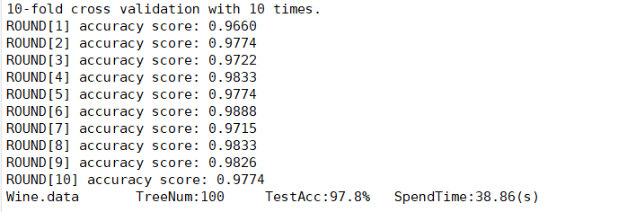

### 32

### 5 30 39 35 7 12

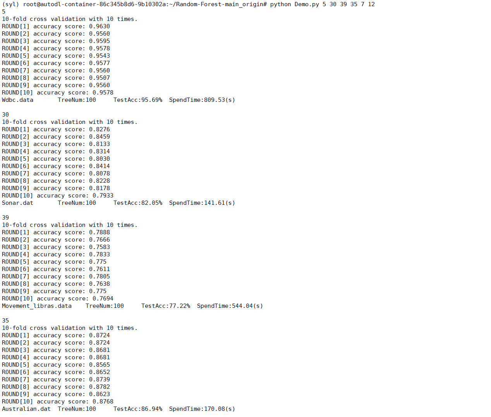

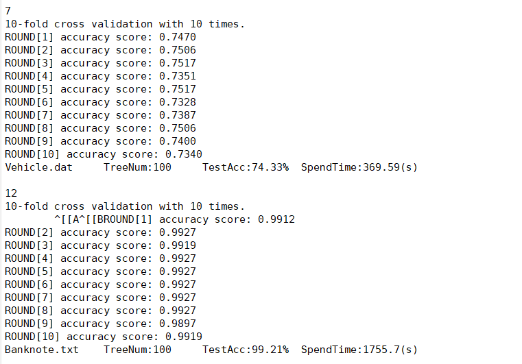

### 41 16 19 20 46

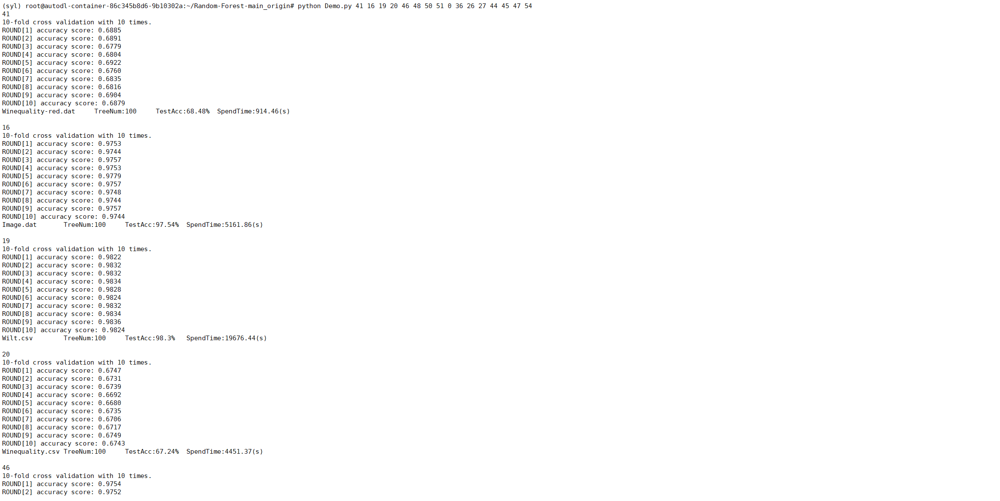	

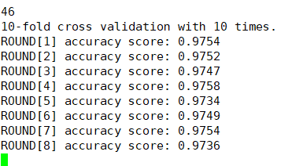

### 48 50 51 54

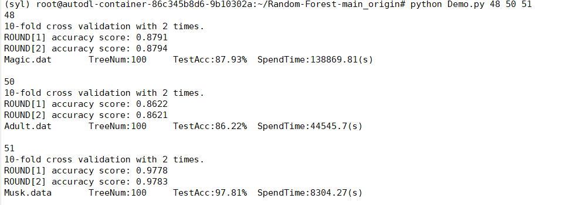

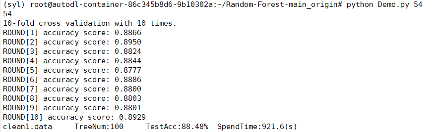

### 0 36 26 27

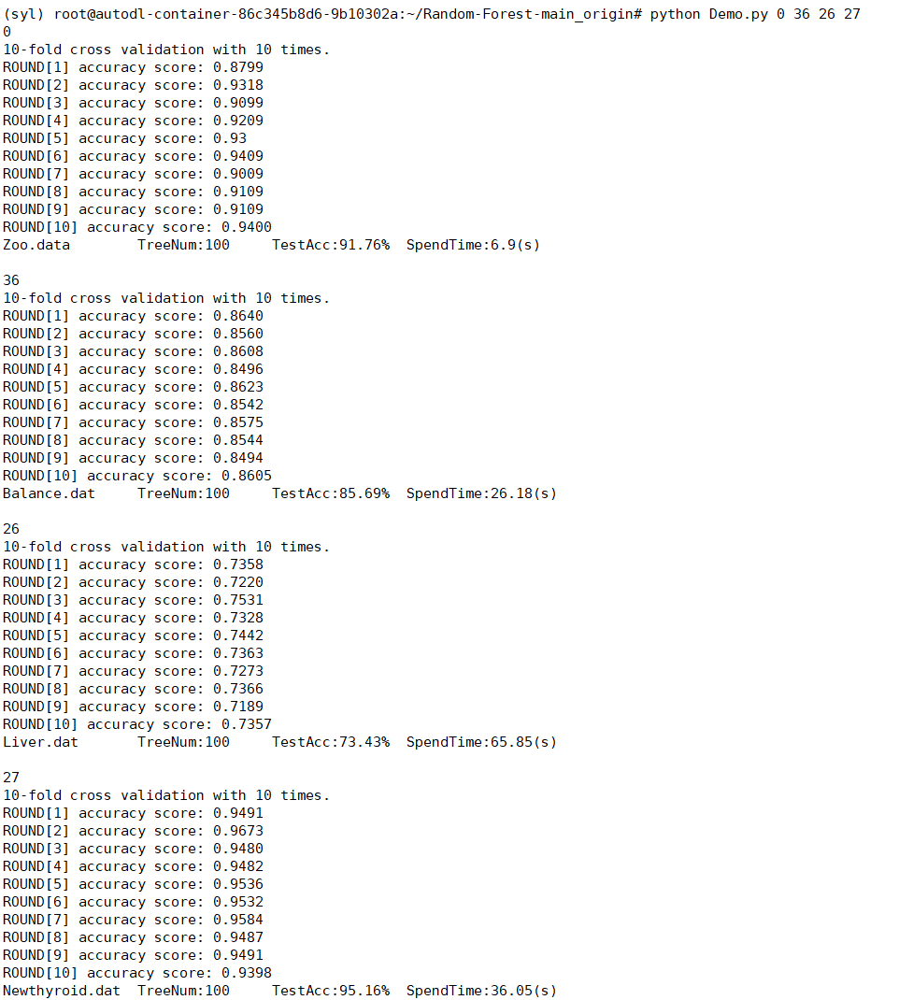

### 44 45 47

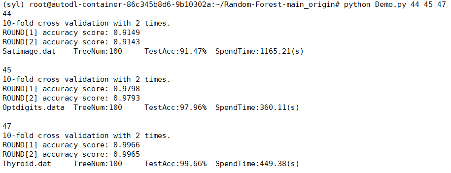

# Bernoulli-Random-Forest

### 4 32 5

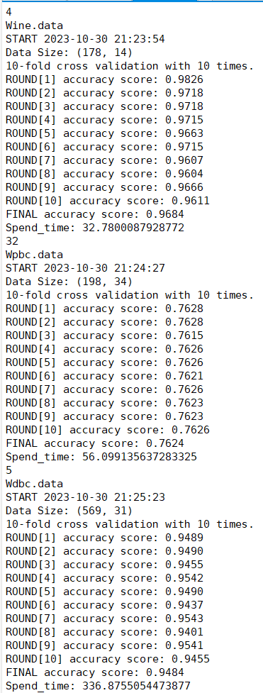

### 30 39 35

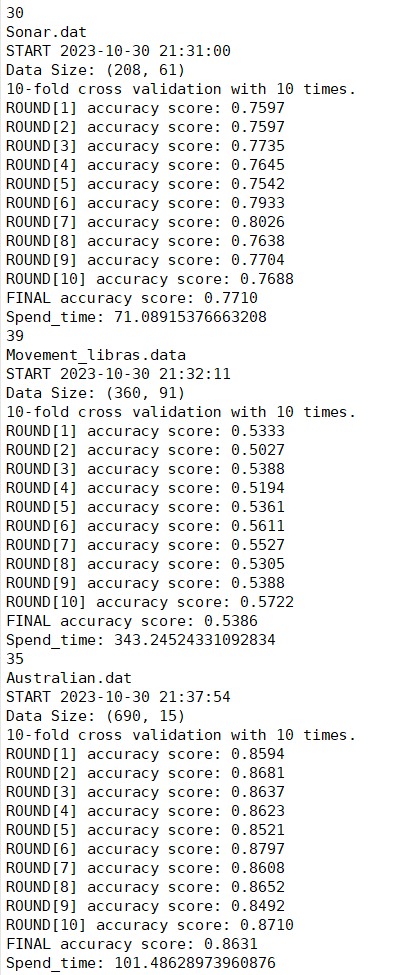

### 7 12 41

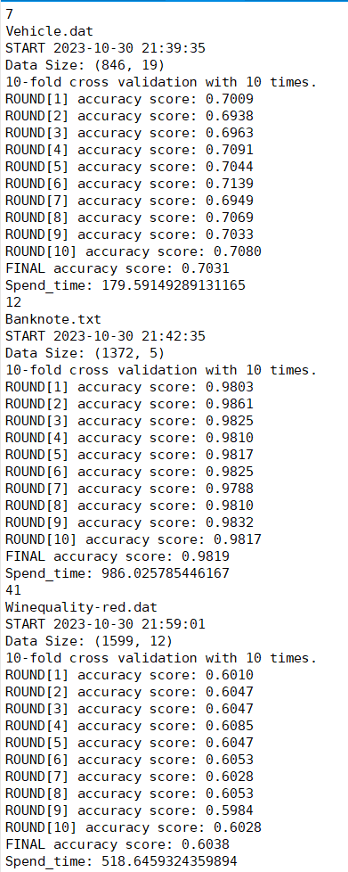

### 16 19 20

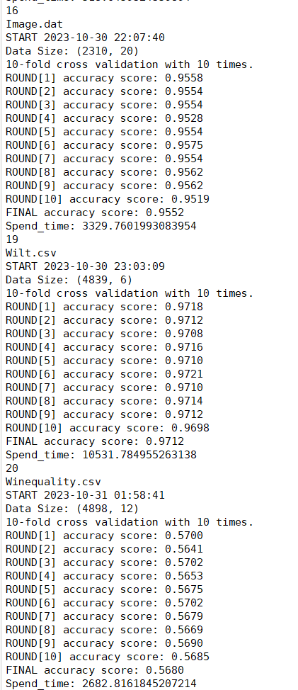

### 48 50 51 54

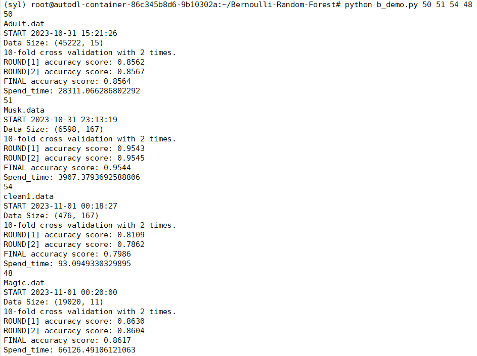

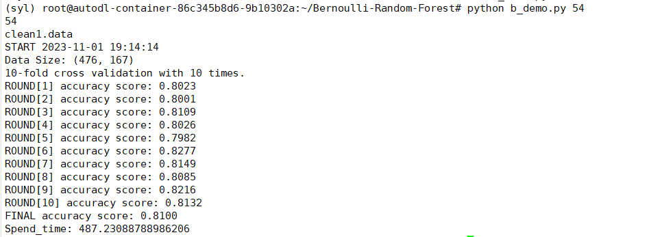

### 0 36 26

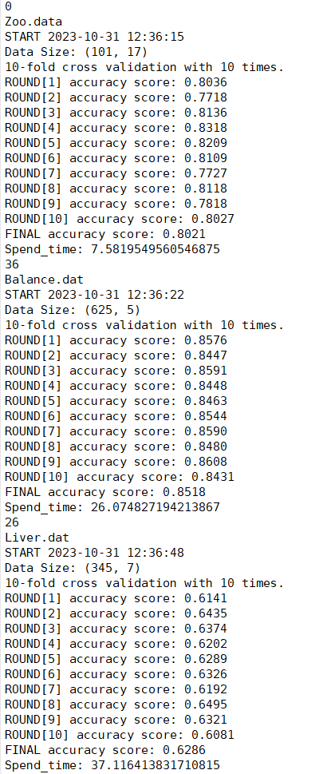

### 27 44 45 47 

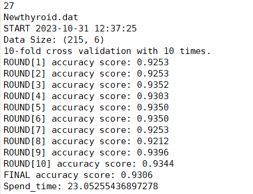

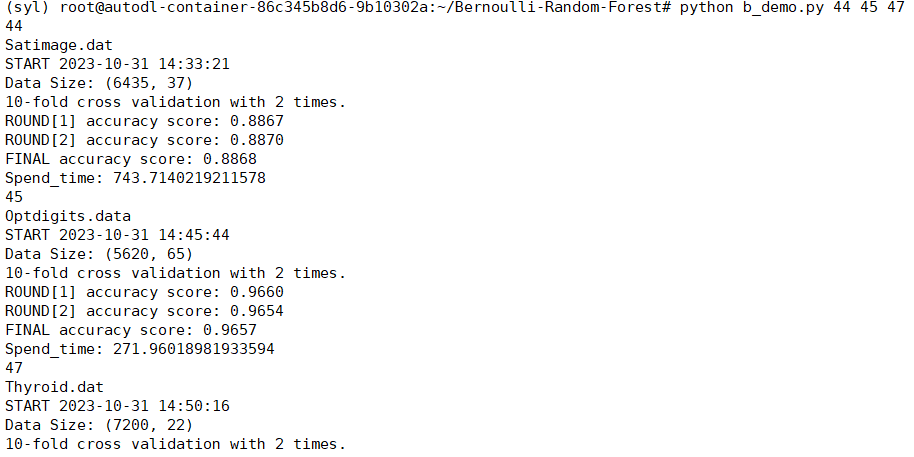

### 46

# CompRF-master

### 4 32 5

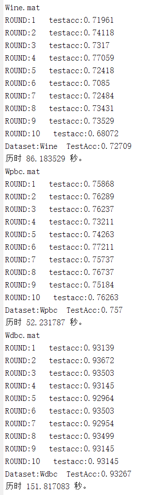

### 30 39 35

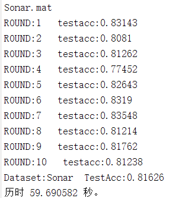

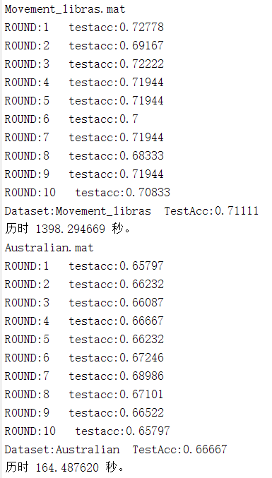

### 7 12 41

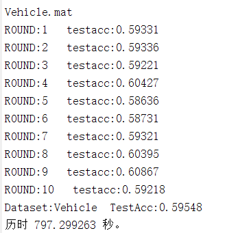

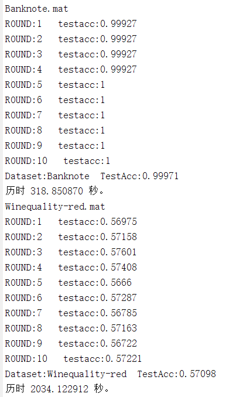

### 16 19 20

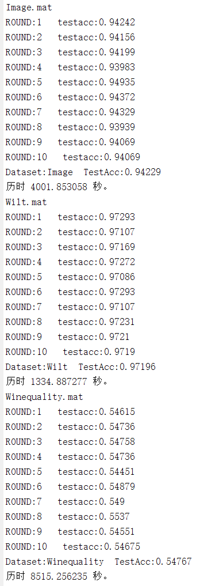

### 48 50 51 54

### 0 36 26

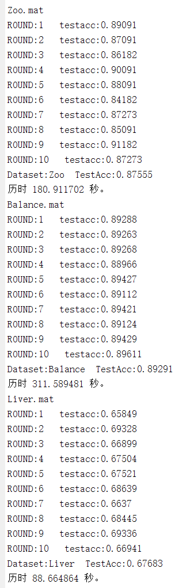

### 27 44 45 47

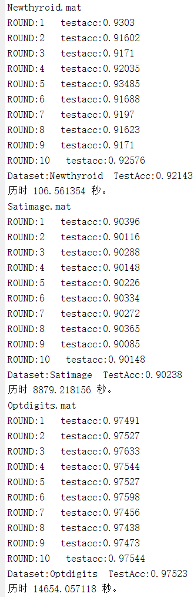

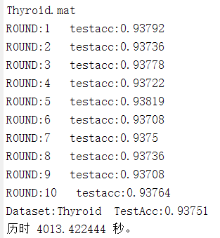

### 46

# HobRaF

### 4 32 5

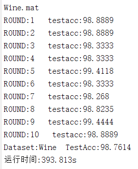

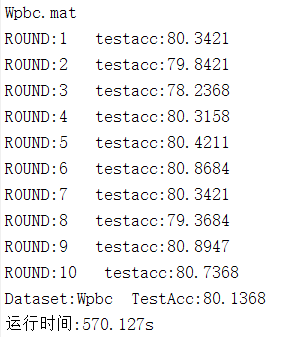

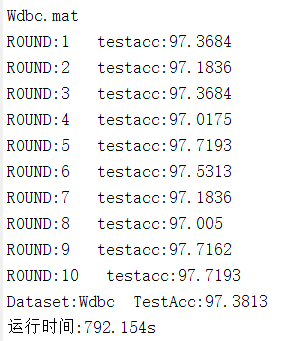

### 30 39 35

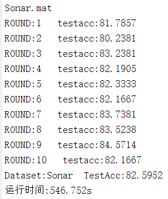

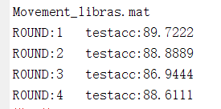

# RF_oblique

### 