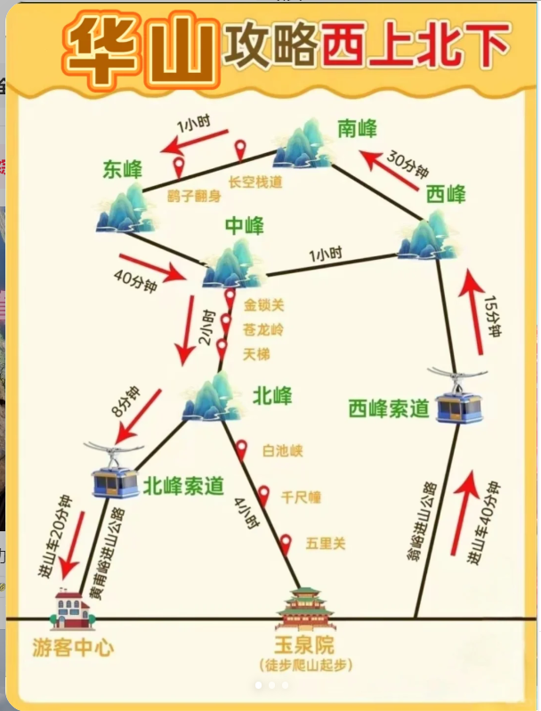

# 西安交通

首班车时间为6：00

末班车各线路不同，具体查看如下链接：https://xa.bendibao.com/traffic/2023821/118807.shtm

# 住宿

宜必思西安钟楼地铁店

距离钟楼（地铁站）步行253m，C口9号口

路线指引：

- 西安站：乘地铁4号线-》大差市站转地铁6号线-》到达钟楼站
- 西安北站：乘地铁2号线直达钟楼站
- 距离较近，可以打车

# 出行

6.10日出发，6.11抵达

6.16日返回，6.17抵达

## 去程

##### 方案一

由无锡站出发乘坐D122-复兴号-二等卧抵达西安站

15:30-次日5:25 耗时13小时55分

##### 方案二

由无锡站乘坐G7726二等座抵达常州站

18:59-19:14 耗时15分钟

由常州站乘坐D92-复兴号-二等卧抵达西安站

19:50-次日9:01 耗时13小时11分

总耗时14小时

## 返程

##### 方案一

由西安站出发乘坐D128-复兴号-二等卧抵达无锡站

19:25-次日8:54 耗时13小时29分钟

##### 方案二

由西安站出发乘坐D124-复兴号-二等卧抵达无锡站

21:16-次日11:01 耗时13小时45分钟

# 行程安排

### 6.11

###### 上午 

9:01到达西安站，先去酒店休整

###### 下午 

钟楼鼓楼：

高家大院

###### 晚上

钟楼鼓楼夜光拍照

回民街小吃

### 6.12

华山-西上北下

###### 方案一

暂定方案一

7：00起床 

7：30出发乘坐G1896 08:32西安北-9:00华山北

出站打车到达游客中心，乘坐进山车，到达西峰，开始爬山

返程乘坐华山北-西安北高铁。

具体车次可到时根据时间预定，车票很多

###### 方案二

乘坐景区大巴7：00开始市区内开始接人

7:50发车，约10:15左右抵达游客中心

### 6.13

秦始皇帝陵博物院 120r

官方解说 30r没人 10人成团

上午 丽山

下午 秦兵马俑博物馆

### 6.14

大雁塔片区地图

上午 陕西历史博物馆

下午+晚上 长安十二时辰

> 大唐永不眠
>

### 6.15

上午 西安博物院（小雁塔）

下午 大慈恩寺（大雁塔在内）

> 73 【西安汉服跟拍｜1⃣小时大雁塔拍照打卡攻略 - 西安汉服-大唐二公主📸 | 小红书 - 你的生活指南】 😆 D6Mom8PgTM451Oc 😆 http://xhslink.com/V2RYOL

晚上 大唐不夜城

注：大唐不夜城是条很大的步行街，长安十二时辰在里面是一个单独的室内场地

### 6.16

西安古城墙：永宁门上

> 81 【西安城墙可算有人讲清楚了❗不绕路 附机位 - 宝公子 | 小红书 - 你的生活指南】 😆 YAn8xg90MQ80P3l 😆 http://xhslink.com/YMeYOL

> 53 【穿着汉服游西安｜第2⃣站城墙📸机位攻略 - 西安汉服-大唐四公主 | 小红书 - 你的生活指南】 😆 mizqN7WOx43in5p 😆 http://xhslink.com/F2WYOL

# 拍照

96 【西安被问爆的1⃣️8⃣️个机位，发朋友圈赢麻了 - 小熊打卡日记🐻 | 小红书 - 你的生活指南】 😆 kd8IJY2a6B2pQ08 😆 http://xhslink.com/AozYOL

