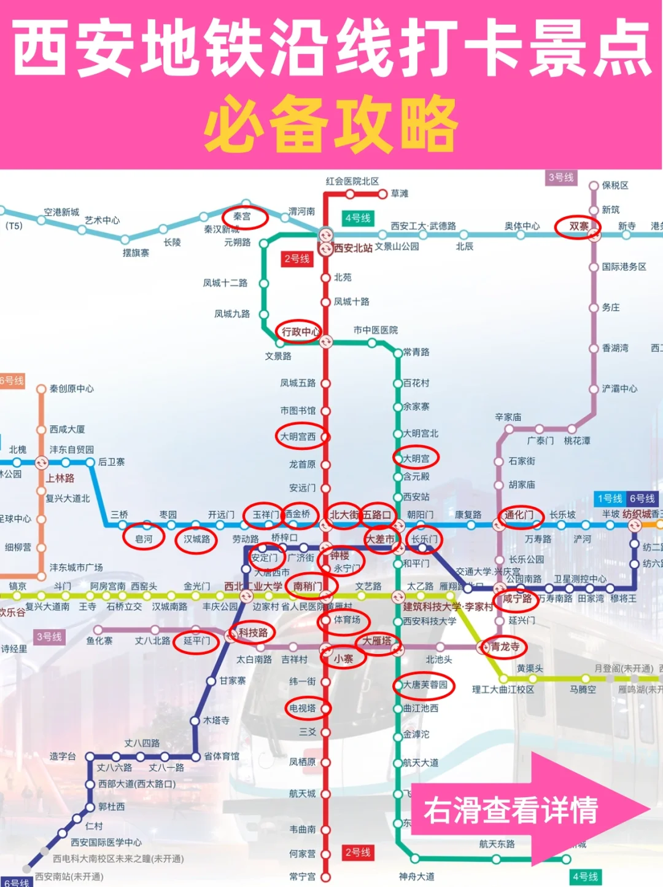
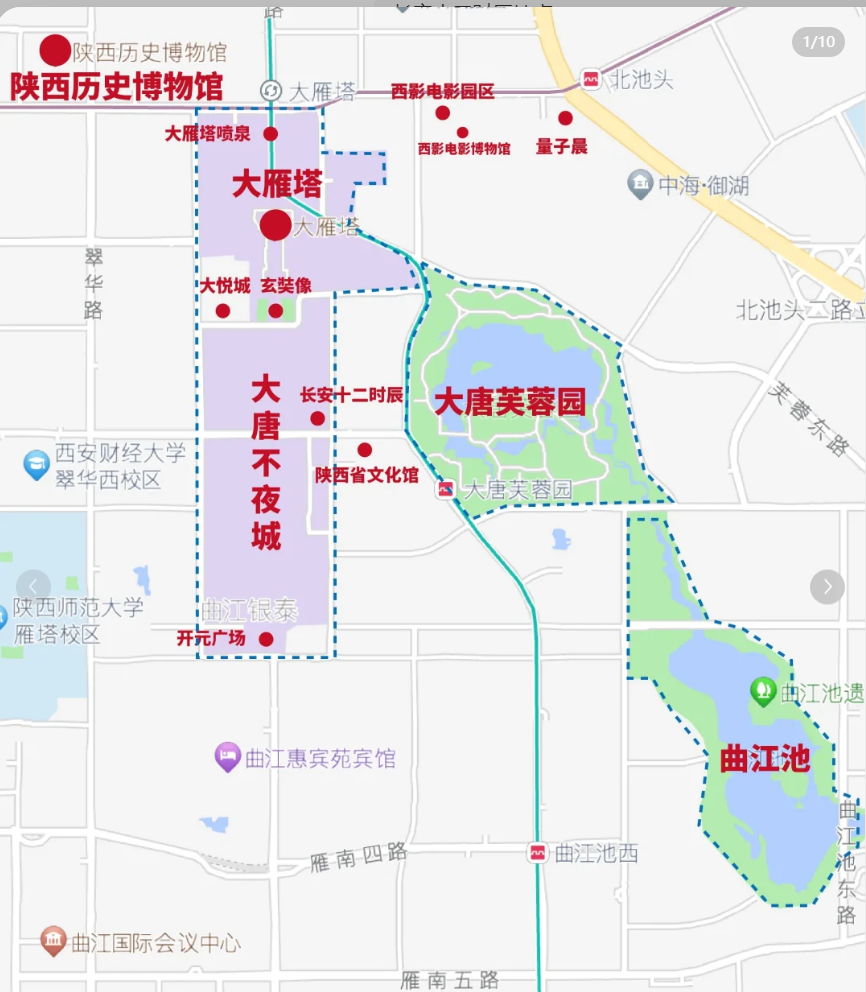

# 西安交通

首班车时间为6：00

末班车各线路不同，具体查看如下链接：https://xa.bendibao.com/traffic/2023821/118807.shtm

# 住宿

宜必思西安钟楼地铁店

距离钟楼（地铁站）步行253m，C口9号口

路线指引：

- 西安站：乘地铁4号线-》大差市站转地铁6号线-》到达钟楼站
- 西安北站：乘地铁2号线直达钟楼站
- 距离较近，可以打车

# 出行

6.10日出发，6.11抵达

6.16日返回，6.17抵达

## 去程

##### 方案一

由无锡站出发乘坐D122-复兴号-二等卧抵达西安站

15:30-次日5:25 耗时13小时55分

##### 方案二

由无锡站乘坐G7726二等座抵达常州站

18:59-19:14 耗时15分钟

由常州站乘坐D92-复兴号-二等卧抵达西安站

19:50-次日9:01 耗时13小时11分

总耗时14小时

## 返程

##### 方案一

由西安站出发乘坐D128-复兴号-二等卧抵达无锡站

19:25-次日8:54 耗时13小时29分钟

##### 方案二

由西安站出发乘坐D124-复兴号-二等卧抵达无锡站

21:16-次日11:01 耗时13小时45分钟

# 行程安排

### 6.11

下午 高家大院

晚上 回民街

下午 大雁塔  大唐芙蓉园

晚上 大唐不夜城

晚上7:00 8:30 9:30有不倒翁表演

### 6.12

华山

### 6.13

秦始皇帝陵博物院

官方解说 30r没人 10人成团

上午 丽山

下午 秦兵马俑博物馆

下午 华清宫

晚上 回民街

### 6.14

大雁塔片区地图

上午 陕西历史博物馆

下午+晚上 长安十二时辰

### 6.15

上午 大慈恩寺（大雁塔在内）

下午+晚上 大唐不夜城+长安十二时辰

注：大唐不夜城是条很大的步行街，长安十二时辰在里面是一个单独的室内场地

西安博物院（小雁塔）

### 6.16

