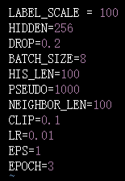
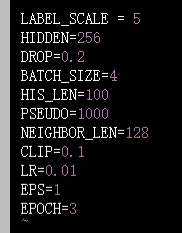
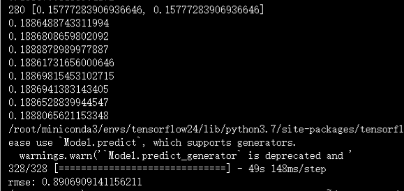

# Personalized Subgraph Federated Learning（开源）

ICML-2023

-------------

FED-PUB

1、引入社区概念，社区内子图具有同质性，社区间具有异质性

2、子图相似度估计：使用函数嵌入作为子图相似性度量，对模型参数进行个性化加权平均

3、自适应本地权重掩码：通过本地稀疏掩码，仅将未稀疏化的模型参数上传到服务器，降低了通信代价；由于本地稀疏掩码仅使用本地数据进行训练，引入近端项防止局部发散（过拟合）

# A federated graph neural network framework forprivacy-preserving personalization（开源）

-------

问题：

- 本地模型包含隐私信息，在通过各个客户端模型聚合中央模型时存在隐私泄露的风险
- 本地用户数据仅仅包含用户-项目的一阶交互信息，由于隐私限制高阶信息不可用

--------

创新点：

- 通过采样伪交互项和本地差分隐私保护用户-项目交互信息
  - 从全局item中随机采样，生成伪交互项的梯度信息，其与真实的梯度信息具有相同的均值和协方差
  - 通过客户端的本地梯度的L1范数对本地梯度进行裁剪，裁剪阈值为超参数，并加入均值为0的拉普拉斯噪声

- 提出一个图扩展协议来里利用高阶交互信息
  - 引入第三方服务器，客户端将用户嵌入和加密的item id上传到第三方服务器，第三方服务器通过匹配item id的密文，来匹配对共同item都有交互的匿名用户作为邻居，然后将邻居的用户嵌入下载到本地进行扩充子图
  - 加密采用RSA算法，算法公钥由server生成分发给各个客户端，密钥由server保存，第三方服务器无法解密密文。

#### yahoo_music

| HIDDEN | BATCH_SIZE | HIS_LEN | NEIGHBOR_LEN |                             RMSE                             |
| :----: | :--------: | :-----: | :----------: | :----------------------------------------------------------: |
|   64   |     32     |   100   |     100      | 67.0747458934784 70.54558992385864 64.1348659992218 |
|  256   |     8      |   64    |      64      |           4.442500730415948 3.998650227488535           |
|  256   |    128     |   64    |      64      | 23.694379545570918 53.26273815313658 30.98846010143386 |
|  256   |    128     |         |              |                                                              |
|        |            |         |              |                                                              |
|        |            |         |              |                                                              |
|        |            |         |              |                                                              |
|        |            |         |              |                                                              |
|        |            |         |              |                                                              |

---

---

---

--------

-------------

-------------

#### flixster

-------------

| HIDDEN | BATCH_SIZE | HIS_LEN | NEIGHBOR_LEN |                    RMSE                    |
| :----: | :--------: | :-----: | :----------: | :----------------------------------------: |
|  256   |     8      |   64    |      64      | 0.7302128635051791 0.7644952105768527 |
|  256   |     8      |   64    |     128      |                   0.8907                   |
|        |            |         |              |                                            |
|        |            |         |              |                                            |
|        |            |         |              |                                            |
|        |            |         |              |                                            |
|        |            |         |              |                                            |
|        |            |         |              |                                            |

---

---------

--------------------

-------------

---------------

--------------

--------------

-------------

#### ml-100k

-------------

#### douban

-------------

# Dual Personalization on Federated Recommendation（开源）

IJCAL-23

---------

PFedRec

1. 使用个性化的评分函数捕捉用户喜好，且评分函数的梯度信息不出本地
2. 去除用户嵌入：基于神经网络的评分函数足以保留用户嵌入的信息
3. 使用微调的个性化的项目嵌入，其梯度参数需要由server进行聚合

核心流程：

1. server初始化模型参数并随机选择部分客户端分发模型参数
2. 客户端使用收到的全局项目嵌入学习评分函数
3. 使用学习完成后的评分函数更新项目嵌入，上传更新后的项目嵌入
4. server聚合收到的项目嵌入并更新全局项目嵌入，分发给client，重复2-4。

# Graph-guided Personalization for Federated Recommendation

GPFedRec

- 在server端通过item embedding的余弦相似度建立user relationship graph，相似度大于阈值时代表两个用户存在联系，通过item embedding矩阵计算user-specific 的item embedding，global共享的item embedding
- 在客户更新过程中，引入正则化项，使用随机梯度下降的方法，迭代求解server回传的user-specific embedding和client 本地item embedding最小距离

# Decentralized Federated Recommendation with Privacy-Aware Structured Client-Level Graph（开源）

--------

DFedRec

- 去中心化，不使用server，而是在每一轮训练中随机选择user作为临时server
  - 问题：user必须可信，很难全面监管，感觉还不如直接使用server或者第三方服务器
- 构建隐私感知的客户级图
  1. 每个客户作为一个node
  2. 如果两个客户之间存在共同的感兴趣的item则对应的node存在边，和node共同构成无向图
  3. 为了保护隐私user上传rated item的时候需要对unrated item进行采样（个性化采样比例，由每个user自己控制），将rated item和unrated item混合后上传到临时server，由临时server构建 客户图，然后user根据 客户级图下载有共同item的user集合
- 

# FedGCN: Convergence-Communication Tradeoffs in Federated Training of Graph Convolutional Networks（开源）

NeurIPS-2023

-----

GCN

------

FedGCN

- 预训练：在初始阶段聚合L-hop内的邻居特征
  - 每个客户端传输加密过的本地节点特征的累积到server
  - server对每个node计算其邻居node feature的聚合，并回传到client
  - client解密server回传的node feature，如果L>1，则重复上面的过程
- 后续训练过程不再传输node feature，仅传输模型参数，按照FedAvg进行模型更新

# Efficient federated item similarity model for privacy-preserving recommendation（开源）

---------------

协同过滤 - CF

---

Keywords:

- Federated recommender systems
- Item similarity
- Meta-Learning
- Two-stage perturbation

-----------

FedIS

- 提出基于项目相似度模型的异质推荐系统
- 提出基于元学习的快速收敛的联邦聚合方法
- 提出一个两阶段的扰动方法来降低本地训练、传输，以及通信成本
  - 标签扰动：添加虚拟交互项，并在本地优化时使用含虚拟交互项的数据进行训练
  - 稀疏扰动：采用伯努利矩阵对模型的更新添加扰动，增加了稀疏性，降低了通信成本
  - 两阶段扰动均符合差分隐私

--------

# Personalized Federated Learning with Graph（开源）

# FGC: GCN-Based Federated Learning Approach for Trust Industrial Service Recommendation

--------------

# LightGCN: Simplifying and Powering Graph Convolution Network for Recommendation（开源）（引用2000+）

# Word2Vec-based efficient privacy-preserving shared representation learning for federated recommendation system in a cross-device setting

用于跨设备联邦推荐系统的基于word2vec的高效隐私保护共享表示学习

